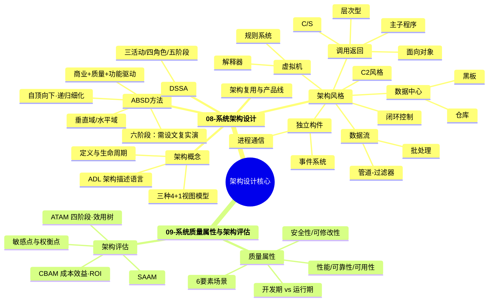
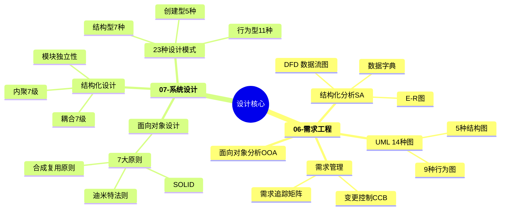
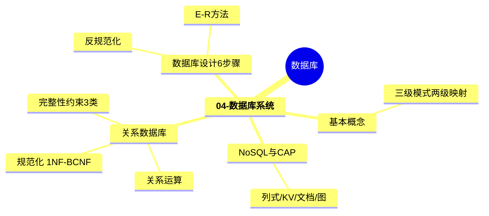
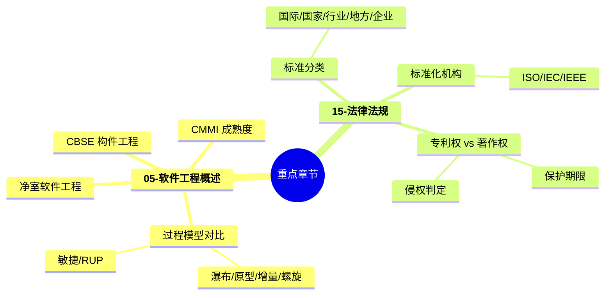
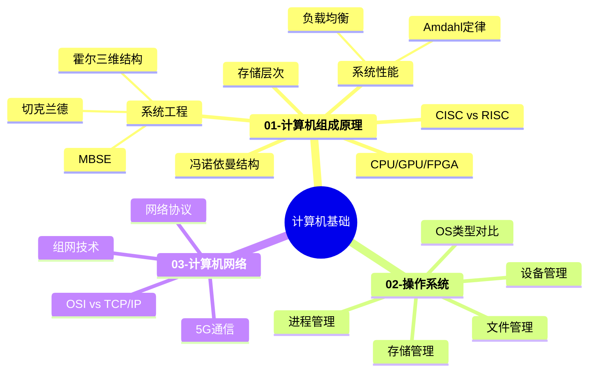
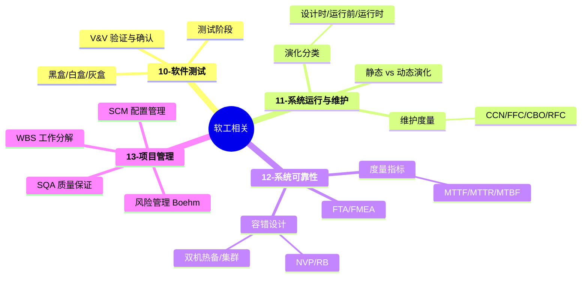
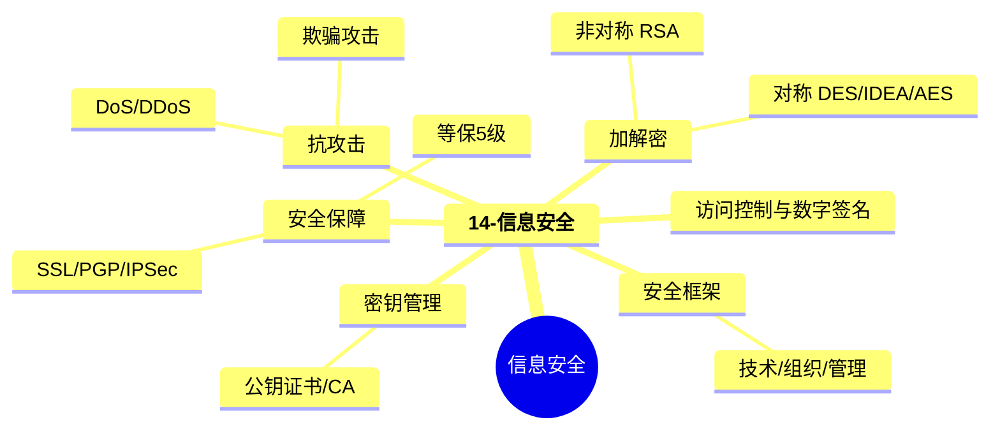
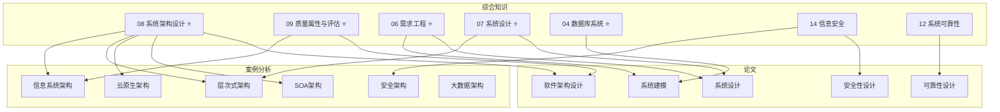

# 综合知识全景图

> 科目一：150分钟，75道选择题，合格线45分。
> 可视化版本：打开 [[00-综合知识全景图.canvas|Canvas 画布版]] 查看可拖拽的知识地图。
> 知识编排依据：《芝士架构公共知识红宝书 v4.0》重点级别

---

## 学习路径

---

## ⭐ 超级重点 ★★★★★★（第1周优先攻克）

> [!danger] 红宝书标注"超级重点"，选择题+案例分析+论文三科核心，必须深入掌握。

### 系统架构设计 + 质量属性与评估

### 需求工程 + 系统设计

### 数据库系统

> [!tip] 关联科目
> - 案例分析：[[02-案例分析/02-信息系统架构设计]]、[[02-案例分析/03-层次式架构设计]]
> - 论文方向：[[03-论文/02-软件架构设计]]、[[03-论文/01-系统建模]]、[[03-论文/03-系统设计]]

---

## 🔶 重点 ★★★★★（第2周扩展）

> [!warning] 红宝书标注"重点"，出题频率高，注意对比记忆。

> [!tip] 关联科目
> - 论文方向：[[03-论文/01-系统建模]]

---

## 🔵 次重点 ★★★☆（第3周补齐）

> [!info] 红宝书标注"次重点"，内容覆盖面广但考得浅，抓住对比要点即可。

### 计算机基础三件套

### 软件工程相关

### 信息安全

> [!tip] 关联科目
> - 案例分析：[[02-案例分析/08-安全架构设计]]、[[02-案例分析/06-嵌入式系统架构设计]]、[[02-案例分析/07-通信系统架构设计]]、[[02-案例分析/09-大数据架构设计]]
> - 论文方向：[[03-论文/04-系统可靠性分析与设计]]、[[03-论文/05-系统安全性与保密性设计]]、[[03-论文/03-系统设计]]

---

## 🟢 非重点（考前扫一遍）

> [!note] 红宝书未收录，考试占分极低，合并精简处理。

- [[01-综合知识/16-其他知识]] — 信息系统基础 / 未来信息技术 / 应用数学 / 专业英语

---

## 跨科目关联总图

---

## 各章详细入口

> [!abstract]- ⭐ 超级重点章节（点击展开）
> - [[01-综合知识/04-数据库系统]] — 规范化、E-R、NoSQL/CAP
> - [[01-综合知识/06-需求工程]] — SA/OOA、UML 14种图、CCB
> - [[01-综合知识/07-系统设计]] — 设计原则、设计模式、内聚耦合
> - [[01-综合知识/08-系统架构设计]] — 架构风格、ABSD、DSSA
> - [[01-综合知识/09-系统质量属性与架构评估]] — SAAM、ATAM、质量属性场景

> [!abstract]- 🔶 重点章节（点击展开）
> - [[01-综合知识/05-软件工程概述]] — 过程模型、CMMI、CBSE
> - [[01-综合知识/15-法律法规]] — 标准体系、专利与著作权

> [!abstract]- 🔵 次重点章节（点击展开）
> - [[01-综合知识/01-计算机组成原理]] — 硬件、系统工程、性能
> - [[01-综合知识/02-操作系统]] — 进程、存储、文件管理
> - [[01-综合知识/03-计算机网络]] — OSI/TCP-IP、5G、组网
> - [[01-综合知识/10-软件测试]] — 黑盒/白盒、V&V
> - [[01-综合知识/11-系统运行与维护]] — 架构演化、维护度量
> - [[01-综合知识/12-系统可靠性]] — MTTF/MTBF、容错设计
> - [[01-综合知识/13-项目管理]] — WBS、SCM、风险管理
> - [[01-综合知识/14-信息安全]] — 加解密、访问控制、安全协议

> [!abstract]- 🟢 非重点章节（点击展开）
> - [[01-综合知识/16-其他知识]] — 信息系统/未来技术/数学/英语
