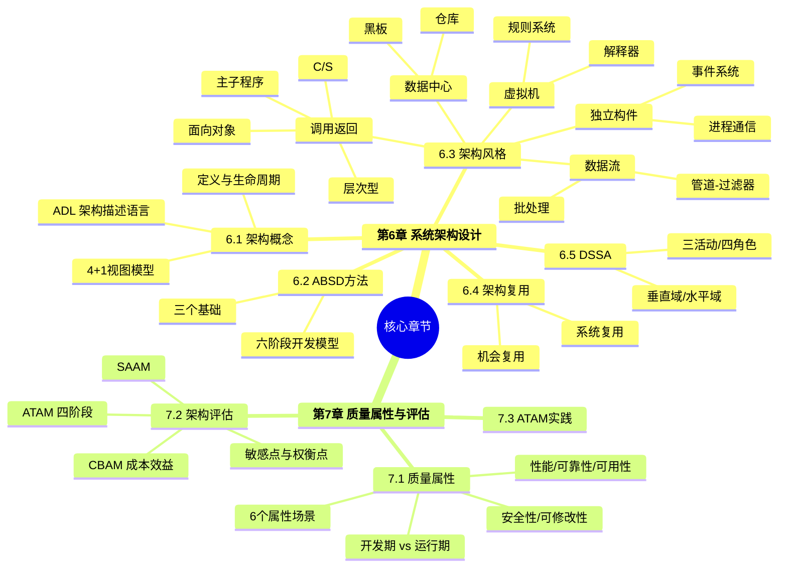
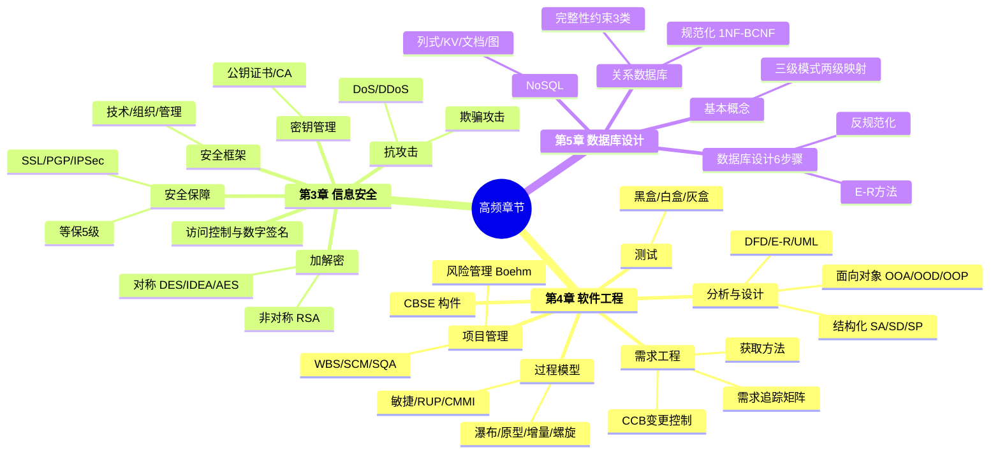
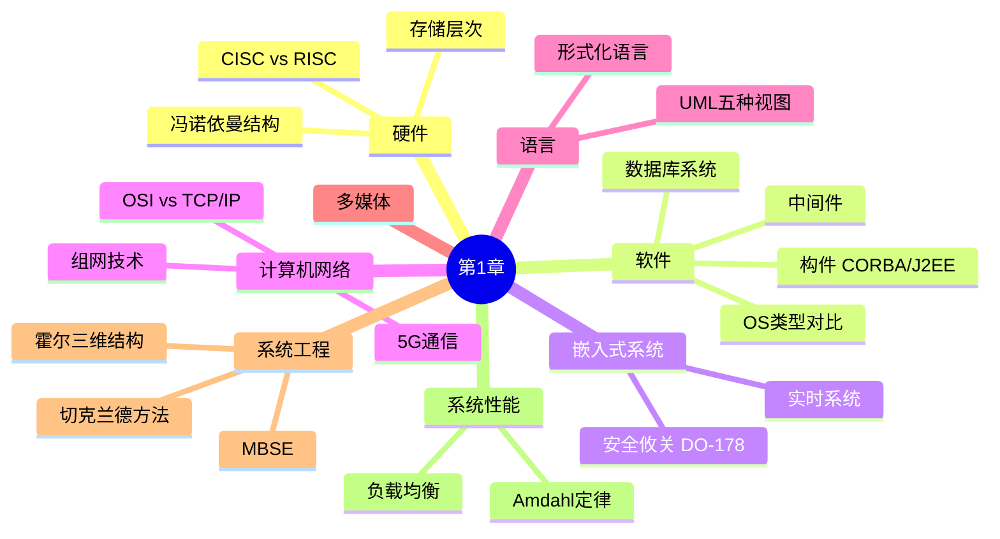
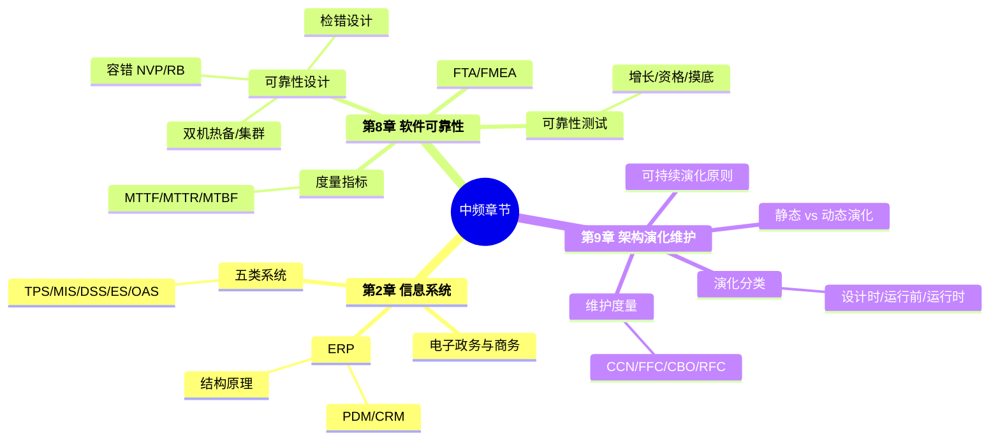
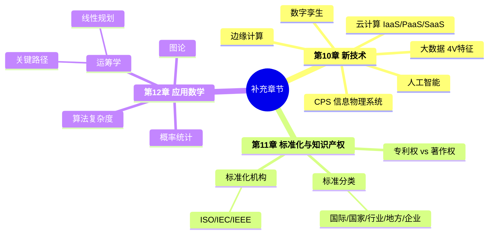
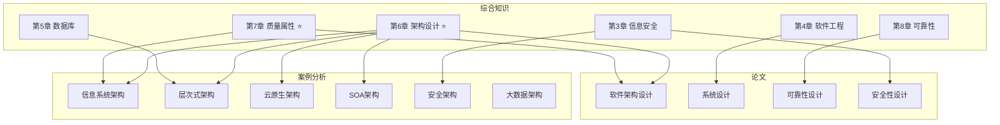

# 综合知识全景图

> 科目一：150分钟，75道选择题，合格线45分。
> 可视化版本：打开 [[00-综合知识全景图.canvas|Canvas 画布版]] 查看可拖拽的知识地图。

---

## 学习路径

---

## ⭐ 核心必学（第1周优先攻克）

> [!danger] 这两章是选择题、案例分析、论文的共同核心，必须优先且深入掌握。

> [!tip] 关联科目
> - 案例分析：[[02-案例分析/02-信息系统架构设计]]、[[02-案例分析/03-层次式架构设计]]
> - 论文方向：[[03-论文/02-软件架构设计]]

---

## 🔶 高频重点（第2周扩展）

> [!warning] 这三章出题频率高，尤其是过程模型对比、加密算法对比、数据库规范化。

> [!tip] 关联科目
> - 案例分析：[[02-案例分析/08-安全架构设计]]、[[02-案例分析/03-层次式架构设计]]
> - 论文方向：[[03-论文/05-系统安全性与保密性设计]]、[[03-论文/01-系统建模]]

---

## 🔵 中频补充（第3周补齐）

> [!info] 内容覆盖面广但单个知识点考得浅，抓住对比记忆的要点即可。

### 第1章 计算机系统基本知识

### 第2·8·9章

### 第10·11·12章

> [!tip] 关联科目
> - 案例分析：[[02-案例分析/06-嵌入式系统架构设计]]、[[02-案例分析/07-通信系统架构设计]]、[[02-案例分析/09-大数据架构设计]]
> - 论文方向：[[03-论文/04-系统可靠性分析与设计]]、[[03-论文/03-系统设计]]

---

## 🟢 低频了解（考前扫一遍）

> [!note] 约5道选择题，投入产出比低，考前过一遍术语表即可。

- [[01-综合知识/13-专业英语]] — 架构设计核心英文术语 + 阅读技巧

---

## 跨科目关联总图

---

## 各章详细入口

> [!abstract]- ⭐ 核心章节（点击展开）
> - [[01-综合知识/06-系统架构设计基础知识]] — 架构风格、ABSD、DSSA
> - [[01-综合知识/07-系统质量属性与架构评估]] — SAAM、ATAM、质量属性场景

> [!abstract]- 🔶 高频章节（点击展开）
> - [[01-综合知识/04-软件工程基础知识]] — 过程模型、需求工程、UML
> - [[01-综合知识/03-信息安全技术基础知识]] — 加解密、访问控制、安全协议
> - [[01-综合知识/05-数据库设计基础知识]] — 规范化、E-R、NoSQL

> [!abstract]- 🔵 中频章节（点击展开）
> - [[01-综合知识/01-计算机系统基本知识]] — 硬件、软件、网络、系统工程
> - [[01-综合知识/02-信息系统基础知识]] — 五类信息系统、ERP
> - [[01-综合知识/08-软件可靠性技术]] — MTTF/MTBF、容错设计
> - [[01-综合知识/09-软件架构的演化和维护]] — 静态/动态演化
> - [[01-综合知识/10-未来信息综合技术]] — CPS、AI、云计算、大数据
> - [[01-综合知识/11-标准化与知识产权]] — 标准体系、专利与著作权
> - [[01-综合知识/12-应用数学]] — 关键路径、概率统计

> [!abstract]- 🟢 低频章节（点击展开）
> - [[01-综合知识/13-专业英语]] — 术语速查
