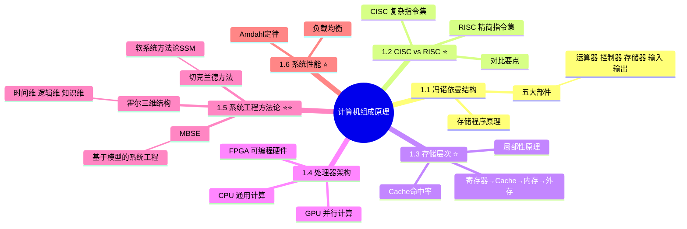

# 计算机组成原理

> [!warning] 次重点 ★★★☆（红宝书ch9）
> 主要在选择题中考察，考点集中在 ==CISC vs RISC 对比==、==存储层次==、==系统工程方法论==（霍尔/切克兰德）和 ==Amdahl定律==。每年约 2-3 题。
>
> **速查跳转**：[[#1.2 CISC vs RISC|CISC/RISC]] · [[#1.3 存储层次|存储层次]] · [[#1.5 系统工程方法论|系统工程]] · [[#1.6 系统性能|Amdahl定律]]

---

## 知识全景

---

## 1.1 冯·诺依曼结构（了解）

> [!note]- 考点提示
> 偶尔考选择，让你识别冯·诺依曼体系的基本特征。

冯·诺依曼（Von Neumann）体系结构是现代计算机的基础架构，核心思想是**存储程序**。

### 五大部件

| 部件 | 功能 |
|------|------|
| ==运算器==（ALU） | 执行算术和逻辑运算 |
| ==控制器==（CU） | 统一指挥和控制计算机各部件协调工作 |
| ==存储器== | 存储程序和数据（内存） |
| ==输入设备== | 将外部信息转换为机器可识别的信息 |
| ==输出设备== | 将计算结果转换为人或其他设备可识别的信息 |

> [!tip] 核心特征
> - 采用**二进制**表示数据和指令
> - **程序和数据存储在同一存储器**中（存储程序原理）
> - 指令按**顺序**执行（可由转移指令改变）
> - 以**运算器**为核心（现代计算机已改为以**存储器**为核心）

### 哈佛结构（对比了解）

| 对比项 | 冯·诺依曼结构 | 哈佛结构 |
|-------|-------------|---------|
| 存储方式 | 程序和数据**共用**存储器 | 程序和数据**分开**存储 |
| 总线 | 共享总线 | 独立总线 |
| 典型应用 | 通用计算机（PC/服务器） | DSP、嵌入式处理器、ARM |
| 优势 | 结构简单，灵活 | 可同时读取指令和数据，速度更快 |

---

## 1.2 CISC vs RISC（次重点★★★☆）

> [!danger] 易考对比
> 选择题常考两者的区别，注意 ==指令数量==、==寻址方式==、==实现方式==、==流水线== 这几个关键对比点。

| 对比项 | ==CISC（复杂指令集）== | ==RISC（精简指令集）== |
|-------|---------------------|---------------------|
| 指令数量 | **多**，通常 200 条以上 | **少**，通常不超过 100 条 |
| 指令长度 | **不固定**，变长指令 | **固定**，等长指令 |
| 指令功能 | 单条指令功能强大，可完成复杂操作 | 单条指令功能简单，复杂操作由多条指令组合 |
| 寻址方式 | **多种**寻址方式 | **少而简单**的寻址方式 |
| 指令执行时间 | 不等长，部分指令需多个时钟周期 | 大多**单周期**执行 |
| 实现方式 | 以**微程序控制**为主 | 以**硬布线控制**（组合逻辑）为主 |
| 流水线 | 难以实现高效流水线 | **适合流水线**，效率高 |
| 通用寄存器 | 数量**少** | 数量**多** |
| 编译优化 | 编译器复杂度低 | 依赖**编译器优化** |
| 典型代表 | x86（Intel/AMD） | ARM、MIPS、RISC-V |

> [!tip] 记忆口诀
> **RISC 精简一切**：指令少、寻址少、定长、单周期、硬布线、多寄存器、靠编译器
> **CISC 复杂全能**：指令多、寻址多、变长、多周期、微程序、少寄存器

---

## 1.3 存储层次（次重点★★★☆）

> [!note] 考点提示
> 常考存储层次的速度/容量关系、局部性原理和 Cache 命中率计算。

### 存储体系金字塔

| 层次 | 存储类型 | 速度 | 容量 | 成本 | 易失性 |
|------|---------|------|------|------|--------|
| 第1层 | ==寄存器==（Register） | 最快 | 最小（字节级） | 最高 | 易失 |
| 第2层 | ==高速缓存==（Cache） | 极快 | 小（KB~MB） | 高 | 易失 |
| 第3层 | ==主存/内存==（RAM） | 快 | 中（GB级） | 中 | 易失 |
| 第4层 | ==辅存/外存==（磁盘/SSD） | 慢 | 大（TB级） | 低 | 非易失 |

> [!tip] 核心规律
> 自上而下：速度**递减**、容量**递增**、单位成本**递减**

### 局部性原理

| 类型 | 含义 | 示例 |
|------|------|------|
| ==时间局部性== | 刚被访问的数据，近期很可能**再次被访问** | 循环变量、频繁调用的函数 |
| ==空间局部性== | 刚被访问的数据附近的数据，近期很可能**被访问** | 数组顺序遍历、顺序执行的指令 |

局部性原理是 Cache 和虚拟存储器有效工作的基础。

### Cache 命中率计算

$$\text{平均访问时间} = H \times t_c + (1 - H) \times t_m$$

其中：
- $H$ = Cache 命中率
- $t_c$ = Cache 访问时间
- $t_m$ = 主存访问时间

> [!example]- 计算示例
> 若 Cache 命中率 H = 95%，Cache 访问时间 = 10ns，主存访问时间 = 200ns
> 平均访问时间 = 0.95 × 10 + 0.05 × 200 = 9.5 + 10 = **19.5ns**
> 比直接访问主存快约 **10倍**

### 主存编址计算（选择题公式）

$$\text{存储总容量} = \text{最大地址} - \text{最小地址} + 1$$

$$\text{芯片数量} = \frac{\text{存储总容量} \times \text{编址位数}}{\text{单个芯片容量}}$$

> [!example]- 编址计算示例
> 内存地址从 A4000H 到 CBFFFH，每个地址存储16位，使用 16K×4位 的芯片
> - 总容量 = CBFFFH - A4000H + 1 = 28000H = 163840 个地址 = 160K
> - 总位数 = 160K × 16位
> - 芯片数 = (160K × 16) / (16K × 4) = **40片**

---

## 1.4 处理器架构（了解）

> [!note]- 考点提示
> 偶尔考选择题，了解各类处理器的定位和适用场景即可。

| 处理器 | 全称 | 特点 | 典型应用 |
|-------|------|------|---------|
| ==CPU== | Central Processing Unit | 通用计算，擅长复杂逻辑和串行任务 | 操作系统、应用程序、数据库 |
| ==GPU== | Graphics Processing Unit | 大量并行计算单元，擅长**大规模并行计算** | 图形渲染、AI训练、科学计算 |
| ==FPGA== | Field-Programmable Gate Array | **可编程硬件**，可根据需要重新配置逻辑电路 | 通信协议处理、硬件加速、原型验证 |

> [!tip] 对比要点
> - CPU 看重**单线程性能**和**通用性**
> - GPU 看重**并行吞吐量**（数千个计算核心）
> - FPGA 看重**可重配置性**和**低延迟**

---

## 1.5 系统工程方法论（重点★★★★★）

> [!danger] 必考
> 系统工程方法论在选择题中出现频率高，==霍尔三维结构== 和 ==切克兰德方法== 是核心考点，需要熟记维度名称和适用场景。

### 1.5.1 霍尔（Hall）三维结构

霍尔三维结构是系统工程的经典方法论框架，将系统工程活动表述为一个**三维空间结构**。

| 维度 | 名称 | 内容 |
|------|------|------|
| ==时间维== | 工作阶段 | 规划→方案→研制→生产→安装→运行→更新（7个阶段） |
| ==逻辑维== | 解决问题的逻辑步骤 | 明确问题→确定目标→系统综合→系统分析→优化→决策→实施（7个步骤） |
| ==知识维== | 所需专业知识 | 工程、医学、建筑、商业、法律、管理、社会科学等各领域 |

> [!tip] 记忆口诀
> **霍尔三维 = 时逻知**：==时间==维（干什么阶段）+ ==逻辑==维（怎么干）+ ==知识==维（用什么知识干）

> [!warning] 易混点
> 霍尔方法属于**硬系统方法论（HSM）**，适用于有明确目标的工程技术问题。

### 1.5.2 切克兰德（Checkland）方法

切克兰德方法是**软系统方法论（SSM，Soft Systems Methodology）**，适用于目标不明确、涉及人为因素的社会性问题。

| 对比项 | 霍尔方法（硬系统HSM） | 切克兰德方法（软系统SSM） |
|-------|-------------------|---------------------|
| 问题类型 | ==目标明确==的工程问题 | ==目标不明确==的社会性问题 |
| 核心思想 | 优化、求最优解 | 比较和探寻，学习和调适 |
| 适用场景 | 航天工程、建筑工程、IT系统建设 | 管理决策、组织变革、政策制定 |
| 方法特点 | 自上而下的结构化分析 | 迭代探索，理解不同利益相关方的观点 |

> [!tip] 选择题判断技巧
> 题目出现"社会性"、"目标不明确"、"利益相关方"→ 选**切克兰德/SSM**
> 题目出现"工程问题"、"目标明确"、"优化"→ 选**霍尔/HSM**

### 1.5.3 MBSE 基于模型的系统工程（了解）

MBSE（Model-Based Systems Engineering）是以**模型**为核心驱动的系统工程方法，替代传统以文档为中心的方式。

| 特点 | 说明 |
|------|------|
| 核心理念 | 用**形式化模型**替代传统文档作为信息交换的主要手段 |
| 建模语言 | SysML（Systems Modeling Language）是主要建模语言 |
| 优势 | 减少歧义、提高一致性、支持自动化分析和仿真 |
| 与传统对比 | 传统 = 基于**文档**；MBSE = 基于**模型** |

---

## 1.6 系统性能（次重点★★★☆）

> [!note] 考点提示
> Amdahl定律在选择题中偶有考察，需要掌握公式和基本计算。

### 1.6.1 Amdahl 定律（必背公式）

Amdahl 定律用于计算系统中某部件改进后，整体系统性能的提升上限。

$$\boxed{S = \frac{1}{(1 - f) + \frac{f}{p}}}$$

其中：
- $S$ = 系统整体加速比（Speedup）
- $f$ = 可改进部分占总执行时间的**比例**（0 ≤ f ≤ 1）
- $p$ = 可改进部分的**加速倍数**

> [!example]- 计算示例
> 某程序中 80% 的时间用于浮点运算，现将浮点运算速度提升 5 倍，求整体加速比。
> - f = 0.8，p = 5
> - S = 1 / (1 - 0.8 + 0.8/5) = 1 / (0.2 + 0.16) = 1 / 0.36 ≈ **2.78**
>
> 即使浮点运算快了5倍，整体只快了约2.78倍。

> [!danger] 核心结论
> 当 $p → ∞$ 时，$S_{max} = \frac{1}{1 - f}$
>
> **含义**：无论如何优化某个部分，系统加速比的上限取决于**不可改进部分**的比例。这就是"==阿姆达尔瓶颈=="。

### 1.6.2 负载均衡（了解）

负载均衡（Load Balancing）是将工作负载分配到多个计算资源上，以提高系统整体性能和可靠性。

| 算法类型 | 常见算法 | 说明 |
|---------|---------|------|
| 静态算法 | ==轮询==（Round Robin） | 按顺序轮流分配请求 |
| 静态算法 | ==加权轮询== | 按服务器权重分配，权重高的分配更多 |
| 动态算法 | ==最少连接== | 将请求分给当前连接数最少的服务器 |
| 动态算法 | ==加权最少连接== | 结合权重和连接数综合分配 |
| 哈希算法 | ==IP哈希== | 根据客户端IP的哈希值固定分配到特定服务器 |

---

## 关联链接

- [[02-操作系统]] — 操作系统（建立在硬件之上的系统软件）
- [[03-计算机网络]] — 计算机网络（网络通信依赖硬件基础设施）
- [[12-系统可靠性]] — 系统可靠性（串并联系统的可靠性分析建立在硬件架构之上）
- [[08-系统架构设计]] — 系统架构设计（系统工程方法论是架构设计的基础）
