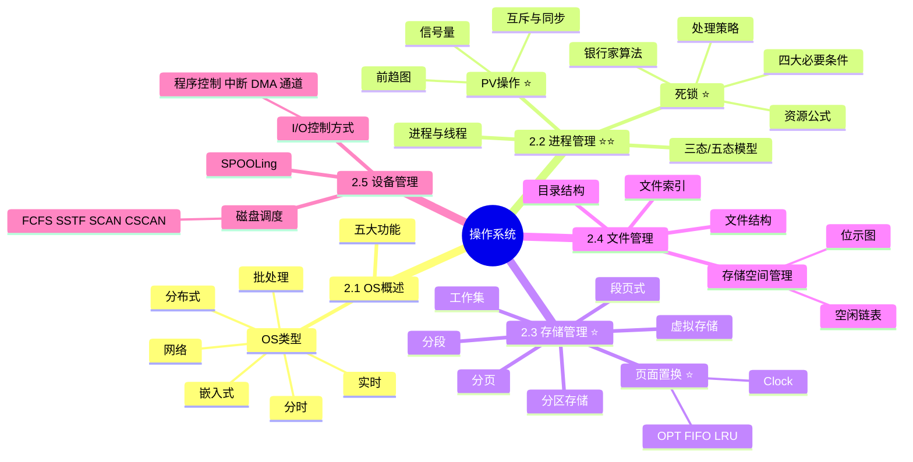
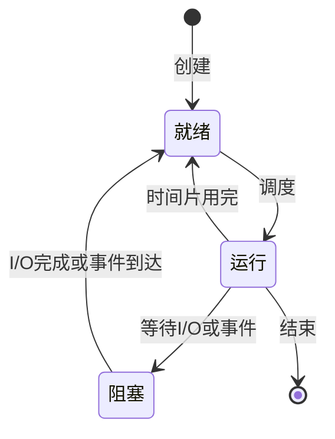

# 操作系统

> [!warning] 次重点 ★★★☆（红宝书ch11）
> 选择题中几乎每年必考 1-3 题，核心考点在 ==PV操作==（信号量/前趋图）、==死锁== 计算、==页面置换算法==（LRU/OPT/FIFO）、==段页式存储== 和 ==磁盘调度==。PV 操作和死锁资源计算是高频必考点。
>
> **速查跳转**：[[#2.2 进程管理|进程管理]] · [[#PV 操作与信号量|PV操作]] · [[#死锁|死锁]] · [[#2.3 存储管理|存储管理]] · [[#页面置换算法|页面置换]] · [[#2.5 设备管理|设备管理]]

---

## 知识全景



---

## 2.1 操作系统概述（了解）

> [!note]- 考点提示
> 选择题偶考，主要考察各类操作系统的特征与适用场景对比。

操作系统（Operating System，OS）是管理计算机硬件与软件资源的系统软件，是用户与计算机之间的接口。

### 五大管理功能

| 功能 | 说明 |
|------|------|
| ==进程管理== | CPU调度、进程同步与互斥、进程通信、死锁处理 |
| ==存储管理== | 内存分配与回收、地址映射、内存保护、虚拟存储 |
| ==文件管理== | 文件存储空间管理、目录管理、文件读写、文件共享与保护 |
| ==设备管理== | 设备分配、I/O控制、缓冲管理、设备独立性 |
| ==作业管理== | 作业调度、用户接口（命令接口、程序接口、图形接口） |

### 操作系统类型对比

| 类型 | 特点 | 典型应用 |
|------|------|---------|
| ==批处理系统== | 成批作业、无交互、吞吐量高 | 早期大型机批处理 |
| ==分时系统== | ==时间片==轮转、多用户交互、响应快 | UNIX、Linux多用户 |
| ==实时系统== | 严格==时间约束==、可预测性 | 工业控制、航空航天 |
| ==网络操作系统== | 网络资源共享、通信管理 | Windows Server |
| ==分布式系统== | 多节点==透明协同==、资源统一管理 | 分布式计算集群 |
| ==嵌入式系统== | 微型化、可定制、高可靠 | RTOS、VxWorks |

> [!tip] 实时系统 vs 分时系统
> - **实时系统**：追求**及时性**和**可靠性**，错过时间窗口即失败（硬实时）
> - **分时系统**：追求**交互性**和**公平性**，轮流分配 CPU 时间片

---

## 2.2 进程管理（重点★★★★★）

> [!danger] 核心考点
> 进程管理是操作系统考题的绝对核心，==PV操作== 和 ==死锁资源计算== 几乎每年必考，必须熟练掌握。

### 2.2.1 进程与线程

| 对比项 | ==进程==（Process） | ==线程==（Thread） |
|-------|-------------------|------------------|
| 定义 | 程序在数据集合上的一次执行，系统资源分配的基本单位 | 进程内的执行单元，CPU调度的基本单位 |
| 资源 | 拥有独立的地址空间和系统资源 | 共享所属进程的地址空间和资源 |
| 通信 | 进程间通信开销大（管道/消息/共享内存） | 线程间通信直接（共享内存） |
| 切换开销 | 大（需保存大量上下文） | 小 |
| 并发性 | 进程级并发 | 线程级并发（更细粒度） |

> [!tip] 核心口诀
> **进程是资源分配的基本单位，线程是 CPU 调度的基本单位**

### 2.2.2 进程状态模型

#### 三态模型



| 状态 | 含义 |
|------|------|
| ==就绪==（Ready） | 已获得除 CPU 外的所有资源，等待分配 CPU |
| ==运行==（Running） | 正在 CPU 上执行 |
| ==阻塞==（Blocked）/等待 | 等待某事件（如 I/O 完成）发生，即使分得 CPU 也不能运行 |

#### 五态模型

在三态基础上增加 ==创建== 和 ==终止== 两个状态。进一步发展为七态（增加就绪挂起、阻塞挂起）。

> [!warning] 易错点
> 阻塞态不能直接转换为运行态，必须先转为**就绪态**再被调度。

### PV 操作与信号量

> [!danger] 必考
> PV 操作是选择题和案例题的**超级重点**，每年必考。务必熟练掌握前趋图→PV 操作的转换。

#### 信号量定义

信号量（Semaphore）是一个**整型变量** S，表示系统中某类资源的数量或同步状态。

| 操作 | 含义 | 等效代码 |
|------|------|---------|
| ==P(S)== | 申请资源 | `S = S - 1; if (S < 0) 阻塞` |
| ==V(S)== | 释放资源 | `S = S + 1; if (S ≤ 0) 唤醒一个阻塞进程` |

> [!tip] P 和 V 的记忆
> - **P**（荷兰语 Proberen，尝试）= **申请**资源 = S减1
> - **V**（荷兰语 Verhogen，增加）= **释放**资源 = S加1

#### 互斥与同步

| 用途 | 信号量初值 | 模式 |
|------|-----------|------|
| ==互斥== | 通常为 **1**（互斥量 mutex） | 一个进程 P 进入临界区，另一进程 V 退出 |
| ==同步== | 通常为 **0** | 一个进程 V 通知另一进程 P 可以继续 |

> [!example]- 生产者-消费者问题
> ```
> semaphore mutex = 1;      // 互斥访问缓冲区
> semaphore empty = n;      // 空闲缓冲区数
> semaphore full  = 0;      // 已填充缓冲区数
>
> 生产者:                   消费者:
>   P(empty);                 P(full);
>   P(mutex);                 P(mutex);
>   放入产品;                  取出产品;
>   V(mutex);                 V(mutex);
>   V(full);                  V(empty);
> ```
> 关键：**资源信号量（full/empty）必须在互斥信号量（mutex）之外** P/V，否则可能死锁。

#### 前趋图求解 PV 操作（考试套路）

给定前趋图（有向图表示任务执行顺序），求 PV 操作步骤：

1. **每条有向边对应一个信号量**，初值为 0
2. **箭头尾部**（前驱任务）的末尾加 **V 操作**
3. **箭头头部**（后继任务）的开头加 **P 操作**
4. 如果一个节点有多条入边，则有多个 P 操作；多条出边则有多个 V 操作

> [!example]- 前趋图示例
> 若 A → B，A → C，B → D，C → D，需要 4 个信号量 S1~S4。
> - A 末尾：V(S1); V(S2);
> - B 开头：P(S1); B 末尾：V(S3);
> - C 开头：P(S2); C 末尾：V(S4);
> - D 开头：P(S3); P(S4);

### 死锁

> [!danger] 必考
> 死锁资源最少数计算是**选择题必考**，公式必须记牢。

#### 死锁定义

两个或多个进程因**争夺资源**而形成的**相互等待**，若无外力作用永远不能前进的现象。

#### 产生的四大必要条件（缺一不可）

| 条件 | 含义 |
|------|------|
| ==互斥条件== | 资源一次只能被一个进程使用 |
| ==请求保持== | 进程持有资源的同时可以请求新资源（也叫占有且等待） |
| ==不可剥夺== | 已分配的资源不能被强行剥夺，只能由进程自愿释放 |
| ==循环等待== | 存在进程-资源的循环等待链 |

> [!tip] 记忆口诀
> **互请不循**：==互==斥 + ==请==求保持 + ==不==可剥夺 + ==循==环等待

#### 死锁处理策略

| 策略 | 思路 | 典型方法 |
|------|------|---------|
| ==死锁预防== | 破坏四个必要条件之一 | 资源静态分配、剥夺式调度、资源有序分配 |
| ==死锁避免== | 运行时动态判断，避免进入不安全状态 | ==银行家算法== |
| ==死锁检测== | 允许死锁，周期性检测 | 资源分配图化简 |
| ==死锁解除== | 检测到死锁后恢复 | 剥夺资源、撤销进程、回滚 |

#### 死锁资源最少数公式

> [!danger] 必背公式
> 系统有 $n$ 个进程，每个进程最多需要 $m$ 个资源，则**不发生死锁**所需资源数 $R$ 满足：
>
> $$\boxed{R \geq n \times (m - 1) + 1}$$
>
> 换言之，若 $R < n(m-1)+1$ 则**可能**发生死锁。

> [!example]- 计算示例
> 系统有 5 个进程，每个进程最多需要 3 个资源，最少要有多少资源才不会死锁？
> - $R = 5 \times (3 - 1) + 1 = 11$
> - 即至少需要 **11** 个资源才能保证不死锁。

#### 银行家算法（了解）

银行家算法是 Dijkstra 提出的**死锁避免**算法。系统在进程申请资源时，先进行**试探性分配**，判断是否会进入不安全状态；若安全则分配，否则让进程等待。

| 数据结构 | 含义 |
|---------|------|
| Available | 各类资源的可用数量 |
| Max | 每个进程对各类资源的最大需求 |
| Allocation | 当前已分配给每个进程的资源 |
| Need | 每个进程还需要的资源 = Max - Allocation |

安全性检查的核心是寻找一个**安全序列**，使得每个进程都能顺利完成。

---

## 2.3 存储管理（重点★★★★★）

> [!danger] 核心考点
> ==页面置换算法==（LRU/OPT/FIFO）和 ==段页式存储== 是选择题高频考点，虚拟存储原理常考。

### 2.3.1 分区存储（了解）

| 方式 | 特点 |
|------|------|
| ==单一连续分配== | 单用户，内存分为系统区和用户区 |
| ==固定分区== | 预先划分若干大小固定的分区，产生**内部碎片** |
| ==可变分区== | 按作业大小动态分配，产生**外部碎片** |

分配算法：
- ==首次适应==（First Fit）：从头查找第一个满足的空闲区
- ==最佳适应==（Best Fit）：选择最小的满足空闲区（易产生碎片）
- ==最坏适应==（Worst Fit）：选择最大的空闲区
- ==循环首次适应==（Next Fit）：从上次查找位置继续

### 2.3.2 分页存储

将进程地址空间和内存都划分为**大小相等**的块，进程的页存入内存的页框（帧）中。

| 术语 | 含义 |
|------|------|
| ==页面==（Page） | 进程逻辑地址空间划分的块 |
| ==页框==（Frame） | 物理内存划分的块 |
| ==页表== | 记录页号到页框号的映射 |

逻辑地址结构：`[页号 | 页内偏移]`

物理地址 = 页框号 × 页大小 + 页内偏移

> [!tip] 分页优缺点
> - **优点**：无外部碎片，内存利用率高
> - **缺点**：存在少量内部碎片，不支持动态增长

### 2.3.3 分段存储

按程序的**逻辑结构**（主程序、子程序、数据段、栈段）分段，各段**长度不等**。

逻辑地址结构：`[段号 | 段内偏移]`

| 对比项 | 分页 | 分段 |
|-------|------|------|
| 划分依据 | 物理大小**等长** | 逻辑单位**不等长** |
| 对用户 | 透明 | 可见 |
| 地址 | 一维 | 二维 |
| 碎片 | 内部碎片 | 外部碎片 |
| 保护与共享 | 难 | 易（按逻辑段） |

### 2.3.4 段页式存储

> [!warning] 高频考点
> 段页式结合分段的逻辑清晰和分页的空间利用率高，考试常考**地址转换步骤**。

逻辑地址结构：`[段号 | 页号 | 页内偏移]`

**地址转换流程**（需访问内存 3 次）：
1. 由**段表**查到该段对应的**页表基址**
2. 由**页表**查到该页对应的**页框号**
3. 页框号 + 页内偏移 = 物理地址

> [!tip] 特点
> - 逻辑单位清晰（分段优点）
> - 无外部碎片（分页优点）
> - 地址转换复杂，开销大
> - 需要**快表（TLB）** 加速访问

### 2.3.5 虚拟存储

虚拟存储基于 ==局部性原理==，只将程序当前需要的部分调入内存，其余留在外存，按需置换。

> [!tip] 局部性原理
> - **时间局部性**：最近访问的数据很可能再次访问
> - **空间局部性**：最近访问的数据附近的数据很可能被访问
>
> 详见 [[01-计算机组成原理#1.3 存储层次|计算机组成原理-存储层次]]

**虚拟存储的实现方式**：请求分页、请求分段、请求段页式。

### 页面置换算法

> [!danger] 必考
> 给定**页面访问序列**，要求算出某算法的**缺页次数**和**命中率**，是选择题**高频**题型。

| 算法 | 全称 | 原则 | 特点 |
|------|------|------|------|
| ==OPT== | 最佳置换 | 淘汰**最久不会**被访问的页 | 理论最优，**无法实现**（需预知未来） |
| ==FIFO== | 先进先出 | 淘汰**最早进入**内存的页 | 简单，可能出现 ==Belady异常== |
| ==LRU== | 最近最少使用 | 淘汰**最长时间未使用**的页 | 性能接近 OPT，常用 |
| ==LFU== | 最不经常使用 | 淘汰**访问次数最少**的页 | 需要访问计数器 |
| ==NUR/Clock== | 最近未使用/时钟 | 循环扫描访问位为 0 的页 | LRU 的近似实现，开销小 |

> [!warning] Belady 异常
> **FIFO 算法**在某些访问序列下，增加页框数反而导致**缺页次数增加**的反常现象。
> **LRU 和 OPT 不会出现 Belady 异常**（属于堆栈类算法）。

> [!example]- LRU 计算示例
> 访问序列：`1 2 3 4 1 2 5 1 2 3 4 5`，页框数 = 3
>
> | 步骤 | 1 | 2 | 3 | 4 | 1 | 2 | 5 | 1 | 2 | 3 | 4 | 5 |
> |------|---|---|---|---|---|---|---|---|---|---|---|---|
> | 页框1 | 1 | 1 | 1 | 4 | 4 | 4 | 5 | 5 | 5 | 3 | 3 | 3 |
> | 页框2 |   | 2 | 2 | 2 | 1 | 1 | 1 | 1 | 1 | 1 | 4 | 4 |
> | 页框3 |   |   | 3 | 3 | 3 | 2 | 2 | 2 | 2 | 2 | 2 | 5 |
> | 缺页 | ✓ | ✓ | ✓ | ✓ | ✓ | ✓ | ✓ |   |   | ✓ | ✓ | ✓ |
>
> 缺页 10 次，命中 2 次，缺页率 = 10/12 ≈ 83%

### 工作集（了解）

工作集（Working Set）是进程在某个时间段内**实际访问**的页面集合。
- 工作集窗口大小为 Δ 时，工作集 $W(t, Δ)$ = $[t-Δ, t]$ 内访问过的页面集合
- 若内存页框数**小于**工作集大小，将频繁缺页，称为 ==抖动==（Thrashing）

---

## 2.4 文件管理（次重点）

> [!note] 考点提示
> 选择题考察**文件组织方式**、**目录结构**、**空闲空间管理**和 **i-node 索引** 的理解。

### 2.4.1 文件的逻辑结构

| 结构 | 特点 |
|------|------|
| ==流式文件== | 字节序列，无结构（UNIX/Linux） |
| ==记录式文件== | 由记录组成（数据库、COBOL） |

### 2.4.2 文件的物理结构（存储结构）

| 方式 | 原理 | 优缺点 |
|------|------|--------|
| ==连续分配== | 文件占据连续的磁盘块 | 顺序快，难扩展，有外部碎片 |
| ==链接分配== | 磁盘块通过指针链接 | 易扩展，**随机访问慢** |
| ==索引分配== | 每个文件有**索引块**记录所有数据块号 | 支持随机访问，索引本身占空间 |

### 2.4.3 UNIX 多级索引（i-node）

UNIX 文件系统使用 ==多级索引== 结构，每个文件有一个 i-node（索引节点）：

| 索引项 | 数量 | 寻址范围 |
|-------|------|---------|
| ==直接索引== | 通常 10 或 13 项 | 直接指向数据块 |
| ==一级间接索引== | 1 项 | 指向一个索引块，再指向数据块 |
| ==二级间接索引== | 1 项 | 指向索引块→索引块→数据块 |
| ==三级间接索引== | 1 项 | 三层间接寻址 |

> [!example]- 文件最大容量计算
> 若磁盘块大小为 1KB，每个索引项 4 字节（即每个索引块可存 256 个指针），10 个直接索引：
> - 直接：10 × 1KB = 10KB
> - 一级间接：256 × 1KB = 256KB
> - 二级间接：256² × 1KB = 64MB
> - 三级间接：256³ × 1KB = 16GB
> - **最大文件 ≈ 16GB**

### 2.4.4 目录结构

| 结构 | 特点 |
|------|------|
| ==单级目录== | 所有文件在同一目录下，不允许重名 |
| ==二级目录== | 主目录+用户目录，可同名 |
| ==树形目录== | 多级嵌套，现代 OS 主流 |
| ==图形目录==（DAG） | 支持文件**共享**（硬链接） |

### 2.4.5 空闲空间管理

| 方法 | 原理 | 特点 |
|------|------|------|
| ==空闲区表== | 记录起始块号和长度 | 适合连续分配 |
| ==空闲链表== | 空闲块链接成链 | 简单，查找慢 |
| ==位示图==（Bitmap） | 每个二进制位表示一个块的占用情况（0空闲/1占用） | **空间紧凑**，易定位 |
| ==成组链接== | UNIX 采用，兼顾链表和数组的优点 | 分配/回收效率高 |

> [!tip] 位示图计算套路
> - 块号 = 字号 × 每字位数 + 位号（通常从 0 或 1 开始，看题目）
> - 考点：给定字号+位号，求块号或反推

---

## 2.5 设备管理（次重点）

> [!note] 考点提示
> 选择题常考 **I/O 控制方式对比**、**SPOOLing 技术** 和 **磁盘调度算法**。

### 2.5.1 I/O 控制方式

> [!warning] 考点
> 按照**CPU 参与程度**从高到低排序，要能识别各方式的特点。

| 方式 | 原理 | CPU 参与 | 数据传送单位 |
|------|------|---------|------------|
| ==程序直接控制==（轮询） | CPU 不断查询设备状态 | 最多（全程占用） | 字/字节 |
| ==中断驱动== | 设备完成后产生中断通知 CPU | 较多（每次传送都需中断） | 字/字节 |
| ==DMA==（直接存储器访问） | 由 DMA 控制器直接与内存交换数据 | 较少（仅开始和结束） | ==数据块== |
| ==通道==（I/O 处理机） | 独立的 I/O 处理机，执行通道程序 | 最少（只在作业开始） | 数据块组 |

> [!tip] 记忆口诀
> **程中DMA通**：CPU 参与度递减，并发能力递增
> - 程序查询：CPU 串行等 I/O
> - 中断：I/O 与 CPU **部分并行**
> - DMA：**高并行**，以数据块为单位
> - 通道：**最高并行**，类似专用小 CPU

### 2.5.2 SPOOLing 技术（假脱机）

> [!danger] 重要概念
> SPOOLing（Simultaneous Peripheral Operation On Line）是 ==虚拟设备== 技术的典型代表。

**核心思想**：用**高速**磁盘模拟**低速**独占设备（如打印机），使独占设备虚拟为**共享设备**。

| 组成 | 作用 |
|------|------|
| 输入井/输出井 | 磁盘上开辟的存储区，模拟输入/输出设备 |
| 输入缓冲/输出缓冲 | 内存中的缓冲区 |
| 输入/输出进程 | 负责在井与缓冲之间传送数据 |

> [!example] 典型应用：打印机
> 用户作业将打印数据送入**输出井**（磁盘），不必等待打印机；系统按调度顺序将输出井的内容送到打印机。实现了**独占的打印机→共享的虚拟打印机**。

### 2.5.3 磁盘调度算法

> [!warning] 高频考点
> 选择题常考给定磁道访问序列，计算各算法的**移动磁道总数**或**平均寻道时间**。

| 算法 | 原则 | 特点 |
|------|------|------|
| ==FCFS== | 先来先服务 | 公平，但效率低 |
| ==SSTF== | 最短寻道时间优先 | 效率高，**可能饿死**远端请求 |
| ==SCAN==（电梯算法） | 单向扫描到端点再反向 | 避免饿死，两端请求等待久 |
| ==C-SCAN==（循环扫描） | 到端点后**直接回到起点**再同向扫描 | 各磁道等待时间更均匀 |
| ==LOOK / C-LOOK== | SCAN/C-SCAN 的改进，==不到端点== 就掉头 | 减少无效移动 |

> [!example]- SSTF 示例
> 当前磁头在 100 磁道，请求队列：`55, 58, 39, 18, 90, 160, 150, 38, 184`
>
> SSTF 顺序：100→90→58→55→39→38→18→150→160→184
> 移动总数 = 10+32+3+16+1+20+132+10+24 = **248** 磁道

### 2.5.4 磁盘访问时间

> [!tip] 组成公式
> $$\text{磁盘访问时间} = \text{寻道时间} + \text{旋转延迟} + \text{传输时间}$$
>
> - ==寻道时间==：磁头移动到目标磁道的时间（最主要开销）
> - ==旋转延迟==：目标扇区转到磁头下的时间（平均为旋转一周的一半）
> - ==传输时间==：实际读写数据的时间

---

## 关联链接

- [[01-计算机组成原理]] — 计算机组成原理（操作系统建立在硬件之上，存储层次是虚存基础）
- [[03-计算机网络]] — 计算机网络（网络操作系统提供网络通信服务）
- [[08-系统架构设计]] — 系统架构设计（进程通信是独立构件架构风格的基础，参见[[08-系统架构设计#独立构件风格]]）
- [[06-需求工程]] — 需求工程（进程视图对应 UML 4+1 中的进程视图）
- [[12-系统可靠性]] — 系统可靠性（双机热备、集群等依赖 OS 调度支持）
