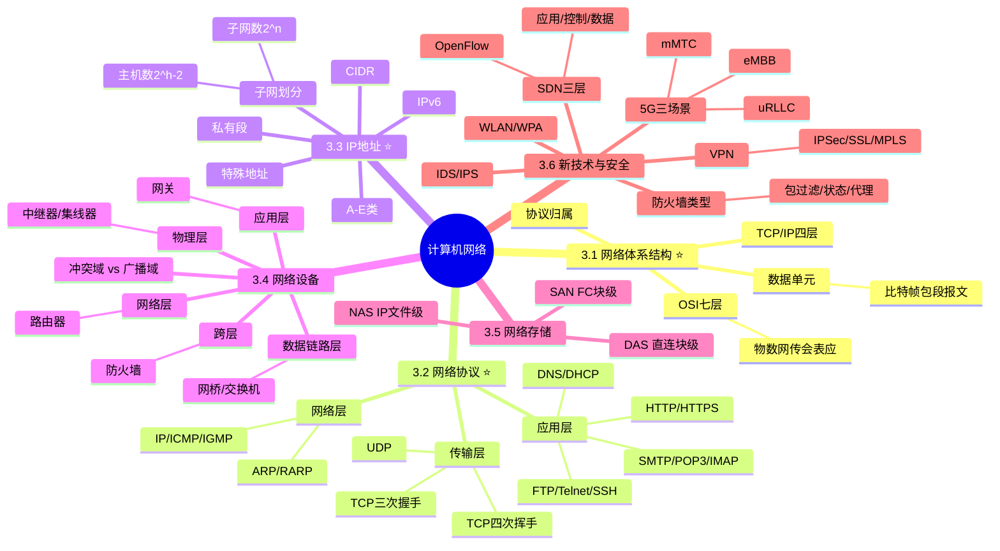

# 计算机网络

> [!warning] 次重点 ★★★☆（红宝书ch10）
> 选择题中常考 1-2 题，核心考点在 ==OSI 七层模型与协议归属==、==TCP/IP 关键端口==、==子网划分计算==、==网络设备工作层级==、==DAS/NAS/SAN 对比==、==5G 三大场景==。**子网划分**是必考的计算题点，**ARP 协议归属**与**冲突域 vs 广播域**是高频易混点。
>
> **速查跳转**：[[#3.1 网络体系结构（重点★★★★）|OSI/TCP-IP]] · [[#3.2 网络协议（重点★★★★）|协议端口]] · [[#3.3 IP 地址与子网划分（重点★★★★）|子网计算]] · [[#3.4 网络设备（次重点★★★）|设备层级]] · [[#3.5 网络存储（次重点★★★）|DAS/NAS/SAN]] · [[#3.6 新技术与网络安全（次重点★★★）|5G/SDN]]

---

## 知识全景

---

## 3.1 网络体系结构（重点★★★★）

> [!tip] 记忆口诀：**物数网传会表应**（自下而上 OSI 七层）

### 3.1.1 OSI 七层 vs TCP/IP 四层 完整对照表

> [!important] 核心强化 — 考试必备
> - OSI 是国际标准但偏理论模型，TCP/IP 是事实工业标准
> - ==ARP 协议工作在网络层，但解析得到的是数据链路层 MAC 地址==（最常考易混）
> - 数据单元自下而上：**比特 → 帧 → 包 → 段 → 报文**

| OSI 层级 | TCP/IP 层级 | 数据单元 | 主要协议 | 典型设备 |
| ------ | -------- | ----------- | ---------------------------------- | ------- |
| 7 应用层  | 应用层      | 报文(Message)         | HTTP/HTTPS/FTP/SMTP/POP3/DNS/DHCP/Telnet/SSH | 网关 |
| 6 表示层  | 应用层      | —                  | JPEG/ASCII/加解密/压缩 | — |
| 5 会话层  | 应用层      | —                  | RPC/SQL/NetBIOS | — |
| 4 传输层  | 传输层      | 段(Segment)/数据报    | TCP/UDP | — |
| 3 网络层  | 网际层      | 包(Packet)/数据报     | IP/ICMP/IGMP/==ARP==/RARP | 路由器/三层交换机 |
| 2 数据链路层 | 网络接口层  | 帧(Frame)            | PPP/HDLC/Ethernet/IEEE 802.3 | 网桥/交换机 |
| 1 物理层  | 网络接口层  | 比特(bit)             | RJ45/双绞线/光纤/同轴电缆 | 中继器/集线器 |

^osi-tcpip-mapping

### 3.1.2 各层核心职责

- **物理层**：传输原始比特流；定义机械/电气/功能/规程 4 种特性
- **数据链路层**：成帧、差错检测、流量控制、MAC 地址寻址
- **网络层**：路由选择、拥塞控制、IP 寻址（端到端逻辑通信）
- **传输层**：端到端可靠传输（TCP）/ 进程间通信、端口号
- **会话层**：建立/管理/终止会话
- **表示层**：数据格式转换、加解密、压缩
- **应用层**：直接面向用户的应用服务

> [!note]- 七层与四层的合并关系
> TCP/IP 模型把 OSI 的 ==会话/表示/应用== 三层合并为一个"应用层"；把 ==物理/数据链路== 两层合并为"网络接口层"（也称"主机到网络层"）。考试中遇到 TCP/IP 协议层级题，要能反推到对应的 OSI 层。

---

## 3.2 网络协议（重点★★★★）

### 3.2.1 应用层协议端口对照表

> [!important] 必背端口表 — 选择题高频考点

| 协议 | 端口 | 传输层 | 用途 |
| ---- | ---- | ---- | ---- |
| HTTP | 80 | TCP | 超文本传输 |
| HTTPS | 443 | TCP | HTTP + SSL/TLS |
| FTP | 20(数据)/21(控制) | TCP | 文件传输 |
| TFTP | 69 | UDP | 简单文件传输（无认证） |
| Telnet | 23 | TCP | 远程登录（明文） |
| SSH | 22 | TCP | 安全远程登录（加密） |
| SMTP | 25 | TCP | 邮件发送 |
| POP3 | 110 | TCP | 邮件接收（下载即删） |
| IMAP | 143 | TCP | 邮件接收（保留服务器） |
| DNS | 53 | UDP/TCP | 域名解析（区域传输用 TCP） |
| DHCP | 67(server)/68(client) | UDP | 动态主机配置 |
| SNMP | 161/162 | UDP | 网络管理 |

^port-table

> [!tip] 端口速记套路
> - **邮件**：发 25(SMTP) / 收 110(POP3) / 同步 143(IMAP)
> - **文件**：FTP 20+21 / TFTP 69
> - **远程**：Telnet 23(明文) / SSH 22(加密)
> - **解析**：DNS 53 / DHCP 67-68
> - **网管**：SNMP 161-162

### 3.2.2 TCP vs UDP 对比

| 维度 | TCP | UDP |
| ---- | ---- | ---- |
| 连接方式 | 面向连接（三次握手） | 无连接 |
| 可靠性 | 可靠（确认+重传+排序） | 不可靠（尽力而为） |
| 报文头开销 | 20 字节（最少） | 8 字节 |
| 流量控制 | 有（滑动窗口） | 无 |
| 拥塞控制 | 有（慢启动/拥塞避免/快重传/快恢复） | 无 |
| 传输方式 | 字节流 | 数据报 |
| 适用场景 | HTTP/FTP/SMTP（数据完整优先） | DNS/视频/语音/在线游戏（速度优先） |

^tcp-udp-comparison

### 3.2.3 TCP 三次握手与四次挥手

> [!important] 三次握手（建立连接）
> 1. 客户 → 服务器：`SYN=1, seq=x`
> 2. 服务器 → 客户：`SYN=1, ACK=1, seq=y, ack=x+1`
> 3. 客户 → 服务器：`ACK=1, seq=x+1, ack=y+1`
>
> **目的**：双方确认收发能力，并交换初始序列号。

> [!important] 四次挥手（关闭连接）
> 1. 主动方 → 被动方：`FIN=1, seq=u`（主动方进入 FIN_WAIT_1）
> 2. 被动方 → 主动方：`ACK=1, ack=u+1`（被动方进入 CLOSE_WAIT，主动方进入 FIN_WAIT_2）
> 3. 被动方 → 主动方：`FIN=1, ACK=1, seq=v`（被动方进入 LAST_ACK）
> 4. 主动方 → 被动方：`ACK=1, ack=v+1`（主动方进入 TIME_WAIT，等 2MSL 后 CLOSED）
>
> **TIME_WAIT 等 2MSL 的原因**：① 确保最后一个 ACK 到达；② 让旧连接报文在网络中失效，防止串扰新连接。

^tcp-handshake

### 3.2.4 网络层关键协议

- **IP（Internet Protocol）**：无连接、不可靠、尽力交付、分组路由
- **ICMP（Internet Control Message Protocol）**：差错报告与控制消息（==ping/traceroute 基于此==）
- **IGMP（Internet Group Management Protocol）**：组播组管理
- **ARP（Address Resolution Protocol）**：IP → MAC 地址解析
- **RARP（Reverse ARP）**：MAC → IP 地址解析（已被 DHCP/BOOTP 替代）

> [!warning] 易混淆点
> - ARP 工作在 ==网络层==，但解析得到的是 ==数据链路层 MAC 地址==
> - ICMP 是网络层协议，但 ==封装在 IP 数据报内部==
> - ping 是应用工具，==基于 ICMP==，本质走网络层

### 3.2.5 数据链路层广域网协议

- **PPP（Point-to-Point Protocol）**：点对点协议，广泛用于拨号、PPPoE 宽带接入
- **HDLC（High-level Data Link Control）**：面向位的同步链路控制协议
- **Ethernet IEEE 802.3**：局域网最主流标准（CSMA/CD）

---

## 3.3 IP 地址与子网划分（重点★★★★）

### 3.3.1 IPv4 地址分类

| 类别 | 首字节范围 | 默认掩码 | 网络数 | 每网络主机数 | 用途 |
| ---- | ---- | ---- | ---- | ---- | ---- |
| A | 1-126 | /8 (255.0.0.0) | 126 | 2²⁴-2 ≈ 1677万 | 大型网络 |
| B | 128-191 | /16 (255.255.0.0) | 16384 | 2¹⁶-2 = 65534 | 中型网络 |
| C | 192-223 | /24 (255.255.255.0) | 2097152 | 2⁸-2 = 254 | 小型网络 |
| D | 224-239 | — | — | — | 多播（组播） |
| E | 240-255 | — | — | — | 保留实验 |

^ipv4-classes

> [!important] 特殊地址速记
> - **127.0.0.1**：环回地址（loopback），本机测试
> - **0.0.0.0**：默认路由 / 当前网络中本主机
> - **255.255.255.255**：受限广播（不跨路由器）
> - **网络号全 0**：本网络
> - **主机位全 0**：网络地址（不可分配给主机）
> - **主机位全 1**：定向广播地址（不可分配给主机）

> [!tip] 私有 IP 地址段（不在公网路由）
> - **A 类私有**：10.0.0.0/8（10.0.0.0 ~ 10.255.255.255）
> - **B 类私有**：172.16.0.0/12（172.16.0.0 ~ 172.31.255.255）
> - **C 类私有**：192.168.0.0/16（192.168.0.0 ~ 192.168.255.255）

### 3.3.2 子网划分公式（必考）

> [!important] 三大公式
> - **子网数 = 2ⁿ**（n = 从主机位借出的位数）
> - **每子网可用主机数 = 2ʰ - 2**（h = 剩余主机位数；扣除全 0 网络号 + 全 1 广播）
> - **每子网总地址数 = 2ʰ**

^subnet-formula

> [!tip] 计算示例 1：固定借位
> 给定 192.168.1.0/24，借 3 位划分子网，求子网数与每子网可用主机数。
> - 子网数 = 2³ = **8**
> - 主机位 = 8 - 3 = 5
> - 可用主机数 = 2⁵ - 2 = **30**
> - 新掩码 = /27 = 255.255.255.224

> [!tip] 计算示例 2：反推借位（容量约束）
> 要求每子网容纳 ≥ 50 主机，原 /24 网络至少保留几位主机位？
> - 由 2ʰ - 2 ≥ 50 → 2ʰ ≥ 52 → h ≥ 6
> - 至少保留 **6 位**主机位 → 借位 = 8 - 6 = 2
> - 新掩码 = /26 = 255.255.255.192
> - 子网数 = 2² = **4**
> - 每子网可用主机 = 2⁶ - 2 = **62**

### 3.3.3 CIDR 无类域间路由（了解）

CIDR（Classless Inter-Domain Routing）打破 A/B/C 类边界，使用变长子网掩码（VLSM）。

- **格式**：`IP/前缀长度`，如 `192.168.1.0/24`、`10.0.0.0/8`
- **作用**：提高地址利用率，减少路由表条目（路由聚合）
- **常用掩码 ↔ 前缀**：
    - /8 = 255.0.0.0
    - /16 = 255.255.0.0
    - /24 = 255.255.255.0
    - /26 = 255.255.255.192
    - /30 = 255.255.255.252（点对点链路常用，2 个可用 IP）

### 3.3.4 IPv6 简介（了解）

| 维度 | IPv4 | IPv6 |
| ---- | ---- | ---- |
| 地址长度 | 32 位 | **128 位** |
| 地址表示 | 点分十进制（4 段） | 冒号十六进制（8 组 4 位） |
| 地址数量 | 约 43 亿 | 约 3.4×10³⁸ |
| 包头 | 20 字节（变长） | 40 字节（定长） |
| 安全性 | 可选 IPSec | **内置 IPSec** |

> [!tip] IPv4 → IPv6 三大过渡技术
> 1. **双协议栈**（Dual Stack）：节点同时运行 IPv4 与 IPv6 协议栈
> 2. **隧道技术**（Tunneling）：IPv6 数据包封装在 IPv4 中传输
> 3. **NAT-PT**（Network Address Translation - Protocol Translation）：协议转换网关

---

## 3.4 网络设备（次重点★★★）

### 3.4.1 设备工作层级对照（自下而上）

| 工作层级 | 设备 | 工作原理 | 隔离冲突域 | 隔离广播域 |
| ---- | ---- | ---- | ---- | ---- |
| 物理层 | 中继器（Repeater） | 信号放大、整形、再生 | ❌ | ❌ |
| 物理层 | 集线器（Hub） | 广播到所有端口（半双工） | ❌ | ❌ |
| 数据链路层 | 网桥（Bridge） | 基于 MAC 地址转发 | ✅ | ❌ |
| 数据链路层 | 交换机（Switch） | MAC 地址表 + 全双工 | ✅ | ❌（VLAN 可隔离） |
| 网络层 | 路由器（Router） | IP 路由 + ACL | ✅ | ✅ |
| 网络层 | 三层交换机 | 二层转发 + 三层路由 | ✅ | ✅（基于 VLAN） |
| 应用层 | 网关（Gateway） | 协议转换 / 不同体系互联 | ✅ | ✅ |
| 跨层 | 防火墙 | 包过滤 / 状态检测 / 应用代理 | — | — |

^device-by-layer

### 3.4.2 交换机 vs 路由器对比

| 维度 | 交换机 | 路由器 |
| ---- | ---- | ---- |
| 工作层级 | 数据链路层（二层） | 网络层（三层） |
| 转发依据 | MAC 地址表 | IP 路由表 |
| 隔离冲突域 | ✅ | ✅ |
| 隔离广播域 | ❌（VLAN 可隔离） | ✅（默认隔离） |
| 转发表更新 | 自学习 MAC | 路由协议（静态/RIP/OSPF/BGP） |
| 转发速度 | 极快（硬件 ASIC） | 慢于交换机（软件 + 硬件） |
| 适用场景 | 局域网内部 | 不同网络互联 |

^switch-vs-router

### 3.4.3 冲突域 vs 广播域（必考易混点）

> [!warning] 易混点速辨
> - **冲突域（Collision Domain）**：CSMA/CD 冲突会传播的范围（同一时刻只能一个站点发送）
> - **广播域（Broadcast Domain）**：广播帧能到达的范围（所有主机都能收到）
> - **集线器**：所有端口共享同一冲突域 + 同一广播域
> - **交换机**：每端口独立冲突域；所有端口默认同一广播域（VLAN 可分割）
> - **路由器**：每端口独立冲突域 + 独立广播域

> [!important] 答题口诀
> - **二层（交换机）隔离冲突域，不隔离广播域**
> - **三层（路由器）冲突域、广播域都隔离**

---

## 3.5 网络存储（次重点★★★）

### 3.5.1 DAS / NAS / SAN 三者对比

| 维度 | DAS | NAS | SAN |
| ---- | ---- | ---- | ---- |
| 全称 | Direct-Attached Storage | Network-Attached Storage | Storage Area Network |
| 中文 | 直连存储 | 网络附加存储 | 存储区域网络 |
| 连接方式 | SCSI/SAS 直连服务器 | 以太网（IP） | 光纤通道 FC / iSCSI(IP) |
| 访问层级 | **块级** | **文件级** | **块级** |
| 协议 | SCSI/SAS | NFS（Unix）/ CIFS·SMB（Windows） | FC / FCoE / iSCSI |
| 数据共享 | ❌ 不共享（独占） | ✅ 文件级共享 | ✅ 块级共享（需文件系统协调） |
| 性能 | 高（直连） | 中（受限以太网） | **极高**（FC）/ 高（iSCSI） |
| 距离 | 短（机柜内） | 远（IP 可达即可） | 中-远（FC 数十 km） |
| 成本 | **低** | 中 | **高** |
| 扩展性 | 差 | 好 | 极好 |
| 适用场景 | 单服务器/工作站 | 文件服务器/中小企业 | 大型企业/数据库/虚拟化 |

^das-nas-san-comparison

> [!important] 三者特征关键字速记
> - **DAS = 直连**（独占、块级、便宜、不共享）
> - **NAS = 文件**（IP 网络、文件级、共享方便）
> - **SAN = 块**（光纤/IP、块级、企业级高性能）

> [!tip] 题目区分技巧
> - 看到「文件共享 / NFS / CIFS」 → **NAS**
> - 看到「光纤通道 / FC / iSCSI / 块设备 / 数据库存储」 → **SAN**
> - 看到「服务器自带磁盘 / SCSI 直连」 → **DAS**

---

## 3.6 新技术与网络安全（次重点★★★）

### 3.6.1 5G 三大应用场景

> [!important] 5G 三大场景（必背）

| 场景 | 全称 | 核心特征 | 典型应用 |
| ---- | ---- | ---- | ---- |
| **eMBB** | Enhanced Mobile Broadband 增强移动宽带 | 高带宽（峰值 10Gbps） | 4K/8K 视频、AR/VR、云游戏 |
| **uRLLC** | Ultra-Reliable Low Latency Communications 超高可靠低延迟通信 | 低时延（毫秒级）+ 高可靠 | 自动驾驶、远程医疗、工业控制 |
| **mMTC** | Massive Machine Type Communications 海量机器类通信 | 广连接（百万设备/km²） | 物联网、智慧城市、智能电表 |

^5g-scenarios

> [!tip] 5G 三大特征
> 1. **高速率**：峰值 10 Gbps，是 4G 的 100 倍
> 2. **低时延**：空口时延 1ms（4G 约 50ms）
> 3. **广连接**：每平方公里百万级设备

### 3.6.2 SDN 软件定义网络

> [!important] 核心思想：**控制平面与数据平面分离**

**SDN 三层架构**（自上而下）：

| 层级 | 组件 | 职责 |
| ---- | ---- | ---- |
| **应用层** | 网络业务应用 | 通过北向接口（API）调用控制器能力 |
| **控制层** | SDN 控制器 | 集中控制、下发流表（南向接口 OpenFlow） |
| **数据层（基础设施层）** | 白盒交换机 | 按流表硬件转发数据 |

^sdn-architecture

- **南向接口**：控制器 ↔ 交换机（==**OpenFlow** 是主流协议==）
- **北向接口**：控制器 ↔ 应用（REST API）

> [!tip] SDN 核心价值
> - **网络可编程化**（软件控制硬件）
> - **集中管控**（替代传统分布式路由协议的局部决策）
> - **灵活流量调度**（基于业务需求）

### 3.6.3 VPN 虚拟专用网

VPN（Virtual Private Network）通过公共网络（互联网）建立加密隧道，实现远程安全访问内网。

| 实现方式 | 工作层级 | 特点 |
| ---- | ---- | ---- |
| **IPSec VPN** | 网络层 | 标准最完善、支持站点对站点（Site-to-Site） |
| **SSL VPN** | 应用层（传输层之上） | 基于浏览器、无需客户端、远程移动办公主流 |
| **MPLS VPN** | 链路层/网络层之间 | 运营商提供、QoS 保证 |
| **L2TP** | 数据链路层 | 通常配合 IPSec 加密 |
| **PPTP** | 数据链路层 | 已淘汰（安全性弱） |

### 3.6.4 防火墙与入侵检测

**防火墙类型对比**：

| 类型 | 工作层级 | 检测内容 | 性能 | 安全性 |
| ---- | ---- | ---- | ---- | ---- |
| **包过滤防火墙** | 网络层 | IP/端口/协议（无状态） | 快 | 弱 |
| **状态检测防火墙** | 传输层 | 连接状态表 | 中 | **中（主流）** |
| **应用代理防火墙** | 应用层 | 应用协议深度检测 | 慢 | **强** |

^firewall-types

> [!warning] IDS vs IPS 部署方式区别
> - **IDS（入侵检测系统）**：==旁路部署==，被动检测 + 告警，不阻断
> - **IPS（入侵防御系统）**：==串联部署==（在线），主动阻断攻击流量
> - **部署口诀**：**IDS 旁路、IPS 串联**

**DMZ（非军事区，Demilitarized Zone）**：内网与外网之间的隔离区，用于部署对外服务（Web/邮件/DNS），形成"内网 - DMZ - 外网"三段式防护。

### 3.6.5 WLAN 与无线安全（了解）

**802.11 系列演进**：

| 标准 | 频段 | 速率 | 商业名称 |
| ---- | ---- | ---- | ---- |
| 802.11a | 5GHz | 54 Mbps | — |
| 802.11b | 2.4GHz | 11 Mbps | — |
| 802.11g | 2.4GHz | 54 Mbps | — |
| 802.11n | 2.4/5GHz | 600 Mbps | Wi-Fi 4 |
| 802.11ac | 5GHz | 6.9 Gbps | Wi-Fi 5 |
| 802.11ax | 2.4/5/6GHz | 9.6 Gbps | **Wi-Fi 6** |

**无线加密演进**：
- **WEP**（Wired Equivalent Privacy）：已破解，淘汰
- **WPA**（Wi-Fi Protected Access）：临时方案
- **WPA2**：基于 AES-CCMP，主流（2004-）
- **WPA3**：抗暴力破解，2018 起逐步推广

---

## 关联链接

- 返回主索引：[[../MOC]]
- 综合知识全景：[[00-综合知识全景图]]
- 关联章节：
    - [[14-信息安全]]：网络安全详细内容（加密算法 / 认证 / 等保 / OSI 安全体系）
    - [[12-系统可靠性]]：网络容错设计（双链路 / HSRP / VRRP）
    - [[01-计算机组成原理]]：硬件层网络接口（前置）
    - [[02-操作系统]]：网络 I/O 与 Socket 编程（前置）
