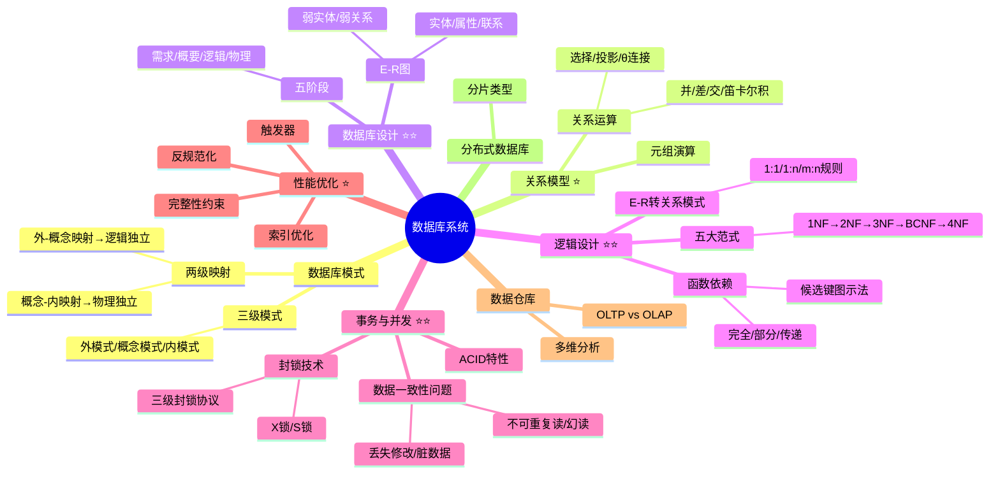

# 数据库系统

> [!danger] 超级重点 ★★★★★★（红宝书ch12）
> 系统架构设计师和系统分析师常考知识点。选择案例常考数据库模式、规范化理论、并发控制、完整性、ER 图等。案例部分还考察数据库分区、NOSQL、反规范化、主从复制、读写分离、一致性等设计维护运行技术。系分架构都爱考，属于不看必挂系列。
>
> **速查跳转**：[[#4.1 数据库模式|三级模式]] · [[#4.2 关系模型|关系运算]] · [[#4.3 数据库设计与建模|设计阶段]] · [[#4.4 概要设计（E-R图）|E-R图]] · [[#4.5 逻辑设计|函数依赖+范式]] · [[#4.6 数据库控制功能|事务+封锁]] · [[#4.7 数据库性能优化|性能优化]] · [[#4.8 数据仓库与分布式|数据仓库]]

---

## 知识全景



---

## 4.1 数据库模式

> [!warning] 重点 ★★★★★ — 三级模式两级映射，选择题爱考

### 三级模式

| 三级模式 | 面向人群 | 内涵 |
|---------|---------|------|
| **外模式**（用户模式） | 用户（程序员和终端用户） | 描述组成用户视图的各个记录的组成、相互关系、数据项的特征、数据的安全性和完整性约束条件，是==局部==数据的逻辑结构和特征的描述 |
| **概念模式**（逻辑模式） | 数据库管理员 | 数据库中==全体数据==的逻辑组织和特征的描述，用以描述现实世界中的实及其性质与联系，定义记录、数据项、数据的完整性约束条件及记录之间的联系 |
| **内模式**（存储模式/物理模式） | 系统程序员 | 用以描述存储记录的类型、存储域的表示和存储记录的物理顺序，以及索引和存储路径等数据的存储组织，是数据在数据库内部的表示方式 |

> [!tip] 记忆口诀
> ==外来的局长改了全部的内务==
> **外**（外模式）**局**（局部数据）**改**（概念）**全**（全体）**内**（内模式）**务**（物理顺序）

^three-schema

### 两级映射与两级独立性

| 两级独立性 | 内涵 |
|---------|------|
| **物理独立性** | 用户的应用程序与存储在==磁盘==上的数据库中的数据是相互独立的 |
| **逻辑独立性** | 用户的应用程序与数据库中的==逻辑结构==是相互独立的，当数据的逻辑结构改变时，应用程序不需要改变 |

- 外模式-概念模式映射 → 保证**逻辑独立性**（External Level ↔ Conceptual Level）
- 概念模式-内模式映射 → 保证**物理独立性**（Conceptual Level ↔ Internal Level）

^schema-mapping

---

## 4.2 关系模型

> [!note]- 重点 ★★★★★ — 关系运算符和SQL等价是考试重点

### 基本术语

| 术语 | 描述 |
|------|------|
| 关系（表文件） | 一个二维表，由行和列组成，对应数据库中的一张表 |
| 元组（记录） | 表中的一行，代表一个元组或一条记录 |
| 属性（字段） | 表中的每一列，定义了数据的意义和数据类型 |
| 属性值 | 行和列交叉点的值 |
| 主码（主键） | 用于唯一确定表中一个元组的数据，可以是一个或多个字段 |
| 域 | 属性的取值范围 |
| 关系模式 | 关系的逻辑描述，一般表示为：关系名（属性1，属性2，…，属性n） |
| 主属性 | 包含在任何一个候选键中的属性 |
| 非主属性 | 不包含在任何候选键中的属性 |

### 4.2.1 关系运算基础

> [!warning] 次重点 ★★★☆☆ — 选择题中时常考到，关系代数符号一定要记住，有时会给关系代数让你写出等价的SQL表达式

关系代数的基本运算：**并、交、差、笛卡尔积、选择、投影、连接和除法运算**。

| 运算 | 符号 | 含义 | 类比SQL |
|------|------|------|---------|
| **并** | R∪S | R和S所有元组的集合（去重） | UNION |
| **差** | R-S | 在R中但不在S中的元组集合 | EXCEPT |
| **交** | R∩S | R和S共同元组的集合 | INTERSECT |
| **笛卡尔积** | R×S | R(m元)×S(n元)→(m+n)元，u×v行 | 无条件JOIN |
| **投影** | π_A(R) | 从R中抽取指定属性（列） | SELECT 指定列名 |
| **选择** | σ_F(R) | 从R中抽取满足条件F的记录 | WHERE |
| **θ连接/自然连接** | R⋈S | 笛卡尔积后筛选满足条件的元组，自然连接去重复列 | INNER JOIN |

^relational-algebra

### 4.2.2 元组演算基础

> [!note]- 次重点 ★★★☆☆ — 只考选择题，最多1分，看懂即可

元组演算表达式基本形式：`{t|P(t)}`，表示满足公式P的所有元组t的集合。
- R(s)：其中R是关系名，s是元组变量，含义是s是关系的一个元组
- s[i]θu[j]：元组s的第i个分量与元组u的第j个分量之间满足θ运算

---

## 4.3 数据库设计与建模

> [!warning] 超级重点 ★★★★★★ — 选择案例必考

基于数据库系统生命周期的数据库设计在系分教材上可分为如下5个阶段：

| 阶段 | 主要内容 | 具体任务 |
|------|---------|---------|
| **需求分析** | 设计者需了解和分析用户需求，是整个设计过程的基础 | 编写需求说明书，包括==数据流图、建立数据字典== |
| **概要设计** | 将需求分析得到的用户需求建立抽象的信息模型（概念模型），是现实世界的模型，便于与不熟悉计算机的用户交流，是数据库设计的==关键== | ==选择局部应用、逐一设计分E-R图和E-R图合并== |
| **逻辑设计** | 用具体DBMS实现用户需求，将概念结构转换为相应数据模型，根据用户处理要求、安全性考虑建立必要视图并优化数据模型 | ==数据模型设计、E-R图转换为关系模式、关系模式规范化、确定完整性约束、确定用户视图、反规范化设计== |
| **物理设计** | 为给定的逻辑数据模型选择高效、最适合的物理结构（主要指数据库的存储结构和存储方法），并对物理结构进行时间和空间效率方面的评价 | — |

> [!tip] 重点关注：==需求分析、概要设计、逻辑设计、物理设计==四块，其中概要设计、逻辑设计是最重要的。

^db-design-stages

---

## 4.4 概要设计（E-R图）

> [!warning] 超级重点 ★★★★★★ — E-R图三要素、联系类型、弱实体必须掌握

概要设计常用策略是运用自顶向下方法进行需求分析，然后运用自底向上方法设计概念结构（选择局部应用→逐一设计分E-R图→E-R图合并）。

### E-R图三要素

| 元素 | 表示方式 | 示例说明 |
|------|---------|---------|
| **实体（型）** | 用==矩形框==表示，框内标注实体名称 | 电商系统中的"用户""商品"等实体 |
| **单值属性** | 用==椭圆形==表示，并用连线与实体连起来 | "用户"实体有"姓名"属性 |
| **多值属性** | 用==双实线椭圆==表示，多值属性可有一或两个以上的值 | "学员"实体的"个人兴趣"属性 |
| **派生属性** | 用==虚线椭圆==表示，从基本属性计算得出 | 学员的"总成绩""平均成绩" |
| **实体之间的联系** | 用==菱形==表示，框内标注联系名称，用连线将菱形与有关实体相连，并在连线上注明联系类型（1:1, 1:n 或 m:n） | "用户"与"商品"实体间可能存在"购买"联系 |

^er-diagram-elements

### 扩展E-R图概念

| 概念 | 定义 | 示例 |
|------|------|------|
| **弱实体** | 依赖于某个实体而存在的实体，依赖的对象为强实体 | 订单依赖于用户实体，订单是弱实体，用户是强实体 |
| **弱关系** | 一般与弱实体一起使用，仅弱实体才会涉及的关系 | / |
| **不完全概化** | 父实体的实例可以是子实体的实例，也可能不是任何子实体的实例，即父实体部分实例不属于任何子类别 | 职业作为父实体，其子实体为工程师、老师，存在部分职业不属于工程师和老师类别 |
| **全部概化** | 父实体的所有实例必须是某个子实体的实例，不存在独立的父实体实例 | 人作为父实体，子实体为男人、女人，所有人必定属于男人或女人类别 |

### 4.4.1 整体E-R图设计

> [!warning] 重点 ★★★★★ — 记忆点：==合并、消除冲突（属性/命名/结构）、消除冗余==

| 步骤 | 内容 |
|------|------|
| **合并** | 确定各局部E-R图的公共实体类型，以其为单位合并，直至所有相同实体类型合并完毕，得到全局E-R图 |
| **消除冲突** | **属性冲突**：包括属性域冲突和取值冲突，需各部门协商解决；**命名冲突**：包含同名异义和异名同义，通过讨论、协商等行政手段解决；**结构冲突**：同一对象在不同应用中抽象不同；同一实体在不同局部E-R图中属性个数或排列次序不同；实体间联系在局部E-R图中联系类型不同 |
| **消除冗余** | 冗余分为冗余属性（可由基本数据导出的数据）和冗余联系（可由其他联系导出的联系） |

^er-merge-steps

---

## 4.5 逻辑设计

> [!warning] 超级重点 ★★★★★★

### 4.5.1 E-R图转换关系模式

> [!warning] 重点 ★★★★★

| 联系类型 | 转换方式1 | 转换方式2 |
|---------|---------|---------|
| **1:1联系** | 转换为独立关系模式（关系的属性由联系相连各实体的主码以及联系本身的属性组成，主码是每个实体的主码） | 与联系一端实体的关系模式合并（将另一个实体的主码和联系本身的属性加入到该端实体关系模式的属性中） |
| **1:n联系** | 转换为独立关系模式（关系的属性由该联系相连的各实体的主码以及联系本身的属性转换而来，主码是n端实体的主码） | 与n端实体对应关系模式合并（将联系本身的属性和1端实体的主码加入到n端对应关系模式中） |
| **m:n联系** | 只能转换为独立关系模式（关系的属性由该联系相连的各实体的主码以及联系本身的属性转换而来，各实体主码的组合是该关系的主码或关系主码的一部分） | — |

^er-to-relational

### 4.5.2 函数依赖

> [!warning] 重点 ★★★★★ — 不用记定义，直接看例子理解

**函数依赖**：若X→Y，读作"X函数决定Y"或"Y函数依赖于X"，X为决定因素。

| 函数依赖类型 | 定义 | 例子 |
|------------|------|------|
| **平凡函数依赖** | 若X→Y，但Y⊆X，则称X→Y是平凡函数依赖 | （职工号，性别）→职工号，因为职工号是（职工号，性别）的子集 |
| **非平凡函数依赖** | 若X→Y，且Y⊄X，则称X→Y是非平凡函数依赖 | （职工号，姓名）→性别 |
| **完全函数依赖** | 在关系模式R(U)中，如果X→Y，并且对于X的任何一个真子集X'，都有X'不→Y，则称Y对X完全函数依赖 | （职称，课程号）完全函数决定课时费 |
| **部分函数依赖** | 在关系模式R(U)中，如果X→Y，但Y不完全函数依赖于X，则称Y对X部分函数依赖 | （教工号，课程号）部分函数决定姓名，因为教工号本身就可以决定姓名 |
| **传递函数依赖** | 在关系模式R(U)中，如果X→Y，Y→Z，且Y!→X，Z⊄Y，则称Z对X传递函数依赖 | 学号→系号，系号→系名和系主任名，系名和系主任名传递依赖于学号 |

^functional-dependency

### 4.5.3 键/码/属性

> [!warning] 重点 ★★★★★ — 候选键图示法是送分题

| 概念 | 定义 |
|------|------|
| **主键/码** | 被数据库设计者选中，用于在同一实体集中区分不同实体的候选码，应选从不或极少变化的属性，一个实体集仅有一个主码 |
| **超码** | 一个或多个属性的集合，能在实体集中唯一标识一个实体，可能含多余属性 |
| **候选码** | 若超码的任一真子集不能成为超码，则为候选码，不包含多余属性 |
| **主属性** | 包含在任一候选码中的属性 |
| **非主属性** | 不包含在任一候选码中的属性 |

**候选键图示法（必须掌握，选择题遇到就是送分）**：
1. 将关系模式的函数依赖关系，用有向图的方式表示，其中顶点表示属性，弧表示属性之间的依赖关系
2. 找出==入度为0的属性集==，并以该属性集为起点，尝试遍历有向图，若能正常遍历图中所有结点，则该属性集即为关系模式的候选键；若入度为0的属性集不能遍历图中所有结点，则需要尝试性地将一些中间顶点（既有入度，也有出度的顶点）并入到入度为0的属性集中，直至该集合能遍历所有顶点，则该集合为候选键

^candidate-key

### 4.5.4 五大范式

> [!warning] 超级重点 ★★★★★★ — 1NF/2NF/3NF/BCNF/4NF全部在考试中出现过，选择案例都会考到！死记硬背都要记住。

> [!tip] 范式口诀
> ==一范式，无重复；二范式，主键独；三范式，无传递；BCNF传递无；四范式，多值除==
>
> 判断范式前，一定要先**找出它的主键**！然后再进行分析。

| 范式名称 | 定义 | 判断关键 | 规范化方法 |
|---------|------|---------|-----------|
| **第一范式（1NF）** | 所有属性只包含原子值，每个分量不可再分 | 属性是否为==原子属性== | 拆分非原子属性 |
| **第二范式（2NF）** | 满足1NF，且不存在非主属性对候选码的==部分函数依赖==；若每一个候选码都是单码则也满足 | 是否存在非主属性对候选码的==部分依赖== | 将部分依赖的非主属性拆出，形成新的关系模式 |
| **第三范式（3NF）** | 满足1NF，不存在非主属性对候选码的==传递函数依赖==；非主属性既不部分也不传递依赖于任何候选码 | 是否存在非主属性对候选码的==传递依赖== | 将传递依赖的关系拆分 |
| **BCNF** | 满足1NF，不存在任何属性对候选码的传递函数依赖，关系模式中==任何函数依赖的左侧必须是码（候选码）== | 函数依赖左侧是否为码 | 将违反BCNF的函数依赖拆分 |
| **第四范式（4NF）** | 是BCNF的推广，针对有==多值依赖==的关系模式，将一个表中多个多值依赖拆分开 | 是否存在多个多值依赖 | 将多值依赖拆分为独立的关系模式 |

^five-normal-forms

> [!tip] 推论
> - 推论1：如果关系模式R∈1NF，且它的每一个非主属性既不部分依赖、也不传递依赖于任何候选码，则R∈3NF
> - 推论2：不存在非主属性的关系模式一定为3NF（所有属性都是主属性）
> - 2NF是基于1NF推导出来的，3NF一定是2NF

### 4.5.5 规范化异常

> [!warning] 重点 ★★★★★ — 此章节极大概率在案例中进行考察，一旦在案例中出现至少8分！

规范化导致的4大异常情况（==冗删改查==）：

| 问题类型 | 描述 | 示例 |
|---------|------|------|
| **数据冗余** | 相同数据在关系中多次重复出现 | 某课程有100个学生选修，课程的任课教师姓名和地址在关系R中重复出现100次 |
| **修改异常** | 因数据冗余，修改数据时需多处修改，否则会导致数据不一致 | 修改教师地址时，需修改100个元组中的地址值 |
| **插入异常** | 因部分信息缺失，导致相关数据无法正常插入数据库 | 不知道听课学生名单时，教师的任课情况和家庭地址无法进入数据库，或需在学生姓名处插入空值 |
| **删除异常** | 删除某类数据时，会意外删除其他不应删除的数据 | 删除某门课程的任课教师信息时，学生信息也被删除 |

> [!tip] 记忆口诀：==绒绣茶山==。毛绒绣出来的茶山玩具。
> **绒**（冗余）**绣**（修改）**茶**（插入）**山**（删除）

^normalization-anomalies

### 4.5.6 Armstrong公理

> [!note]- 次重点 ★★★☆☆ — 了解就行，重点关注自反、增广、传递、合并和分解

| 名称 | 公式 |
|------|------|
| **自反性** | 若X⊇Y，则存在X→Y |
| **增广性** | 若X→Y，则存在XZ→YZ |
| **传递性** | 若X→Y 和 Y→Z，则存在X→Z |
| **合并性** | 若X→Y 和 X→Z，则存在X→YZ |
| **分解性** | 若X→Y，且Y⊇Z，则存在X→Z |
| **伪传递性** | 若X→Y 和 WY→Z，则存在WX→Z |
| **复合性** | 若X→Y 和 Z→W，则存在XZ→YW |
| **自增性** | 若X→Y，则存在WX→Y |

---

## 4.6 数据库控制功能

> [!warning] 重点 ★★★★★ — 系分容易出案例题，架构一般不会

DBMS的控制功能包括并发控制、性能优化、数据完整性和安全性，以及数据备份与恢复等问题。

### 4.6.1 事务的基本概念（ACID）

> [!warning] 重点 ★★★★★ — ACID目前案例还没考过，但这里的原理需要记住，可能出概念题，至少8分

事务是用户定义的一个数据库操作序列，这些操作序列要么全做，要么全不做，是一个不可分割的工作单位。

| 特性名称 | 含义 | 示例 |
|---------|------|------|
| **原子性（Atomicity）** | 事务包含的一组更新操作是==原子不可分==的，是一个整体，不能部分地完成 | 强调事务中的操作要么全部执行成功，要么全部不执行 |
| **一致性（Consistency）** | 使数据库从一个==一致性状态==变到另一个一致性状态，与原子性密切相关，由事务的隔离性来表示，逻辑上不独立 | 转账操作中，各账户金额必须平衡 |
| **隔离性（Isolation）** | 一个事务的执行不能被其他事务干扰，并发执行的各个事务之间不能相互干扰，即使多个事务并发执行，看上去也像每个事务按串行调度执行一样，也称为==可串行化== | 强调并发事务之间的相互隔离，不互相干扰 |
| **持久性（Durability）** | 也称为永久性，事务一旦提交，改变就是==永久性==的，无论发生何种故障，都不应该对其有任何影响 | 比如订单提交成功后，相关数据的改变会永久保存 |

^acid-properties

### 4.6.2 数据一致性问题

> [!warning] 重点 ★★★★★ — 数据不一致问题以往系分案例考过填空，有概率改成案例概念题，这里的例子和三个不一致的场景必须掌握

| 问题类型 | 描述 | 示例 |
|---------|------|------|
| **丢失修改（写覆盖）** | 事务A与事务B从数据库中读入同一数据并修改，事务B的提交结果破坏了事务A提交的结果，导致事务A的修改被丢失 | T1读A=10，T2读A=10，T1执行A=A-5写回，T2执行A=A-8写回，则T1的修改被T2覆盖 |
| **读"脏数据"（读回滚）** | 事务A修改某一数据，并将其写回磁盘，事务B读取同一数据后，由于某种原因被撤销，这时事务A已修改过的数据恢复原值，事务B读到的数据就与数据库中的数据不一致，称为"脏数据" | T1读A=100改为70写回，T2读A=70，T1撤销A变回100，T2读的70就是脏数据 |
| **不可重复读（读更新）** | 事务A读取数据后，事务B执行了更新操作，事务A前后两次读取结果就发生变化，造成了数据不一致性 | T1读A和B求和=50，T2修改A=A+50写回，T1再次读A和B求和=100，两次结果不同 |
| **幻读（读插入）** | T1读取某一范围的数据，T2在这个范围内插入新的数据，T1再次读取这个范围的数据，此时读取的结果和第一次读取的结果不同 | T1读年龄20-30岁间的学生记录，T2插入一条年龄25岁的学生记录，T1再次读时比第一次多了一条记录 |

^concurrency-problems

### 4.6.3 封锁技术

> [!warning] 重点 ★★★★★ — 数据库事务锁很有可能在案例中出现，可能结合MySQL事务隔离机制出填空或者概念题

处理并发控制的主要方法是采用==封锁技术==，主要有两种封锁：**X封锁**和**S封锁**。

| 封锁类型 | 含义 | 特点 | 操作权限 | 解除封锁要求 |
|---------|------|------|---------|------------|
| **排他型封锁（X封锁）** | 事务T对数据对象A实现X封锁 | 只允许一个事务独锁某个数据，具有==排他性== | 事务T可读取和修改数据A；其他事务在T解除X封锁前，不能对数据A进行任何类型的封锁 | 事务T完成对数据A的操作后解除 |
| **共享型封锁（S封锁）** | 事务T对数据A实现S封锁 | 允许==并发读==，但不允许修改 | 事务T只能读取数据A，不能修改；在所有S封锁解除前，任何事务不能对数据A实现X封锁 | 所有对数据A加S封锁的事务完成读取操作后解除 |

**封锁协议**：

| 封锁协议 | 具体内容 | 能解决的问题 | 不能解决的问题 |
|---------|---------|------------|--------------|
| **一级封锁协议** | 事务T在修改数据R之前必须先对其加X锁，直到事务结束才释放 | 防止==丢失修改==，保证事务T可恢复 | 不能防止读"脏数据"和不可重复读 |
| **二级封锁协议** | 一级封锁协议基础上，事务T在读取数据R之前先对其加S锁，读完后即可释放S锁 | 防止丢失修改、防止读=="脏数据"== | 不能保证可重复读 |
| **三级封锁协议** | 一级封锁协议基础上，事务T在读取数据R之前先对其加S锁，直到事务结束才释放 | 防止丢失修改、读"脏数据"，能保证==可重复读== | 无 |
| **两段锁协议** | 所有事务必须分两个阶段对数据项加锁和解锁：扩展阶段（申请并获得封锁）；收缩阶段（释放封锁后，事务不能再申请和获得任何其他封锁） | 若并发执行的所有事务均遵守，则任何并发调度策略都是可串行化的 | 遵守该协议的事务可能发生==死锁== |

^locking-protocols

> [!tip] 封锁粒度
> ==封锁粒度小则并发性高，但开销大；封锁粒度大则并发性低但开销小==，综合平衡照顾不同需求，以合理选取适当的封锁粒度是很重要的。

---

## 4.7 数据库性能优化

> [!note]- 次重点 ★★★☆☆ — 极有可能出案例题，让你写出常见的数据库优化手段

### 4.7.1 反规范化

> [!warning] 重点 ★★★★★

从某种意义上来说，非规范化（反规范化）可以改善系统的性能。在进行数据库设计时，可以考虑合理增加冗余属性，以提升系统性能。

| 类别 | 详情 |
|------|------|
| **反规范化** | 将常用的计算属性（如总计、最大值等）存储到数据库实体中 |
| **提升性能的措施** | 重新定义实体，以减少外部属性数据或行数据的开支；将关系进行水平或垂直割，以提升并行访问度 |
| **反规范化带来的问题** | ==数据冗余增加==，相同数据在多个地方重复存储；==更新异常==，因数据冗余，更新一处数据可能遗漏其他重复存储处，导致数据不一致；==插入异常==，为满足反规范化结构要求，可能需要先插入不必要数据；==删除异常==，删除某些数据可能意外删除其他有用信息 |

### 4.7.2 索引优化

> [!warning] 重点 ★★★★★ — 索引相关知识也是案例常考内容

| 建议内容 | 具体描述 |
|---------|---------|
| **索引选用属性原则** | 选经常作为查询、不常更新的属性建立索引；避免对常更新属性建立索引，因其严重影响性能 |
| **索引数量影响** | 关系上索引过多会影响 UPDATE、INSERT 和 DELETE 性能，因关系更新时所有索引都需相应调整 |
| **索引优化策略** | 分析每个重要查询使用频度，找出使用最多的索引并进行优化 |
| **小数据量关系处理** | 数据量非常小的关系不必建立索引，关系扫描更快且消耗系统资源更少 |

### 4.7.3 完整性约束

> [!warning] 重点 ★★★★★ — 此章节仍然是案例重点考察知识点，考察方式为概念默写

| 约束手段 | 描述 | 补充 |
|---------|------|------|
| **实体完整性** | 实体完整性规则（Entity Integrity Rule）是指关系的主属性，即主码（主键）的组成不能为空，也就是关系的主属性不能是空值（NULL） | / |
| **参照完整性** | 若基本关系S中含有与另一基本关系S的主键PK相对应的属性组FK（FK称为R的外键），则参照完整性要求，及中的每个元组在FK上的值必须是S中某个元组的PK值，或者为空值 | 插入删除问题（级联/受限/置空/遗归） |
| **触发器** | 触发器是一个数据库对象，当指定数据操作语言操作发生时（触发事件），该对象可以自动执行一个或多个SQL语句（触发操作） | 可以在一个表上定义一或多个触发器以便在INSERT、UPDATE或DELETE触发事件发生之后进行操作（不能直接对SELECT定义触发器，因为SELECT只是读取数据，不改变表的状态） |
| **用户定义完整性** | 针对特定数据库应用所定义的约束条件，由用户根据实际业务需求来制定 | 例如，在员工信息表中，规定员工的年龄必须在18-60岁之间 |

### 4.7.4 触发器示例

> [!warning] 重点 ★★★★★ — 系分案例考过触发器填空，所以必须重视起来

以 MySQL 为例：

```sql
CREATE TRIGGER trigger_name
{BEFORE | AFTER} {INSERT | UPDATE | DELETE}
ON table_name
FOR EACH ROW
[trigger_body]
```

触发器中可以通过虚拟表访问行数据（NEW, OLD）：

| 触发器 | 虚拟表 |
|-------|-------|
| INSERT 触发器 | 只能用 `NEW.column_name`（新插入的值） |
| UPDATE 触发器 | 可以用 `OLD.column_name`（更新前的值）和 `NEW.column_name`（更新后的值） |
| DELETE 触发器 | 只能用 `OLD.column_name`（被删除的值） |

^trigger-syntax

### 4.7.5 备份与恢复技术

> [!note]- 次重点 ★★★☆☆ — 看过算过

| 分类方法 | 子分类 | 解读 |
|---------|-------|------|
| **按备份实现方式** | 物理备份 | 指直接拷贝数据库的数据文件、日志文件等物理文件来进行备份，恢复速度相对较快 |
| | 逻辑备份 | 通过数据库的导出工具，将数据库中的数据以逻辑对象（如表、视图、存储过程等）的形式导出为特定格式的文件，如SQL脚本文件等，灵活性较高，可跨平台和数据库版本使用 |
| **按备份数据量情况** | 完全备份 | 对整个数据库进行完整的备份，包括所有数据表、索引、视图、存储过程等数据库对象以及数据 |
| | 增量备份 | 只备份自上次备份以来发生变化的数据，备份速度快，占用空间少，但恢复时需要依次使用完全备份以及后续的所有增量备份 |
| | 差异备份 | 备份自上次完全备份以来发生变化的数据，备份速度相对较快，恢复时只需使用完全备份和最近一次的差异备份 |

---

## 4.8 数据仓库与分布式

### 4.8.1 数据仓库技术

> [!note]- 次重点 ★★★☆☆ — 以往只在选择题中考察过1-2次

**OLTP vs OLAP 对比**：

| 对比维度 | OLTP（联机事务处理） | OLAP（在线分析处理） |
|---------|------------------|------------------|
| **主要应用场景** | 传统数据库，支持基本日常事务处理（如订单处理、客户信息管理、库存管理） | 数据仓库系统，支持复杂分析操作，侧重决策支持（如数据挖掘、商业智能、决策支持） |
| **用户群体** | 操作人员、低层管理人员 | 决策人员、高层管理人员 |
| **功能** | 日常操作处理 | 分析决策 |
| **数据库设计** | 面向应用 | 面向==主题== |
| **数据特点** | 当前的、最新的、细节的、二维的、分立的 | 历史的、聚集的、多维的、集成的、统一的 |
| **数据存取** | 读/写数十条记录 | 读上百万条记录 |
| **数据库大小** | MB 或 GB 级 | GB 或 TB 级 |

**多维分析基本操作**：

| 操作名称 | 定义 | 示例 |
|---------|------|------|
| **钻取** | 改变维的层次，变换分析粒度，包括向上钻取和向下钻取 | 从汇总数据往下"钻"到更细的数据，如从"年销售额"→"季度销售额"→"月销售额" |
| **切片和切块** | 在部分维选定值后，关注度量数据在剩余维上的分布；剩余两维为切片，三维以上为切块 | 切片：获取按月的销售数据；切块：获取按地区（如华东区、华北区等）的数据 |
| **旋转** | 变换维的方向，重新安排维的放置（如行列互换） | 比如原来报表是"行=地区，列=季度"，旋转后变成"行=季度，列=地区" |

^olap-operations

### 4.8.2 分布式数据库

> [!note]- 次重点 ★★★☆☆

分布式数据库系统是数据库技术与网络技术相结合的产物，其基本思想是将传统的集中式数据库中的数据分布于网络上的多台计算机。

| 特性名称 | 具体说明 |
|---------|---------|
| **数据独立性** | 在分布式数据库系统中更为重要，包含数据的逻辑独立性、物理独立性，以及额外的数据分布独立性（==分布透明性==） |
| **集中与自治共享结合的控制结构** | 各局部DBMS可独立管理局部数据库，具备自治功能；同时系统设集中控制机制，协调局部DBMS工作并执行全局应用 |
| **适当增加数据冗余度** | 在不同场地存储同一数据的多个副本，以提高系统的可靠性、可用性及性能 |
| **全局的一致性、可串行性和可恢复性** | 确保分布式环境下数据的全局一致性、事务执行的可串行性，以及系统故障后的可恢复性 |

**数据分片类型**：

| 分片类型 | 定义与条件 | 重构方式 |
|---------|----------|---------|
| **水平分片** | 将全局关系的元组按本关系属性值划分为多个子集 | 通过并操作恢复全局关系 |
| **垂直分片** | 将全局关系的属性划分为多个子集（关键字必须保留在所有分片中） | 通过连接运算恢复全局关系 |
| **导出分片** | 分片条件来自其他关系的属性（又称导出水平分片） | 通过并操作恢复全局关系 |
| **混合分片** | 在同一关系中同时采用水平分片与垂直分片 | 综合使用并操作与连接运算 |

---

## 易错点总结

| 易错点 | 正确理解 |
|-------|--------|
| 三级模式口诀记不住？ | ==外来的局长改了全部的内务==：外/局部→概念/全体→内/物理顺序 |
| 逻辑独立性 vs 物理独立性？ | 外-概念映射→==逻辑==独立性（应用程序不受逻辑结构变化影响）；概念-内映射→==物理==独立性（应用程序不受存储结构变化影响） |
| 部分依赖 vs 传递依赖？ | 部分依赖：Y依赖于X的==真子集==；传递依赖：X→Y→Z且Y⊄X |
| 2NF消除什么？3NF消除什么？BCNF消除什么？ | 2NF消除==部分函数依赖==；3NF消除==传递函数依赖==；BCNF消除==任何属性对候选码的传递依赖==（要求函数依赖左侧必须是码） |
| 候选键图示法核心步骤？ | 找==入度为0==的属性集→尝试遍历所有顶点→若不能则加入中间顶点 |
| 规范化4大异常？ | ==绒绣茶山==：冗余/修改异常/插入异常/删除异常 |
| 一/二/三级封锁协议能解决什么问题？ | 一级→防止==丢失修改==；二级→+防止=="脏数据"==；三级→+保证==可重复读== |
| 两段锁协议的问题？ | 能保证可串行化，但可能发生==死锁== |
| OLTP vs OLAP 关键区别？ | OLTP面向==应用==，操作人员用，处理日常事务；OLAP面向==主题==，决策人员用，分析历史数据 |
| ACID中隔离性的别称？ | ==可串行化==，并发事务执行效果等同于串行执行 |

^error-prone-summary

---

## 与其他知识点的关联

> [!info]+ 知识网络
> **前置知识**
> - [[01-综合知识/07-系统设计|系统设计]] — 数据库设计是系统设计的重要组成部分
> - [[01-综合知识/06-需求工程|需求工程]] — 数据库需求分析阶段要用到DFD和数据字典
>
> **后续知识**
> - [[01-综合知识/14-信息安全|信息安全]] — 数据库安全性与信息安全密切相关
> - [[01-综合知识/12-系统可靠性|系统可靠性]] — 数据库的备份与恢复属于可靠性范畴
>
> **案例 & 论文**
> - [[02-案例分析/03-数据库设计|案例：数据库设计]] — 案例中常考ER图设计、范式判断与规范化、并发控制
> - [[03-论文/04-数据库系统|论文：数据库系统]] — 论文方向包括分布式数据库、数据仓库、反规范化设计
