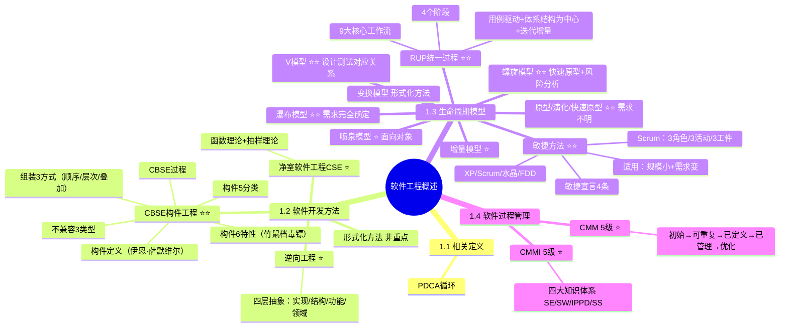

# 软件工程概述

> [!warning] 重点 ★★★★★（红宝书ch1）
> 主要在选择题和论文中考察。下划线标出的内容要熟悉，选择常考概念名称和区分。论文关注：==敏捷（Scrum）==、==RUP==、==测试驱动开发==。
>
> **速查跳转**：[[#1.2.4 CBSE 基于构件的软件工程|CBSE构件]] · [[#1.3 软件过程/生命周期模型|生命周期模型]] · [[#1.3.7 统一过程 RUP|RUP]] · [[#1.3.8 敏捷方法|敏捷/Scrum]] · [[#1.4 软件过程管理|CMM/CMMI]]

---

## 知识全景



---

## 1.1 软件工程相关定义（次重点★★★★☆）

> [!note]- 考点提示
> 记住 PDCA 循环即可，选择题考过一次。

软件工程由**方法、工具和过程**三个部分组成，包括以下4个方面 ==**PDCA**==：

| 字母 | 含义 | 说明 |
|------|------|------|
| P（Plan） | 软件规格说明 | 规定软件的功能及其运行时的限制 |
| D（Do） | 软件开发 | 开发出满足规格说明的软件 |
| C（Check） | 软件确认 | 确认开发的软件能够满足用户的需求 |
| A（Action） | 软件演进 | 软件在运行过程中不断改进以满足客户新的需求 |

---

## 1.2 软件开发方法（重点★★★★★★）

软件开发方法按三种维度分类：

| 分类维度 | 具体方法 |
|---------|---------|
| 开发风格 | 自顶向下 / 自底向上 |
| 性质 | 形式化方法 / 非形式化方法 |
| 适应范围 | 整体性方法 / 局部性方法 |

### 1.2.1 形式化方法（非重点）

使用严格的数学模型和形式化语言描述系统的需求、设计和行为，从理论上保证程序"必然正确"，常用于安全攸关或高可靠性系统。

**特点**：正确性验证难且耗时；仍需和传统测试相结合。

### 1.2.2 净室软件工程 CSE（次重点★★★★☆）

净室软件工程（Cleanroom Software Engineering，CSE）是一种**形式化方法**，强调用数学与统计理论在设计和规约阶段消除错误。

> [!tip]- 两大理论基础
> | 理论基础 | 核心 |
> |---------|------|
> | **函数理论** | 程序本质=从输入集合到输出集合的严格映射，核心性质：完备性、一致性、正确性（**口诀：玩一阵**） |
> | **抽样理论** | 将所有潜在使用场景视为整体样本空间，科学抽样选取代表性测试用例 |

**开发步骤**（了解4个）：统计过程控制下的增量式开发 → 基于函数的规约+盒子结构方法 → 正确性验证 → 统计测试与软件认证。

**局限**：正确性验证依赖严格理论推导，工程实践中仍需考虑底层环境缺陷。

### 1.2.3 逆向工程（次重点★★★★☆）

> [!tip]- 核心概念区分（选择常考）
> | 概念 | 方向 | 定义 |
> |------|------|------|
> | **逆向工程** | 低层→高层 | 分析程序，在比源代码更高抽象层次上建立程序表示，是设计恢复过程 |
> | **重构** | 同层改结构 | 在同一抽象级别上转换系统描述形式（不升层次） |
> | **设计恢复** | 借助工具 | 借助工具从已有程序中抽取数据设计、总体结构设计和过程设计等信息 |
> | **再工程** | 综合 | 逆向工程 + 新需求 + 正向工程（三步） |
> | **正向工程** | 设计→代码 | 从设计到代码 |

**逆向工程4个抽象层次**（从低到高，选择必考）：

| 层次 | 包含信息 |
|------|---------|
| ==实现级== | 程序的抽象语法树、符号表等信息，**最低级**的抽象 |
| ==结构级== | 反映程序分量相互依赖关系信息，如调用图、结构图等 |
| ==功能级== | 反映程序段功能及程序段之间关系的信息 |
| ==领域级== | 反映程序分量或实体与应用领域概念对应关系的信息，**最高级**的抽象 |

> [!tip] 记忆口诀
> **世仇结分工龄**（世仇结婚还要计算工龄）：世（实现）仇（抽象信息）结（结构）分（程序分量）工（功能级）龄（领域级）

### 1.2.4 CBSE 基于构件的软件工程（超级重点★★★★★★）

> [!danger] 超级重点
> 23年架构考了至少5道选择题。构件定义、6大特性、组装类型、不兼容类型——必须全部熟记。

**CBSE**（Component-Based Software Engineering）：通过复用可重用的软件构件来构造高质量、高效率的应用软件系统。

#### 1.2.4.1 构件的定义（重点★★★★★★）

构件定义来自**伊恩·萨默维尔**，构件具有6大特性：

| 构件特性 | 描述 |
|---------|------|
| ==可组装性== | 所有外部交互必须通过公开定义的接口进行，并提供对自身信息的外部访问 |
| ==可部署性== | 构件是自包含的，能作为独立实体在构件模型实现的构件平台上运行；二进制形式且无需在部署前编译 |
| ==文档化== | 构件必须是完全文档化的，所有用户能确定是否构件满足他们的需求 |
| ==独立性== | 构件应该是独立的，在无其他特殊构件的情况下进行组装和部署 |
| ==标准化== | 在CBSE过程中使用的构件必须符合某种标准化的构件模型 |
| ==可见性== | 没有（外部的）可见状态（但构件本身不直接暴露外部可见状态，可通过运行时容器管理并对外提供可见性） |

> [!tip] 记忆口诀
> **竹鼠档毒镖**：竹（可组装性）鼠（可部署性）档（文档化）毒（独立性）镖（标准化）

#### 1.2.4.2 构件分类（次重点★★★★☆）

从外部形态看，构件可分为5类（选择考过一次）：

| 名称 | 特点 | 例子 |
|------|------|------|
| **独立而成熟的构件** | 成熟度高，完全隐藏所有接口，用规定命令使用 | 数据库管理系统、操作系统 |
| **有限制的构件** | 提供接口并指出使用条件和前提；装配时可能产生资源冲突 | 面向对象语言的基础类库 |
| **适应性构件** | 通过包装或接口技术处理了不兼容、资源冲突等问题，可直接在各种环境中使用 | ActiveX组件 |
| **装配的构件** | 安装时已装配在操作系统、数据库管理系统等不同层次上，使用胶水代码即可连接 | 多数软件商提供的成品软件产品 |
| **可修改的构件** | 可修改错误、增加新功能，通过重新"包装"或写接口实现构件版本替换 | 应用系统开发中常用的功能模块 |

> [!tip] 记忆口诀
> **独显限时装秀**：独（独立）显（限制）时（适应）装（装配）秀（修改）。独立显卡挂在衣服上走时装秀。

#### 1.2.4.3 CBSE 过程的主要活动（次重点★★★★☆）

CBSE 活动分两块：
- **面向复用的开发**：开发将被复用在其他应用程序中的构件或服务（通用化处理）
- **基于复用的开发**：复用已存在的构件和服务来开发新的应用程序

基于复用的开发过程：系统需求概览 → 识别候选构件 → 根据发现的构件修改需求 → 体系结构设计 → 识别候选构件 → 组装构件创建系统。

#### 1.2.4.4 构件组装（次重点★★★★☆）

> [!tip] 组装方式（选择常考）

| 组装类型 | 描述 | 特点 |
|---------|------|------|
| **顺序组装** | 按顺序调用已有构件创造新构件，先调用构件A服务，用A结果调用构件B服务 | 构件间不相互调用，可能被外部程序调用，需特定胶水代码确保接口兼容 |
| **层次组装** | 一个构件直接调用另一个构件提供的服务，被调用构件"提供"接口与调用构件"请求"接口需兼容 | 接口匹配无需额外代码；不匹配需转换代码；构件作为网络服务时不能用 |
| **叠加组装** | 两个或以上构件叠加创建新构件，新构件接口是原构件接口组合，通过外部接口分别调用原构件 | A和B不相互依赖和调用 |

**接口不兼容的3种类型**（选择考过）：

| 不兼容类型 | 描述 |
|---------|------|
| ==参数不兼容== | 接口两侧操作名相同，但参数类型或数目不同 |
| ==操作不兼容== | "提供"接口和"请求"接口操作名不同 |
| ==操作不完备== | 一个构件的"提供"接口是另一个构件的"请求"接口的子集，或相反 |

> [!tip] 关键提示
> 只有接口兼容才能做层次组装；顺序组装或叠加组装中可以有中间代码参与兼容转换。

---

## 1.3 软件过程/生命周期模型

> [!danger] 重点 ★★★★★★
> 超级重点，选择爱考，一年分案例也着重考察了。软件过程 = 软件开发生命周期模型（同义词）。

**按前提条件分类**：

| 前提条件 | 适用模型 |
|---------|---------|
| 软件需求**完全确定** | 瀑布模型 |
| 软件开发初始阶段**仅能提供基本需求** | 喷泉模型、螺旋模型、统一开发过程、敏捷方法等 |
| 以**形式化**开发方法为基础 | 变换模型 |

### 1.3.1 瀑布模型（重点★★★★★★）

最早由 Winston W. Royce 在1970年提出，将软件开发过程分为6个阶段：需求分析和定义 → 系统和软件设计 → 实现和单元测试 → 集成和系统测试 → 运行维护。

**适用**：需求完全确定的项目。

> [!warning] 缺点（必背）
> - 依赖于早期进行的需求调查，**不能适应需求的变化**
> - 软件需求的完整性、正确性等很难确定，甚至是不可能和不现实的

### 1.3.2 原型/演化/快速原型模型（重点★★★★★★）

适用于**需求难完整定义**的软件开发，基于快速开发的原型，依据用户反馈改进，不断迭代直至形成最终产品。

开发流程：建立原型目标 → 定义原型功能 → 开发原型 → 评估原型（循环）

> [!tip] 优缺点
> - **优点**：功能开发后可及时测试以验证需求，助于产生高质量要求
> - **缺点**：让用户过早接触不稳定功能，可能造成负面影响
> - **特点**：强调**迭代**，和增量模型有区别

### 1.3.3 螺旋模型（重点★★★★★★）

> [!tip] 核心公式（选择特别爱考）
> **螺旋模型 = 快速原型 + 风险分析**
> 
> 螺旋模型是在快速原型的基础上扩展而成。

螺旋模型是**基于快速原型，并加入风险分析**的软件开发模型，使软件增量版本可快速开发，以一系列增量发布的形式进行。

4个象限活动：① 确定下阶段目标和约束条件 → ② 风险分析、建造原型 → ③ 开发、验证阶段性软件产品 → ④ 制定下阶段计划。

**适用**：庞大、复杂并具有高风险的系统，支持用户需求的动态变化。

**缺点**：过多的迭代次数会增加开发成本，延迟提交时间。

### 1.3.4 喷泉模型（次重点★★★★☆）

> [!note] 记忆要点
> 喷泉模型关键：各个阶段可以**交互**进行。

喷泉模型是一种**以用户需求为动力，以对象为驱动**的模型，主要用于描述**面向对象**的软件开发过程。

各开发阶段没有特定的次序要求，可以交互进行（就像水喷上去又可以落下来）。

### 1.3.5 变换模型（次重点★★★★☆）

基于**形式化规格说明语言和程序变换**的软件开发模型，需要严格的数学理论和一整套开发环境的支持。

### 1.3.6 V 模型（重点★★★★★★）

> [!danger] 考点：什么设计是什么测试的依据（选择常考）

```
需求分析          ←→    验收测试（依据：用户需求）
  概要设计        ←→    系统测试（依据：需求分析文档）
    详细设计      ←→    集成测试（依据：软件概要设计文档）
      编码        ←→    单元测试（依据：软件详细设计说明书）
```

**测试类型对比**（必背）：

| 测试类型 | 测试对象 | 测试目的 | 依据（文档） |
|---------|---------|---------|------------|
| ==单元测试== | 可独立编译或汇编的程序模块、软件构件或OO软件中的类（统称为模块） | 检查每个模块能否正确实现设计说明中的功能、性能、接口等 | **软件详细（设计说明书）** |
| ==集成测试== | 模块之间，以及模块和已集成的软件之间的接口关系 | 检查接口关系，验证已集成的软件是否符合设计要求 | **软件概要设计（文档）** |
| ==系统测试== | 完整的、集成的计算机系统 | 在真实系统工作环境下，验证完整的软件配置项能否和系统正确连接，并满足系统/子系统设计文档和软件开发合同的规定 | **需求分析（文档或开发合同）** |
| ==验收测试== | 已完成全部开发工作、准备交付用户使用的软件系统 | 从用户角度验证系统是否满足合同或需求规定的业务目标，确保系统可交付、可上线 | **用户需求** |

### 1.3.7 统一过程 RUP（超级重点★★★★★★）

> [!danger] 超级重点
> RUP的特点、生命周期、9大核心工作流——选择和论文都考。

**RUP**（Rational Unified Process）将项目管理、业务建模、分析与设计等统一起来，贯穿整个开发过程。

**三大特征**（必背）：
- ==用例驱动==
- ==以体系结构为中心==
- ==迭代和增量==

RUP 采用 **"4+1"视图模型**描述软件系统的体系结构：逻辑视图、实现视图、进程视图、部署视图 + 用例（注意：与架构4+1视图不同，此处核心是用例）。

#### RUP 生命周期（重点★★★★★★）

RUP 是一个**二维的软件开发模型**，包含 **4个阶段** × **9个核心工作流**：

**4个阶段**：初始阶段 → 细化阶段 → 构建阶段 → 交付阶段

**9大核心工作流**（必背，23年系分直接考）：

| 工作流类型 | 9个工作流 |
|---------|---------|
| 工程工作流（6个） | ==业务建模==、==需求==、==分析与设计==、==实现==、==测试==、==部署== |
| 支持工作流（3个） | ==配置与变更管理==、==项目管理==、==环境== |

> [!tip] 记忆口诀
> **建需分食测（工程6个）**：建（建模）需（需求）分（分析）食（实现）测（测试）——建仓前，需先分好粮食、测好食物够不够。
> 
> **部配项环（后4个）**：部（部署）配（配置变更）项（项目管理）环（环境）——部门配了新工具，遇情况得变步骤，项目每个环节都得盯牢。

### 1.3.8 敏捷方法（超级重点★★★★★★）

> [!danger] 超级重点
> 选择、案例、论文都会考察。论文会让你写敏捷论文，所以是超级重点。

敏捷方法是**适应型**（非可预测型），是**以人为本**（非以过程为本），敏捷开发是**迭代增量式**的开发过程。

#### 敏捷宣言（重点★★★★★★）

敏捷宣言认为，==个体和交互==胜过过程和工具；==可工作的软件==胜过大量的文档；==客户合作==胜过合同谈判；==响应变化==胜过遵循计划。

#### 适用场景（重点★★★★★★）

> [!tip] 记忆口诀
> **小变**：小（规模小）变（快速改变）

1. 适合于**规模较小**的项目
2. 敏捷方法适用于**需求初步萌芽、尚未明确定型**并且快速改变的情况
3. 如果系统有比较高的**关键性、可靠性、安全性**方面的要求，则可能不完全适合

#### 主要敏捷方法（重点★★★★★★）

| 方法 | 简介 | 核心价值观/原则 |
|------|------|--------------|
| **极限编程（XP）** | 轻量级、灵巧且严谨周密的软件开发方法，强调通过短开发周期和频繁发布提高软件质量和开发团队生活质量 | 交流、朴素、反馈、勇气；强调团队合作、客户满意度和应对变化；遵循 YAGNI 和 DRY 原则等 |
| **水晶系列方法** | 提倡"机动性的"方法，包含具有共性的核心元素 | 以人为中心 |
| **Scrum** | 侧重于项目管理的迭代增量软件开发过程 | 注重团队协作、响应变化、关注商业价值等 |
| **特征驱动开发（FDD）** | 迭代的开发模型，强调人、过程和技术三要素 | 未明确提及特别核心的价值观表述 |

#### Scrum 详解（次重点★★★★☆）

Scrum 是用于指导团队协作、迭代交付的软件开发敏捷**框架（framework）**。核心思想：通过**短周期、迭代式**的工作方式，让团队围绕价值交付持续调整方向。

**3类核心角色**：

| 角色名称 | 定位 | 核心职责 |
|---------|------|---------|
| ==Product Owner==（产品负责人） | 业务价值代言人 | 代表客户与业务利益相关者传递需求；管理并优先级排序产品需求列表（Product Backlog）；确保团队始终聚焦最大价值工作 |
| ==Scrum Master==（敏捷教练） | Scrum方法推动者与障碍清除者 | 推动Scrum框架落地；识别并清除团队工作障碍；提升团队整体交付效能 |
| ==Development Team==（开发团队） | 价值交付执行者 | 跨功能、自组织模式展开工作；具体执行Sprint阶段任务，自主决策交付方式；协同完成Sprint目标 |

**3种固定活动（事件）**：

| 活动名称 | 核心定位 | 关键目的/输出 |
|---------|---------|------------|
| ==Sprint Planning==（冲刺规划） | 明确冲刺范围与核心目标 | 定义当前冲刺需完成的工作（梳理Sprint Backlog）；对齐团队冲刺目标；制定具体执行计划 |
| ==Daily Scrum==（每日短会） | 同步进展、暴露障碍 | 团队每日快速同步"已完成工作、今日计划、遇到的障碍"；及时调整执行方向，确保冲刺目标推进 |
| ==Sprint Review==（冲刺评审） | 展示成果、收集反馈 | 向客户及利益相关者演示可交付成果；收集需求调整、优化建议；确认成果是否符合业务价值 |

**3种重要工件（Artifacts）**：

| 工件名称 | 核心定义 | 核心价值 |
|---------|---------|---------|
| ==Product Backlog==（产品待办列表） | 动态更新的功能需求清单，按业务价值优先级排序，随时可细化调整 | 提供产品价值全景，确保需求透明化、优先级明确 |
| ==Sprint Backlog==（冲刺待办列表） | 源于Product Backlog的高优先级需求，是冲刺规划阶段筛选出的工作项集合 | 聚焦冲刺目标，可视化当前迭代工作范围与进度 |
| ==Increment==（增量成果） | 某次冲刺结束后完成的产品改进部分，满足"完成的定义（Definition of Done）"，具备独立可用价值 | 沉淀可复用价值，实现产品持续迭代优化 |

**冲刺（Sprint）**：有时间限制的迭代周期（通常**1-4周**），每个冲刺周期里团队都要交付一个可工作的、潜在可发布的成果增量（Increment）。

### 1.3.9 增量模型（次重点★★★★★☆）

增量模型（增量开发）：将系统分为多个模块，按照模块完成的顺序逐步实现系统功能，每个迭代周期都会新增一部分功能，最终达到完整系统的目的。增量模型的每一次增量版本都可以作为独立可操作的作品。

> [!tip] 迭代 vs 增量（易混）
> - **迭代**：通过分阶段循环（需求→设计→开发→测试）逐步完善**同一功能模块**，每次交付完整版本以快速验证需求并优化（**深度优化，螺旋上升**）
> - **增量**：将项目拆分为**独立子系统**逐个开发交付，每次添加新功能模块以扩展系统架构（**模块叠加，线性扩展**）

---

## 1.4 软件过程管理（次重点★★★★☆）

### 1.4.1 软件能力成熟度模型 CMM（次重点★★★★☆）

**CMM**（Capability Maturity Model for Software）由美国卡内基梅隆大学软件工程研究所（SEI）于1987年提出，用于评估和改进软件开发过程的框架。

**CMM 5个成熟级别**（必背）：

| 级别 | 名称 | 描述 |
|------|------|------|
| 1 | ==初始级== | 软件开发过程缺乏结构化，项目通常依赖于个人经验和口头指令 |
| 2 | ==可重复级== | 组织能够定义和文档化其软件过程，确保项目的成功 |
| 3 | ==已定义级== | 组织不仅定义了软件过程，还对这些过程进行了标准化和文档化 |
| 4 | ==已管理级== | 组织能够监控和量化其软件过程，以便进行持续改进 |
| 5 | ==优化级== | 组织能够动态地调整其软件过程以适应不同的项目需求 |

> [!tip] 记忆口诀
> **初重定管优**：除虫顶管用。除（初始）虫（可重复）顶（定义）管（管理）优（优化）。

### 1.4.2 能力成熟度模型集成 CMMI（次重点★★★★☆）

**CMMI** 是CMM的升级版本，强调系统工程和软件工程的整合，适合于信息系统集成企业。

**四大知识体系**：==系统工程（SE）==、==软件工程（SW）==、==集成产品与流程开发（IPPD）==、==供应商采购（SS）==。

> [!tip] 记忆口诀
> **细软开工**（拿着细软开工了）：细（系统工程）软（软件工程）开（开发IPPD）工（供应商采购SS）

**CMMI 5个成熟级别**（和CMM同样5级，顺序略有不同）：

| 级别 | 名称 | 描述 |
|------|------|------|
| 1 | 初始级 | 过程通常是随意且混乱的 |
| 2 | ==已管理级== | 组织要确保策划、文档化、执行、监督和控制项目级的过程 |
| 3 | ==已定义级== | 已将组织标准过程剪裁到各个项目 |
| 4 | ==量化管理级== | 建立了过程的量化目标，并在整个开发过程中收集并分析其度量值 |
| 5 | 优化级 | 组织能够动态地调整其软件过程以适应不同的项目需求，持续过程改进 |

> [!tip] CMM vs CMMI 对比
> | 对比项 | CMM | CMMI |
> |-------|-----|------|
> | 适用范围 | 软件开发过程 | 系统工程+软件工程整合 |
> | 知识体系 | 软件工程单一 | SE/SW/IPPD/SS四大体系 |
> | 第2级名称 | ==可重复级== | ==已管理级== |
> | 第4级名称 | ==已管理级== | ==量化管理级== |
> | 适合对象 | 软件企业 | 信息系统集成企业 |

---

## 速查对比表

### 生命周期模型快速对比

| 模型 | 核心特征 | 适用场景 | 关键词 |
|------|---------|---------|-------|
| **瀑布** | 线性顺序，不可回退 | 需求完全确定 | 依赖早期需求 |
| **原型/演化** | 快速原型+用户反馈迭代 | 需求不明确 | 迭代、用户反馈 |
| **螺旋** | 快速原型+风险分析 | 大型高风险项目 | 风险驱动 |
| **喷泉** | 各阶段可交互进行 | 面向对象开发 | 以对象为驱动 |
| **变换** | 形式化规格+程序变换 | 以形式化方法为基础 | 数学模型 |
| **V模型** | 开发阶段与测试阶段对应 | 强调测试的项目 | 测试依据 |
| **RUP** | 用例驱动+体系结构为中心+迭代增量 | 大型复杂系统 | 4+1视图，9工作流 |
| **敏捷/Scrum** | 短迭代，频繁交付，以人为本 | 规模小+需求变 | 迭代增量式 |
| **增量** | 模块叠加交付 | 可按模块划分的系统 | 独立子系统 |

---

## 关联链接

- [[06-需求工程]] - 需求工程（软件工程生命周期的下游）
- [[07-系统设计]] - 系统设计（软件工程生命周期的下游）
- [[08-系统架构设计]] - 架构设计（包含RUP的4+1视图对比）
- [[10-软件测试]] - 软件测试（V模型中各测试类型的详细内容）
