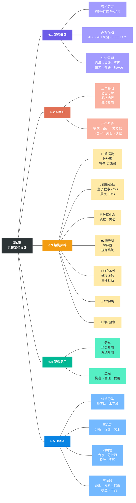
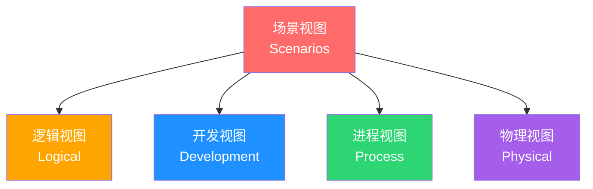
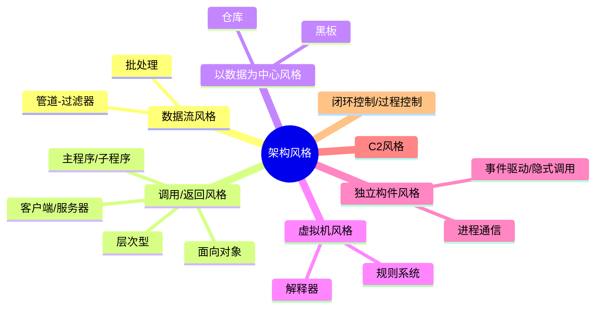
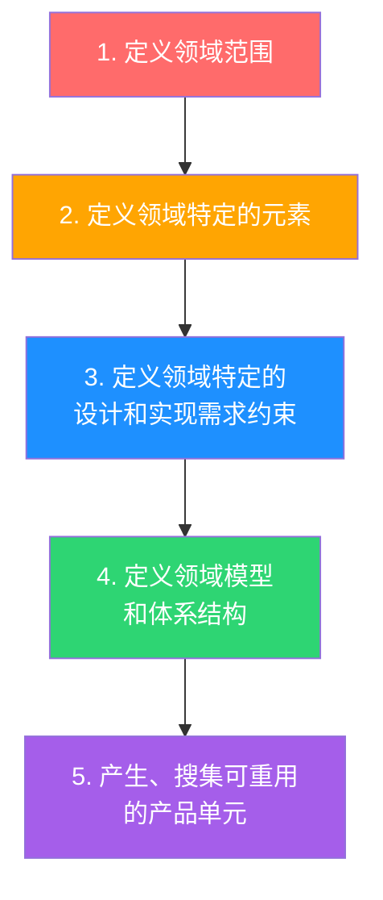

# 第6章 系统架构设计基础知识

> [!danger] 核心重点章
> 本章是综合知识、案例分析、论文三科的共同核心。架构风格、ABSD、DSSA 是必考内容，务必深入理解而非死记硬背。

---

## 本章知识框架

### 知识树

### 故事线：一条逻辑链串起5节知识

> 不要把5节当作并列的知识块来背，它们是**一条完整的架构实践路径**：

> **建筑类比**：学建筑理论（6.1）→ 掌握施工流程（6.2）→ 选择建筑风格：哥特/现代/中式（6.3）→ 用预制件提高效率（6.4）→ 参考行业标准图纸：医院/学校各有模板（6.5）

### 章节目录

> [!example]+ 📖 本章内容导航
>
> > [!note]+ 🟣 [[#6.1 软件架构概念|6.1 软件架构概念]] #高频
> > - [[#6.1.1 软件架构的定义|架构定义]]：构件 + 连接件 + 约束
> > - [[#6.1.2 软件架构与生命周期|生命周期]]：6个阶段
> > - [[#6.1.3 关键概念速记|关键概念]]：ADL · **三种4+1视图模型区分** · IEEE 1471
>
> > [!tip]+ 🔴 [[#6.2 基于架构的软件开发方法（ABSD）|6.2 ABSD方法]] #高频 #必背
> > - [[#6.2.2 ABSD 的三个基础|三个基础]]：功能分解 · 风格选择 · 模板复用
> > - [[#6.2.3 ABSD 的六个阶段|六个阶段]]：需求 → 设计 → 文档化 → 复审 → 实现 → 演化
>
> > [!warning]+ 🟡 [[#6.3 软件架构风格|6.3 架构风格]] #高频 #必背 ==重中之重==
> > - [[#6.3.1 数据流体系结构风格|数据流]]：批处理 · 管道-过滤器
> > - [[#6.3.2 调用/返回体系结构风格|调用/返回]]：主子程序 · 面向对象 · 层次型 · C/S
> > - [[#6.3.3 以数据为中心的体系结构风格|数据中心]]：仓库 · 黑板
> > - [[#6.3.4 虚拟机体系结构风格|虚拟机]]：解释器 · 规则系统
> > - [[#6.3.5 独立构件体系结构风格|独立构件]]：进程通信 · 事件驱动
> > - [[#6.3.6 C2 体系结构风格|C2风格]]：并行构件网络
> > - [[#6.3.7 闭环控制/过程控制架构|闭环控制]]：反馈循环
> > - [[#架构风格对比总表|⭐ 对比总表]]
>
> > [!success]+ 🟢 [[#6.4 软件架构的复用技术|6.4 架构复用]] #中频
> > - **软件产品线**：核心资产库 · 特性集
> > - 分类：机会复用 · 系统复用
> > - 过程：获取 → 管理 → 使用
>
> > [!info]+ 🔵 [[#6.5 特定领域软件架构（DSSA）|6.5 DSSA]] #高频
> > - [[#6.5.2 垂直域与水平域|垂直域 vs 水平域]]
> > - [[#6.5.3 DSSA 的三个基本活动|三个活动]] · [[#6.5.4 参与 DSSA 的四种角色|四种角色]] · [[#6.5.5 DSSA 的五阶段建立过程|五阶段]]
>
> > [!bug]+ ⚠️ [[#易混概念辨析|易混概念辨析]] #易错
> > - ABSD vs DSSA · 4+1视图 vs ADL · 黑板 vs 事件驱动

---

## 6.1 软件架构概念 #高频

### 6.1.1 软件架构的定义

> [!quote] 核心定义
> 软件架构是指软件系统的**高层结构**，包括系统的组成部分（构件）、构件之间的交互关系（连接件）、以及指导构件与连接件组合方式的**约束和原则**。

^def-software-architecture

**架构设计的两个分类**：

| 分类 | 说明 |
|------|------|
| 数据设计 | 将分析模型中的数据对象和关系转化为数据结构 |
| 体系结构设计 | 定义软件系统各主要结构元素之间的关系 |

### 6.1.2 软件架构与生命周期

> [!info] 架构贯穿软件全生命周期的各个阶段

| 阶段 | 架构相关活动 | 关键产物 |
|------|-------------|----------|
| 需求阶段 | 问题空间建模，用 UseCase 图捕获架构需求 | UseCase 模型 |
| 设计阶段 | 架构建模，产出架构文档 | ADL 描述、4+1 视图 |
| 实现阶段 | 基于架构的开发，构件实现 | 代码模块 |
| 构件组装阶段 | 基于架构的构件组装和集成 | 可运行系统 |
| 部署阶段 | 系统部署到目标环境 | 部署方案 |
| 后开发阶段 | 架构演化、维护和升级 | 演化后的架构 |

### 6.1.3 关键概念速记

> [!tip] 必背概念

**ADL（架构描述语言）**：用于描述软件架构的形式化语言，主要组成要素：
- **构件**（Component）— 计算或数据存储单元
- **连接件**（Connector）— 构件之间的交互机制
- **架构配置**（Configuration）— 构件与连接件的拓扑关系

^def-adl

**4+1 视图模型**（Kruchten 提出）：

| 视图 | 关注点 | 面向角色 |
|------|--------|----------|
| **逻辑视图** | 系统功能需求，对象模型 | 最终用户 |
| **开发视图** | 软件模块组织，子系统分解 | 程序员 |
| **进程视图** | 系统运行时并发、同步、通信 | 系统集成者 |
| **物理视图** | 软件到硬件的映射，部署拓扑 | 系统工程师 |
| **场景视图** | 用例驱动，串联其他四个视图 | 所有人 |

^model-4plus1

> [!warning] 易错点
> 4+1 视图中的 "+1" 是**场景视图**（不是安全视图、不是数据视图）。场景视图通过用例串联其他4个视图。

**三种不同的「4+1 视图模型」区分**（红宝书 p73-74，常考辨析）：

| 视图模型 | 4个视图 | +1 | 记忆口诀 |
|---------|---------|-----|---------|
| **架构 4+1**（Kruchten） | 逻辑、开发、进程、物理 | 场景 | **罗凯进五常**：罗（逻辑）凯（开发）进（进程）五（物理）常（场景） |
| **RUP/UML 4+1** | 逻辑、实现、进程、部署 | 用例 | **落实进步用**：落（逻辑）实（实现）进（进程）部（部署）用（用例） |
| **ABSD 4+1** | 逻辑、实现、进程、配置 | 用例 | **逻实进配**：逻（逻辑）实（实现）进（进程）配（配置） |

> [!tip] 辨析技巧
> - 三者都有「逻辑视图」和「进程视图」
> - 区别在于：架构用「开发+物理+场景」，RUP用「实现+部署+用例」，ABSD用「实现+配置+用例」
> - ABSD 的视图非常类似 RUP/UML，区别仅在于「部署」换成了「配置」

**IEEE 1471-2000**：软件架构描述的推荐标准，强调通过多个**视角**（viewpoint）来描述架构，每个视角关注不同的**利益相关者**（stakeholder）的关注点。

---

## 6.2 基于架构的软件开发方法（ABSD） #高频 #必背

> [!danger] 高频考点
> ABSD 的三个基础和六个阶段是选择题常考内容，也是案例分析的分析框架。

### 6.2.1 ABSD 概述

ABSD（Architecture-Based Software Development）是一种**架构驱动**的软件开发方法，与传统的需求驱动方法不同，ABSD 认为**架构是软件开发的核心**。

> [!danger] 必背关键词（红宝书原文）
> - ABSD 方法是由**体系结构驱动**的，即指由构成体系结构的**商业、质量和功能需求的组合驱动**的
> - ABSD 方法是一个**自顶向下的，递归细化**的方法，软件系统的体系结构通过该方法得到细化，直到能产生软件构件和类
> - ABSD 方法是**递归的**，且迭代的每个步骤都是清晰定义的，有助于降低体系结构设计的随意性

^def-absd

### 6.2.2 ABSD 的三个基础

> [!important] 必背：三个基础

| 基础 | 含义 |
|------|------|
| **功能的分解** | 基于模块分解，关注内聚和耦合 |
| **通过选择架构风格来实现质量和商业需求** | 架构风格选择对应质量属性 |
| **软件模板的使用** | 用模板复用已有架构经验 |

^absd-three-foundations

### 6.2.3 ABSD 的六个阶段

^absd-six-phases

> [!tip] 记忆口诀：**许设温敷实验**
> 许博士设计了一个温敷的实验。许（需求）设（设计）温（文档化）敷（复审）实（实现）验（演化）。

> [!abstract]+ 第一阶段：架构需求
> - **需求获取**：从利益相关人处收集功能和非功能需求
> - **标识构件**：识别系统中的核心构件
> - **架构需求评审**：评审需求的完整性和一致性

> [!abstract]+ 第二阶段：架构设计
> - 选择合适的**架构风格**（见 [[#6.3 软件架构风格]])
> - 将需求映射到架构元素
> - 产出**架构设计过程模型**

> [!abstract]+ 第三阶段：架构文档化
> - 产出两大核心文档：
>   1. **架构规格说明书** — 描述系统架构的技术细节
>   2. **质量设计说明书** — 描述对质量属性的测试需求

> [!abstract]+ 第四阶段：架构复审
> - 目的：发现架构设计中的潜在**风险**和**缺陷**
> - 由外部专家和利益相关人参与
> - 是架构质量保证的关键手段

> [!abstract]+ 第五阶段：架构实现
> - 基于架构设计进行编码实现
> - 构件的开发和集成
> - 产出可运行的系统

> [!abstract]+ 第六阶段：架构演化
> - 需求变化驱动架构修改
> - 需要对变更进行评估和控制
> - 详见 [[09-软件架构的演化和维护]]

> [!warning] 易错点
> ABSD 是一个**迭代**过程，演化阶段可以反馈回需求阶段。不要死记为线性瀑布。

---

## 6.3 软件架构风格 #高频 #必背

> [!danger] 重中之重
> 架构风格是本章最高频考点，选择题、案例分析、论文都会涉及。必须掌握每种风格的定义、特点、适用场景和优缺点。

### 总览

### 6.3.1 数据流体系结构风格

> [!example]+ 批处理风格
> **特点**：每个处理步骤是独立的程序，每步必须在前一步**完成后**才能开始。数据以**整体**方式传递。
>
> **典型场景**：编译器的传统实现、银行批量对账
>
> **关键词**：顺序执行、整体数据传递、无交互

> [!example]+ 管道-过滤器风格
> **特点**：每个构件（过滤器）有一组输入和输出，过滤器读取输入数据流、处理、产生输出数据流。管道是连接件，传输数据流。
>
> **典型场景**：Unix Shell 命令管道 `cat file | grep "error" | sort`、编译器的现代实现
>
> **优点**：
> - 高内聚低耦合
> - 支持复用（过滤器可组合）
> - 支持并行执行
> - 易于维护和扩展
>
> **缺点**：
> - 不适合交互式系统
> - 数据传输可能需要格式转换，增加开销
>
> **关键词**：数据流驱动、过滤器独立、可并行

^style-pipe-filter

> [!warning] 易错：批处理 vs 管道-过滤器（红宝书 p80）
>
> | 对比项 | 批处理 | 管道-过滤器 |
> |--------|--------|-------------|
> | 数据传递 | **整体**传递 | **增量/流式**传递 |
> | 执行方式 | 前一步**完成后**才开始下一步 | 前面执行完后可以**开始下一步**的执行（可并行） |
> | 前后关联 | 前后构件**不一定有关联** | 前一个输出作为**后一个输入** |
> | 数据粒度 | 粗粒度（整个文件） | 细粒度（数据流） |

### 6.3.2 调用/返回体系结构风格

> [!example]+ 主程序/子程序风格
> **特点**：单线程控制，主程序调用子程序，子程序可再调用更小的子程序。层次分解。
>
> **典型场景**：传统 C 语言结构化程序
>
> **关键词**：层次分解、单线程、显式调用

> [!example]+ 面向对象风格
> **特点**：构件是对象，对象封装数据和操作。通过消息传递（方法调用）交互。
>
> **优点**：封装性好、易于复用和维护、自然的问题建模
>
> **缺点**：对象间的依赖关系可能复杂、方法调用链可能影响性能
>
> **关键词**：封装、继承、多态、消息传递

> [!example]+ 层次型风格
> **特点**：系统组织为层次结构，每层只与相邻层交互。上层调用下层服务，下层对上层透明。
>
> **典型场景**：OSI 七层模型、TCP/IP 协议栈、三层/多层架构
>
> **优点**：
> - 关注点分离
> - 各层可独立修改
> - 支持复用
>
> **缺点**：
> - 严格分层可能影响性能（层层调用开销）
> - 难以确定层次划分的粒度
>
> **关键词**：分层、上层调用下层、透明性

> [!example]+ 客户端/服务器（C/S）风格
> **特点**：系统分为客户端和服务器两部分，客户端发起请求，服务器提供服务。
>
> **扩展**：两层 C/S → 三层 C/S（加入中间层）→ B/S（浏览器/服务器）
>
> **关键词**：请求-响应、服务分离
>
> > [!note] 归属说明
> > 红宝书将 C/S 归在调用/返回风格下。部分教材将 C/S 归为层次系统架构风格单独讨论，考试以红宝书为准。

### 6.3.3 以数据为中心的体系结构风格

> [!example]+ 仓库风格
> **特点**：有一个**中央数据仓库**存储系统的当前状态，多个独立构件围绕仓库运作，对仓库中的数据进行操作。
>
> **典型场景**：数据库系统、IDE 集成开发环境
>
> **关键词**：共享数据、中央存储、构件独立

> [!example]+ 黑板风格
> **特点**：仓库风格的特化。包含三个组成部分：
> 1. **黑板**（共享数据区）— 全局数据
> 2. **知识源**（KS）— 独立的专家模块
> 3. **控制器** — 监控黑板变化，决定调用哪个知识源
>
> **典型场景**：语音识别、自然语言处理、模式识别
>
> **核心机制**：知识源响应黑板的变化，而非由主程序调用（**数据驱动**）
>
> **关键词**：知识源、黑板、控制器、数据驱动

^style-blackboard

> [!warning] 易错：仓库 vs 黑板
>
> | 对比项 | 仓库风格 | 黑板风格 |
> |--------|----------|----------|
> | 控制方式 | 由**构件主动**访问仓库 | 由**控制器**监控黑板变化后调度知识源 |
> | 驱动方式 | 构件驱动 | **数据驱动** |
> | 适用场景 | 数据库、IDE | 语音识别、NLP、AI问题求解 |

### 6.3.4 虚拟机体系结构风格

> [!example]+ 解释器风格
> **特点**：包含一个虚拟机，能够模拟硬件执行或解释执行非本地原生代码。
>
> 四个组成部分：
> 1. **解释引擎** — 完成解释工作
> 2. **被解释的代码** — 待执行的程序
> 3. **解释引擎当前状态** — 执行位置等
> 4. **被解释代码当前状态** — 变量值等
>
> **典型场景**：JVM、Python 解释器、浏览器 JavaScript 引擎
>
> **优点**：高度灵活、跨平台
>
> **缺点**：执行效率低于原生编译
>
> **关键词**：虚拟机、解释执行、灵活、跨平台

> [!example]+ 规则系统风格
> **特点**：解释器风格的特化。包含规则集、规则解释器、规则/数据选择器和工作内存。基于规则（IF-THEN）执行。
>
> **典型场景**：专家系统、业务规则引擎
>
> **关键词**：规则集、IF-THEN、工作内存

### 6.3.5 独立构件体系结构风格

> [!example]+ 进程通信风格
> **特点**：构件是独立进程，通过消息传递机制（如 RPC、管道、Socket）进行通信。
>
> **典型场景**：微服务架构、分布式系统
>
> **关键词**：独立进程、消息传递、显式通信

> [!example]+ 事件驱动/隐式调用风格
> **特点**：构件不直接调用其他构件，而是**发布事件**。系统中的其他构件可以**注册**对特定事件的兴趣，事件发生时被**隐式调用**。
>
> **典型场景**：GUI 框架、消息队列系统、发布-订阅系统
>
> **优点**：
> - 松耦合（发布者不知道谁是订阅者）
> - 易于扩展（新增订阅者无需修改发布者）
>
> **缺点**：
> - 构件放弃了对执行顺序的控制
> - 难以调试和推理系统行为
> - 数据交换可能有困难
>
> **关键词**：事件发布、隐式调用、松耦合、发布-订阅

^style-event-driven

### 6.3.6 C2 体系结构风格

> [!example]+ C2 风格
> **特点**：通过**连接件**绑定在一起的按照一组规则运作的**并行构件网络**。
>
> **四条规则**（红宝书 p80）：
> 1. 构件和连接件都有顶部和底部
> 2. 构件的顶部连接到连接件的底部，构件的底部连接到连接件的顶部；**构件之间不允许直接连接**
> 3. 连接件可以连接任意数量的构件和其他连接件
> 4. 当两个连接件直接相连时，必须**一个的底部连接到另一个的顶部**
>
> **关键词**：并行构件网络、连接件绑定、构件不直连

### 6.3.7 闭环控制/过程控制架构

> [!example]+ 闭环控制架构
> **特点**：软件与硬件之间可以粗略地表示为一个**反馈循环**，这个反馈循环通过接受一定的输入，确定一系列的输出，最终使环境达到一个新的状态。
>
> **典型场景**：空调控温系统、定速巡航系统
>
> **关键词**：反馈循环、过程控制、环境状态调节

### 架构风格对比总表 #必背

> [!important] 核心对比表 — 考试必备

| 风格 | 构件 | 连接件 | 数据交互 | 控制方式 | 典型场景 |
|------|------|--------|----------|----------|----------|
| **批处理** | 独立程序 | 文件/数据 | 整体传递 | 顺序执行 | 银行批量对账 |
| **管道-过滤器** | 过滤器 | 管道 | 流式传递 | 数据驱动 | Unix Shell |
| **主程序/子程序** | 主/子程序 | 调用/返回 | 参数传递 | 单线程控制 | C语言程序 |
| **面向对象** | 对象 | 方法调用 | 消息传递 | 分散控制 | Java/C++系统 |
| **层次型** | 各层模块 | 层间接口 | 接口调用 | 层间约束 | OSI/TCP-IP |
| **C/S** | 客户/服务端 | 网络协议 | 请求-响应 | 请求驱动 | Web应用 |
| **仓库** | 独立构件 | 共享数据 | 读写仓库 | 构件驱动 | 数据库/IDE |
| **黑板** | 知识源 | 黑板+控制器 | 读写黑板 | **数据驱动** | 语音识别/NLP |
| **解释器** | 解释引擎+代码 | 解释执行 | 内存状态 | 解释引擎 | JVM/Python |
| **规则系统** | 规则+工作内存 | 规则引擎 | 规则匹配 | 规则触发 | 专家系统 |
| **进程通信** | 独立进程 | 消息机制 | 消息传递 | 进程自治 | 分布式系统 |
| **事件驱动** | 事件源/监听器 | 事件总线 | 事件发布 | **隐式调用** | GUI/MQ |
| **C2** | 并行构件 | 连接件 | 消息传递 | 构件网络 | — |
| **闭环控制** | 控制器+受控对象 | 反馈回路 | 传感数据 | **反馈驱动** | 空调控温/巡航 |

^table-style-comparison

---

## 6.4 软件架构的复用技术 #中频

### 基本概念

> [!note] 定义
> 软件架构复用（Software Architecture Reuse）是指在多个软件系统或项目中重复使用已有的架构设计、组件、模式、技术或构件，以提高开发效率、降低成本、提高质量和可维护性。

### 6.4.0 软件产品线（红宝书 p80-81）

> [!important] 产品线概念
> **软件产品线**是指一组软件密集型系统，它们共享一个公共的、可管理的**特性集**，满足某个特定市场或任务的具体需要，是以规定的方式用公共的**核心资产**集成开发出来的。

**核心资产库**包括：
- 软件架构及其可剪裁的元素
- 设计方案及其文档
- 用户手册、项目管理的历史记录（如预算和进度）
- 软件测试计划和测试用例

**软件复用与产品线的关系**：
- 软件复用是系统化的软件开发过程：开发一组基本的软件构造模块，以覆盖不同需求/体系结构之间的相似性，从而提高系统开发的效率、质量和性能
- 软件架构复用的类型包括**机会复用**和**系统复用**

### 复用分类

| 分类 | 说明 |
|------|------|
| **机会复用** | 开发过程中偶然发现可复用的资产 |
| **系统复用** | 有计划、有组织地进行复用（更推荐） |

### 复用基本过程

| 阶段 | 关键活动 | 红宝书补充 |
|------|----------|----------|
| **获取可复用的软件资产** | 明确可复用软件资产的特性 | 资产须具备可靠性、广泛适用性、易理解性以及易修改性 |
| **管理可复用资产** | 构件库管理、构件分类和检索 | 包括构件分类（按特定方式组织大量构件）和构件检索（依据给定查询需求快速精确找到相关构件） |
| **使用可复用资产** | 获取可复用资产，通过修改、扩展、配置等方式定制 | 最终将其组装与集成，形成最终系统 |

---

## 6.5 特定领域软件架构（DSSA） #高频

### 6.5.1 DSSA 的定义

> [!quote] 核心定义
> DSSA（Domain-Specific Software Architecture）是在一个**特定应用领域**中，为一组应用提供组织结构参考的标准软件架构。

^def-dssa

### 6.5.2 垂直域与水平域

> [!warning] 易错：垂直域 vs 水平域

| 类型 | 含义 | 示例 |
|------|------|------|
| **垂直域** | 定义特定系统族，成果是该领域中可作为系统可行解决方案的通用软件体系结构 | 只能应用于成熟、稳定的领域 |
| **水平域** | 定义多个系统和多个系统族中功能区域的共有部分，在子系统级涵盖多个系统族的特定部分功能 | 不局限于特定成熟领域，只要存在多个系统或系统族有部分功能共性即可 |

^dssa-domain-types

### 6.5.3 DSSA 的三个基本活动

| 活动 | 目标 | 产出 |
|------|------|------|
| **领域分析** | 获取领域模型 | 领域需求、领域术语字典 |
| **领域设计** | 获取领域架构 | DSSA（特定领域的参考架构） |
| **领域实现** | 开发可复用的资产 | 可复用的构件、框架 |

^dssa-three-activities

### 6.5.4 参与 DSSA 的四种角色

| 角色 | 职责 |
|------|------|
| **领域专家** | 包括该领域系统的资深用户、从事需求分析、设计、实现及项目管理的软件工程师 |
| **领域分析人员** | 由具备知识工程背景的资深系统分析员担任 |
| **领域设计人员** | 由资深软件设计人员担任 |
| **领域实现人员** | 由资深程序设计人员担任 |

^dssa-four-roles

### 6.5.5 DSSA 的五阶段建立过程

> [!tip] 记忆口诀：**范围 → 元素 → 约束 → 模型 → 产品**

| 阶段 | 目标（红宝书 p83） |
|------|------|
| 定义领域范围 | 重点确定感兴趣领域的范围及过程终止时间 |
| 定义领域特定的元素 | 目标是编制领域词典和术语同义词词典，识别应用间的共性和差异性 |
| 定义领域特定的设计和实现需求约束 | 目标是描述解空间中的差异特性，记录约束对设计实现决策的影响 |
| 定义领域模型和体系结构 | 目标是产生一般体系结构模型 |
| 产生、搜集可重用的产品单元 | 目标是为领域特定软件架构增加可重用构件，使之可用于该领域产生新应用 |

^dssa-five-phases

### DSSA 的三层次系统模型

| 层次 | 说明 |
|------|------|
| 领域开发环境 | 领域架构师工作的环境 |
| 领域特定的应用开发环境 | 应用工程师基于 DSSA 开发应用的环境 |
| 应用执行环境 | 最终用户运行应用的环境 |

---

## 易混概念辨析 #易错

> [!bug] 常见混淆点

### ABSD vs DSSA

| 对比项 | ABSD | DSSA |
|--------|------|------|
| 关注范围 | **单个系统**的架构开发 | **特定领域**的通用架构 |
| 目标 | 开发一个具体系统的架构 | 建立可复用的领域参考架构 |
| 过程 | 需求→设计→文档化→复审→实现→演化 | 领域分析→领域设计→领域实现 |
| 复用性 | 过程方法论可复用 | 架构本身可被多个系统复用 |

^compare-absd-dssa

### 4+1 视图 vs ADL

| 对比项 | 4+1 视图模型 | ADL |
|--------|-------------|-----|
| 本质 | 架构的**多角度描述方法** | 架构的**形式化描述语言** |
| 组成 | 5个视图（逻辑/开发/进程/物理+场景） | 构件 + 连接件 + 架构配置 |
| 作用 | 满足不同利益相关人的关注点 | 精确定义架构结构 |

### 黑板 vs 事件驱动

| 对比项 | 黑板风格 | 事件驱动风格 |
|--------|----------|-------------|
| 驱动方式 | 数据驱动（黑板状态变化） | 事件驱动（事件发布） |
| 数据共享 | 通过共享**黑板**数据区 | 通过**事件参数**传递 |
| 控制 | 有专门的**控制器**调度 | 无中央控制，**隐式调用** |
| 典型场景 | AI 问题求解 | GUI、消息队列 |

---

## 跨科目关联 #综合知识 #案例分析 #论文

> [!tip] 本章知识在其他科目中的应用

**案例分析**：
- [[02-案例分析/02-信息系统架构设计]] — 架构模型选择、TOGAF
- [[02-案例分析/03-层次式架构设计]] — 层次型风格的实际应用
- [[02-案例分析/04-云原生架构设计]] — 现代架构风格演进
- [[02-案例分析/05-面向服务架构设计]] — SOA 与架构风格

**论文方向**：
- [[03-论文/02-软件架构设计]] — 架构风格选择、ABSD、DSSA 都是论文热门主题

**综合知识关联**：
- [[07-系统质量属性与架构评估]] — 架构风格选择需考虑质量属性
- [[09-软件架构的演化和维护]] — ABSD 第六阶段：架构演化
- [[04-软件工程基础知识]] — RUP 与 4+1 视图模型的关系
