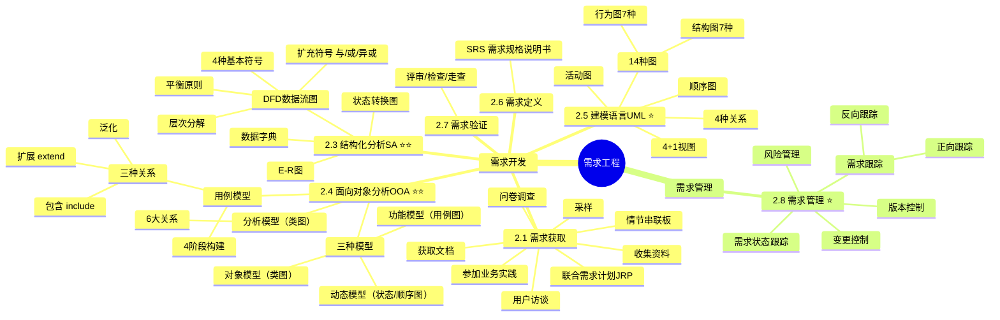

# 需求工程

> [!danger] 超级重点 ★★★★★★（红宝书ch2）
> 选择、案例和论文都会考察。重点关注：==结构化分析DFD==、==数据字典==、面向对象分析中的==用例模型/类图==、==顺序图/活动图==、需求管理中的==变更控制==。
>
> **速查跳转**：[[#2.3 结构化分析方法/建模SA|SA分析]] · [[#2.4 面向对象分析方法/建模OOA|OOA分析]] · [[#2.5 建模语言UML|UML]] · [[#2.8 需求管理|需求管理]]

---

## 知识全景

> [!tip]+ 记忆口诀
> - 需求开发4阶段：**获分归雁** — 获（获取）分（分析）归（规格说明书/定义）雁（验证）
> - 需求管理：**基因变更** — 基（基线）因（变更）变（变更）更（跟踪）

^req-mnemonics

---

## 2.1 需求获取 #次重点

**核心概念**：确定和理解不同项目干系人的需求和约束的过程。

> [!example]- 需求获取方法（展开查看详情）
>
> | 方法 | 具体内容 | 优缺点 |
> |------|--------|--------|
> | **用户访谈** | 有结构化和非结构化两种；准备（确定目的/用户/问题）→ 访谈 → 后续工作 | 灵活性强；但对架构设计师沟通能力要求高 |
> | **问卷调查** | 制作调查表，确定问题类型、编写问题、设计格式 | 高效、低成本、匿名；但缺乏灵活性、返还率低 |
> | **采样** | 从种群中选出有代表性样本集；样本大小 = α ×（可信度系数 / 可接受的错误）²，α一般取0.25 | 可加快数据收集、降低成本；但依赖设计师经验 |
> | **情节串联板** | 通过一系列图片辅助讲述故事叙述需求，有被动式、主动式和交互式 | 生动、用户友好、交互性强；但花费时间多 |
> | **联合需求计划JRP** | 通过集会让开发者与顾客深入合作 | 对需求不清晰领域有用；但会议组织和人员能力是难点 |
> | **收集资料** | 查阅已有文档、报告、学术论文、行业标准等 | — |
> | **获取文档** | 向相关人员索取项目相关文档 | — |
> | **参加业务实践** | 参与实际业务流程和操作，体验和观察业务活动 | — |
>
> > [!tip] 记忆口诀
> > **访问踩窗帘，合收十文** — 访（访谈）问（问卷）踩（采样）窗（串联板）帘，合（联合）收（收集）十（实践）文（文档）

^req-elicitation-methods

---

## 2.2 需求分析简介 #非重点

需求分析的方法主要有：**结构化分析SA**、**面向对象分析OOA** 和面向问题域的分析（PDOA）。其中SA和OOA是软考的重点。

> [!note] 建模 = 分析
> 教材中提到的"面向对象建模""系统建模"等说法，实际上分析方法就是建模。

---

## 2.3 结构化分析方法/建模SA #超级重点

**核心概念**：自顶向下，逐层分解，把一个大问题分解成若干小问题。

SA分析模型的核心是==数据字典==，围绕它有三个层次的模型：
- **数据模型**（==E-R图==）
- **功能模型**（==DFD图==）
- **行为模型**（==状态转换图==）

^sa-three-models

### 2.3.1 数据流图DFD #重点 #必背

DFD是结构化分析方法中的重要工具，表达系统内数据的流动并通过数据流描述系统功能。

#### DFD的4种基本符号

| 符号名称 | 表示内容 | 图形表示 |
|--------|--------|--------|
| **数据流** | 具有名字和流向的数据 | 标有名字的箭头 |
| **加工**（数据处理） | 对数据流的变换 | 圆圈 |
| **数据存储** | 可访问的存储信息 | 直线段 |
| **外部实体**（数据源及数据终点） | 位于系统之外的信息生产者或消费者 | 标有名字的方框 |

^dfd-basic-symbols

%%注意：DFD四种符号是案例题常考填空点%%

> [!warning] 易错点
> ==数据存储要被外部实体使用必须要经过加工==，不能直接连接。有一年案例考察过这个知识点。

> [!abstract]- DFD的两种记号集（了解即可）
> - **Gane & Sarson 方法**：加工用方框、数据存储用开口方框
> - **Yourdon & Coad 方法**：加工用圆圈、数据存储用直线段

#### DFD扩充符号 #重点

| 符号 | 含义 | 说明 |
|------|------|------|
| **\*** | 与 | 输入流中所有数据流都到达后才能加工；输出时同时产生所有输出流 |
| **+** | 或 | 输入流中任何一个到达就可以加工；输出至少产生其中一个 |
| **⊕** | 异或 | 输入流中只有其中一个到达时才能加工（不能同时）；输出仅产生其中一个 |

#### DFD的层次 #重点

结构化分析依赖DFD进行**自上而下**的分析：
1. **顶层图**：将整个系统表示为一个加工，画出所有外部实体和数据流
2. **逐层分解**：对顶层图中的加工进行进一步分解，直至系统被清晰描述

#### DFD的平衡原则 #重点 #必背

**（1）父图与子图平衡**：
- **个数一致**：两层数据流图中的数据流个数一致
- **方向一致**：两层数据流图中的数据流方向一致

**（2）子图内部平衡**（检查错误）：

| 概念 | 描述 |
|------|------|
| ==**黑洞**== | 加工只有输入没有输出 |
| ==**奇迹**== | 加工只有输出没有输入 |
| ==**灰洞**== | 加工中输入不足以产生输出（挂羊头卖狗肉） |
| **数据存储** | 正常情况下必须既有读的数据流，又有写的数据流 |

^dfd-balance-errors

%%黑洞/奇迹/灰洞 是选择题常见干扰项%%

> [!abstract]- 2.3.2 状态转换图 #次重点
> 描述系统对内部或外部事件响应的行为模型。状态主要有：**初态**（黑圆点）、**终态**（黑圆点外加一个圆）、**中间状态**（圆角四边形）。
>
> 状态转换图现在已经用 UML 状态图替代，详见 [[#2.5.5 常考UML图详解]]。

> [!abstract]- 2.3.3 数据字典 #非重点
> 数据字典基于DFD，对其中所有命名元素进行定义，赋予图形元素确切解释。DFD与数据字典配合，能从图形和文字两方面完整描述系统逻辑模型。

---

## 2.4 面向对象分析方法/建模OOA #超级重点

> 超级重点，选择题、案例都常考。案例部分会结合具体场景让你识别类、识别用例的关系等。

### 2.4.1 分析/建模工具 #重点

面向对象分析方法将系统分为三种模型：

| 模型 | 表示方式 | 作用 | 关系 |
|------|--------|------|------|
| **对象模型** | ==类图== | 定义系统中的对象、属性和关系（**最基础、最核心**） | 为功能和动态模型提供结构基础 |
| **功能模型** | ==用例图==/DFD | 描述系统"要做什么"（用户和业务角度） | — |
| **动态模型** | ==状态图/顺序图== | 描述系统行为随时间的变化 | — |

^ooa-three-models

> 三者相互映射、相互约束，共同构成对待开发系统完整而统一的认识。

### 2.4.2 用例模型 #重点 #必背

构建用例模型一般经历**4个阶段**：

> [!tip] 记忆口诀：**人合细条** — 人合团结了就协调了
> 人（识别参与者）合（合并需求获得用例）细（细化用例描述）条（调整用例模型）

#### 用例图的元素

用例图中主要包含**参与者、用例和通信关联（箭头）**三种元素。

| 结构元素 | 关系元素 |
|--------|--------|
| 用例（Use Case） | 关联（Association）— 实线 |
| 参与者（Actor） | 扩展（Extend）— `<<extend>>` |
| 系统边界（System Boundary） | 包含（Include）— `<<include>>` |
| 注释（Note） | 泛化（Generalization）— 实线空心三角 |

#### 识别参与者 #重点

参与者是与系统交互的所有事物，不仅可以是人，还可以是其他系统、硬件设备、甚至是系统时钟。

> [!warning] 易错点
> 参与者一定在**系统之外**，不是系统的一部分。参与者之间也可以发生继承关系。

| 参与者类型 | 示例 |
|---------|------|
| 其他系统 | 企业在线教育平台系统中，OA系统是参与者 |
| 硬件设备 | IC卡门禁系统中，IC卡读写器是参与者 |
| 时钟 | 在线测试系统"定时交卷"功能中，时钟作为参与者 |

#### 用例之间的关系 #重点 #必背

| 关系类型 | 描述 | 构造型 | 箭头指向 |
|--------|------|------|--------|
| **包含关系** | 从多个用例中提取公共行为，原始用例为基本用例 | `<<include>>` | 指向**抽象用例** |
| **扩展关系** | 一个用例混合多种不同场景，可分为基本用例和扩展用例 | `<<extend>>` | 指向**基本用例** |
| **泛化关系** | 多个用例有类似结构和行为，将共性抽象为父用例 | 实线空心三角 | 指向**父用例** |

> [!tip] 辨析技巧
> - **包含**：基本用例==**必须**==调用被包含的用例（如"学习课程"必须"检查权限"）
> - **扩展**：基本用例==**可选**==被扩展的用例（如"课程测试"可选"充入学习币"）
> - **泛化**：子用例继承父用例的所有结构、行为和关系（如"电话注册"和"网上注册"泛化为"课程注册"）

^usecase-relationships

> [!example]- 细化用例描述 #次重点 （展开查看详情）
>
> 用例描述包含的部分：
>
> | 部分 | 内容说明 |
> |------|--------|
> | 用例名称 | 应与用例图相符 |
> | 简要说明 | 用简洁自然语言描述用例为参与者传递的价值结果 |
> | 事件流 | 参与者和系统为达成目标所发生的一系列活动（基本流程+备选流程） |
> | 非功能需求 | 涉及的非功能需求，需保证可度量和可验证 |
> | 前置/后置条件 | 前置条件：执行用例前系统必须存在的状态；后置条件：执行完毕后的状态 |
> | 扩展点 | 若有扩展（或包含）用例，写出名称及使用情况 |
> | 优先级 | 表明用户对该用例的期望，确定开发先后顺序 |

### 2.4.3 分析模型（类图） #超级重点

分析模型描述系统的基本逻辑结构。建立分析模型的过程大致包括：**定义概念类、确定类之间的关系、为类添加职责、建立交互图**，其中前三个步骤统称为 **CRC**（类——责任——协作者）建模。

#### 类图的6大关系 #重点 #必背

关系强弱排序：==**泛化 = 实现 > 组合 > 聚合 > 关联 > 依赖**==

| 关系类型 | 定义 | 举例 | 特点 | 记忆方法 |
|--------|------|------|------|--------|
| **关联关系** | 强语义联系的结构关系，明确稳定 | 学生与课程、学生选修课 | 强语义、结构稳定 | — |
| **依赖关系** | 若B的变化可能引起A的变化，A依赖于B | 教师临时用教学工具 | B对A是临时使用关系 | 教师临时用工具授课 |
| **泛化关系** | 描述一般事物与特殊种类的关系，即继承 | 经理是员工的子类 | 子类继承父类属性和方法 | 父与子，子承父业 |
| **聚合关系** | 类之间整体与部分的关系，"部分"可同时属于多个"整体" | 图书馆与书籍 | 部分可多属，生命周期可不同 | 好聚好散，部分能单独存在 |
| **组合关系** | 类之间整体与部分的关系，"部分"只能属于一个"整体" | 汽车与发动机 | 部分唯一归属，生命周期相同 | 与聚合比，生命周期同步 |
| **实现关系** | 描述类与接口的关系，类实现接口中的所有抽象方法 | 多个类实现"打印"接口 | 接口定行为，类来实现 | 接口定行为，类来实现 |

> [!tip] 记忆口诀
> **饭（泛）食（实现）组聚关羽（依）** — 干饭小组和关羽聚会

^class-six-relationships

---

## 2.5 建模语言UML #重点

### 2.5.1 统一建模语言UML #重点

UML是一种用于描述、可视化和文档化软件系统的标准建模语言。

**UML的结构包括：==构造块、规则和公共机制==**三个部分。

> [!abstract]- 公共机制四大要素（展开查看）
> 1. **详述**：通过文字补充图形符号的语义信息
> 2. **修饰**：利用附加符号（如访问权限标识）增强元素表现力
> 3. **通用划分**：基于类/对象二分法抽象系统层次
> 4. **扩展机制**：通过构造型、标记值和约束支持建模元素的自定义扩展

### 2.5.2 UML 4+1 视图 #重点

> UML 4+1 视图 = RUP 4+1 视图，都是以==**用例视图**==为中心。

| 视图名称 | 主要描述 | 关注点 | 关注的角色 |
|--------|--------|--------|----------|
| **逻辑视图** | 系统的功能模块及其相互关系 | 展示主要功能组件及交互关系 | 最终用户 |
| **进程视图** | 系统运行时的进程和线程的组织、交互 | 体现动态运行特性、并发和同步 | 系统集成人员 |
| **实现视图** | 软件构件在开发环境中的组织结构 | 指导代码的组织和实现 | 编程人员 |
| **部署视图** | 构件部署到物理节点上的映射和分布结构 | 明确部署方式和拓扑结构 | 系统工程人员 |
| **用例视图** | 通过用例和参与者描述系统的功能需求 | 从用户角度描述系统功能 | 所有人都可以用到 |

^uml-4plus1-views

### 2.5.3 UML的14种图 #重点 #必背

> 记住==**结构图（静态图）7种**==包含哪些，剩下的都是==**行为图7种**==。

| 分类 | 名称 | 描述 |
|------|------|------|
| **结构图（静态图）** | 类图 | 描述类、接口、协作及它们之间的关系 |
| | 对象图 | 描述对象及对象之间的关系 |
| | 包图 | 描述包及包之间的相互依赖关系 |
| | 组合结构图 | 描述系统某一部分（组合结构）的内部结构 |
| | 构件图 | 描述构件及其相互依赖关系 |
| | 部署图 | 展示构件在各节点上的部署 |
| | 外廓图 | 展示构造型、元类等扩展机制的结构 |
| **行为图（动态图）** | 用例图 | 描述一组用例、参与者及它们之间的相互关系 |
| | 顺序图 | 展示对象之间消息的交互，强调消息传送的**时间顺序** |
| | 通信图/协作图 | 展示对象之间消息的交互，强调对象**协作**的交互图 |
| | 时间图/定时图 | 展示对象之间消息的交互，强调**真实时间**信息的交互图 |
| | 交互概览图 | 展示交互图之间的执行顺序 |
| | 活动图 | 描述事务执行的**控制流和数据流** |
| | 状态机图 | 描述对象所经历的**状态转移** |

> [!warning] 易错点
> 用例图在UML 2.x下是一种==**行为图**==（不是结构图）。

^uml-14-diagrams

### 2.5.4 UML的4种关系 #重点

UML事务的关系就4种：**依赖、关联、泛化、实现**，其他都是引申出来的。

| 关系类型 | 含义 | 表示方式 |
|--------|------|--------|
| **依赖关系** | 一个元素的改动可能影响另一个使用它的元素，临时性、偶然性 | 带箭头的虚线，箭头指向被依赖元素 |
| **关联关系** | 对象间较稳定的结构联系，有单向/双向之分及不同多重性 | 实线，两端可带箭头表示方向 |
| **泛化关系** | 即继承关系，子类继承父类的属性和方法，可扩展或重写 | 带空心三角形箭头的实线，箭头指向父类 |
| **实现关系** | 描述类与接口的关系，类实现接口中定义的所有抽象方法 | 带空心三角形箭头的虚线，箭头指向接口 |

> [!tip] 引申关系
> - 用例图中的**包含和扩展**都属于**依赖关系**
> - 类图中的**组合和聚合**都属于**关联关系**

### 2.5.5 常考UML图详解 #超级重点

#### 顺序图 #重点

| 类别 | 详情 |
|------|------|
| 定义 | 一种最常用的动态交互图，显示对象间的交互活动，关注对象之间消息传送的**时间顺序** |
| 核心概念 | 对象、生命线、执行发生、消息、交互片段；UML 2中新增**交互片段**概念（封装交互中的片段，可对片段施加选择、循环、并行等操作） |
| 推荐使用场合 | 用例分析、用例设计等场合 |

消息类型：
- **同步消息**：实心箭头实线
- **异步消息**：开放箭头实线
- **返回消息**：虚线箭头
- **创建消息**：`<<create>>` 虚线箭头

#### 活动图 #重点

| 类别 | 详情 |
|------|------|
| 定义 | 将业务流程或其他计算的结构展示为内部一步步的控制流和数据流，描述某一方法、机制或用例的内部行为 |
| 核心概念 | 活动/组合活动、对象/对象流、转移/分支、并发/同步、分区（Partition） |
| 推荐使用场合 | 业务建模、需求、类设计等场合 |

核心元素：活动/动作（圆角矩形）、起点（实心圆）、终点（圆环内实心圆）、流结束（圆内×）、决策点（菱形）、分叉/合并（粗横线）、分区（泳道）

> [!abstract]- 2.5.6 系统建模语言SysML #次重点 （展开查看）
> SysML并不是独立语言，而是UML的一种扩展。UML是特别为软件工程领域所创建的，SysML扩展了一些新功能机制，新增了UML中没有的图（如**模块定义图、需求图、参数图**）。
>
> | 特性 | UML | SysML |
> |------|-----|-------|
> | 局限性 | 聚焦单个软件，难描述非功能需求 | 学习曲线陡峭，工具支持有限 |
> | 优势 | 工具成熟丰富，图形化直观 | 具备系统级视角，兼顾功能与非功能需求 |

---

> [!abstract]- 2.6 需求定义 #非重点
> 系统架构设计师在获取了用户的需求并进行详细分析后，将需求形成文档，即**需求定义**（或需求基线）。
>
> - 需求定义的产物是**软件需求规格说明书（SRS）**
> - 通常有两种方法：**严格定义方法**和**原型方法**

---

> [!abstract]- 2.7 需求验证 #非重点
> 在系统分析阶段，检测SRS中的错误。需求验证也称为**需求确认**。
>
> **三种评审类型**：
>
> | 类型 | 定义 | 特点 |
> |------|------|------|
> | **评审** | 正式会议，向用户或其他项目干系人介绍工作产品，征求意见和批准 | 正式 |
> | **检查** | 由非制作者的个人或小组详细检查工作产品，验证是否有错误 | 正式+严格 |
> | **走查** | 由某个开发人员领导团队成员逐部分讲解并检查 | 非正式 |

---

## 2.8 需求管理 #重点

**核心概念**：在CMM中，需求管理是可重复级的一个关键过程域。目标是为软件需求建立一个基线，供软件开发及其管理使用。

需求管理通常包括：==**变更控制、版本控制、需求跟踪和需求状态跟踪**==。

> [!tip] 记忆口诀：**基变更** — 基（基线）因（变更）变（变更）更（跟踪）

> [!abstract]- 2.8.1 变更管理 #非重点
> 需求变更两种说法（都正确）：
> - 说法1：变更申请 → 变更评估 → 通告评估结果 → 变更实施 → 变更验证与确认 → 变更发布
> - 说法2：识别问题 → 问题分析和变更描述 → 变更分析和成本计算 → 变更实现

> [!example]- 2.8.2 需求风险管理 #次重点 （展开查看）
> **带有风险的做法**（了解即可，案例里可能让你默写）：
>
> （1）无足够用户参与（2）忽略了用户分类（3）用户需求的不断增加（4）模棱两可的需求（5）不必要的特性（6）过于精简的SRS（7）不准确地估算
>
> 其中1/2是用户类的，3/4/5是需求类的，6是文档类的，7是费用工期估算类的。

### 2.8.3 需求跟踪 #次重点

**核心概念**：将单个需求和其他系统元素之间的依赖关系和逻辑联系建立跟踪。需求都要具有**双向可追踪性**。

| 跟踪类型 | 概念定义 | 例子 |
|--------|--------|------|
| **正向跟踪** | 检查SRS中的每个需求是否都能在后续工作成果中找到对应点 | 检查设计文档是否包含了商品详情页加入购物车按钮 |
| **反向跟踪** | 检查设计文档、代码、测试用例等工作成果是否都能在SRS中找到出处 | 对于设计文档中商品详情页的设计，也能在SRS中找到需求描述 |

---

## 易错点总结

| 易错点 | 正确理解 |
|-------|--------|
| DFD中外部实体能否直接访问数据存储？ | **不能**，必须经过加工 |
| DFD的"与/或/异或"是哪个标准的？ | **扩充符号**，不属于DFD标准的Gane&Sarson或Yourdon |
| 用例图中包含和扩展的箭头方向？ | 包含→指向抽象用例；扩展→指向基本用例 |
| 参与者只能是人吗？ | **不是**，还可以是其他系统、硬件设备、时钟等 |
| UML中用例图属于结构图还是行为图？ | UML 2.x 下属于**行为图** |
| 聚合和组合的区别？ | 聚合的"部分"可多属、生命周期可不同；组合的"部分"唯一归属、生命周期相同 |
| 类图6大关系强弱排序？ | 泛化=实现 > 组合 > 聚合 > 关联 > 依赖 |
| 正向跟踪和反向跟踪的区别？ | 正向：从SRS→后续成果；反向：从后续成果→SRS |

^error-prone-summary

---

## 与其他知识点的关联

> [!info]+ 知识网络
> **前置知识**
> - [[01-综合知识/08-系统架构设计|系统架构设计]] — 本章的理论基础
>
> **后续知识**
> - [[01-综合知识/07-系统设计|系统设计]] — 需求分析之后进入系统设计阶段
> - [[01-综合知识/08-系统架构设计|系统架构设计]] — 架构设计以需求为驱动
>
> **案例 & 论文**
> - [[02-案例分析/02-信息系统架构设计|案例：信息系统架构设计]] — 常考DFD/用例图的绘制和分析
> - [[03-论文/01-系统建模|论文：系统建模]] — 可能考察SA建模或OOA建模
> - [[03-论文/03-系统设计|论文：系统设计]] — 需求工程是系统设计的前置阶段
