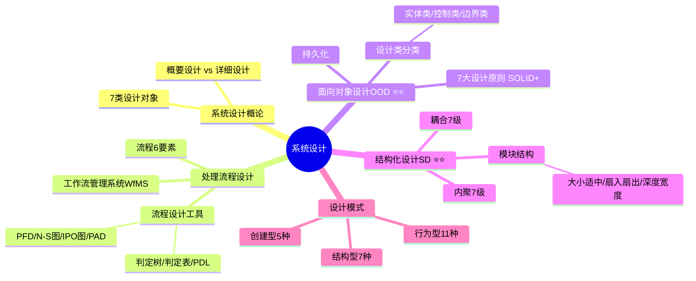

# 系统设计

> [!danger] 超级重点 ★★★★★★（红宝书ch3）
> 选择、案例部分多考察面向对象设计和结构化设计的相关概念（必须非常熟悉，下划线标出都要背出），处理流程设计考察的相对偏少。论文也是高频考点。
>
> **速查跳转**：[[#7.2 系统设计概述|设计概述]] · [[#7.3 处理流程设计概述|流程设计]] · [[#7.4 面向对象设计|OOD]] · [[#7.5 结构化设计|结构化]] · [[#7.6 设计模式|设计模式]]

---

## 知识全景

> [!tip]+ 记忆口诀
> - 需求开发4阶段：**获分归雁**（来自 [[01-综合知识/06-需求工程#^req-mnemonics|需求工程]]）
> - 耦合从低到高：**非鼠标控外公嘴** — 非（非直接）鼠（数据）标（标记）控（控制）外（外部）公（公共）嘴（内容）
> - 内聚从高到低：**公孙铜锅涮罗欧** — 公（功能）孙（顺序）铜（通信）锅（过程）涮（瞬时）罗（逻辑）欧（偶然）
> - 设计模式（创建）：**工厂抽象建造者，单例原型巧构成**
> - 设计模式（结构）：**试桥组装外享代**
> - 设计模式（行为）：**观察命令责任链，迭代模板状态变。中介策略备忘录，解释访问都包含**

^design-mnemonics

---

## 7.1 系统设计在软件工程中的位置 #非重点

> [!abstract]- 概要设计 vs 详细设计（展开查看）
> **概要设计**：对系统进行高层次的规划和设计，确定系统的基本结构、组成要素以及它们之间的关系。主要关注系统的大体框架和基本功能，着重解决系统应该如何组织、如何实现等问题。
>
> **详细设计**（也称模块设计）：在概要设计的基础上，进一步深入到系统细节层面，确定系统中各个模块的具体实现方式、接口定义、算法实现等内容。着重解决系统应该如何完成某个具体任务、如何处理某个具体的数据等问题。
>
> 概要设计、详细设计都可以纵向分解成==架构层、功能层和数据层==。

---

## 7.2 系统设计概述 #次重点

系统设计按照对象不同可以分为以下 ==7 类==。

| 设计类型 | 主要任务 / 目的 |
|--------|------------|
| **网络设计** | 根据系统要求选择网络结构，安排设备分布、布线部署，划定节点权限，选择系统及管理软件 |
| **代码设计**（重点） | 包括面向对象设计和结构化设计。实现代码的唯一化、规范化、系统化 |
| **输入设计** | 确保输入数据的完整性、正确性、一致性 |
| **输出设计** | 确保输出数据的完整性、正确性、一致性 |
| **处理流程设计**（重点） | 确定各系统模块的内部结构（局部数据组织、控制流、加工过程与细节） |
| **数据存储设计** | 选择存储方式、介质、组织方式，估算容量，满足业务与管理需求。数据库设计（概念设计、逻辑设计、物理设计） |
| **用户界面设计** | 优化系统与用户的交互体验，引导用户操作。==黄金三原则==：置于用户控制之下、减轻用户记忆负担、保持界面一致性 |
| **安全性和可靠性设计** | 确保系统安全、有效运行，对运行环境和数据处理进行控制 |

^design-7-types

---

## 7.3 处理流程设计概述 #次重点

处理流程设计的任务是==设计出系统所有模块以及它们之间的相互关系==，并具体设计出每个模块内部的功能和处理过程，为开发人员提供详细的技术资料。

### 7.3.1 流程设计 #次重点

流程设计包含 4 个核心概念：

| 类别 | 定义 | 例子 |
|------|-----|-----|
| **流程** | ISO 9000 定义：一组将输入转化为输出的相互关联或相互作用的活动 | 在线教育平台"开通课程"流程 |
| **工作流** | WFMC 定义：可部分／完全自动执行的业务过程，基于规则在执行者间传递文档、任务等 | 课程申请单流转：员工→主管→培训部→财务 |
| **活动及其所有者** | 活动：流程基本要素，改变数据／状态，推动流程（人或系统完成）；所有者：有权结束活动并推动流程的参与者 | 审批活动：输入为课程申请单，处理合规性判断，所有者为部门主管 |
| **工作项** | 流程实例中参与者需执行的具体工作 | 某员工创建的"软考课程申请单"，是主管审批环节的具体待办工作 |

#### 流程的 6 个基本要素 #次重点

==输入资源、活动、活动的相互作用（结构）、输出结果、用户和价值==。

> [!tip] 记忆口诀
> **输入输出活动（相互作用）用户价值**

^process-6-elements

### 7.3.2 流程设计工具 #次重点

流程设计工具分为三类：==图形工具、表格工具和语言工具==。

| 大类 | 工具名称 | 描述 | 要点 |
|------|--------|------|------|
| **图形工具** | 程序流程图（PFD） | 用图框表示各种操作，独立于任何程序设计语言，直观易掌握 | 5种基本控制结构：顺序、选择、多分支选择、当型循环、直到型循环 |
| | N-S 图（盒图） | 以方框代替传统 PFD，包括顺序型、选择型、WHILE/UNTIL 循环型和多分支选择 | 具有==强烈的结构化特征== |
| | IPO 图 | 描述模块的输入、输出和数据加工，结构清晰 | 常用于系统设计文档 |
| | 问题分析图（PAD） | 由日立公司提出，支持结构化程序设计，包含五种基本控制结构 | 执行顺序明确，==适合嵌套和层次关系的表示== |
| | 判定树 | 用树形结构表示逻辑判断，条件和处理流程直观 | 适合复杂条件判断 |
| **表格工具** | 判定表 | 结构清晰、简明，用表格形式表示逻辑判断问题 | 适合多个互相联系的条件和多种结果的描述 |
| **语言工具** | 过程设计语言（PDL） | 也称伪代码，混合自然语言词汇和结构化程序设计语言语法 | 灵活，有助于逐步求精和详细设计 |

> [!warning] 易错点
> PFD（程序流程图）主要用于描述==程序的逻辑流程==（各个步骤的执行顺序、判断条件等），而==不是==用于描述系统中每个模块的输入、输出和数据加工（那是 IPO 图）。

^process-design-tools

### 7.3.3 工作流管理系统 #次重点

工作流管理系统（Workflow Management System，WfMS）通过软件定义、创建工作流并管理其执行。

**WFMS 基本功能**（3个）：
1. ==工作流建模==（定义活动和规则，对应现实业务处理过程）
2. ==工作流执行==（创建和执行实际工作流）
3. ==业务过程管理和分析==（监控管理执行中的业务情况）

> [!tip] 记忆口诀
> **简直过分** — 简（建模）直（执行）过（过程管理）分（分析）

**工作流参考模型（WRM）** 包含 ==6 个基本模块==：工作流执行服务、工作流引擎、流程定义工具、客户端应用、调用应用和管理监控工具。

> [!tip] 记忆口诀
> **指引丁克调管** — 指（执行）引（引擎）丁（定义）克（客户端）调（调用）管（管理）

---

## 7.4 面向对象设计 #重点

面向对象设计（OOD）是面向对象分析（OOA）方法的延续，其基本思想包括==抽象、封装和可扩展性==，其中可扩展性主要通过==继承和多态==来实现。在面向对象设计中，==数据结构和在数据结构上定义的操作算法封装在一个对象之中==。

### 7.4.1 设计类分类 #重点 #必背

案例中常考判定什么是实体类、控制类、边界类。

| 维度 | 实体类 | 控制类 | 边界类 |
|------|--------|--------|--------|
| **定义** | 映射需求中的每个实体，保存需永久存储在存储体中的信息 | 用于控制用例工作，对用例特有的控制行为建模 | 封装用例内外流动的信息或数据流，处于系统与外界交界处 |
| **命名规则** | 采用业务领域术语，一般为==名词== | 由动宾结构短语转化而来的==名词== | 与系统接口紧密相关，无固定规则但能体现外部交互功能 |
| **生命周期** | 通常具有永久性，只要业务存在其信息就需持续保存 | 系统执行用例时产生，用例执行完毕后消亡 | 随系统运行一直存在，在系统与外部交互时发挥作用 |
| **属性与方法** | 一定有属性，操作依业务需求而定，不一定存在 | 通常没有属性，但一定有方法 | 可以既有属性也有方法 |
| **常见示例** | 在线教育平台的学员类、课程类 | 如"身份验证"对应的"身份验证器" | ==窗口、通信协议、打印机接口、报表==等 |

^design-class-types

> [!tip] 判断技巧
> 先看是否是（窗口、通信协议、打印机接口、报表等）→ 是则为==边界类==；
> 剩下用命名规则判断：==名词是实体类，动名词就是控制类==。

### 7.4.2 面向对象设计原则 #重点 #必背

常用的面向对象设计原则包括 ==SOLID + 组合/聚合复用原则 + 最少知识原则（迪米特法则）==，共 7 个。

| 设计原则 | 简写 | 详细描述 |
|--------|------|--------|
| **单一职责原则** | S | 类应该只有==一个设计目的== |
| **开闭原则** | O | 对==扩展开放，对修改封闭==。通过添加抽象层实现，是其他原则的基础 |
| **里氏替换原则** | L | 软件实体使用基类对象时应==适用于子类对象==，设计时应将变化类设计为抽象类或接口 |
| **接口隔离原则** | I | 分逻辑和侠义两种理解，前者将接口视为角色，后者要求==将大接口方法分至小接口== |
| **依赖倒置原则** | D | ==抽象不依赖于细节==，针对接口编程，是实现开闭原则的主要机制，与各种技术和框架相关 |
| **组合/聚合复用原则** | — | 通过组合或聚合关系==复用已有对象==，比继承更灵活，耦合度低 |
| **最少知识原则**（迪米特法则） | — | 软件实体应尽量少与其他实体相互作用。分狭义和广义，狭义降低类耦合但可能影响通信效率，广义主要控制信息相关方面，利于子系统解耦和复用 |

^ood-7-principles

> [!tip] 记忆口诀
> **SOLID + 组合复用 + 迪米特** = 7大原则

### 7.4.3 持久化 #次重点

> [!abstract]- 持久化相关概念（展开查看）
> 面向对象设计中，**持久化**是将内存中的对象状态保存到持久存储介质（如数据库、文件）中的过程。常见技术包括 ORM（对象关系映射）、序列化等。

---

## 7.5 结构化设计 #重点

结构化设计（Structured Design，简称 SD）是一种面向==数据流==的方法，以软件需求规格说明（SRS）、系统分析（SA）阶段所产生的数据流图和数据字典等文档为基础，是一个==自顶向下、逐步求精和模块化==的过程。

软件设计模型/结构化设计包括四个既独立又相互联系的活动：==数据设计、软件结构设计、人机界面设计（接口设计）和过程设计==。

### 7.5.1 模块结构 #重点

| 模块划分原则 | 具体说明 |
|----------|--------|
| **模块大小适中** | 过大→功能不单一、复杂度高；过小→调用频繁、独立性降低。一般模块实现代码 ==1-2 页纸内或 50-200 行== |
| **模块扇入扇出合理** | ==扇出==指直接调用下级模块个数，扇出大→复杂度高→需控制模块数；==扇入==指直接调用该模块的上级模块个数，扇入大→复用程度高。系统平均扇入和扇出系数为 ==3 或 4，不超 7== |
| **深度和宽度适当** | ==深度==指模块层数，过多考虑是否简单可合并；==宽度==指同一层次模块总数最大值，宽度大→系统复杂 |
| **信息隐蔽** | 采用封装技术隐藏模块实现细节，使接口简单，模块设计成=="黑盒"==，仅通过接口交互。抽象原则抽取事物基本特性和行为，忽略细节，分层次抽象控制开发复杂性，包括==过程抽象、数据抽象和控制抽象== |

^module-structure

### 7.5.2 耦合 #重点 #必背

耦合表示模块之间联系的程度。模块的耦合类型通常分为 ==7 种==，根据耦合度==从低到高==排序：

| 耦合类型 | 描述 |
|--------|------|
| **非直接耦合**（低） | 两个模块之间没有直接关系，完全通过主模块的控制和调用来实现 |
| **数据耦合** | 一组模块借助==参数表传递简单数据值== |
| **标记耦合** | 一组模块通过==参数表传递记录信息==（是指数据结构） |
| **控制耦合** | 模块之间传递的信息中包含用于==控制模块内部逻辑==的信息 |
| **外部耦合** | 一组模块都访问同一==全局简单变量==而不是同一全局数据结构，而且不是通过参数表传递该全局变量的信息 |
| **公共耦合** | 多个模块都访问同一==公共数据环境==，公共的数据环境可以是全局数据结构、共享的通信区、内存的公共覆盖区等 |
| **内容耦合**（高） | 一个模块直接访问另一个模块的==内部数据==；一个模块不通过正常入口转到另一个模块的内部；两个模块有一部分程序代码重叠；一个模块有多个入口 |

^coupling-7-types

> [!tip] 记忆口诀（从低到高）
> **非鼠标控外公嘴** — 非（非直接）要用鼠（数据）标（标记）控（控制）外（外部）公（公共）嘴（内容）

### 7.5.3 内聚 #重点 #必背

内聚表示模块内部各成分之间的联系程度。模块的内聚类型也分为 ==7 种==，根据内聚度==从高到低==排序：

| 内聚类型 | 描述 |
|--------|------|
| **功能内聚**（高） | 完成==一个单一功能==，各个部分协同工作，缺一不可 |
| **顺序内聚** | 处理元素相关，而且必须==顺序执行==（存在数据传递和依赖关系） |
| **通信内聚** | 所有处理元素集中在==一个数据结构的区域==上 |
| **过程内聚** | 处理元素相关，而且必须==按特定的次序执行==（不存在数据传递和依赖关系） |
| **瞬时内聚**（时间内聚） | 所包含的任务必须在==同一时间间隔==内执行 |
| **逻辑内聚** | 完成逻辑上相关的一组任务 |
| **偶然内聚**（巧合内聚）（低） | 完成==一组没有关系或松散关系==的任务 |

^cohesion-7-types

> [!tip] 记忆口诀（从高到低）
> **公孙铜锅涮罗欧** — 公（功能）孙（顺序）铜（通信）锅（过程）涮（瞬时）罗（逻辑）欧（偶然）

> [!warning] 易错点：顺序内聚 vs 过程内聚
> - **顺序内聚**：各个成分和==同一个功能密切相关==，并且一个成分的输出作为另一个成分的输入，==存在数据传递和依赖关系==
> - **过程内聚**：中构件或操作之间==即使没有数据传递也可组合在一起==，==不一定存在数据上的依赖==

---

## 7.6 设计模式 #次重点

> [!info] 考察说明
> 此章节 90% 概率只会在选择题中出现，小概率在案例和论文出现。最简单的是设计模式的分类以及辨别，稍难一点的是给你场景让你判断用哪种设计模式实现最佳，或者给你一个类图让你判别是哪种设计模式。

设计模式是前人经验的总结，它使人们可以方便地复用成功的设计和架构。共 ==23 种==，分为三大类：

### 创建型模式（5种）

> [!tip] 记忆口诀：**工厂抽象建造者，单例原型巧构成**

| 模式名称 | 具体解释 |
|--------|--------|
| **工厂方法** | 定义一个接口用于创建对象，但由==子类决定==实例化哪个类 |
| **抽象工厂** | 提供一个接口以创建==相关或依赖对象的家族==，而无需明确指定具体类 |
| **生成器**（建造者） | 将一个复杂对象的==构建与其表示分离==，使同样的构建过程可以创建不同的表示 |
| **原型** | 通过==复制现有对象==来创建新对象，而不是从头开始实例化 |
| **单例** | 确保一个类==只有一个实例==，并提供全局访问点 |

^pattern-creational

### 结构型模式（7种）

> [!tip] 记忆口诀：**试桥组装外享代**

| 模式名称 | 具体解释 |
|--------|--------|
| **适配器** | 将一个类的接口转换为客户希望的另一个接口，使==原本接口不兼容的类==可以一起工作 |
| **桥接** | 将抽象部分与它的实现部分分离，使它们都可以==独立变化== |
| **组合** | 将对象组合成树形结构以表示=="部分-整体"的层次结构==，使客户可以统一处理单个对象和组合对象 |
| **装饰** | 动态地给对象==添加额外职责==，而不改变其接口 |
| **外观** | 为子系统中的一组接口提供一个==统一的高层接口==，使子系统更容易使用 |
| **享元** | 通过共享技术来有效支持==大量细粒度对象的复用== |
| **代理** | 为另一个对象提供一个==代理或占位符==以控制对它的访问 |

^pattern-structural

### 行为型模式（11种）

> [!tip] 记忆口诀：**观察命令责任链，迭代模板状态变。中介策略备忘录，解释访问都包含**

| 模式名称 | 具体解释 |
|--------|--------|
| **观察者** | 定义对象间一种==一对多的依赖关系==，使得每当一个对象改变状态时，所有依赖它的对象都会得到通知并自动更新 |
| **命令** | 将请求==封装成对象==，以便使用不同的请求、队列或日志来参数化其他对象 |
| **责任链** | 使多个对象都有机会处理请求，从而==避免请求的发送者和接收者之间的耦合== |
| **迭代器** | 提供一种方法==顺序访问==一个聚合对象中的各个元素，而不暴露其内部表示 |
| **模板方法** | 在一个方法中定义一个算法的骨架，而将一些步骤==延迟到子类==中，使子类可以不改变算法结构即可重定义该算法的某些步骤 |
| **状态** | 允许对象在内部状态改变时==改变其行为==，对象看起来好像修改了其类 |
| **策略** | 定义一系列算法，将每一个算法==封装==起来，并使它们可以互换 |
| **备忘录** | 在不破坏封装的前提下，==捕获并外部化==对象的内部状态，以便以后恢复到该状态 |
| **中介者** | 用一个中介对象来封装一系列对象交互，使对象==不需要显式地相互引用==，降低它们的耦合度 |
| **访问者** | 表示一个作用于某对象结构中的各元素的操作，使你可以在==不改变各元素类==的前提下定义作用于这些元素的新操作 |
| **解释器** | 给定一个语言，定义其文法的一种表示，并定义一个==解释器==，用于处理该语言中的句子 |

^pattern-behavioral

---

## 易错点总结

| 易错点 | 正确理解 |
|-------|--------|
| 概要设计和详细设计的区别？ | 概要→系统大体框架"如何组织"；详细→各模块具体实现"如何完成" |
| PFD 描述的是什么？ | 描述==程序逻辑流程==（执行顺序/判断），不是模块的输入输出（那是 IPO 图） |
| 实体类、控制类、边界类怎么判断？ | 先看是否是窗口/接口/报表→边界类；名词→实体类；动名词→控制类 |
| 顺序内聚和过程内聚的区别？ | 顺序：==有数据传递和依赖==；过程：按次序执行但==不一定有数据依赖== |
| 耦合从低到高排序？ | ==非直接 < 数据 < 标记 < 控制 < 外部 < 公共 < 内容== |
| 内聚从高到低排序？ | ==功能 > 顺序 > 通信 > 过程 > 瞬时 > 逻辑 > 偶然== |
| 开闭原则的含义？ | 对==扩展开放、对修改封闭==，是其他原则的基础 |
| 创建型/结构型/行为型各几种？ | 创建 ==5== 种、结构 ==7== 种、行为 ==11== 种，共 23 种 |

^error-prone-summary

---

## 与其他知识点的关联

> [!info]+ 知识网络
> **前置知识**
> - [[01-综合知识/06-需求工程|需求工程]] — 需求分析之后进入系统设计阶段
> - [[01-综合知识/05-软件工程概述|软件工程概述]] — 系统设计在软件工程中的位置
>
> **后续知识**
> - [[01-综合知识/08-系统架构设计|系统架构设计]] — 架构设计是系统设计的高层抽象
> - [[01-综合知识/10-软件测试|软件测试]] — 设计完成后进入测试阶段
>
> **案例 & 论文**
> - [[02-案例分析/02-信息系统架构设计|案例：信息系统架构设计]] — 案例中常考设计类分类、设计原则
> - [[03-论文/03-系统设计|论文：系统设计]] — 论文中面向对象设计、设计模式是高频主题
