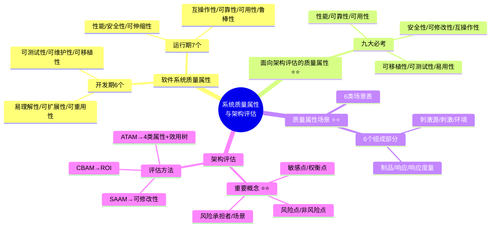

# 系统质量属性与架构评估

> [!danger] 重点 ★★★★★★（红宝书ch4.8）
> 两类质量属性注意区分：==软件系统质量属性==（描述系统）vs ==架构质量属性==（描述架构）。九大必考质量属性选择题常考，质量属性场景案例必考（让你默写），ATAM 效用树也是高频考点。
>
> **速查跳转**：[[#9.1 软件系统质量属性|软件质量属性]] · [[#9.2 面向架构评估的质量属性|九大必考属性]] · [[#9.3 质量属性场景描述|场景描述]] · [[#9.4 系统架构评估|架构评估概念]] · [[#9.5 系统架构评估方法|评估方法]]

---

## 知识全景



---

## 9.1 软件系统质量属性

> [!note]- 次重点 ★★★☆☆ — 了解即可，不重要
> 软件系统质量属性是指影响软件系统==性能和可靠性==的因素，用来衡量和评估软件系统在不同方面的表现。质量属性通常是在设计和开发过程中考虑的==非功能性需求==（Non-functional Requirements）。

基于软件系统的生命周期，可以将质量属性分为两个部分：

| 分类 | 数量 | 具体属性 |
|------|------|--------|
| **开发期**质量属性 | ==6== 个 | 易理解性、可扩展性、可重用性、可测试性、可维护性、可移植性 |
| **运行期**质量属性 | ==7== 个 | 性能、安全性、可伸缩性、互操作性、可靠性、可用性、鲁棒性 |

^software-quality-attributes

---

## 9.2 面向架构评估的质量属性

> [!warning] 超级重点 ★★★★★★
> 和软件系统质量属性的不同点在于，面向架构评估的质量属性强调==如何通过架构设计实现和优化==质量属性。评估方法所普遍关注的质量属性有以下 ==9== 种，也是案例选择常考的、让你辨析的内容。

### 9.2.1 九大必考质量属性

| 属性 | 描述 | 对策 |
|------|------|------|
| **性能** | 指系统的==响应能力==，处理事务所需时间或单位时间内处理事务数量 | 优先级队列、增加计算资源、减少计算开销、引入并发机制、采用资源调度 |
| **可靠性** | 指软件在应用错误、意外错误使用情况下维持功能特性的基本能力，通过==平均失效时间==来衡量 | ==冗余设计==（硬件冗余、数据冗余）、错误检测与恢复机制（如奇偶校验、循环冗余校验）、异常处理（捕获并处理程序运行中的异常）、备份与恢复策略、负载均衡（避免单个组件过载） |
| **可用性** | 指系统==正常运行的时间比例==，表现为两次故障间时长或故障时恢复正常速度 | 心跳机制（检测系统组件的运行状态）、冗余系统（如双机热备、集群）、快速恢复机制（使用备用设备或系统）、内置监控器监控与预警、==故障转移==（自动将工作负载转移到备用组件） |
| **安全性** | 指向合法用户提供服务同时==阻止非授权访问==或拒绝服务的能力 | 用户认证（如用户名密码认证、多因素认证）、授权管理（基于角色的访问控制）、数据加密、防火墙、入侵检测与防范系统、审计与日志记录 |
| **可修改性** | 指快速、高性价比地变更系统的能力，包括==可维护性、可扩展性、结构重组、可移植性== | 模块化设计（降低模块间耦合度）、接口标准化、抽象与封装、配置管理、版本控制 |
| **互操作性** | 软件需要与其他系统或环境交互，软件架构必须为外部功能和数据结构提供精心设计的==入口== | 使用标准协议和接口（如 RESTful API、SOAP）、数据格式转换、中间件、服务注册与发现、跨语言开发工具 |
| **可移植性** | 软件或硬件适应==不同运行环境==的能力，通过抽象层、环境无关代码设计 | 遵循标准协议并依赖标准 API，避免特定平台专有 API；抽象底层差异，通过封装底层代码和借助中间件或虚拟机隔离软件与底层的差异；进行兼容性测试 |
| **可测试性** | 指软件能够被==有效测试==的难易程度 | 设计分层与模块化，减少模块间耦合度；提供测试接口：在代码中预留专用的测试接口，允许测试人员直接访问内部状态 |
| **易用性** | 指系统让用户"好学、好找、好操作、少犯错"的程度 | 统一交互与视觉规范；信息架构清晰；可发现性与即时反馈；降低认知负荷；多语言与本地化；快捷操作；新手引导与内嵌帮助；可访问性 |

^nine-quality-attributes

> [!tip] Q：可靠性和可用性的区别是否需要辨析？
> 实际上架构第二版上这两个不一样的概念，但是真题实际上也没出现过两者的辨析。同时根据国际标准 ISO/IEC 25010 的解读，可用性实际上是可靠性的一个子集。其中可用性的定义包含了故障恢复速度的含义，可靠性的度量指标平均失效时间实际上也是恢复速度快。近十年之内两者都没有出现过辨析。
>
> **结论**：写可用性没问题。默认可用性。以真题为例——"网络失效后系统需要在2分钟内发现错误并启用备用系统"、"主站点断电后需要在3秒内将访问请求重定向到备用站点"——这些都归结到==可用性==。

---

## 9.3 质量属性场景描述

> [!warning] 超级重点 ★★★★★★
> 这一章节架构同学必学必会，==案例题就捏你概念，让你默写==。为了精确描述软件系统的质量属性，通常采用质量属性场景（Quality Attribute Scenario）作为描述质量属性的手段。

| 项目 | 内容 |
|------|------|
| **目的** | 引入质量属性场景的目的是精确描述软件系统的质量属性 |
| **概念** | 质量属性场景是对利益相关者与系统交互的简短陈述，描述了一个具体的质量属性需求 |
| **6个组成部分** | ==刺激源、刺激、环境、制品、响应、响应度量== |
| **6类质量属性** | 可用性、可修改性、性能、可测试性、易用性和安全性 |

### 6个组成部分定义

| 组成部分 | 定义 |
|---------|------|
| **刺激源** | 生成刺激的实体 |
| **刺激** | 到达系统时需要考虑的条件 |
| **环境** | 刺激发生的条件 |
| **制品** | 被激励的对象 |
| **响应** | 激励到达后采取的行动 |
| **响应度量** | 对响应进行度量的方式 |

> [!tip] 记忆口诀
> ==原词换纸想读==。原来的歌词换个纸我就想读了。
> **原**（刺激源）**词**（刺激）**换**（环境）**纸**（制品）**想**（响应）**读**（度量）。

^scenario-mnemonics

### 6类质量属性场景表

> [!warning] 必须掌握 — 最低要求看熟悉。==可用性、可修改性、性能和安全性==是必须要掌握的。

| 质量属性 | 刺激源 | 刺激 | 环境 | 制品 | 响应 | 响应度量 |
|---------|--------|------|------|------|------|---------|
| **可用性** | 系统内部、外部 | 疏忽、错误、正常操作、降级模式 | 崩溃、时间 | 系统处理器、通信信道、持久存储器、进程 | 检测事件，记录并通知相关方，禁止错误或故障源 | ==可用时间/可用性；允许不可用时长；故障修复时间（MTTR）==；降级可运行时长 |
| **可修改性** | 最终用户、开发人员、系统管理员 | 希望增加、删除、修改、改变功能、质量属性、容量等 | 系统设计时、编译时、构建时、运行时 | 系统用户界面、平台、环境或与目标系统交互的系统 | 查找需修改位置，修改且不影响其他功能，测试并部署修改 | ==修改成本/工时==；影响范围（受影响元素数）；对其他功能/质量属性影响程度 |
| **性能** | 用户请求，其他系统触发等 | 定期事件到达、随机事件到达、偶然事件到达 | 正常模式、超载模式 | 系统 | 处理刺激、改变服务级别 | ==响应/等待时间==；吞吐量；期限/截止时间 SLA 达成/超时率；丢失率 |
| **可测试性** | 开发人员、增量人员、系统验证人员、客户验收测试人员、系统用户 | 已完成的分析、架构、设计、类和子系统集成；所交付的系统 | 设计时、开发时、编译时、部署时 | 设计、代码段、完整地应用 | 提供对状态值的访问，提供所有计算的值，准备测试环境 | ==覆盖率==；缺陷暴露率；测试执行时间；环境准备时间；依赖链长度 |
| **易用性** | 最终用户 | 想要学习系统特性、有效使用系统、使错误的影响最低、适配系统、对系统满意 | 系统运行时或配置时 | 系统 | 提供支持学习、有效使用、降低错误影响、适配系统、使客户满意的响应 | ==任务完成时间==；错误数；成功率；满意度 |
| **安全性** | 正确识别、非正确识别、未知的来自内部/外部的个人或系统；经过授权/未授权它访问了有限的资源/大量资源 | 试图显示数据，改变/删除数据，访问系统服务，降低系统服务的可用性 | 在线或离线、联网或断网、连接有防火墙或者直接连到了网络 | 系统服务、系统中的数据 | 对用户身份进行认证；隐藏用户的身份；阻止/允许访问；授予/收回许可；记录访问；存储数据；识别高需求；通知并限制服务可用性 | ==统过成本（时间/资源）==；攻击检测率；溯源成功率；DDoS 下可用性；恢复时间/影响范围 |

^scenario-six-attributes

---

## 9.4 系统架构评估

> [!warning] 超级重点 ★★★★★★
> 系统架构评估是在对架构分析、评估的基础上，对架构策略的选取进行决策。评估方法通常可以分为 ==3== 类：基于调查问卷或检查表的方式、基于场景的方式和基于度量的方式。软考只考==基于场景的方式和基于度量的方式==。

### 9.4.1 架构评估中的重要概念

> [!warning] 超级重点 ★★★★★★ — 特别是敏感点和权衡点的辨析，是系分架构选择题最爱出的方向

| 概念 | 定义 | 举例 |
|------|------|------|
| **敏感点** | ==一个或多个构件==（和/或构件之间的关系）的特性 | 对查询请求处理时间的要求将影响系统的数据传输协议和处理过程的设计 |
| **权衡点** | ==影响多个质量属性==的特性，是多个敏感点的综合 | 在线文件存储系统，加密级别的选择就是权衡点。高加密级别（如 AES-256）能大幅提升安全性，但会增加数据加密和解密的计算量，降低系统性能 |
| **风险承担者/利益相关人** | 系统架构涉及到的利益相关者 | 企业 ERP 系统中的财务部门、销售部门 |
| **场景** | 从风险承担者的角度对于系统的交互的简短描述，架构评估中一般采用==刺激、环境和响应三方面==来描述 | 客户在公共 Wi-Fi 环境下尝试登录银行网上银行系统，系统需 10 秒内完成身份验证并显示账户信息 |
| **风险点** | 可能导致系统架构出现问题或无法满足质量属性要求的特性、决策或情况（==如果…，可能…，影响==） | 如果"养护报告生成"业务逻辑的描述尚未达成共识，可能导致部分业务功能模块规则的矛盾，影响系统的可修改性 |
| **非风险点** | ==不会==对系统的质量属性造成负面影响，或者影响在可接受范围内 | 选择一款成熟且持续更新的消息队列中间件（如 RabbitMQ），其性能、稳定性都经过市场验证 |

^evaluation-concepts

> [!tip] 敏感点 vs 权衡点判断技巧
> - **敏感点**：只影响==一个==质量属性 → "对X的要求将影响Y的设计"
> - **权衡点**：影响==多个==质量属性 → "提升了A，但降低了B"
> - **风险点**：带有"==如果…可能…影响…=="的不确定描述
> - **非风险点**：明确可控，经过验证

---

## 9.5 系统架构评估方法

> [!warning] 重点 ★★★★★★
> 系统架构评估方法是用于评价系统架构优劣、合理性及是否满足需求等的一系列技术和手段。软考里只有 ==SAAM、ATAM、CBAM== 和其他。选择主要考概念。

### 9.5.1 基于场景的架构分析方法 SAAM

> [!note]- 次重点 ★★★☆☆
> SAAM 的目标是通过场景验证架构假设和原则，评估架构固有风险，比较不同架构方案。SAAM 采用场景技术进行评估，将质量属性具体化为场景描述。
>
> - SAAM 的主要质量属性是==可修改性==，但也可扩展到其他属性
> - SAAM 协调不同利益相关者的关注点，达成架构共识
> - SAAM 针对==最终架构==而非详细设计进行评估
> - SAAM 的评估过程包括：==场景开发、架构描述、单场景评估、场景交互评估和总体评估==

^saam-overview

### 9.5.2 架构权衡分析方法 ATAM

> [!warning] 重点 ★★★★★★
> ATAM 在 SAAM 的基础上发展起来的，主要针对==性能、可用性、安全性和可修改性==，在系统开发之前，对这些质量属性进行评价和折中。

**ATAM 活动过程 — 4个主要阶段**：

| 阶段 | 名称 | 内容 |
|------|------|------|
| 阶段 1 | ==场景和需求收集== | 收集场景以及约束等需求信息 |
| 阶段 2 | ==体系结构视图和场景实现== | 描述体系结构图，实现场景 |
| 阶段 3 | ==属性模型构造和分析== | 基于优秀单一理论进行特定属性分析，构造属性模型并分析 |
| 阶段 4 | ==折中== | 标志折中情况，识别敏感度 |

^atam-four-phases

**ATAM 评估实践 — 4个阶段**（上面4个阶段的展开）：

| 阶段 | 主要内容 |
|------|---------|
| **演示阶段** | 评估团队介绍 ATAM 过程、业务目标和要评估的体系结构 |
| **调查和分析阶段** | 深入探讨架构方法，生成==质量属性效用树==，分析架构方法 |
| **测试阶段** | 通过头脑风暴和优先场景理解质量属性要求，分析架构方法 |
| **报告阶段** | ATAM 团队向利益相关者呈现评估结果、效用树、场景、分析问题、风险和非风险以及架构方法的发现，为架构改进提供指导 |

**效用树（Utility Tree）**：

ATAM 方法采用效用树这一工具来对质量属性进行分类和优先级排序。

%%效用树结构是ATAM的核心工具，考试常考%%

```
效用树结构：
树根 → 质量属性 → 属性分类 → 质量属性场景（叶子节点）
```

> [!tip] 效用树关键要点
> - ATAM 主要关注 ==4== 类质量属性：==性能、安全性、可修改性、可用性==（因为这4个质量属性是利益相关者最为关心的）
> - 得到初始的效用树后，需要修剪这棵树，保留重要场景（通常不超过 ==50== 个）
> - 再对场景按重要性给定优先级（用 ==H/M/L== 的形式），再按场景实现的难易度来确定优先级（用 H/M/L 的形式）
> - 每个场景就有一个优先级对（重要度，难易度），如 ==(H, L)== 表示该场景重要且易实现
> - 做真题的时候你会知道，是通过==填空形式==来进行考察的

^atam-utility-tree

### 9.5.3 CBAM 方法

> [!note]- 次重点 ★★★☆☆
> CBAM 的核心思想是：架构策略会影响系统的质量属性。质量属性的变化会为系统的相关方带来一定收益（效用）。==CBAM 协助相关方根据投资回报率（ROI）来选择最优架构策略==。

^cbam-overview

### 9.5.4 其他方法

> [!note]- 非重点 ☆☆☆☆☆ — 了解即可不做要求，假如出论文题目放弃，不好写
>
> | 方法名称 | 主要特点 |
> |---------|---------|
> | SAEM 方法 | 兼顾软件架构的产品属性与过程属性，从内外部质量属性评估，构建通用评估框架 |
> | SAABNet 方法 | 借助专家知识，利用贝叶斯信念网络实现定性评估 |
> | SACMM 方法 | 聚焦架构修改，以图内核定义准测度量架构变化 |
> | SASAM 方法 | 通过对比预期与实际架构进行静态评估 |

### SAAM / ATAM / CBAM 对比

| 对比项 | SAAM | ATAM | CBAM |
|-------|------|------|------|
| **关注属性** | ==可修改性==（可扩展到其他） | ==性能、可用性、安全性、可修改性== | 质量属性的==经济收益== |
| **核心工具** | 场景 | ==效用树== | ROI 分析 |
| **评估对象** | 最终架构 | 架构策略的折中 | 架构策略的==投资回报== |
| **发展关系** | 最早 | SAAM 基础上发展 | ATAM 基础上发展 |
| **过程特点** | 场景驱动 | ==迭代式== | 成本收益分析 |

^evaluation-methods-compare

---

## 易错点总结

| 易错点 | 正确理解 |
|-------|--------|
| 软件系统质量属性 vs 架构质量属性？ | 前者描述==系统==（开发期+运行期），后者强调如何通过==架构设计==实现和优化 |
| 敏感点 vs 权衡点？ | 敏感点影响==一个==质量属性；权衡点影响==多个==质量属性（多个敏感点的综合） |
| 风险点 vs 非风险点？ | 风险点带有=="如果…可能…影响…"==不确定描述；非风险点明确可控、经过验证 |
| 可靠性 vs 可用性？ | 度量不同——可靠性看==平均失效时间==，可用性看==正常运行时间比例==；实际考试中默认可用性即可 |
| SAAM 主要关注什么？ | ==可修改性==（不是性能！） |
| ATAM 主要关注哪4类？ | ==性能、安全性、可修改性、可用性==（利益相关者最关心的4类） |
| ATAM 的出发点和终点？ | 出发点也是终点——都是==需求==（后面的架构视图还是质量属性评估，最终都要解决用户需求问题） |
| 效用树的叶子节点是什么？ | ==质量属性场景==（不是质量属性！结构：树根→质量属性→属性分类→场景） |
| 质量属性场景的6个部分？ | ==原词换纸想读==：刺激源、刺激、环境、制品、响应、响应度量 |
| CBAM 的核心是什么？ | 根据==投资回报率（ROI）==选择最优架构策略 |

^error-prone-summary

---

## 与其他知识点的关联

> [!info]+ 知识网络
> **前置知识**
> - [[01-综合知识/08-系统架构设计|系统架构设计]] — 本章是架构设计章节(ch4)的子章节，质量属性与架构评估建立在架构设计基础之上
> - [[01-综合知识/07-系统设计|系统设计]] — 系统设计中的设计原则影响质量属性
>
> **后续知识**
> - [[01-综合知识/12-系统可靠性|系统可靠性]] — 可靠性是质量属性之一，在可靠性章节深入展开
> - [[01-综合知识/10-软件测试|软件测试]] — 可测试性是质量属性之一，测试章节详细展开
>
> **案例 & 论文**
> - [[02-案例分析/02-信息系统架构设计|案例：信息系统架构设计]] — 案例中常考质量属性场景描述、敏感点与权衡点辨析
> - [[03-论文/01-系统架构设计|论文：系统架构设计]] — 论文中架构评估方法（特别是ATAM）是高频主题
