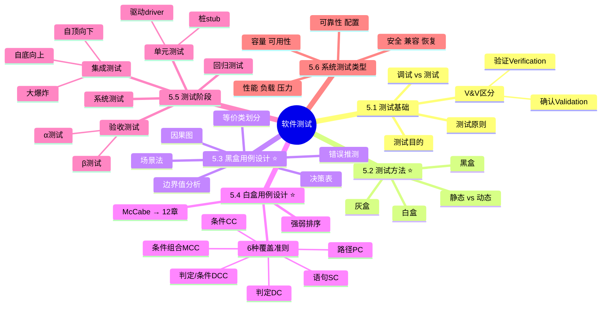

# 软件测试

> [!warning] 次重点 ★★★☆（红宝书ch5）
> 选择题中常考 1-2 题，核心考点在 ==黑盒等价类与边界值==、==白盒 6 种覆盖准则强弱排序==、==McCabe 环路复杂度==、==集成策略（自顶向下/自底向上）==、==性能/负载/压力测试区分==。McCabe 计算与 [[12-系统可靠性]] 重叠，本章引用不重复。
>
> **速查跳转**：[[#5.2 测试方法（重点★★★★）|测试方法]] · [[#5.3 黑盒测试用例设计（重点★★★★）|黑盒]] · [[#5.4 白盒测试用例设计（重点★★★★）|白盒]] · [[#5.5 测试阶段（次重点★★★）|测试阶段]] · [[#5.6 系统测试类型（次重点★★★）|系统测试]]

---

## 知识全景



---

## 5.1 测试基础（了解）

> [!note]- 考点提示
> 选择题偶考，主要考察 V&V 区分与调试 vs 测试。

软件测试是为了发现软件错误而执行程序的过程，目的是 ==发现错误而非证明无错误==。

### 5.1.1 测试目的

- 发现错误（首要目的）
- 评估软件质量
- 验证需求满足度

### 5.1.2 测试原则

- **穷举测试不可能**：所有输入组合无法全部测试
- **早测试早发现**：缺陷修复成本随阶段指数增长
- **Pareto 二八原则**：80% 错误集中在 20% 模块
- **第三方测试更客观**：避免开发人员的思维定势

### 5.1.3 V&V 验证与确认（必考易混点）

> [!important] 一句话区分
> - **验证（Verification）**：是否==正确做==产品（符合规格说明）
> - **确认（Validation）**：是否==做正确==产品（符合用户需求）
>
> 口诀：**V**erification 看**规**格、**V**alidation 看**用**户。

^vv-distinction

### 5.1.4 调试 vs 测试

| 维度 | 测试（Testing） | 调试（Debugging） |
| ---- | ---- | ---- |
| 目的 | 发现错误 | 定位并修复错误 |
| 起点 | 已知测试用例 | 已知错误现象 |
| 主体 | 测试人员 | 开发人员 |
| 步骤 | 设计用例 → 执行 → 比对 | 复现 → 定位 → 修改 → 验证 |
| 是否需要代码细节 | 黑盒不需要 | 必须看代码 |

---

## 5.2 测试方法（重点★★★★）

测试方法可从两个正交维度分类：

### 5.2.1 按是否执行代码

- **静态测试**：不执行程序，靠代码审查、走查、桌面检查发现问题
    - 适合早期阶段（编码完成但未运行）
    - 主要发现：编码规范、逻辑结构、可读性问题
- **动态测试**：实际执行程序，输入测试用例，观察输出
    - 主要发现：运行时错误、功能缺陷

### 5.2.2 按是否需要代码细节

> [!important] 三种方法对比 — 必考

| 维度 | 黑盒测试 | 白盒测试 | 灰盒测试 |
| ---- | ---- | ---- | ---- |
| 别名 | 功能测试 / 数据驱动 | 结构测试 / 逻辑驱动 | — |
| 是否看代码 | ❌ 不看内部 | ✅ 必须看代码 | 部分了解 |
| 关注点 | 输入输出是否符合规格 | 内部逻辑路径覆盖 | 接口与部分内部逻辑 |
| 主要执行人 | 测试人员 / 用户 | 开发人员 / 白盒测试员 | 集成测试人员 |
| 适用阶段 | 系统测试、验收测试 | 单元测试 | 集成测试 |
| 用例设计方法 | 等价类、边界值、决策表、因果图 | 6 种覆盖准则、基本路径法 | 综合两者 |

^test-method-comparison

> [!warning] 易混点
> "黑盒"不是不知道任何东西，而是 ==不需要看代码内部==。测试人员仍然需要熟悉规格说明书。

---

## 5.3 黑盒测试用例设计（重点★★★★）

### 5.3.1 等价类划分

将输入域划分为若干等价类，每个等价类的代表性数据等价。

- **有效等价类**：合法、合理的输入数据集合
- **无效等价类**：不合法、不合理的输入数据集合

> [!important] 设计原则
> - 每个有效等价类至少 ==被 1 个用例覆盖==（可以多个有效类共享 1 用例）
> - 每个无效等价类 ==必须独立 1 个用例==（不能合并，否则掩盖错误）

### 5.3.2 边界值分析

==错误更可能出现在边界附近==。与等价类配合使用，效果加倍。

> [!tip] 边界值取值套路（每个边界 3 个）
> 对于边界 max：取 ==max-1==（刚好小于）、==max==（恰好）、==max+1==（刚好大于）
> 对于边界 min：取 ==min-1==、==min==、==min+1==

^boundary-value

> [!tip] 考试示例：年龄输入字段（要求 1-150 整数）
>
> **等价类划分**：
> - 有效等价类：1 ≤ 年龄 ≤ 150
> - 无效等价类 1：年龄 < 1（如 0、-1）
> - 无效等价类 2：年龄 > 150（如 151）
> - 无效等价类 3：非整数（如 25.5）
> - 无效等价类 4：非数字（如 "abc"、空值）
>
> **边界值用例**：
> - 下边界：0 / 1 / 2
> - 上边界：149 / 150 / 151
>
> **最少用例集**（覆盖所有有效+无效等价类 + 边界）：
> {0, 1, 150, 151, 25.5, "abc"}

^equivalence-class-example

### 5.3.3 决策表（判定表）

适用于 ==业务规则复杂、条件组合多== 的场景（如保险费率、贷款审批）。

四部分组成：
1. **条件桩**：列出所有条件
2. **动作桩**：列出所有可能动作
3. **条件项**：条件取值的组合（每列一个规则）
4. **动作项**：每个规则下应执行的动作

### 5.3.4 因果图

分析输入（因）与输出（果）之间的关系，转化为判定表后生成测试用例。

适用于：输入条件之间存在 ==约束/组合== 关系。

### 5.3.5 错误推测

基于经验和直觉，列举程序中可能出现的错误，针对性设计用例。

经验候选：空值、零、负数、超长字符串、特殊字符、并发访问、网络中断 等。

### 5.3.6 场景法

基于用例的 ==基本流（正常路径）== 和 ==备选流（异常/分支路径）== 设计测试用例。

---

## 5.4 白盒测试用例设计（重点★★★★）

### 5.4.1 6 种覆盖准则（自弱到强）

| # | 准则 | 英文/缩写 | 含义 |
| ---- | ---- | ---- | ---- |
| 1 | 语句覆盖 | Statement Coverage / SC | 每条 ==可执行语句== 至少执行一次 |
| 2 | 判定覆盖（分支覆盖） | Decision / Branch Coverage / DC | 每个判定的 ==真/假分支== 各至少执行一次 |
| 3 | 条件覆盖 | Condition Coverage / CC | 每个判定中 ==每个条件== 的真/假各至少出现一次 |
| 4 | 判定/条件覆盖 | Decision-Condition Coverage / DCC | 同时满足判定覆盖与条件覆盖 |
| 5 | 条件组合覆盖 | Multiple Condition Coverage / MCC | 每个判定中 ==条件的所有组合== 都至少执行一次 |
| 6 | 路径覆盖 | Path Coverage / PC | 程序的 ==所有可能路径== 都至少执行一次（最强） |

^coverage-criteria-order

> [!important] 强弱排序（自弱到强）
> **语句 < 判定 ≈ 条件 < 判定/条件 < 条件组合 < 路径**
>
> 注：判定覆盖与条件覆盖 ==互不包含==（满足一个不一定满足另一个）。

> [!warning] 经典易混点：满足条件覆盖不一定满足判定覆盖
>
> 例：判定 `if (A && B)`，两条用例：
> - 用例 1：A=T, B=F → 判定结果 F
> - 用例 2：A=F, B=T → 判定结果 F
>
> 条件 A、B 的真/假都被覆盖（满足条件覆盖），但 ==判定的"真"分支从未执行==（未满足判定覆盖）。

### 5.4.2 考试级示例：if (A && B) 6 种覆盖用例

> [!tip] 给定代码片段
>
> ```
> if (A > 0 AND B > 0) {
>     X = 1;        // S1
> } else {
>     X = 0;        // S2
> }
> ```
>
> **语句覆盖**（执行 S1 与 S2 各一次）：
> - 用例 1：A=1, B=1（执行 S1）
> - 用例 2：A=-1, B=任意（执行 S2）
>
> **判定覆盖**（判定的真假各一次）：
> - 用例 1：A=1, B=1（判定 = T）
> - 用例 2：A=-1, B=1（判定 = F）
>
> **条件覆盖**（每个条件的真假各出现一次）：
> - 用例 1：A=1（A>0=T）, B=-1（B>0=F）
> - 用例 2：A=-1（A>0=F）, B=1（B>0=T）
> - 注：可能不满足判定覆盖（同上易混点）
>
> **判定/条件覆盖**（同时满足判定 + 条件）：
> - 用例 1：A=1, B=1（A>0=T, B>0=T，判定=T）
> - 用例 2：A=-1, B=-1（A>0=F, B>0=F，判定=F）
>
> **条件组合覆盖**（所有条件组合，2² = 4 个）：
> - A=1, B=1 (T, T)
> - A=1, B=-1 (T, F)
> - A=-1, B=1 (F, T)
> - A=-1, B=-1 (F, F)
>
> **路径覆盖**（本例两条路径）：
> - 路径 1：判定=T → S1 → 出
> - 路径 2：判定=F → S2 → 出

^coverage-example

### 5.4.3 McCabe 环路复杂度（参见 [[12-系统可靠性]]）

> [!note]+ McCabe 环路复杂度 V(G) 三种算法
> 详细推导参见 [[12-系统可靠性#McCabe环形复杂度|系统可靠性 - McCabe环路复杂度]]
>
> 简记三种算法：
> 1. **边-节点法**：V(G) = E - N + 2（E 边数、N 节点数）
> 2. **判定数法**：V(G) = 判定节点数 + 1
> 3. **区域数法**：V(G) = 平面图区域数（含外部区域）
>
> 物理含义：基本路径数 = V(G)，是 ==基本路径测试法的最少用例数==。

^mccabe-formula-ref

---

## 5.5 测试阶段（次重点★★★）

### 5.5.1 测试阶段对照表

| 阶段 | 测试对象 | 测试依据 | 主要执行人 | 测试方法 |
| ---- | ---- | ---- | ---- | ---- |
| **单元测试** | 模块/函数 | 详细设计 | 开发人员 | 白盒为主 |
| **集成测试** | 模块间接口 | 概要设计 | 开发 / 测试团队 | 黑盒+白盒 |
| **系统测试** | 完整系统 | 需求规格 | 独立测试团队 | 黑盒为主 |
| **验收测试** | 完整系统 | 用户需求 / 合同 | 用户 | 黑盒（α / β） |
| **回归测试** | 修改影响范围 | 历史用例集 | 测试团队 | 自动化为主 |

^test-stage-comparison

### 5.5.2 单元测试

针对模块内部逻辑、独立单元（函数/类），由开发人员执行。

> [!warning] 桩 stub vs 驱动 driver（必考易混）
> - **桩模块（stub）**：模拟 ==被调用的下层模块==（自顶向下集成时使用）
> - **驱动模块（driver）**：模拟 ==上层调用者==（自底向上集成时使用）
> - 速记口诀：**自顶向下用桩、自底向上用驱动**

### 5.5.3 集成测试 — 三种策略

| 策略 | 顺序 | 需要的辅助 | 优点 | 缺点 |
| ---- | ---- | ---- | ---- | ---- |
| **自顶向下** | 主控模块 → 下层 | 桩模块（stub） | 早期验证主流程 | 底层缺陷暴露晚 |
| **自底向上** | 底层模块 → 上层 | 驱动模块（driver） | 底层模块测试充分 | 主流程验证晚 |
| **大爆炸** | 一次性集成所有模块 | — | 简单粗暴 | ==故障定位困难、不推荐== |

^integration-strategy

> [!tip] 自顶向下又分两种
> - **深度优先**：沿一条路径走到底再回溯
> - **广度优先**：每次扩展一层

### 5.5.4 系统测试

完整系统级测试，依据需求规格说明，黑盒为主，由独立测试团队执行。

详见下一节 [[#5.6 系统测试类型（次重点★★★）]]。

### 5.5.5 验收测试

由 ==用户参与==，依据用户需求或合同验收。

> [!important] α 测试 vs β 测试
> - **α 测试**：在 ==开发现场==，开发人员观察用户操作，受控环境
> - **β 测试**：在 ==用户实际使用现场==，开发人员通常不在场，真实环境

### 5.5.6 回归测试

任何修改后（缺陷修复、需求变更、架构调整）重新运行已通过的用例，确保 ==修改未引入新缺陷==。

- 通常自动化执行
- 是 ==贯穿所有阶段== 的横向测试活动

---

## 5.6 系统测试类型（次重点★★★）

### 5.6.1 系统测试类型对比

| 类型 | 测试目的 | 关键问题 |
| ---- | ---- | ---- |
| **性能测试** | 测量响应时间、吞吐量、资源占用等指标 | "在指定条件下系统跑得多快" |
| **负载测试** | 逐步增加负载，找出系统的 ==极限和瓶颈== | "找出系统能撑到哪个上限" |
| **压力测试** | ==超出== 正常负载，看系统是否崩溃及崩溃后是否能恢复 | "极端条件下系统会不会崩、崩了能不能恢复" |
| **容量测试** | 找系统能处理的 ==最大数据量 / 用户数 / 连接数== | "最多能存多少 / 接多少人" |
| **可用性测试** | 评估用户操作的方便程度（用户体验） | "好不好用" |
| **安全性测试** | 抵御非法访问、防止数据泄露 | "能不能被攻破" |
| **兼容性测试** | 跨平台、跨浏览器、跨版本 | "在不同环境下能不能跑" |
| **恢复测试** | 故障后系统能否恢复到正常状态 | "崩了能不能起得来" |
| **可靠性测试** | 长时间运行下的稳定性（MTBF） | "能不能长时间稳定跑" |
| **配置测试** | 不同硬件 / 软件配置下的行为 | "不同配置下表现一致吗" |

^system-test-types

> [!warning] 性能 / 负载 / 压力 / 容量 区分（最常考易混）
> - **性能**：在 ==指定条件下== 测各项指标（如 100 并发下响应时间）
> - **负载**：==逐步加压== 找极限（找瓶颈，确定系统天花板）
> - **压力**：==超过极限== 测崩溃与恢复（看会不会崩）
> - **容量**：测 ==最大处理能力== 的具体数值（最多多少用户）

> [!tip] 题目区分技巧（关键字捕捉）
> - 看到「找极限 / 找瓶颈」 → **负载测试**
> - 看到「超极限 / 极端条件 / 崩溃测试」 → **压力测试**
> - 看到「最大处理量 / 最多多少」 → **容量测试**
> - 看到「响应时间 / 吞吐量 / 资源占用」 → **性能测试**

---

## 关联链接

- 返回主索引：[[../MOC]]
- 综合知识全景：[[00-综合知识全景图]]
- 关联章节：
    - [[12-系统可靠性]]：McCabe 环路复杂度详细推导（3 种算法）
    - [[05-软件工程概述]]：V 模型与软件生命周期、敏捷测试观
    - [[07-系统设计]]：单元/集成测试与设计的对应关系
    - [[06-需求工程]]：验收测试与需求规格的关系
