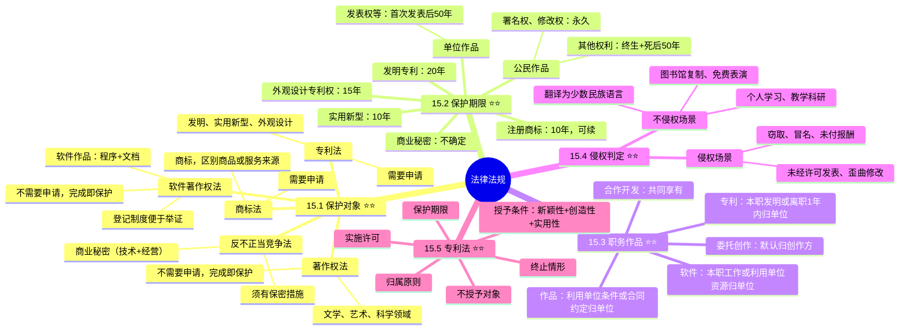

# 法律法规

> [!warning] 重点 ★★★★★（红宝书ch14）
> 选择题重点考察，以往难度不大基本属于送分，近两年开始考专利法相关内容后变得比较难了。每年 ==2-4 分==。重点关注：==保护对象区分==、==保护期限==、==职务作品归属==、==侵权判定==、==专利法==。
>
> **速查跳转**：[[#15.1 保护对象|保护对象]] · [[#15.2 保护期限|保护期限]] · [[#15.3 职务作品|职务作品归属]] · [[#15.4 侵权判定|侵权判定]] · [[#15.5 专利法|专利法]]

**知识产权**也称为"智力成果权""智慧财产权"，是人类通过创造性的智力劳动而获得的一项权利。知识产权是指民事权利主体（自然人、法人）基于创造性的智力成果。

知识产权具有**无形性、专有性、地域性和时间性**四大特点。

我国相关法律法规主要包括：《著作权法》、《计算机软件保护条例》、《专利法》、《商标法》和《反不正当竞争法》。

> [!tip] 著作权法不适用的情形
> 法律、法规，国家机关的决议、决定、命令和其他具有立法、行政、司法性质的文件，及其官方正式译文；时事新闻；历法、通用数表、通用表格和公式。

> [!tip] 软件作品的保护范围
> 开发软件所用的思想、处理过程、操作方法或者数学概念**不受保护**，软件作品并不是指代码，而是指带有特定业务逻辑的**程序以及软件文档**。

---

## 知识全景

---

## 15.1 保护对象（重点★★★★★★）

| 法律法规 | 保护对象 | 注意事项 |
|---------|---------|---------|
| ==著作权法== | 文学、艺术和科学领域内具有独创性并能以一定形式表现的智力成果，如文字作品、音乐、美术、影视等 | **不需要申请**，作品完成即开始保护；绘画或摄影作品原件出售（赠予）著作权还归原作者，原件拥有者有所有权、展览权 |
| ==软件著作权法==（计算机软件保护条例） | 软件作品，包括计算机程序及其有关文档 | **不需要申请**，作品完成即开始保护；登记制度便于举证 |
| ==专利法== | 发明创造，包括发明、实用新型和外观设计 | **需要申请**，专利权有效期是从**申请日**开始计算 |
| ==商标法== | 商标，用于区别商品或服务来源 | **需要申请**，核准之日起商标受保护 |
| ==反不正当竞争法== | 经营者的合法权益、市场竞争秩序 | 商业秘密包括**技术与经营**两个方面；必须**有保密措施**才能认定为商业秘密 |

> [!tip] 核心区分：需要申请 vs 不需要申请
> - **不需要申请**（完成即保护）：著作权、软件著作权
> - **需要申请**：专利、商标

---

## 15.2 保护期限（重点★★★★★★）

> [!danger] 必背表格
> 保护期限是选择题高频考点，必须熟记各项数字。

| 客体 | 保护对象 | 保护期限 |
|------|---------|---------|
| **公民作品** | ==署名权、修改权、保护作品完整权== | **没有限制**（永久） |
| **公民作品** | ==发表权、使用权和获得报酬权== | 作者**终生及其死亡后的50年**（第50年的12月31日） |
| **单位作品** | 发表权、使用权和报酬权 | **首次发表后的第50年** |
| **公民软件作品** | 署名权，修改权 | **没有限制**（永久） |
| **公民软件作品** | 其他 | 作者终生及死后50年（第50年12月31日）。合作开发，以最后死亡作者为准 |
| ==注册商标== | 商标专用权 | 有效期 **10年**（若注册人死亡或倒闭1年后，未转移则可注销，期满后**6个月**内必须续注） |
| ==发明专利== | 专利权 | 保护期为 **20年**（从**申请日**开始） |
| ==实用新型== | 专利权 | 保护期为 **10年**（从**申请日**开始） |
| ==外观设计专利权== | 专利权 | 保护期为 **15年**（从**申请日**开始） |
| ==商业秘密== | 秘密信息 | **不确定**，公开后公众可用 |

> [!tip] 速记
> - 署名权、修改权 → **永久**（不管公民还是软件）
> - 公民其他权利 → **终生+死后50年**
> - 单位作品 → **首次发表后50年**
> - 专利：发明 **20** / 实用新型 **10** / 外观设计 **15**（均从**申请日**起算）
> - 商标 **10年**可续

---

## 15.3 职务作品（重点★★★★★★）

> [!danger] 高频考点
> 核心原则：署名权**永远归作者**，其他权利根据情况可归单位。

### 作品著作权归属

| 情况说明 | 场景 | 产权归属 |
|---------|------|---------|
| **作品** | 利用单位的技术条件进行创作 | ==单位（署名权除外）== |
| **作品** | 合同约定著作权属于单位 | ==单位（署名权除外）== |
| **作品** | 其他 | 作者拥有著作权，单位有权在业务范围使用 |

### 软件著作权归属

| 情况说明 | 场景 | 产权归属 |
|---------|------|---------|
| **软件** | 本职工作明确的开发目标 | ==单位（署名权除外）== |
| **软件** | 属于从事本职工作活动的结果 | ==单位（署名权除外）== |
| **软件** | 使用单位资源并由单位承担责任的软件 | ==单位（署名权除外）== |

### 专利权归属

| 情况说明 | 场景 | 产权归属 |
|---------|------|---------|
| **专利** | 本职工作中作出的发明创作 | ==单位（署名权除外）== |
| **专利** | 履行本单位本职工作之外的发明创造 | ==单位（署名权除外）== |
| **专利** | ==离职、退休或调动工作后**一年内**==，与原单位工作相关 | ==单位（署名权除外）== |

### 委托与合作

| 情况说明 | 场景 | 归属规则 |
|---------|------|---------|
| **作品/软件** | 委托创作 | ==默认归创作方==，可以约定给委托方 |
| **作品/软件** | 合作开发 | ==共同享有== |
| **商标** | 同一天申请 | 谁先申请谁拥有（除知名商标的非法抢注）；同一天申请则根据谁先使用（需提供证据），无法提供证据协商归属，无效时使用抽签（但不可不确定） |
| **专利** | 同一天申请 | 谁先申请谁拥有，同一天申请则**协商归属**，但不能够同时驳回双方的专利申请 |

> [!example]- 真题示例（21年系分）
> 某软件公司参与开发管理系统软件的程序员丁某，辞职到另一公司任职，该公司项目负责人将管理系统软件的开发者署名替换为王某，该项目负责人的行为（__）。
>
> **答案：C 侵犯了开发者丁某的署名权**
>
> 关键：==署名权是开发者的永久权利==（人身权），不管开发者有没有在该公司任职，都不能将署名权替换成其他人。

---

## 15.4 侵权判定（重点★★★★★★）

| 不侵权场景 | 侵权场景 |
|---------|---------|
| 个人用于自身学习、探究或者品鉴 | 在未获得许可的情况下，对他人作品进行发表 |
| 进行适度的援引 | 在未得到合作作者应允的情形下，把与他人合作创作的作品当作是自身单独创作的作品予以发表 |
| 有关公开演讲的内容 | 没有参与创作，却在他人作品中署名 |
| 应用于教学或者科学探究方面 | 对他人作品进行歪曲、修改 |
| 对馆藏作品进行复制 | 窃取他人作品 |
| 无偿表演他人的作品 | 运用他人作品时，没有支付相应报酬 |
| 在室外公共场合对艺术品进行临摹、绘画、拍摄、录像 | 在未取得出版者同意的状况下，使用其出版的图书、期刊的版式设计 |
| 把汉语作品翻译为少数民族语言作品或者以盲文形式出版 | |

---

## 15.5 专利法（补充重点★★★★★★）

> [!danger] 近两年新增重点
> 这两年开始考专利法相关内容，难度上升。

专利法的客体是**发明创造**，包括：
- **发明**：对产品、方法或者其改进所提出的新的技术方案
- **实用新型**：对产品的形状、构造及其组合，提出的适于实用的新的技术方案
- **外观设计**：对产品的形状、图案及其组合，以及色彩与形状、图案的结合所作出的富有美感并适于工业应用的新设计

### 授予专利权的条件

| 考点分类 | 考点详情 | 具体内容 |
|---------|---------|---------|
| **授予条件（发明和实用新型）** | 三性 | ==新颖性==（申请前国内外无同样发明或实用新型，特定情况不丧失新颖性）、==创造性==（相比原有技术有突出特点和显著进步）、==实用性==（能制造或使用且有积极效果） |
| **授予条件（外观设计）** | | 与国内外发表的外观设计**不相同、不相近似** |

### 不授予专利权的对象

==科学发现、智力活动的规则和方法、疾病的诊断和治疗方法、动植物品种及用原子核变换方法获得的物质==。

### 专利权人确定

| 情况 | 归属规则 |
|------|---------|
| **基本归属原则** | 专利权归属于对发明创造作出创造性贡献的发明人或设计人，组织、辅助人员不属于此列 |
| **职务发明** | 执行单位任务或利用单位物质技术条件完成的发明创造，包括本职工作中、本职工作外任务、==退职退休调动**1年内**==相关任务作出的发明；专利申请批准后单位为专利权人，也可签合同重新规定归属 |
| **合作发明、设计** | 专利权通常**共同所有**，可依合同确定归属 |
| **委托发明** | 未签订合同规定归属时，专利权归**发明、设计者** |
| **特殊情况** | 非职务发明单位无权压制个人申请；多个类似专利申请，专利归**最先提交的申请人** |

### 不视为侵权的情形

==专利权人相关产品售出后使用等==；==申请日前已制造相同产品等在原有范围继续==；==国外运输工具临时使用==；==专为科研和实验使用==。

### 专利权终止与实施许可

| 考点 | 内容 |
|------|------|
| **终止情形** | 未按时缴纳年费；书面声明放弃；专利复审未通过 |
| **实施许可** | 具备条件单位可请求许可实施；国家紧急状态等可**强制实施**发明、实用新型专利许可 |

---

## 速查对比表

### 保护期限速查

| 类型 | 期限 | 起算点 |
|------|------|-------|
| 署名权/修改权 | **永久** | - |
| 公民著作权（其他） | **终生+死后50年** | 第50年12月31日 |
| 单位作品 | **首次发表后50年** | - |
| 发明专利 | **20年** | 申请日 |
| 外观设计 | **15年** | 申请日 |
| 实用新型 | **10年** | 申请日 |
| 注册商标 | **10年**（可续） | 核准日 |
| 商业秘密 | 不确定 | - |

### 归属速查

| 情况 | 著作权 | 软件 | 专利 |
|------|-------|------|------|
| 职务/本职 | 单位（署名权除外） | 单位（署名权除外） | 单位 |
| 委托 | 默认归创作方 | 默认归创作方 | 默认归发明人 |
| 合作 | 共同享有 | 共同享有 | 共同所有 |
| 离职后1年内 | - | - | 单位 |

---

## 关联链接

- [[05-软件工程概述]] - 软件工程（软件著作权保护的是带有特定业务逻辑的程序和文档）
- [[09-系统质量属性与架构评估]] - 质量属性（安全性涉及知识产权保护）
