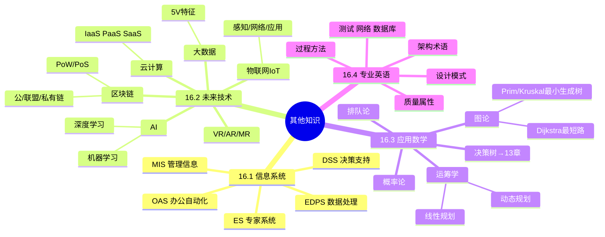

# 其他知识

> [!warning] 非重点 P3（红宝书未单独收录）
> 选择题中可能出现 1-2 题"防漏分"考点：==信息系统类型识别==、==云 3 服务模式==、==大数据 5V==、==物联网三层==、==图论算法用途==、==专业英语阅读==。考前 3 天集中突击即可，不深入。
>
> **速查跳转**：[[#16.1 信息系统（了解）|信息系统]] · [[#16.2 未来信息综合技术（了解）|未来技术]] · [[#16.3 应用数学（了解）|数学]] · [[#16.4 专业英语（了解）|英语]]

---

## 知识全景

---

## 16.1 信息系统（了解）

### 16.1.1 5 类信息系统对比

> [!important] 必识别表 — 选择题中常考"系统类型 ↔ 决策类型"的匹配

| 系统 | 全称 | 用户层级 | 核心功能 | 决策类型 |
| ---- | ---- | ---- | ---- | ---- |
| **EDPS** | Electronic Data Processing System（电子数据处理系统） | 操作层 | ==替代手工事务处理== | 结构化（程序化） |
| **MIS** | Management Information System（管理信息系统） | 中层管理 | ==内部数据汇总报表== | 结构化（程序化） |
| **DSS** | Decision Support System（决策支持系统） | 中高层 | ==半结构化决策辅助== | 半结构化 |
| **OAS** | Office Automation System（办公自动化系统） | 各层 | 办公文档 / 工作流 | — |
| **ES** | Expert System（专家系统） | 专业领域 | ==模拟专家推理== | 非结构化 |

^info-system-types

> [!tip] 速记口诀
> - **EDPS** — 替手工（操作层、最早）
> - **MIS** — 出报表（中层、汇总）
> - **DSS** — 辅决策（中高层、半结构化）
> - **OAS** — 办公自动化
> - **ES** — 模专家（推理、非结构化）

> [!note]+ 决策类型与系统类型对应
> - 结构化决策（规则明确、程序化）→ EDPS / MIS
> - 半结构化决策（部分规则）→ DSS
> - 非结构化决策（依赖经验/创造）→ ES

---

## 16.2 未来信息综合技术（了解）

### 16.2.1 人工智能 AI

- **分类**：弱 AI（特定任务）/ 强 AI（通用智能，尚未实现）
- **机器学习 ML 三大学习类型**：
    - **监督学习**：有标签数据（分类、回归）
    - **无监督学习**：无标签（聚类、降维）
    - **强化学习**：通过试错与奖励（AlphaGo、自动驾驶）
- **深度学习 DL**：基于多层神经网络（CNN / RNN / Transformer）
- **典型应用**：自然语言处理 NLP、计算机视觉 CV、推荐系统、智能语音

### 16.2.2 区块链

- **核心特征**：==去中心化、不可篡改、分布式账本、可追溯==
- **三种类型**：
    - **公有链**：完全开放（比特币、以太坊）
    - **联盟链**：多机构共同维护（Hyperledger Fabric）
    - **私有链**：单一组织内部
- **典型共识算法**：
    - **PoW**（Proof of Work，工作量证明）— 比特币
    - **PoS**（Proof of Stake，权益证明）— 以太坊 2.0
    - **DPoS**（委托权益证明）
    - **PBFT**（实用拜占庭容错）— 联盟链常用

### 16.2.3 物联网 IoT

> [!important] IoT 三层架构

| 层级 | 职责 | 典型技术 |
| ---- | ---- | ---- |
| **感知层** | 数据采集 | RFID、传感器、二维码 |
| **网络层** | 数据传输 | 5G、Wi-Fi、ZigBee、LoRa、MQTT |
| **应用层** | 数据处理与服务 | 智能家居、工业 4.0、智慧城市 |

^iot-three-layers

### 16.2.4 云计算

> [!important] 3 服务模式（必考）

| 模式 | 全称 | 提供 | 用户管理 | 例子 |
| ---- | ---- | ---- | ---- | ---- |
| **IaaS** | Infrastructure as a Service（基础设施） | ==虚拟机/存储/网络== | 操作系统及以上 | AWS EC2、阿里云 ECS |
| **PaaS** | Platform as a Service（平台） | ==开发运行平台== | 应用 + 数据 | Heroku、阿里云 ACK |
| **SaaS** | Software as a Service（软件） | ==完整应用== | 仅业务配置 | Office 365、企业微信 |

^cloud-service-models

> [!tip] 速记：IaaS 给硬件、PaaS 给环境、SaaS 给软件

**4 种部署模式**：
- **公有云**（Public）：面向所有用户开放
- **私有云**（Private）：单一组织专用
- **混合云**（Hybrid）：公有 + 私有结合
- **社区云**（Community）：特定群体共享

### 16.2.5 大数据

> [!important] 5V 特征（必背）

| 特征 | 英文 | 含义 |
| ---- | ---- | ---- |
| **大量** | Volume | 数据规模 PB/EB 级 |
| **高速** | Velocity | 数据产生与处理速度 |
| **多样** | Variety | 结构化 / 半结构化 / 非结构化 |
| **真实性** | Veracity | 数据质量与可信度 |
| **价值** | Value | 蕴含的价值密度低 |

^big-data-5v

> [!tip] 5V 速记：**量速样真值**

**两种处理架构**（详见 [[02-案例分析]]）：
- **Lambda 架构**：批处理 + 流处理双层
- **Kappa 架构**：仅流处理一层

### 16.2.6 VR / AR / MR

> [!warning] 三者区分（必考易混）
> - **VR**（Virtual Reality，虚拟现实）：==完全虚拟环境==（VR 头盔，沉浸式）
> - **AR**（Augmented Reality，增强现实）：==现实 + 虚拟叠加==（手机 AR 滤镜）
> - **MR**（Mixed Reality，混合现实）：==现实与虚拟交互==（HoloLens）

---

## 16.3 应用数学（了解）

### 16.3.1 图论

**基本概念**：
- **有向图 / 无向图**：边是否有方向
- **加权图**：边带权重（距离、成本等）
- **连通图 / 强连通**：节点间可达性

> [!important] 图论核心算法对比 — 必识别用途

| 算法 | 解决问题 | 思想 | 复杂度 |
| ---- | ---- | ---- | ---- |
| **Dijkstra** | ==单源最短路径==（无负权） | 贪心 + 优先队列 | O(N²) 或 O(M log N) |
| **Floyd** | 多源最短路径 | 动态规划 | O(N³) |
| **Prim** | ==最小生成树==（加点法） | 贪心 | O(N²) |
| **Kruskal** | ==最小生成树==（加边法） | 贪心 + 并查集 | O(M log M) |
| **拓扑排序** | 有向无环图节点排序 | 入度为 0 节点出队 | O(N+M) |

^graph-algorithms

> [!tip] 速记：Dijkstra 找最短、Prim/Kruskal 找最小生成树

### 16.3.2 运筹学

**线性规划**：
- 目标函数（最大化或最小化）
- 约束条件（≤、≥、=）
- 标准型转化、单纯形法（仅做识别）

**动态规划**：

> [!tip] 动态规划判定（满足两点即可用 DP）
> 1. **最优子结构**：问题的最优解包含子问题的最优解
> 2. **重叠子问题**：递归过程中相同子问题被多次计算

**经典 DP 问题**：
- 0/1 背包问题
- 最长公共子序列 LCS
- 最长递增子序列 LIS
- 编辑距离

### 16.3.3 决策树（参见 [[13-项目管理]]）

> [!note]+ 决策树 EMV 计算
> 详见 [[13-项目管理#13.5.4 EMV 期望货币值]]
>
> 核心公式：**EMV = 概率 × 后果价值**

### 16.3.4 概率论与排队论（速览）

- **条件概率**：P(A|B) = P(AB) / P(B)
- **贝叶斯公式**：P(A|B) = P(B|A) × P(A) / P(B)
- **排队论 M/M/1 模型**：到达过程泊松分布、服务时间指数分布、单服务台

---

## 16.4 专业英语（了解）

> [!note]+ 应试策略
> - 阅读理解 5-7 题（约 5-7 分），不要逐字翻译
> - 抓 ==主题词与专业术语==，结合上下文做选择
> - 考前花 30-60 分钟过一遍术语表即可

### 16.4.1 高频术语对照表

> [!important] 按主题分组的术语词汇表

**架构与组件**：

| English | 中文 | 备注 |
| ---- | ---- | ---- |
| Architecture | 架构 | — |
| Architectural Pattern | 架构模式 | 风格级别 |
| Architectural Style | 架构风格 | — |
| Component | 构件 | — |
| Connector | 连接件 | — |
| Constraint | 约束 | — |
| Decomposition | 分解 | — |
| Cohesion | 内聚（高内聚） | High Cohesion |
| Coupling | 耦合（低耦合） | Low Coupling |
| Modularity | 模块化 | — |
| Abstraction | 抽象 | — |
| Encapsulation | 封装 | — |
| Inheritance | 继承 | — |
| Polymorphism | 多态 | — |

**质量属性**：

| English | 中文 |
| ---- | ---- |
| Reliability | 可靠性 |
| Availability | 可用性 |
| Maintainability | 可维护性 |
| Scalability | 可伸缩性 / 可扩展性 |
| Security | 安全性 |
| Performance | 性能 |
| Usability | 易用性 |
| Interoperability | 互操作性 |
| Portability | 可移植性 |
| Testability | 可测试性 |

**设计模式**：

| English | 中文 |
| ---- | ---- |
| Singleton | 单例 |
| Factory | 工厂 |
| Abstract Factory | 抽象工厂 |
| Builder | 建造者 |
| Prototype | 原型 |
| Adapter | 适配器 |
| Bridge | 桥接 |
| Decorator | 装饰器 |
| Facade | 外观 |
| Proxy | 代理 |
| Observer | 观察者 |
| Strategy | 策略 |
| Iterator | 迭代器 |
| State | 状态 |
| Template Method | 模板方法 |

**过程与方法**：

| English | 中文 |
| ---- | ---- |
| Iteration | 迭代 |
| Increment | 增量 |
| Sprint | 冲刺（Scrum） |
| Backlog | 待办列表（Scrum） |
| Retrospective | 回顾会议 |
| Refactoring | 重构 |
| Continuous Integration | 持续集成 |
| Deployment | 部署 |
| Release | 发布 |

**测试**：

| English | 中文 |
| ---- | ---- |
| Unit Test | 单元测试 |
| Integration Test | 集成测试 |
| System Test | 系统测试 |
| Acceptance Test | 验收测试 |
| Regression Test | 回归测试 |
| Coverage | 覆盖率 |
| Test Case | 测试用例 |
| Defect / Bug | 缺陷 |

**网络与安全**：

| English | 中文 |
| ---- | ---- |
| Encryption | 加密 |
| Authentication | 认证 |
| Authorization | 授权 |
| Firewall | 防火墙 |
| VPN | 虚拟专用网 |
| Vulnerability | 漏洞 |
| Threat | 威胁 |
| Confidentiality | 机密性 |
| Integrity | 完整性 |

**数据库**：

| English | 中文 |
| ---- | ---- |
| Normalization | 规范化 |
| Index | 索引 |
| Transaction | 事务 |
| ACID | 原子/一致/隔离/持久 |
| CAP | 一致性/可用性/分区容错 |
| Schema | 模式 |
| Query | 查询 |

^english-glossary

---

## 关联链接

- 返回主索引：[[../MOC]]
- 综合知识全景：[[00-综合知识全景图]]
- 关联章节：
    - [[13-项目管理]]：EMV 决策树、风险矩阵
    - [[04-数据库系统]]：CAP 与大数据架构
    - [[14-信息安全]]：区块链密码学基础（哈希、非对称加密）
    - [[03-计算机网络]]：物联网网络层、5G 三大场景
