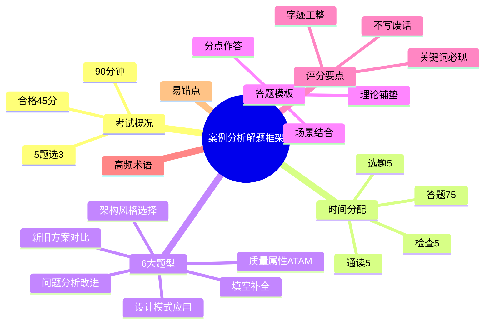

# 案例分析解题框架

> [!warning] 案例分析必读总纲
> 90 分钟、5 题选 3、合格线 45 分。==分点作答 + 专业术语 + 结合场景== 三大得分要素。所有专题文件答题前都应回查本文档。
>
> **速查跳转**：[[#0.2 时间分配策略|时间分配]] · [[#0.3 题型分类与答题套路|题型分类]] · [[#0.4 通用答题模板|答题模板]] · [[#0.5 评分要点与得分技巧|评分要点]] · [[#0.6 高频术语速查（按主题分组）|术语速查]]

---

## 知识全景

---

## 0.1 案例分析考试概况

- **考试时长**：==90 分钟==
- **题型**：5 道大题，==每题 25 分==（总 75 分）
- **答题要求**：通常 ==5 选 3==（根据当年题型组合略有变化，可能含必答+选答）
- **合格线**：==45 分==（每题平均 ≥ 9 分即可过线）
- **题目范围**：覆盖 9 大架构专题（信息系统/层次式/云原生/SOA/嵌入式/通信/安全/大数据/系统计划）

> [!important] 三科同时合格规则
> 综合知识、案例分析、论文 ==三科必须同时达到 45 分==，任何一科不过都需要全部重考。

---

## 0.2 时间分配策略

> [!important] 90 分钟时间分配（必背）

| 阶段 | 用时 | 任务 |
| ---- | ---- | ---- |
| **通读** | 5 分钟 | 全部 5 道题快速浏览，标注熟悉 / 不熟悉 |
| **选题** | 5 分钟 | 选 3 道最有把握的，按难度从易到难排序 |
| **答题** | ==75 分钟== | 每题 ==25 分钟==（理论 5 分钟 + 答题 18 分钟 + 检查 2 分钟） |
| **检查** | 5 分钟 | 核对题号、补漏、调整字迹 |

^time-allocation

> [!warning] 时间陷阱
> - 不要在某一题上 ==超过 30 分钟==，及时止损切换
> - 必答题先答（如果有的话），不能漏
> - 留出 ==至少 5 分钟检查==，避免漏题号

---

## 0.3 题型分类与答题套路

> [!important] 6 大常考题型

### 0.3.1 架构风格选择题

- **识别关键字**：「采用何种架构风格」「为什么选择 X 架构」「对比 X 与 Y」
- **答题套路**：
    1. 列出可选架构风格 3-4 个
    2. 对比优缺点（用表格 / 分点）
    3. 结合题目场景选定 + 说明理由
- **常见考点**：管道-过滤器、C/S vs B/S、分层、事件驱动、SOA、微服务

### 0.3.2 质量属性分析题（ATAM）

- **识别关键字**：「敏感点」「权衡点」「风险点」「ATAM」「质量属性场景」
- **答题套路**：
    1. **敏感点**：影响某个质量属性的设计决策
    2. **权衡点**：影响 ==多个质量属性== 的决策（往往是 trade-off，如性能 vs 安全）
    3. **风险点**：可能引发问题的决策
    4. 结合质量属性场景 6 要素：刺激源 / 刺激 / 制品 / 环境 / 响应 / 响应度量

### 0.3.3 设计模式应用题

- **识别关键字**：「该场景适合什么设计模式」「画 UML 类图」「列出参与者」
- **答题套路**：
    1. 识别场景中的 ==变化点 / 共性需求==
    2. 给出设计模式名 + 类型（创建型 / 结构型 / 行为型）
    3. 列出参与者（角色名 + 职责）
    4. 可加 UML 类图（手绘示意，标清类名与关系）

### 0.3.4 新旧方案对比题

- **识别关键字**：「比较 A 与 B 的优缺点」「将 A 改造为 B 的影响」
- **答题套路**：
    1. 用 ==对比表== 列出 A 与 B 的差异（5-6 个维度）
    2. 维度：架构层级、扩展性、可维护性、性能、成本、适用场景
    3. 总结改造的优势 + 风险

### 0.3.5 填空补全题

- **识别关键字**：架构图 / 表格 / 流程图中有 ==(1)(2)(3)== 空白
- **答题套路**：
    1. 通读全图 / 全表，理解整体逻辑
    2. 根据上下文推测空白位置的术语
    3. 用 ==专业名词== 填空（不要写大白话）

### 0.3.6 问题分析改进题

- **识别关键字**：「该方案存在哪些问题」「如何改进」「给出建议」
- **答题套路**：
    1. **问题识别**：分点列出 3-5 个问题（可结合质量属性维度）
    2. **改进措施**：每个问题对应给出 1-2 个具体改进
    3. 结合架构原则（高内聚低耦合 / 单一职责 / 开闭原则）说明

---

## 0.4 通用答题模板

> [!important] 答题三段论结构（万能模板）
>
> 1. **第一段：理论铺垫**（1-2 句）— 用专业术语定义概念
> 2. **第二段：分点作答**（核心）— 用 (1)(2)(3) 编号
> 3. **第三段：结合题目场景**（1-2 句）— 把理论落到题目里

^answer-template

### 0.4.1 架构风格选择 答题模板

> [!tip] 模板示例
>
> **理论**：架构风格反映了软件系统的组织结构与组件交互方式。常见的架构风格有 ==分层、管道-过滤器、C/S、B/S、事件驱动、SOA== 等。
>
> **分点对比**：
> - （1）X 风格：优点 / 缺点 / 适用场景
> - （2）Y 风格：优点 / 缺点 / 适用场景
> - （3）综合考虑题目中的 ==高并发 / 扩展性 / 实时性 / 安全性== 等需求
>
> **结论**：本系统应采用 ==<风格名>==。原因是 <结合题目关键词>。

### 0.4.2 质量属性 ATAM 答题模板

> [!tip] 模板示例
>
> **理论**：ATAM 通过分析架构对质量属性的影响，识别 ==敏感点 / 权衡点 / 风险点==。
>
> **分点分析**：
> - **敏感点**：<某设计决策> 显著影响 <某属性>，例如 <举例>
> - **权衡点**：<某决策> 同时影响 <属性 A> 和 <属性 B>，往往需要 trade-off
> - **风险点**：<某决策> 可能导致 <某问题>，需要补救方案

### 0.4.3 设计模式应用 答题模板

> [!tip] 模板示例
>
> **理论**：本场景的核心问题是 <识别变化点>，对应 ==<设计模式名>==（<创建型/结构型/行为型>）。
>
> **参与者**：
> - <角色 1>：<职责>
> - <角色 2>：<职责>
>
> **协作**：<两者如何协同工作>
>
> **应用到题目**：<把场景中的实体映射到模式角色>

### 0.4.4 新旧方案对比 答题模板

> [!tip] 模板示例
>
> | 维度 | 旧方案 (A) | 新方案 (B) |
> | ---- | ---- | ---- |
> | 架构层级 | … | … |
> | 扩展性 | … | … |
> | 可维护性 | … | … |
> | 性能 | … | … |
> | 成本 | … | … |
> | 适用场景 | … | … |
>
> **结论**：在 <场景关键字> 下，新方案的 <优势> 更突出，建议改造。

---

## 0.5 评分要点与得分技巧

> [!important] 5 大得分要素（按重要性排序）

| # | 要素 | 说明 | 失分点 |
| ---- | ---- | ---- | ---- |
| 1 | **分点作答** | 用 (1)(2)(3) 编号，阅卷按点给分 | 没编号或编号混乱 |
| 2 | **专业术语** | 用规范术语而非大白话 | "高并发"写成"很多人用" |
| 3 | **结合场景** | 理论 + 题目关键词 | 空谈理论、不落地 |
| 4 | **写满但不废话** | 每点 2-3 句说清楚 | 大段废话或过于简略 |
| 5 | **字迹工整** | 手写卷面整洁 | 字迹潦草直接扣印象分 |

> [!warning] 失分高发区
> - **题号错位**：5 选 3 不要做超过 3 道，多做不加分还浪费时间
> - **必答题漏做**：仔细看题目要求，"必答 1 + 选答 2" vs "5 选 3"
> - **ATAM 三点混淆**：敏感点、权衡点、风险点的区分必须清晰
> - **C/S vs B/S 答题**：用"客户端/服务器"、"浏览器/服务器"等专业表述

> [!tip] 答题节奏建议
> - 每题花 2 分钟在草稿纸上列要点
> - 直接用要点写答案，不要先写完整草稿
> - 答题时 ==字数控制== 在 200-300 字 / 题（每个分点 50-80 字）

---

## 0.6 高频术语速查（按主题分组）

> [!note]+ 答题用语规范
> 用专业术语而非大白话，是案例分析得分的核心。考前过一遍本表，确保答题时能"调用"。

### 0.6.1 架构风格

==分层架构 / 管道-过滤器 / 客户/服务器 C/S / 浏览器/服务器 B/S / 事件驱动 / 黑板模式 / 仓库模式 / SOA / 微服务 / 事件溯源==

### 0.6.2 质量属性（必背 6 个）

| 属性 | 关键场景 |
| ---- | ---- |
| **可用性** | MTBF、MTTR、故障检测、冗余 |
| **可修改性** | 模块化、低耦合、扩展点 |
| **性能** | 响应时间、吞吐量、负载、缓存 |
| **安全性** | 认证、授权、加密、审计 |
| **可测试性** | 测试桩、mock、覆盖率 |
| **易用性** | 用户体验、错误恢复、引导 |

### 0.6.3 设计模式（GoF 23 种 — 高频）

- **创建型**：单例、工厂方法、抽象工厂、建造者、原型
- **结构型**：适配器、装饰器、代理、外观、桥接、组合
- **行为型**：观察者、策略、责任链、命令、状态、模板方法、迭代器

### 0.6.4 SOA / 微服务

==WSDL / SOAP / UDDI / BPEL / ESB / REST / RPC / 服务注册发现 / 服务网格 Service Mesh / API Gateway==

### 0.6.5 云原生

==容器 / Docker / Kubernetes K8s / Serverless / FaaS / 服务网格 / Istio / 12-Factor / DevOps / CI/CD==

### 0.6.6 大数据

==Lambda 架构 / Kappa 架构 / Hadoop / HDFS / MapReduce / Spark / Flink / Kafka / 数据湖 / 数据仓库 / OLAP / OLTP==

### 0.6.7 安全

==认证 / 授权 / 加密 / 完整性 / 不可否认 / 防火墙 / IDS / IPS / WPDRRC / OSI 安全体系 / BLP / Biba==

### 0.6.8 嵌入式

==嵌入式 OS / RTOS / DARTS / ABSD / ADD / 中间件 / 实时性 / 资源受限==

---

## 0.7 易错点与注意事项

> [!warning] 必避免的 6 大错误

1. **题号错位**：5 选 3 题，超答的部分不会加分，反而浪费时间
2. **必答题漏做**：开考第一时间确认题目结构（必答 + 选答 / 全选答）
3. **大白话答题**：用"很多人用"代替"高并发"会被扣分
4. **不分点**：阅卷按点给分，不分点的答案被认为是"流水账"
5. **理论 ≠ 应用**：只写理论不结合场景，得不到结合分
6. **字迹潦草**：手写卷面是直接的视觉印象，会拉低整体分数

> [!tip] 心态建议
> - 案例分析 ==45 分及格==，不需要追求满分
> - 每题尽力答好 60% 即可（15/25）
> - 3 道题 × 15 分 = 45 分，刚好及格

> [!important] 考前最后 1 周准备清单
> - [ ] 重点背 ==9 大专题的标志性术语==
> - [ ] 通读 ==[[#0.4 通用答题模板]]==
> - [ ] 模拟做 1-2 套真题，控制时间
> - [ ] 高频专题：信息系统、层次式、云原生、SOA、安全、大数据

---

## 关联链接

- 返回主索引：[[../MOC]]
- 综合知识全景：[[../01-综合知识/00-综合知识全景图]]
- **9 大专题文件**：
    - [[01-系统计划]] #中频
    - [[02-信息系统架构设计]] #高频
    - [[03-层次式架构设计]] #高频
    - [[04-云原生架构设计]] #高频
    - [[05-面向服务架构设计]] #高频
    - [[06-嵌入式系统架构设计]] #中频
    - [[07-通信系统架构设计]] #中频
    - [[08-安全架构设计]] #高频
    - [[09-大数据架构设计]] #高频
- 论文方向：[[../03-论文/00-论文写作框架]]（待建）
