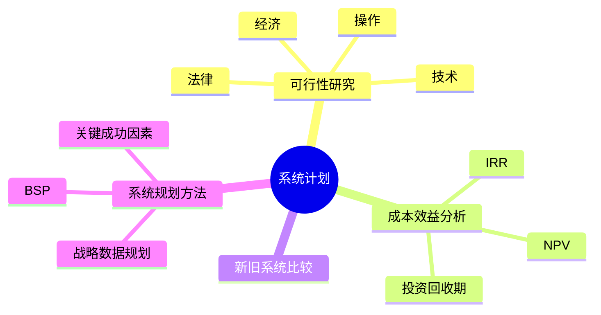

# 系统计划

> [!warning] 中频考点（约 1-2 年考一次）
> 核心考点：==可行性研究 4 类==（经济/技术/操作/法律）、==成本效益分析==（NPV / IRR / 投资回收期）、==新旧系统比较==、==系统规划方法==。
>
> **状态**：⚠️ 骨架阶段，待细化

---

## 知识全景

---

## 1.1 核心概念（待细化）

> [!note]+ 待补充内容
> - 可行性研究 4 大维度：经济 / 技术 / 操作 / 法律
> - 系统规划生命周期：可行性 → 系统分析 → 系统设计 → 系统实施 → 运行维护
> - 引用 [[../01-综合知识/06-需求工程]] 需求获取阶段

---

## 1.2 关键技术与架构（待细化）

> [!note]+ 待补充内容
> - 成本效益分析公式：
>     - **NPV**（净现值）= Σ 现金流 / (1+r)^t
>     - **IRR**（内部收益率）：使 NPV = 0 的折现率
>     - **投资回收期**：累计现金流首次为正的时间点
> - 新旧系统比较方法：替代方案权衡矩阵

---

## 1.3 典型考点与解题套路（待细化）

> [!note]+ 待补充内容
> - 题型：可行性分析题 / 系统选型题
> - 答题模板（参见 [[00-案例分析解题框架#0.4 通用答题模板]]）
> - 关键字判定：「是否值得投资」→ 经济可行性；「现有技术能否实现」→ 技术可行性

---

## 1.4 真题与练习（待细化）

> [!note]+ 待补充内容
> - 历年真题列表
> - 完整答题示例 1-2 题

---

## 关联链接

- 返回案例分析索引：[[00-案例分析解题框架]]
- 返回主索引：[[../MOC]]
- 关联综合知识章节：
    - [[../01-综合知识/06-需求工程]]：需求获取与分析
    - [[../01-综合知识/13-项目管理]]：EMV 决策、风险管理
