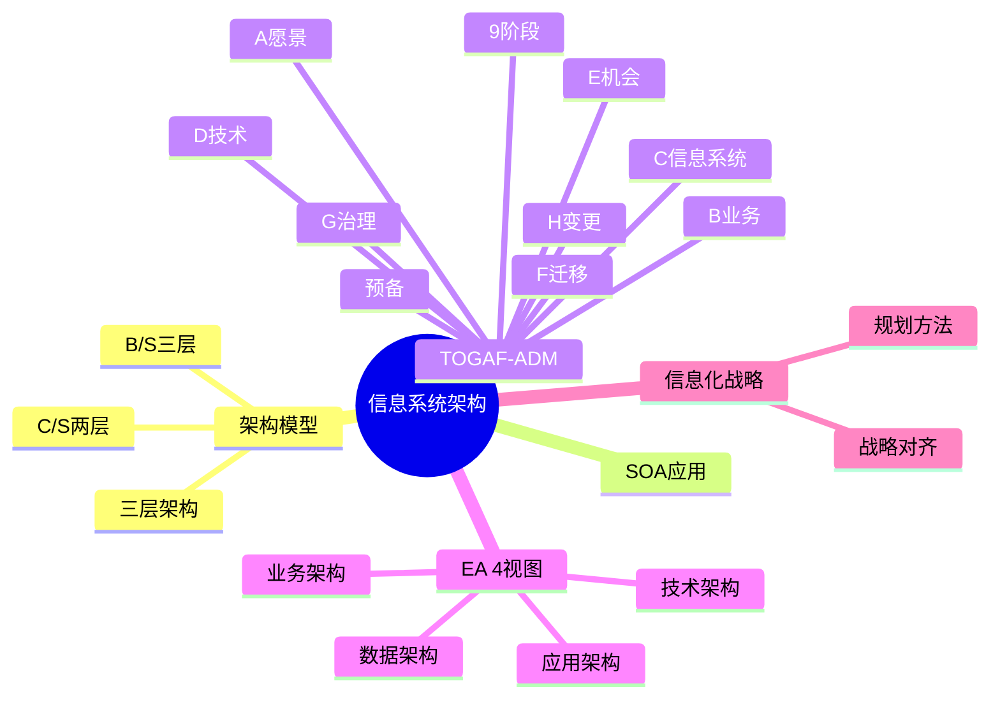

# 信息系统架构设计

> [!warning] 高频考点（几乎每年必考）
> 核心考点：==C/S vs B/S 对比==、==三层架构 vs SOA==、==TOGAF-ADM 9 阶段==、==信息化战略规划==、==企业架构 EA 4 视图==（业务/数据/应用/技术）。
>
> **状态**：✅ 已细化
>
> **速查跳转**：[[#2.2.1 C/S vs B/S vs 三层架构（核心对比）|C/S/B/S/三层]] · [[#2.2.2 TOGAF-ADM 9 阶段（必背）|TOGAF-ADM]] · [[#2.4 真题与练习|真题示例]]

---

## 知识全景

---

## 2.1 核心概念

### 2.1.1 信息系统层级（3 层级）

> [!important] 信息系统按用户层级与决策类型划分

| 层级 | 决策类型 | 用户角色 | 系统例子 |
| ---- | ---- | ---- | ---- |
| **战略层**（高层） | 非结构化决策 | 高管、董事会 | DSS 决策支持系统 / EIS 高管信息系统 |
| **战术层**（中层） | 半结构化决策 | 部门经理 | MIS 管理信息系统 / DSS |
| **操作层**（基层） | 结构化决策 | 一线员工 | TPS 事务处理 / EDPS / OAS 办公自动化 |

> [!tip] 速记：层级越高，决策越非结构化（依赖经验和判断）

### 2.1.2 企业架构 EA 4 视图（必背）

> [!important] EA = Enterprise Architecture（企业架构）4 视图

| 视图 | 关注点 | 主要产出 |
| ---- | ---- | ---- |
| **业务架构** | 业务功能、流程、组织 | 业务流程图、组织结构图 |
| **数据架构** | 数据实体、数据模型、流向 | 数据模型、数据字典、ER 图 |
| **应用架构** | 应用系统、模块、接口 | 应用蓝图、应用集成方案 |
| **技术架构** | 硬件、网络、平台、中间件 | 技术标准、基础设施图 |

^ea-4views

> [!tip] EA 4 视图记忆：**业数应技**（业务 → 数据 → 应用 → 技术，自上而下）

### 2.1.3 信息化战略与对齐

- **战略对齐链**：业务战略 → 信息化战略 → IT 架构 → 实施
- **核心原则**：信息化必须 ==服务业务目标==，不能"为信息化而信息化"
- **常用规划方法**：
    - **BSP**（Business Systems Planning，企业系统规划法）
    - **CSF**（Critical Success Factors，关键成功因素法）
    - **SST**（Strategy Set Transformation，战略集合转化法）

---

## 2.2 关键技术与架构

### 2.2.1 C/S vs B/S vs 三层架构（核心对比）

> [!important] 9 维度对比表 — 必考

| 维度 | C/S（两层） | B/S（三层） | 三层架构（通用） |
| ---- | ---- | ---- | ---- |
| 客户端 | 专用客户端程序 | 浏览器 | 表现层（Web/客户端） |
| 中间层 | 无 | 应用服务器 | 业务逻辑层 |
| 数据层 | 数据库 | 数据库 | 数据访问层 → 数据库 |
| 部署 | 客户端需安装、升级麻烦 | ==零部署、热升级== | 服务器集中部署 |
| 跨平台 | 差（依赖客户端 OS） | ==好==（浏览器即可） | 取决于实现 |
| 性能 | 强（厚客户端） | 一般（受网络制约） | 取决于设计 |
| 维护成本 | 高 | ==低== | 中 |
| 安全性 | 数据可在客户端处理，需保护 | 数据集中、易控制 | 集中管控 |
| 适用场景 | 局域网、富交互（IDE、设计软件） | 互联网、跨平台、零部署（Web 应用） | 业务复杂、多端接入 |

^csbs-3tier

> [!warning] 易混点
> - **B/S 本质上是三层架构的一种特例**（浏览器作为表现层、Web 服务器作为业务层、DB 作为数据层）
> - 题目说"三层架构"时通常指通用的"表现/业务/数据"三层，可以是 Web 也可以是富客户端

### 2.2.2 TOGAF-ADM 9 阶段（必背）

ADM = **A**rchitecture **D**evelopment **M**ethod（架构开发方法）

> [!important] TOGAF-ADM 9 阶段（预备 + A-H 共 9 个）

| 阶段 | 名称 | 核心活动 |
| ---- | ---- | ---- |
| **预备阶段** | Preliminary | 定义企业、组织架构能力、确认架构原则 |
| **A** | 架构愿景 | 明确范围、利益相关方、商业目标 |
| **B** | 业务架构 | 描述业务流程、信息流、组织结构 |
| **C** | 信息系统架构 | ==数据架构 + 应用架构== |
| **D** | 技术架构 | 硬件、网络、平台、中间件 |
| **E** | 机会与解决方案 | 找出实施路径、识别项目 |
| **F** | 迁移规划 | 项目排序、迁移计划 |
| **G** | 实施治理 | 监督实施、合规检查 |
| **H** | 架构变更管理 | 处理需求变更、保持架构演化 |

^togaf-adm-9phases

> [!tip] 顺序口诀（必背）
> **预愿业信技 / 机迁实变**
> = 预备 + A 愿景 + B 业务 + C 信息系统 + D 技术 + E 机会 + F 迁移 + G 实施治理 + H 变更

> [!warning] 易混点
> - **C 阶段** 在题目中常被分为"数据架构"和"应用架构"两个子部分
> - **B 业务架构 ↔ EA 业务视图**、**D 技术架构 ↔ EA 技术视图** 一一对应

### 2.2.3 SOA 在信息系统中的应用

- 适用场景：跨部门数据共享、整合多个遗留系统、企业级集成
- **ESB**（企业服务总线）作为消息路由与协议转换中枢
- 详见 [[05-面向服务架构设计]]

---

## 2.3 典型考点与解题套路

### 2.3.1 架构选型题答题模板

参考 [[00-案例分析解题框架#0.4.1 架构风格选择 答题模板]]，针对信息系统架构选型的特化模板：

> **第一段（理论）**：信息系统常见架构有 C/S、B/S、三层架构、SOA 等。其中 C/S 适合局域网富客户端、B/S 适合跨平台 Web 应用、三层架构适合复杂业务系统、SOA 适合多遗留系统集成。
>
> **第二段（分点对比）**：
> - （1）X 架构：优点 / 缺点 / 适用场景
> - （2）Y 架构：优点 / 缺点 / 适用场景
> - （3）综合考虑题目中 ==<跨平台 / 富交互 / 集成 / 战略规划>== 等需求
>
> **第三段（结论）**：本系统应采用 ==<X 架构>==，原因是 <结合题目关键字>。

### 2.3.2 关键字判定速查

> [!tip] 题目关键字 → 推荐架构（必备速查）

| 题目关键字 | 推荐架构 |
| ---- | ---- |
| 跨平台 / 零部署 / 互联网 / 浏览器访问 / 移动办公 | **B/S** |
| 富交互 / 性能要求高 / 局域网 / 专业工具（IDE、CAD） | **C/S** |
| 业务复杂 / 多模块 / 多端接入 / 集成多系统 | **三层 / SOA** |
| 多遗留系统整合 / 跨部门 / 企业总线 | **SOA + ESB** |
| 长期演化 / 战略规划 / 数字化转型 | **TOGAF-ADM** |

^selection-keywords

### 2.3.3 信息化规划题套路（4 步法）

针对"请为某企业制定信息化战略 / 架构规划"类题目：

1. **识别企业战略目标**：题目中明示或暗示的业务目标（如"全国扩张"、"降本增效"、"线上线下一体化"）
2. **EA 4 视图自上而下分析**：业务架构 → 数据架构 → 应用架构 → 技术架构（==业数应技==）
3. **套用 TOGAF-ADM 9 阶段**：从预备阶段开始，按 ==预愿业信技/机迁实变== 推进
4. **列迁移路径与里程碑**：项目排序、风险识别、关键里程碑

---

## 2.4 真题与练习

### 2.4.1 真题示例 1：C/S 改 B/S 选型（高频）

**题目**：某公司原有一套 C/S 架构的进销存系统，面临以下挑战：
- 销售人员需在外出差时使用，但客户端仅安装在公司内电脑
- 全国 30 多个分公司，客户端版本不一致，升级麻烦
- 客户提出希望通过手机也能查看库存

请说明应将系统改造为何种架构，列出对比理由。

> [!example]+ 参考答题
>
> **理论**：信息系统架构主要有 C/S 与 B/S 两种主流模式。C/S 部署在专用客户端，B/S 通过浏览器访问。
>
> **分点对比**：
> （1）现有 C/S 架构的问题：
>   - ① 客户端依赖公司内网，==移动办公受限==
>   - ② 升级需逐台部署，跨地域成本高
>   - ③ 不支持手机访问
> （2）改造为 B/S 架构的优势：
>   - ① ==零部署，浏览器直接访问==
>   - ② ==跨平台==（PC / 手机均可）
>   - ③ ==升级集中==，服务器更新即可全员生效
>   - ④ 支持互联网访问，满足出差和分公司场景
> （3）改造的考虑：
>   - ① 需评估原有功能在 Web 端的可实现性
>   - ② 安全性需通过 ==HTTPS + 认证授权== 加强
>   - ③ 性能可能下降，需 ==CDN / 缓存== 等优化
>
> **结论**：建议将系统改造为 **B/S 架构**，主要解决跨平台访问与集中升级问题，同时辅以安全和性能优化措施。

^realexam-csbs

### 2.4.2 真题示例 2：TOGAF-ADM 应用（中频）

**题目**：某大型企业启动数字化转型，需建立企业架构。请说明 TOGAF-ADM 的 9 个阶段，并指出哪些阶段直接对应"业务架构"和"信息系统架构"。

> [!example]+ 参考答题
>
> **理论**：TOGAF-ADM 是一套架构开发方法，分为 ==预备阶段 + 8 个阶段==（A 到 H），共 9 个阶段。
>
> **分点列举**：
> （1）**预备阶段**（Preliminary）：定义组织架构能力、确认架构原则
> （2）**A 架构愿景**：明确范围、利益相关方、商业目标
> （3）**B 业务架构** ←==对应"业务架构"==：描述业务流程、信息流、组织结构
> （4）**C 信息系统架构** ←==对应"信息系统架构"（含数据 + 应用）==
> （5）**D 技术架构**：硬件、网络、平台
> （6）**E 机会与解决方案**：识别实施项目
> （7）**F 迁移规划**：项目排序、迁移计划
> （8）**G 实施治理**：监督实施、合规
> （9）**H 架构变更管理**：处理需求变更
>
> **结论**：业务架构对应 **B 阶段**，信息系统架构对应 **C 阶段**（含数据架构 + 应用架构两个子部分）。
>
> **顺序口诀**：==预愿业信技 / 机迁实变==

^realexam-togaf

---

## 关联链接

- 返回案例分析索引：[[00-案例分析解题框架]]
- 返回主索引：[[../MOC]]
- 关联综合知识章节：
    - [[../01-综合知识/08-系统架构设计]]：架构风格、ABSD、DSSA
    - [[../01-综合知识/06-需求工程]]：需求驱动的架构选型
    - [[../01-综合知识/09-系统质量属性与架构评估]]：架构选型的质量属性权衡
- 关联案例分析：[[05-面向服务架构设计]]（SOA 详细）
