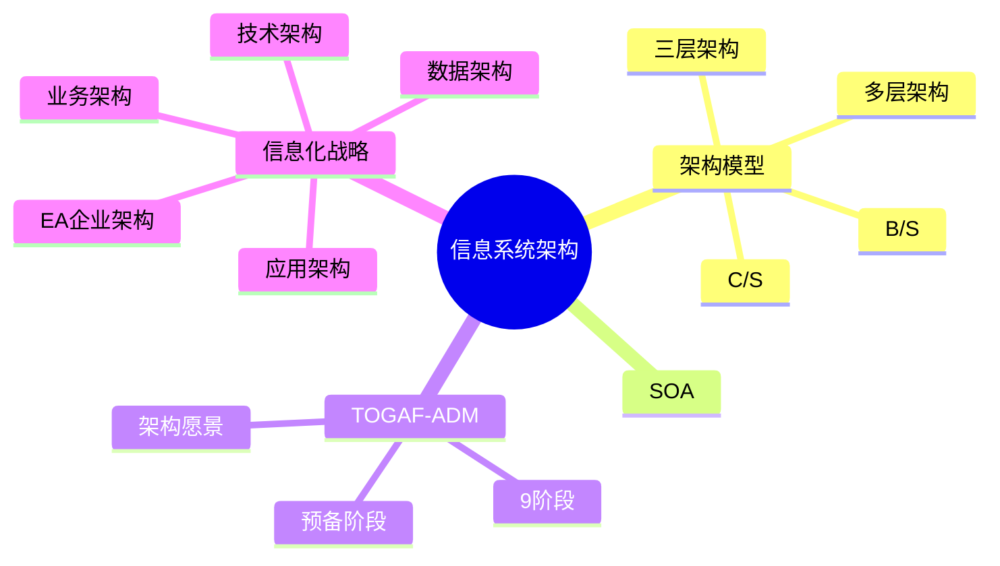

# 信息系统架构设计

> [!warning] 高频考点（几乎每年必考）
> 核心考点：==C/S vs B/S 对比==、==三层架构 vs SOA==、==TOGAF-ADM 9 阶段==、==信息化战略规划==、==企业架构 EA 4 视图==（业务/数据/应用/技术）。
>
> **状态**：⚠️ 骨架阶段，待细化

---

## 知识全景

---

## 2.1 核心概念（待细化）

> [!note]+ 待补充内容
> - 信息系统层级：操作层 / 战术层 / 战略层
> - 企业架构 EA 4 视图：业务 / 数据 / 应用 / 技术
> - 信息化战略 vs 业务战略对齐
> - 引用 [[../01-综合知识/08-系统架构设计]] 架构风格部分

---

## 2.2 关键技术与架构（待细化）

> [!note]+ 待补充内容
> - C/S vs B/S vs 三层 完整对比表（架构层级 / 部署 / 维护成本 / 跨平台 / 适用场景）
> - TOGAF-ADM 9 阶段流程图（预备 / 愿景 / 业务 / 信息系统 / 技术 / 机会与解决 / 迁移 / 实施治理 / 变更管理）
> - SOA 在信息系统中的应用

---

## 2.3 典型考点与解题套路（待细化）

> [!note]+ 待补充内容
> - 题型：架构选型题（C/S 还是 B/S）/ 信息化战略规划题
> - 答题模板（参见 [[00-案例分析解题框架#0.4.1 架构风格选择 答题模板]]）
> - 关键字判定：
>     - 「跨平台、零部署、互联网」→ B/S
>     - 「响应快、富交互、专用客户端」→ C/S
>     - 「业务规则复杂、多模块协同」→ 三层 / SOA

---

## 2.4 真题与练习（待细化）

> [!note]+ 待补充内容
> - 历年真题列表
> - 完整答题示例 1-2 题

---

## 关联链接

- 返回案例分析索引：[[00-案例分析解题框架]]
- 返回主索引：[[../MOC]]
- 关联综合知识章节：
    - [[../01-综合知识/08-系统架构设计]]：架构风格、ABSD、DSSA
    - [[../01-综合知识/06-需求工程]]：需求驱动的架构选型
    - [[../01-综合知识/09-系统质量属性与架构评估]]：架构选型的质量属性权衡
