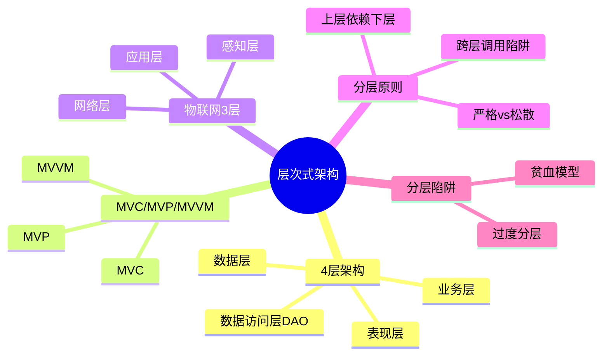

# 层次式架构设计

> [!warning] 高频考点
> 核心考点：==4 层架构==（表现 / 业务 / 数据访问 / 数据）、==MVC / MVP / MVVM 对比==、==物联网 3 层==（感知/网络/应用）、==分层原则与陷阱==。
>
> **状态**：✅ 已细化
>
> **速查跳转**：[[#3.2.1 MVC / MVP / MVVM 对比（必考核心）|MVx对比]] · [[#3.2.2 物联网 3 层架构（IoT 必备）|物联网3层]] · [[#3.4 真题与练习|真题]]

---

## 知识全景

---

## 3.1 核心概念

### 3.1.1 4 层架构职责

> [!important] 4 层架构标准职责对照

| 层级 | 职责 | 典型组件 |
| ---- | ---- | ---- |
| **表现层** | UI 呈现、用户交互、输入校验 | View / Web 页面 / 移动端界面 |
| **业务层** | 业务逻辑、规则、流程 | Service / Domain / Use Case |
| **数据访问层 DAO** | 持久化访问、ORM、数据查询 | Repository / Mapper / DAO |
| **数据层** | 数据存储 | RDBMS / NoSQL / 文件系统 |

^4-layers

### 3.1.2 分层原则与依赖方向

> [!warning] 分层核心原则
> - **依赖单向**：==上层依赖下层、下层不能调上层==
> - **依赖链**：表现层 → 业务层 → 数据访问层 → 数据层
> - **跨层调用风险**：耦合提升、不易维护、业务规则失控

具体危害：
- 表现层 ==绕过== 业务层直接访问数据 → 业务规则失控
- 数据层 ==反向调用== 业务层 → 循环依赖、不可测试
- 业务层 ==嵌入== UI 代码 → 表示与业务混杂

### 3.1.3 严格分层 vs 松散分层

| 类型 | 特征 | 优点 | 缺点 |
| ---- | ---- | ---- | ---- |
| **严格分层**（Closed） | 上层 ==只能调相邻下层== | 隔离强、责任清晰 | 性能稍差、调用链长 |
| **松散分层**（Open） | 允许 ==跨层调用== | 性能好、灵活 | 耦合高、难维护 |

^strict-vs-loose

> [!tip] 选择套路
> - 大型系统 / 复杂业务 → **严格分层**（牺牲性能换可维护）
> - 性能敏感 / 简单系统 → **松散分层**（允许必要的跨层）

---

## 3.2 关键技术与架构

### 3.2.1 MVC / MVP / MVVM 对比（必考核心）

> [!important] 7 维度对比表 — 必考

| 维度 | MVC | MVP | MVVM |
| ---- | ---- | ---- | ---- |
| 全称 | Model-View-Controller | Model-View-Presenter | Model-View-ViewModel |
| 数据流向 | View → Controller → Model | View ↔ Presenter ↔ Model | View ↔↔ ViewModel ↔ Model（==双向绑定==） |
| View 与 Model 关系 | View 直接监听 Model | View 完全 ==被动==，由 Presenter 操控 | View 与 ViewModel ==双向数据绑定== |
| UI 测试性 | 一般（View 与 Model 耦合） | **强**（Presenter 可单独测） | **强**（ViewModel 可单独测） |
| 学习曲线 | 低 | 中 | 中-高 |
| 典型框架 | Spring MVC、Struts2、Rails | Android（早期）、GWT | **Vue.js、Angular、WPF、SwiftUI** |
| 适用场景 | 服务端 Web 经典 | Android 应用、富客户端 | Web SPA、桌面/移动跨平台 |

^mvc-mvp-mvvm

> [!tip] 三者核心差异速记
> - **MVC** = 经典三角，View 直连 Model
> - **MVP** = View 被动，Presenter 居中调度
> - **MVVM** = 双向绑定，==状态变化自动同步 UI==

### 3.2.2 物联网 3 层架构（IoT 必备）

> [!important] 物联网标准 3 层架构（自下而上）

| 层级 | 职责 | 典型技术 |
| ---- | ---- | ---- |
| **感知层** | 数据采集（最底层） | RFID、传感器、二维码、摄像头、NFC |
| **网络层** | 数据传输 | 5G、Wi-Fi、ZigBee、LoRa、MQTT、NB-IoT |
| **应用层** | 业务处理与服务（最顶层） | 智能家居、智慧城市、工业 4.0、车联网 |

^iot-3layers

> [!tip] 物联网 3 层记忆
> **采集 → 传输 → 处理**（自下而上：感知 → 网络 → 应用）

### 3.2.3 分层陷阱

> [!warning] 3 大常见陷阱

- **贫血模型**（Anemic Domain Model）：业务逻辑全在 Service，Domain 只有 getter/setter — ==退化为数据搬运==
- **过度分层**：增加不必要的层（如简单 CRUD 也强分 4 层）→ 性能差、维护成本高
- **跨层调用**：表现层直接访问数据层，绕过业务层 → ==业务规则失控==

> [!note]+ 贫血模型 vs 充血模型
> - **贫血模型**：Domain 只有数据，业务逻辑写在 Service 中（常见但反 OO）
> - **充血模型**（Rich Domain Model）：Domain 既有数据又有行为（DDD 推荐）

---

## 3.3 典型考点与解题套路

### 3.3.1 MVx 选择题答题模板

参考 [[00-案例分析解题框架#0.4.1 架构风格选择 答题模板]]，针对 MVx 模式选型的特化模板：

> **第一段（理论）**：层次式架构的常见 UI 模式有 MVC、MVP、MVVM 三种，主要区别在 ==View 与 Model 的关联方式== 和 ==数据流向==。
>
> **第二段（分点对比）**：
> - （1）MVC：View → Controller → Model 单向，适合 ==服务端 Web==（Spring MVC）
> - （2）MVP：View 完全被动，由 Presenter 操控，==Android 早期经典==
> - （3）MVVM：双向数据绑定，==Vue / Angular / SwiftUI==
>
> **第三段（结合场景）**：本系统的核心需求是 <场景关键字>，故选用 <X 模式>。

### 3.3.2 关键字判定速查

> [!tip] 题目关键字 → 推荐模式（必备速查）

| 题目关键字 | 推荐模式 |
| ---- | ---- |
| 服务端 Web、Spring、Rails、传统 Web 应用 | **MVC** |
| Android（早期）、富客户端、UI 单元测试 | **MVP** |
| **Vue / Angular / SPA、双向数据绑定、响应式** | **MVVM** |
| 物联网、传感器、设备接入、5G | **物联网 3 层架构** |

^mvx-keywords

### 3.3.3 物联网架构填空套路

题目常给出物联网架构图，让填空"层级名"或"该层组件"。

> [!tip] 自下而上识别"采集 → 传输 → 处理"
> - 采集 = ==感知层==（RFID / 传感器 / 摄像头）
> - 传输 = ==网络层==（5G / Wi-Fi / LoRa / NB-IoT）
> - 处理 = ==应用层==（智慧城市 / 智能家居 / 工业 4.0）

---

## 3.4 真题与练习

### 3.4.1 真题示例 1：MVx 模式选择（高频）

**题目**：某公司开发新一代电商前端，要求页面状态变化时 UI 自动同步刷新，开发团队熟悉 Vue.js。请说明应采用何种 UI 架构模式，并对比 MVC、MVP、MVVM 三种模式的核心差异。

> [!example]+ 参考答题
>
> **理论**：层次式 UI 架构的三种主流模式为 MVC、MVP、MVVM，核心差异在 ==View 与 Model 的关联方式== 和 ==数据流向==。
>
> **分点对比**：
> （1）**MVC**（Model-View-Controller）：
>   - View → Controller → Model 单向数据流
>   - 适合 ==服务端 Web==（Spring MVC、Rails）
> （2）**MVP**（Model-View-Presenter）：
>   - Presenter 操控 View，View 完全被动
>   - 适合 ==Android 早期== 和富客户端，UI 测试性强
> （3）**MVVM**（Model-View-ViewModel）：
>   - ==双向数据绑定==：View 与 ViewModel 自动同步
>   - 适合 ==SPA、Vue / Angular / SwiftUI==
>
> **结论**：本场景"页面状态变化时 UI 自动刷新 + Vue.js"完全匹配 ==**MVVM 模式**== 的双向绑定特性。Vue.js 框架本身就是基于 MVVM 实现的响应式系统，故选用 MVVM。

^realexam-mvvm

### 3.4.2 真题示例 2：物联网 3 层填空（中频）

**题目**：某智慧城市物联网平台架构图（自下而上 3 层），请填空：
- (1)：____ — 采集环境数据，使用 RFID、温湿度传感器
- (2)：____ — 数据传输，使用 5G、NB-IoT、LoRa
- (3)：____ — 业务处理，提供智慧交通、智能照明等服务

> [!example]+ 参考答题
>
> **理论**：物联网采用 ==标准 3 层架构==：感知层、网络层、应用层（自下而上）。
>
> **分点填空**：
> （1）**感知层**：负责数据采集，对应 RFID、温湿度传感器、摄像头等
> （2）**网络层**：负责数据传输，对应 5G、NB-IoT、LoRa、MQTT 等
> （3）**应用层**：负责业务处理，对应智慧交通、智能照明、智慧停车等服务
>
> **总结**：物联网架构按 ==采集 → 传输 → 处理== 对应 ==感知 / 网络 / 应用 3 层==。

^realexam-iot

---

## 关联链接

- 返回案例分析索引：[[00-案例分析解题框架]]
- 返回主索引：[[../MOC]]
- 关联综合知识章节：
    - [[../01-综合知识/08-系统架构设计]]：分层架构风格
    - [[../01-综合知识/07-系统设计]]：设计原则、设计模式
    - [[../01-综合知识/03-计算机网络]]：物联网网络层、5G
- 关联案例分析：
    - [[02-信息系统架构设计]]：C/S vs B/S vs 三层架构对比
    - [[07-通信系统架构设计]]：物联网网络细节
