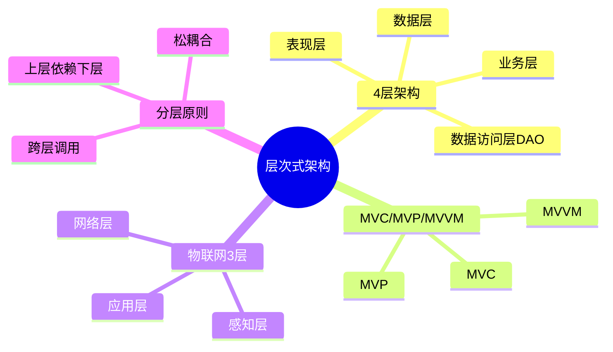

# 层次式架构设计

> [!warning] 高频考点
> 核心考点：==4 层架构==（表现 / 业务 / 数据访问 / 数据）、==MVC / MVP / MVVM 对比==（数据流向、UI 测试性）、==物联网 3 层==（感知/网络/应用）。
>
> **状态**：⚠️ 骨架阶段，待细化

---

## 知识全景

---

## 3.1 核心概念（待细化）

> [!note]+ 待补充内容
> - 分层职责：表现层（UI）/ 业务层（业务逻辑）/ 数据访问层（DAO）/ 数据层（DB）
> - 依赖方向：上层 → 下层（==下层不能调上层==）
> - 严格分层 vs 松散分层（是否允许跨层调用）
> - 引用 [[../01-综合知识/08-系统架构设计]] 分层架构风格

---

## 3.2 关键技术与架构（待细化）

> [!note]+ 待补充内容
> - **MVC**：Model 业务、View 展示、Controller 接收请求并协调
> - **MVP**：View 通过 Presenter 与 Model 交互（View 被动）
> - **MVVM**：View 与 ViewModel 双向绑定，常见于 Vue / Angular
> - 三者对比表：数据流方向 / UI 测试性 / 学习曲线 / 典型框架
> - 物联网 3 层：感知层（传感器 / RFID）/ 网络层（5G/Wi-Fi）/ 应用层（业务平台）

---

## 3.3 典型考点与解题套路（待细化）

> [!note]+ 待补充内容
> - 题型：层次划分题 / MVx 选择题 / 物联网架构题
> - 答题套路：
>     - 看到「Web 系统、Vue/Angular、双向绑定」→ MVVM
>     - 看到「Android 经典模式、安全测试」→ MVP
>     - 看到「服务端 Web 经典模式」→ MVC
>     - 看到「物联网、传感器、设备接入」→ 物联网 3 层

---

## 3.4 真题与练习（待细化）

> [!note]+ 待补充内容
> - 历年真题列表
> - 完整答题示例 1-2 题

---

## 关联链接

- 返回案例分析索引：[[00-案例分析解题框架]]
- 返回主索引：[[../MOC]]
- 关联综合知识章节：
    - [[../01-综合知识/08-系统架构设计]]：分层架构风格
    - [[../01-综合知识/07-系统设计]]：设计原则、设计模式
    - [[../01-综合知识/03-计算机网络]]：物联网网络层、5G
