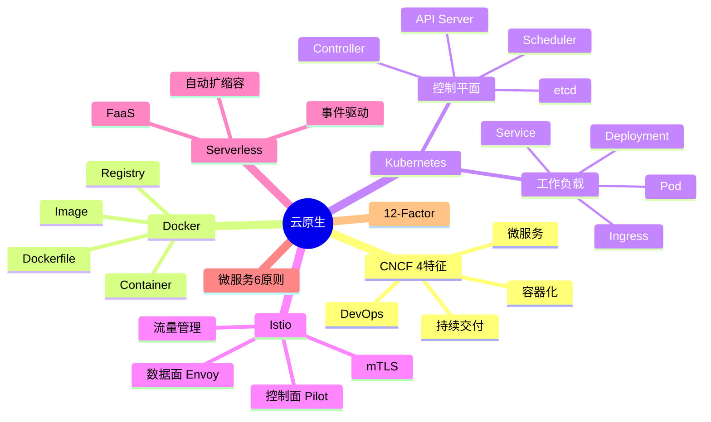

# 云原生架构设计

> [!warning] 高频考点（近年新增热点）
> 核心考点：==容器化（Docker/K8s）==、==微服务设计原则==、==Serverless / FaaS==、==服务网格 Istio==、==12-Factor 应用原则==、==CNCF 4 大特征==。
>
> **状态**：✅ 已细化
>
> **速查跳转**：[[#4.1.1 CNCF 4 大特征|CNCF特征]] · [[#4.2.5 微服务设计原则|微服务原则]] · [[#4.3.3 SDK（Spring Cloud） vs Service Mesh（Istio） 对比|SDK vs Mesh]] · [[#4.4 真题与练习|真题]]

---

## 知识全景

---

## 4.1 核心概念

### 4.1.1 CNCF 4 大特征

> [!important] 云原生 4 大核心特征（必背）

| 特征 | 含义 |
| ---- | ---- |
| **容器化** | 应用打包到容器，运行环境一致 |
| **微服务** | 单一职责、独立部署、独立扩展 |
| **DevOps** | 开发与运维一体化（文化 + 工具） |
| **持续交付**（CI/CD） | 自动化构建、测试、部署流水线 |

^cncf-4features

> [!tip] CNCF = Cloud Native Computing Foundation（云原生计算基金会）
> 维护开源云原生项目（Kubernetes、Prometheus、Envoy 等）

### 4.1.2 架构演进路径

| 阶段 | 关键特征 | 治理方式 |
| ---- | ---- | ---- |
| **单体** | 一个应用一个进程一个数据库 | 函数调用 |
| **SOA** | 服务化、基于 ESB、粗粒度 | ESB 总线 |
| **微服务** | 细粒度、去中心化、独立数据库 | SDK（Spring Cloud） |
| **云原生** | 容器化 + K8s 编排 + 服务网格 | Sidecar（Istio） |

^evolution-path

> [!tip] 演进逻辑：从"集中"→"分布式"，从"粗粒度"→"细粒度"，从"耦合治理"→"解耦治理"

### 4.1.3 12-Factor 应用原则（适合 SaaS 应用）

12 条原则（精简版）：

1. **基准代码**（Codebase）：一份代码，多份部署
2. **依赖**（Dependencies）：显式声明
3. **配置**（Config）：与代码分离（环境变量）
4. **后端服务**（Backing Services）：作为附加资源
5. **构建/发布/运行**（Build/Release/Run）：严格分离
6. **进程**（Processes）：无状态
7. **端口绑定**（Port Binding）：通过端口暴露服务
8. **并发**（Concurrency）：通过水平扩展
9. **易处置**（Disposability）：快速启动、优雅终止
10. **开发与生产对等**（Dev/Prod Parity）：环境一致
11. **日志**（Logs）：作为事件流
12. **管理任务**（Admin Processes）：独立进程

> [!tip] 12-Factor 速记：**码依配后构进端并易对日管**

---

## 4.2 关键技术与架构

### 4.2.1 容器（Docker）

> [!important] Docker 核心概念

| 概念 | 说明 |
| ---- | ---- |
| **Image**（镜像） | 只读模板（含应用 + 依赖 + 运行时） |
| **Container**（容器） | Image 的运行实例，可启停 |
| **Registry**（仓库） | 镜像存储中心（Docker Hub / Harbor） |
| **Dockerfile** | 镜像构建脚本（声明式） |

^docker-concepts

> [!warning] 容器 vs 虚拟机（必区分）
> | 维度 | 容器 | 虚拟机 |
> | ---- | ---- | ---- |
> | 隔离层级 | 进程级（共享 OS 内核） | 完整 OS |
> | 启动速度 | ==秒级== | 分钟级 |
> | 资源占用 | 轻量（MB） | 重（GB） |
> | 隔离性 | 弱 | 强 |
> | 适用场景 | 应用打包部署 | 多租户、多 OS |

### 4.2.2 编排（Kubernetes / K8s）

> [!important] K8s 控制平面 4 组件

| 组件 | 职责 |
| ---- | ---- |
| **API Server** | 唯一入口、所有操作通过 REST API |
| **etcd** | 分布式 KV 存储（集群状态） |
| **Scheduler** | 调度 Pod 到合适节点（资源 + 亲和性） |
| **Controller Manager** | 维持期望状态（自愈） |

> [!important] K8s 工作负载概念

| 概念 | 说明 |
| ---- | ---- |
| **Pod** | 最小调度单元（1+ 容器、共享网络） |
| **Deployment** | 声明式管理 Pod 副本（滚动更新） |
| **Service** | 服务发现 + 4 层负载均衡 |
| **Ingress** | 7 层路由（HTTP / HTTPS） |
| **ConfigMap / Secret** | 配置 / 敏感信息管理 |
| **Namespace** | 资源隔离（多团队 / 多环境） |

^k8s-components

### 4.2.3 服务网格（Service Mesh / Istio）

核心思想：==控制平面与数据平面分离==

> [!important] Istio 双平面架构

| 平面 | 组件 | 职责 |
| ---- | ---- | ---- |
| **数据平面** | **Envoy** 代理（Sidecar） | 拦截服务间所有流量、实施策略 |
| **控制平面** | Pilot / Citadel / Galley | 配置下发 / 证书签发 / 配置校验 |

^istio-planes

**3 大能力**：
- **流量管理**：路由、灰度、超时、重试
- **安全**：mTLS 双向认证、授权策略
- **可观测性**：指标、日志、链路追踪

> [!tip] Sidecar 模式
> 在每个 Pod 旁边部署 Envoy 代理，==透明拦截== 所有进出流量，业务代码无感知。

### 4.2.4 Serverless / FaaS

- **FaaS**（Function as a Service）：函数即服务，按调用付费
- **特征**：
    - ==事件驱动==（HTTP / 消息 / 定时触发）
    - ==自动扩缩容==（按并发自动扩展）
    - ==无状态==（函数不保存状态）
    - ==无服务器管理==（云厂商负责运维）
- **典型平台**：AWS Lambda、阿里云函数计算、Cloudflare Workers
- **适用场景**：突发流量、异步任务、事件处理、API 后端

> [!warning] Serverless ≠ 没有服务器
> 是 ==开发者无需管理服务器==，云厂商代管。底层仍有服务器（容器集群）。

### 4.2.5 微服务设计原则

> [!important] 微服务 6 大原则

| 原则 | 说明 |
| ---- | ---- |
| **单一职责** | 每个微服务负责 ==一个业务能力==（DDD 限界上下文） |
| **自治性** | ==独立部署、独立技术栈、独立扩展== |
| **数据独立** | 每个服务拥有自己的数据库（避免共享 DB） |
| **故障隔离** | 单个服务故障不影响整体（熔断、限流） |
| **去中心化治理** | ==不依赖单一总线==（vs SOA 的 ESB） |
| **基础设施自动化** | CI/CD、容器化部署、可观测性 |

^microservice-principles

> [!warning] 微服务陷阱
> - 服务粒度太细 → 网络通信开销大
> - 数据库共享 → 退化为分布式单体
> - 没有 ==服务治理== → 故障传播失控

---

## 4.3 典型考点与解题套路

### 4.3.1 单体 → 微服务 改造模板

> **第一段（理论）**：微服务架构通过将单体系统按 ==业务能力== 拆分为细粒度独立服务，实现 ==独立部署、独立扩展、技术异构==。
>
> **第二段（分点）**：
> - （1）**拆分原则**：按业务领域 DDD、按读写分离、按变化频率；优先拆变化频率高、瓶颈服务
> - （2）**数据拆分**：每个服务独立数据库；跨服务一致性用 ==分布式事务 / Saga 模式==
> - （3）**服务治理**：服务注册发现（Nacos）、负载均衡、熔断降级（Sentinel/Hystrix）、API 网关
> - （4）**部署运维**：容器化（Docker）+ 编排（K8s）+ CI/CD + 可观测性（链路追踪 SkyWalking）
>
> **第三段（结合场景）**：本系统的痛点是 <场景>，改造后通过 <X 技术> 解决。

### 4.3.2 关键字判定速查

> [!tip] 题目关键字 → 推荐架构（必备速查）

| 题目关键字 | 推荐架构 |
| ---- | ---- |
| 快速迭代 / 独立部署 / 技术异构 | **微服务** |
| 突发流量 / 事件驱动 / 按调用付费 | **Serverless / FaaS** |
| 服务间通信治理 / mTLS / 可观测 | **服务网格 Istio** |
| 容器编排 / 自动扩缩容 / 滚动更新 | **K8s** |
| 应用打包 / 环境一致性 | **Docker** |

^cloud-native-keywords

### 4.3.3 SDK（Spring Cloud） vs Service Mesh（Istio） 对比

| 维度 | SDK（Spring Cloud） | Service Mesh（Istio） |
| ---- | ---- | ---- |
| 治理位置 | ==SDK 嵌入业务代码== | ==Sidecar 透明拦截== |
| 语言耦合 | 强（绑定 Java/Spring） | 无（语言无关） |
| 升级成本 | 高（需改业务代码） | 低（只升级 Sidecar） |
| 学习曲线 | 中 | 高 |
| 性能 | 好（本地调用） | 略低（多一跳 Sidecar） |
| 适用场景 | 单语言为主、追求性能 | 多语言异构、统一治理 |

^sdk-vs-mesh

> [!note] API Gateway vs Service Mesh
> - **API Gateway**：处理 ==南北流量==（外部 → 内部入口）
> - **Service Mesh**：处理 ==东西流量==（服务 → 服务）
> - 两者 ==互补==，生产环境通常 **API Gateway + Service Mesh** 组合

---

## 4.4 真题与练习

### 4.4.1 真题示例 1：单体 → 微服务改造（高频）

**题目**：某电商系统采用单体架构，随着业务扩张，出现以下问题：
- 一次发布需停机 1 小时，无法做到高频迭代
- 数据库压力大，单库 200GB
- 团队从 5 人扩张到 60 人，开发互相阻塞

请说明如何将系统改造为微服务架构，并指出改造的风险。

> [!example]+ 参考答题
>
> **理论**：微服务架构通过将单体系统按 ==业务能力==（如商品、订单、支付、库存）拆分为细粒度独立服务，实现独立部署、独立扩展。
>
> **改造方案分点**：
> （1）**服务拆分**：
>   - 按业务领域（DDD）拆分：商品 / 订单 / 支付 / 库存 / 用户 / 营销
>   - 优先拆变化频率高、瓶颈服务（如订单）
> （2）**数据拆分**：
>   - 每个服务独立数据库（避免共享）
>   - 用 ==分布式事务== 或 ==Saga== 模式处理跨服务一致性
> （3）**服务治理**：
>   - **服务注册发现**：Nacos / Eureka
>   - **负载均衡**：Ribbon / Service Mesh
>   - **熔断降级**：Hystrix / Sentinel
>   - **API 网关**：Spring Cloud Gateway / Kong
> （4）**部署运维**：
>   - **容器化**：Docker 镜像统一打包
>   - **编排**：K8s 管理 Pod、自动扩缩容
>   - **CI/CD**：GitLab CI / Jenkins，独立流水线
>
> **风险**：
> - ==分布式事务复杂度上升==
> - 服务间网络通信增多，==延迟敏感==
> - 监控运维成本提升（需要 ==链路追踪== 如 SkyWalking、Jaeger）
> - 拆分粒度不当可能导致"分布式单体"
>
> **结论**：通过按业务能力拆分 + 容器化 + 服务治理，解决单体的高频迭代与扩展瓶颈，但需配套建设服务治理与可观测性体系。

^realexam-monolith-to-ms

### 4.4.2 真题示例 2：服务网格 vs API Gateway（中频）

**题目**：在微服务架构中，团队对"服务治理用 Spring Cloud SDK 还是 Service Mesh"存在分歧。请对比两种方案，并给出选型建议。

> [!example]+ 参考答题
>
> **理论**：服务治理是微服务架构的核心问题。主流方案有两种：基于 SDK（如 Spring Cloud）和基于 Service Mesh（如 Istio）。
>
> **分点对比**：
> （1）**SDK 方案（Spring Cloud）**：
>   - 治理逻辑 ==嵌入业务代码==（依赖 SDK）
>   - 优点：成熟度高、性能好（无 Sidecar 转发）
>   - 缺点：==与编程语言强绑定==（Java/Spring 生态）；升级需改业务代码
> （2）**Service Mesh 方案（Istio）**：
>   - 治理逻辑 ==下沉到 Sidecar==（Envoy 代理）
>   - 优点：==语言无关==、业务无侵入、统一治理面
>   - 缺点：学习曲线高、Sidecar 增加 ==网络延迟==
> （3）**API Gateway 不同维度**：
>   - API Gateway 是 ==南北流量==（外部 → 内部）的入口
>   - Service Mesh 是 ==东西流量==（服务 → 服务）的治理
>   - 两者 ==互补==，不互斥
>
> **结论**：
> - 如果团队主要用 Java/Spring 且追求成熟稳定 → **SDK 方案**
> - 如果有 ==多语言异构==（Java + Go + Python） → **Service Mesh**
> - 大多数生产实践：**API Gateway 处理南北流量 + Service Mesh / SDK 处理东西流量**

^realexam-mesh-vs-gateway

---

## 关联链接

- 返回案例分析索引：[[00-案例分析解题框架]]
- 返回主索引：[[../MOC]]
- 关联综合知识章节：
    - [[../01-综合知识/08-系统架构设计]]：架构风格、SOA、微服务演进
    - [[../01-综合知识/03-计算机网络]]：5G、SDN（与服务网格类比）
    - [[../01-综合知识/16-其他知识]]：云计算 IaaS/PaaS/SaaS 服务模式
- 关联案例分析：[[05-面向服务架构设计]]（SOA 与微服务对比）
