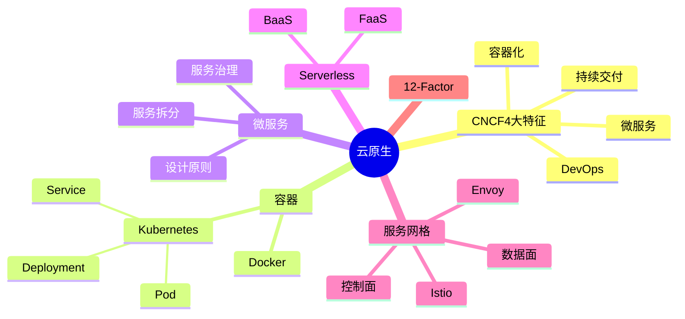

# 云原生架构设计

> [!warning] 高频考点（近年新增热点）
> 核心考点：==容器化（Docker/K8s）==、==微服务设计原则==、==Serverless / FaaS==、==服务网格 Istio==、==12-Factor 应用原则==、==CNCF 4 大特征==。
>
> **状态**：⚠️ 骨架阶段，待细化

---

## 知识全景

---

## 4.1 核心概念（待细化）

> [!note]+ 待补充内容
> - **CNCF 定义**：Cloud Native Computing Foundation 的云原生 4 大特征：容器化 / 微服务 / DevOps / 持续交付
> - **12-Factor 原则**（适合 SaaS 应用）
> - 单体 → SOA → 微服务 → 云原生 演进路径
> - 引用 [[../01-综合知识/08-系统架构设计]] SOA 与微服务

---

## 4.2 关键技术与架构（待细化）

> [!note]+ 待补充内容
> - **Docker 核心概念**：Image / Container / Registry / Dockerfile
> - **Kubernetes 核心组件**：
>     - 控制平面：API Server / etcd / Scheduler / Controller Manager
>     - 工作负载：Pod / Deployment / Service / Ingress
> - **Istio 服务网格**：
>     - 控制平面 Pilot / Citadel / Galley
>     - 数据平面 Envoy
>     - 流量管理 / 安全 / 可观测性
> - **Serverless / FaaS**：函数即服务、按调用付费、自动扩缩容

---

## 4.3 典型考点与解题套路（待细化）

> [!note]+ 待补充内容
> - 题型：单体 → 微服务改造题 / Serverless 适用场景题 / 服务网格 vs API Gateway 选择题
> - 答题套路：
>     - 看到「快速迭代、独立部署、技术异构」→ 微服务
>     - 看到「事件驱动、突发流量、低运维」→ Serverless
>     - 看到「服务间通信治理、可观测性」→ 服务网格
> - 微服务设计原则：单一职责 / 自治 / 数据独立 / 故障隔离 / 去中心化治理

---

## 4.4 真题与练习（待细化）

> [!note]+ 待补充内容
> - 历年真题列表
> - 完整答题示例 1-2 题

---

## 关联链接

- 返回案例分析索引：[[00-案例分析解题框架]]
- 返回主索引：[[../MOC]]
- 关联综合知识章节：
    - [[../01-综合知识/08-系统架构设计]]：架构风格、SOA、微服务演进
    - [[../01-综合知识/03-计算机网络]]：5G、SDN（与服务网格类比）
    - [[../01-综合知识/16-其他知识]]：云计算 IaaS/PaaS/SaaS 服务模式
