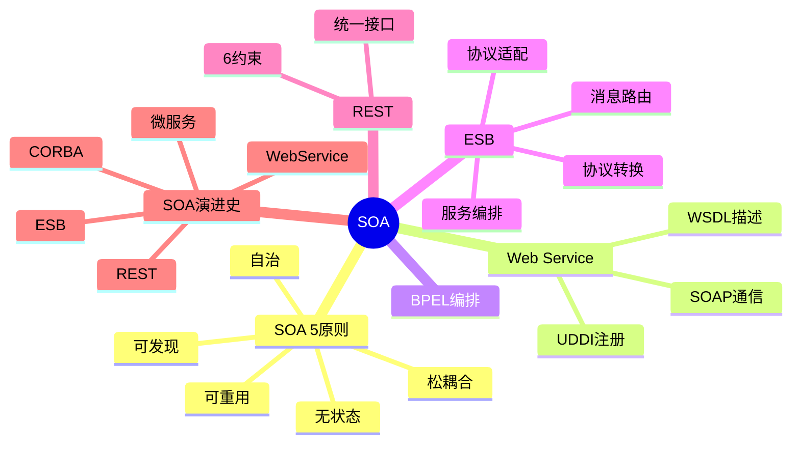

# 面向服务架构设计

> [!warning] 高频考点
> 核心考点：==SOA 5 大原则==（松耦合 / 可重用 / 自治 / 无状态 / 可发现）、==Web Service 三大标准==（WSDL / SOAP / UDDI）、==BPEL 流程编排==、==ESB 企业服务总线==、==REST vs SOAP==、==SOA vs 微服务==。
>
> **状态**：✅ 已细化
>
> **速查跳转**：[[#5.2.1 Web Service 三大标准|Web Service]] · [[#5.2.4 REST 6 大约束|REST]] · [[#5.3.1 SOA vs 微服务对比答题模板|SOA vs 微服务]] · [[#5.4 真题与练习|真题]]

---

## 知识全景

---

## 5.1 核心概念

### 5.1.1 SOA 定义与特征

SOA（Service-Oriented Architecture，面向服务架构）= 将业务功能封装为可独立部署的服务，通过 ==标准协议== 通信。

核心思想：**服务化 + 松耦合 + 跨系统集成**

适用场景：企业级集成、跨系统业务流程编排、异构系统互通。

### 5.1.2 SOA 5 大设计原则（必背）

> [!important] SOA 5 大原则

| 原则 | 含义 |
| ---- | ---- |
| **松耦合**（Loose Coupling） | 服务间最小依赖，接口契约稳定 |
| **可重用**（Reusability） | 服务可被多个消费者复用 |
| **自治**（Autonomy） | 服务独立运行、独立演化 |
| **无状态**（Statelessness） | 服务不保存调用上下文 |
| **可发现**（Discoverability） | 服务可被注册中心发现 |

^soa-5principles

### 5.1.3 SOA 演进史

| 时代 | 技术 | 特征 |
| ---- | ---- | ---- |
| 1990s | CORBA / DCOM | 重型、平台耦合 |
| 2000s | **Web Service**（SOAP） | 标准化、跨平台 |
| 2005-2015 | **ESB + BPEL** | 企业级集成 |
| 2010s | **REST** | 轻量、互联网友好 |
| 2015s+ | **微服务 / 云原生** | 细粒度、独立部署 |

^soa-evolution

> [!tip] 演进逻辑
> 从 ==重型 → 轻量==、从 ==耦合 → 自治==、从 ==粗粒度 → 细粒度==

---

## 5.2 关键技术与架构

### 5.2.1 Web Service 三大标准

> [!important] Web Service 三角关系（必考）

| 标准 | 全称 | 角色 |
| ---- | ---- | ---- |
| **WSDL** | Web Services Description Language | ==服务描述==（XML 接口契约） |
| **SOAP** | Simple Object Access Protocol | ==通信协议==（基于 XML） |
| **UDDI** | Universal Description Discovery Integration | ==服务注册中心==（黄页） |

^web-service-trinity

**三角协作关系**：
- **服务提供者**：开发服务 → ==发布 WSDL== 到 UDDI
- **服务消费者**：从 UDDI ==查询 WSDL== → 获取服务地址
- **通信**：消费者通过 ==SOAP== 调用服务

> [!tip] 三件套口诀
> **W**SDL = ==描述==、**S**OAP = ==通信==、**U**DDI = ==注册（找服务）==

### 5.2.2 BPEL 流程编排

BPEL（Business Process Execution Language）= 业务流程执行语言

- 用 ==XML 描述== 跨服务的 ==长事务流程==
- 支持：顺序、并行、条件、循环、补偿
- 适用：订单履约、保险理赔等多步骤业务流程
- 核心概念：流程实例 / 活动 / 变量 / 链接

^bpel-purpose

> [!note] BPEL 与 ESB 关系
> BPEL 是 ==流程描述==，ESB 是 ==运行时执行== BPEL 流程的引擎之一

### 5.2.3 ESB 企业服务总线

ESB（Enterprise Service Bus）= 服务通信中枢

> [!important] ESB 4 大职责

| 职责 | 说明 |
| ---- | ---- |
| **消息路由** | 根据规则转发消息（基于内容、基于规则） |
| **协议转换** | SOAP ↔ JMS ↔ HTTP ↔ FTP ↔ Mainframe |
| **服务编排** | 协调多个服务调用（执行 BPEL 流程） |
| **协议适配** | 异构系统集成（适配老系统） |

^esb-4capabilities

适合 ESB 的场景：
- 多系统集成（OA、ERP、CRM、HR）
- 协议异构（SOAP / JMS / FTP / Mainframe）
- 长事务编排
- 集中治理（监控、审计、流量控制）

不适合 ESB 的场景：
- 高并发 / 低延迟（ESB 是性能瓶颈）
- 微服务架构（应改用 ==Service Mesh==）

### 5.2.4 REST 6 大约束（必背）

REST（Representational State Transfer）的 6 个架构约束：

> [!important] REST 6 约束

| # | 约束 | 含义 |
| ---- | ---- | ---- |
| 1 | **客户端-服务器**（Client-Server） | 关注点分离 |
| 2 | **无状态**（Stateless） | 每个请求自包含 |
| 3 | **可缓存**（Cacheable） | 响应可标记为可缓存 |
| 4 | **统一接口**（Uniform Interface） | 标准化资源接口（URL + HTTP 方法） |
| 5 | **分层系统**（Layered System） | 客户端不知道直连还是中间层 |
| 6 | **按需代码**（Code-On-Demand） — ==可选== | 服务器可下发可执行代码（如 JS） |

^rest-6constraints

> [!warning] 易错点
> 6 大约束中只有 **按需代码（Code-On-Demand）是可选的**，其他 5 项是必备
> 统一接口又含 4 子约束：资源标识、表述操作资源、自描述消息、HATEOAS

### 5.2.5 REST vs SOAP 对比

> [!important] REST vs SOAP 6 维度对比

| 维度 | REST | SOAP |
| ---- | ---- | ---- |
| 协议层级 | HTTP（应用层） | 应用层（独立协议） |
| 数据格式 | ==JSON / XML==（多样） | XML 强制 |
| 性能 | **快**（轻量） | 慢（XML 解析重） |
| 标准化 | 风格指南（不强制） | ==WS-* 标准全套==（事务/安全/可靠消息） |
| 状态 | 无状态 | 可有状态（WS-*） |
| 适用场景 | Web API、互联网应用 | 企业级、强事务、强安全 |

^rest-vs-soap

> [!warning] 易混点
> - **REST 是架构风格**（不是协议）
> - **SOAP 是协议**（也是消息格式）
> - 两者 ==不在同一抽象层级==

---

## 5.3 典型考点与解题套路

### 5.3.1 SOA vs 微服务对比答题模板

> [!important] SOA vs 微服务 5 维度对比

| 维度 | SOA | 微服务 |
| ---- | ---- | ---- |
| **粒度** | 粗粒度（业务模块级） | ==细粒度==（业务能力级） |
| **治理** | 集中（==ESB 总线==） | 去中心化（每服务自治） |
| **通信协议** | SOAP / WS-* 重型 | ==REST / gRPC== 轻量 |
| **数据** | 共享数据库常见 | ==每服务独立数据库== |
| **部署** | 应用服务器（WAS / WebLogic） | ==容器（Docker）+ K8s== |

^soa-vs-microservices

**答题三段论**：

> 第一段（理论）：SOA 与微服务都是 ==服务化架构==，但在粒度、治理、协议、数据、部署 5 个维度有本质差异。
>
> 第二段（分点对比）：
> - （1）粒度：SOA 粗、微服务细
> - （2）治理：SOA 集中（ESB）、微服务去中心化
> - （3）通信：SOA SOAP/WS-*、微服务 REST/gRPC
> - （4）数据：SOA 共享、微服务独立
> - （5）部署：SOA 应用服务器、微服务容器化
>
> 第三段（结论）：本系统的需求是 <场景>，故选用 <X 架构>。

### 5.3.2 关键字判定速查

> [!tip] 题目关键字 → 推荐架构

| 题目关键字 | 推荐 |
| ---- | ---- |
| 跨企业集成 / 异构系统 / 强事务 | **SOA + ESB + SOAP** |
| 业务流程编排 / 长事务 | **BPEL** |
| 互联网 API / 轻量 / 移动端 | **REST** |
| 高并发 / 性能敏感 / 内部服务 | **gRPC**（微服务） |
| 多语言 / 独立部署 / 快速迭代 | **微服务** |

^soa-keywords

### 5.3.3 ESB 选型套路

**ESB 适合**：
- 30+ 异构系统集成
- 协议多样（SOAP / JMS / FTP / 老系统）
- 长事务流程编排（BPEL）
- 集中治理（监控、审计）

**ESB 不适合**：
- 微服务架构（与去中心化理念冲突）
- 高并发场景（ESB 是性能瓶颈）

---

## 5.4 真题与练习

### 5.4.1 真题示例 1：SOA vs 微服务对比（高频）

**题目**：某大型企业原有 SOA 架构（基于 ESB），近年面临业务快速变化、研发效率低的压力，团队提议改造为微服务架构。请对比 SOA 与微服务，并给出改造建议。

> [!example]+ 参考答题
>
> **理论**：SOA 与微服务都是 ==服务化架构==，但在粒度、治理、协议、数据、部署 5 个维度有本质差异。
>
> **分点对比**：
> （1）**粒度**：
>   - SOA：粗粒度（业务模块级，如订单管理、客户管理）
>   - 微服务：==细粒度==（业务能力级，如订单创建、订单查询）
> （2）**治理**：
>   - SOA：==集中式（ESB 总线）==
>   - 微服务：==去中心化==（每服务自治、Service Mesh）
> （3）**通信协议**：
>   - SOA：SOAP / WS-* 重型协议
>   - 微服务：==REST / gRPC== 轻量协议
> （4）**数据**：
>   - SOA：共享数据库常见
>   - 微服务：==每服务独立数据库==
> （5）**部署**：
>   - SOA：应用服务器（WAS / WebLogic）
>   - 微服务：==容器（Docker）+ K8s 编排==
>
> **改造建议**：
> - 渐进式拆分：识别现有 SOA 中的高变化模块，先抽出微服务
> - ESB → Service Mesh：替换集中式治理为去中心化
> - 数据库拆分：每个微服务独立 DB（用 ==Saga== 处理跨服务事务）
> - DevOps 配套：CI/CD、容器化、可观测性
> - 业务边界遵循 ==DDD 限界上下文==
>
> **结论**：业务快速变化 + 研发效率优先 → 改造为 ==微服务架构==，但需配套服务治理与 DevOps 体系，不能一次性大拆大建。

^realexam-soa-vs-ms

### 5.4.2 真题示例 2：保险公司 ESB 选型（中频）

**题目**：某保险公司有 30+ 异构系统（核保、理赔、客户、财务、CRM），跨系统业务流程复杂（如理赔涉及 8 个系统）。请说明应采用何种集成方案，并对比直接点对点集成的优劣。

> [!example]+ 参考答题
>
> **理论**：跨系统集成有 ==点对点（P2P）== 和 ==企业服务总线（ESB）== 两种主流方案。
>
> **分点对比**：
> （1）**点对点集成**：
>   - 每两个系统之间直接连接
>   - n 个系统 → ==n(n-1)/2 条连接==（30 个系统 = 435 条）
>   - ==紧耦合==、维护成本爆炸、协议异构难处理
> （2）**ESB 集成**：
>   - 所有系统接入 ESB 总线
>   - n 个系统 → ==n 条连接==（30 个系统 = 30 条）
>   - ==松耦合==、统一治理、协议自动转换
> （3）**ESB 4 大能力**：
>   - **消息路由**：按规则转发
>   - **协议转换**：SOAP ↔ JMS ↔ HTTP ↔ FTP
>   - **服务编排**：协调多个服务调用（如理赔流程）
>   - **协议适配**：异构系统集成
>
> **结论**：30+ 异构系统 + 复杂跨系统流程 → ==采用 ESB==，并辅以 ==BPEL 编排== 理赔等长事务流程。
>
> **风险提示**：
> - ESB 是性能瓶颈，==高并发场景需扩容==
> - 微服务化改造时应考虑替换为 ==Service Mesh==
> - 长事务用 BPEL，但要做好补偿机制

^realexam-esb

---

## 关联链接

- 返回案例分析索引：[[00-案例分析解题框架]]
- 返回主索引：[[../MOC]]
- 关联综合知识章节：
    - [[../01-综合知识/08-系统架构设计]]：SOA 架构风格
    - [[../01-综合知识/04-数据库系统]]：分布式与事务
- 关联案例分析：[[04-云原生架构设计]]（微服务详细）
