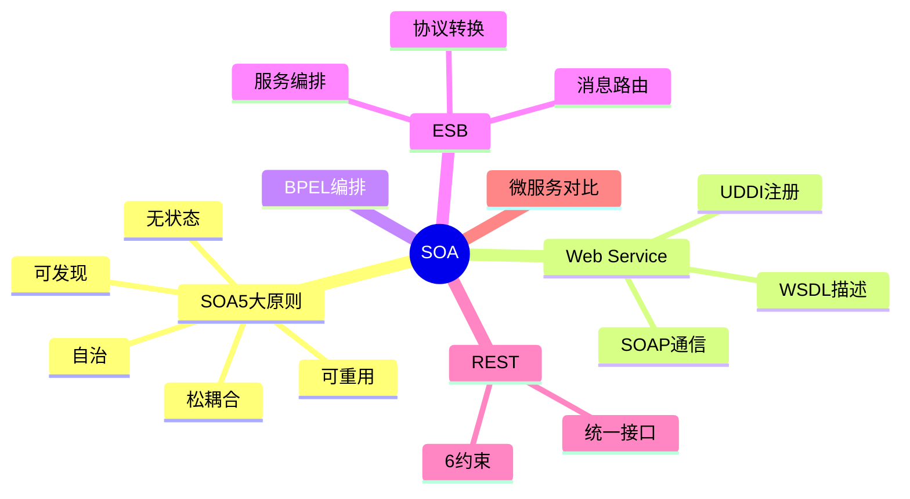

# 面向服务架构设计

> [!warning] 高频考点
> 核心考点：==SOA 5 大原则==（松耦合 / 可重用 / 自治 / 无状态 / 可发现）、==Web Service 三大标准==（WSDL / SOAP / UDDI）、==BPEL 流程编排==、==ESB 企业服务总线==、==REST vs SOAP==、==SOA vs 微服务==。
>
> **状态**：⚠️ 骨架阶段，待细化

---

## 知识全景

---

## 5.1 核心概念（待细化）

> [!note]+ 待补充内容
> - SOA 定义：将业务功能封装为可独立部署的服务、通过标准协议通信
> - **SOA 5 大原则**：
>     1. 松耦合（Loose Coupling）
>     2. 可重用（Reusability）
>     3. 自治（Autonomy）
>     4. 无状态（Statelessness）
>     5. 可发现（Discoverability）
> - 引用 [[../01-综合知识/08-系统架构设计]] SOA 章节

---

## 5.2 关键技术与架构（待细化）

> [!note]+ 待补充内容
> - **Web Service 三角关系图**：
>     - **WSDL**（Web Services Description Language）— 服务描述
>     - **SOAP**（Simple Object Access Protocol）— 通信协议
>     - **UDDI**（Universal Description Discovery Integration）— 服务注册中心
> - **BPEL**（Business Process Execution Language）：流程编排
> - **ESB 企业服务总线**：消息路由 / 协议转换 / 服务编排 / 协议适配
> - **REST 6 约束**：客户端-服务器 / 无状态 / 可缓存 / 统一接口 / 分层 / 按需代码
> - REST vs SOAP 对比表（协议 / 数据格式 / 性能 / 适用场景）

---

## 5.3 典型考点与解题套路（待细化）

> [!note]+ 待补充内容
> - 题型：SOA vs 微服务对比题 / ESB 选择题 / REST vs SOAP 选择题
> - SOA vs 微服务对比维度：粒度 / 通信协议 / 数据存储 / 治理 / 部署
> - 答题套路：
>     - 看到「重型企业集成、复杂事务」→ SOA + ESB
>     - 看到「轻量、独立部署、Web API」→ 微服务 + REST
>     - 看到「业务流程编排、长事务」→ BPEL

---

## 5.4 真题与练习（待细化）

> [!note]+ 待补充内容
> - 历年真题列表
> - 完整答题示例 1-2 题

---

## 关联链接

- 返回案例分析索引：[[00-案例分析解题框架]]
- 返回主索引：[[../MOC]]
- 关联综合知识章节：
    - [[../01-综合知识/08-系统架构设计]]：SOA 架构风格
    - [[../01-综合知识/04-数据库系统]]：分布式与事务
