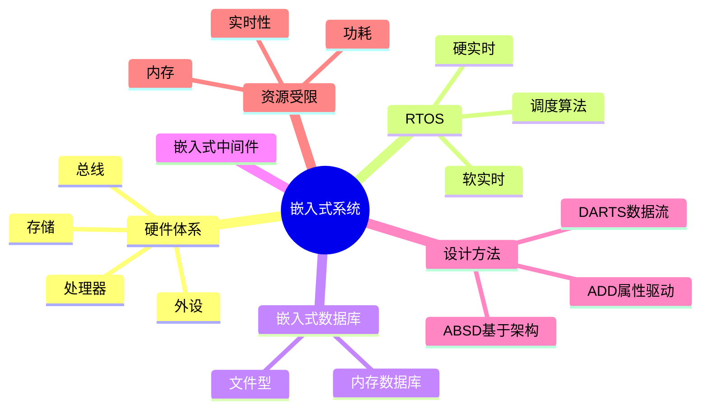

# 嵌入式系统架构设计

> [!warning] 中频考点
> 核心考点：==嵌入式硬件体系==、==RTOS 实时操作系统==（硬实时 vs 软实时）、==嵌入式数据库==、==嵌入式中间件==、==DARTS / ABSD / ADD 设计方法==、==资源受限场景设计==。
>
> **状态**：⚠️ 骨架阶段，待细化

---

## 知识全景

---

## 6.1 核心概念（待细化）

> [!note]+ 待补充内容
> - 嵌入式系统三大特征：==资源受限 / 实时性 / 专用性==
> - 硬实时 vs 软实时：
>     - **硬实时**：错过截止时间 = 系统失败（如医疗设备、汽车 ABS）
>     - **软实时**：错过截止时间会降低质量但不致命（如视频流）
> - 引用 [[../01-综合知识/02-操作系统]] 进程调度算法、[[../01-综合知识/01-计算机组成原理]] 硬件体系

---

## 6.2 关键技术与架构（待细化）

> [!note]+ 待补充内容
> - **嵌入式硬件体系**：处理器（MCU/MPU/DSP）/ 存储（ROM/RAM/Flash）/ 外设 / 总线（I²C/SPI/CAN）
> - **RTOS 调度算法**：基于优先级抢占式、Rate Monotonic（RM）、Earliest Deadline First（EDF）
> - **嵌入式中间件**：CORBA / DDS（数据分发服务）
> - **3 种设计方法**：
>     - **ABSD**（Architecture-Based Software Design，基于架构）
>     - **ADD**（Attribute-Driven Design，属性驱动）
>     - **DARTS**（Design Approach for Real-Time Systems，数据流驱动实时系统）

---

## 6.3 典型考点与解题套路（待细化）

> [!note]+ 待补充内容
> - 题型：嵌入式系统选型题 / RTOS vs 通用 OS 选择题 / 设计方法应用题
> - 答题套路：
>     - 看到「实时性、确定性、安全关键」→ 硬实时 RTOS
>     - 看到「资源极度受限、纳秒级响应」→ 裸机 / 简单调度
>     - 看到「数据流明显、传感器输入」→ DARTS
>     - 看到「质量属性驱动设计」→ ADD

---

## 6.4 真题与练习（待细化）

> [!note]+ 待补充内容
> - 历年真题列表
> - 完整答题示例 1-2 题

---

## 关联链接

- 返回案例分析索引：[[00-案例分析解题框架]]
- 返回主索引：[[../MOC]]
- 关联综合知识章节：
    - [[../01-综合知识/01-计算机组成原理]]：CISC vs RISC、硬件体系
    - [[../01-综合知识/02-操作系统]]：进程调度、I/O 控制
    - [[../01-综合知识/08-系统架构设计]]：ABSD 基于架构的开发
