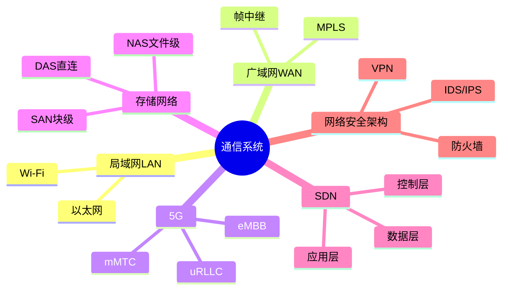

# 通信系统架构设计

> [!warning] 中频考点
> 核心考点：==LAN / WAN 网络架构==、==5G 三大场景==（eMBB / uRLLC / mMTC）、==存储网络 DAS / NAS / SAN==、==SDN 三层架构==、==网络安全架构==。
>
> **状态**：⚠️ 骨架阶段，待细化

---

## 知识全景

---

## 7.1 核心概念（待细化）

> [!note]+ 待补充内容
> - 通信架构层级：物理 → 链路 → 网络 → 传输 → 应用（参见 [[../01-综合知识/03-计算机网络]] OSI 七层）
> - **5G 三大特征**：高速率（峰值 10Gbps）/ 低时延（毫秒级）/ 广连接（百万设备/km²）
> - 引用 [[../01-综合知识/03-计算机网络]] 全章

---

## 7.2 关键技术与架构（待细化）

> [!note]+ 待补充内容
> - **5G 三大场景**：
>     - **eMBB**（增强移动宽带）— 高带宽，4K/8K 视频
>     - **uRLLC**（超高可靠低延迟通信）— 自动驾驶、远程医疗
>     - **mMTC**（海量机器类通信）— 物联网、智慧城市
> - **DAS / NAS / SAN 对比表**（详见 [[../01-综合知识/03-计算机网络#3.5 网络存储]]）
> - **SDN 三层架构**：应用层 / 控制层（OpenFlow）/ 数据层
> - 网络安全架构：DMZ + 多层防火墙 + IDS/IPS + VPN

---

## 7.3 典型考点与解题套路（待细化）

> [!note]+ 待补充内容
> - 题型：网络规划题 / 5G 场景应用题 / 存储网络选型题
> - 答题套路：
>     - 看到「高带宽、视频」→ eMBB
>     - 看到「低延迟、工控」→ uRLLC
>     - 看到「物联网、海量设备」→ mMTC
>     - 看到「文件共享 / NFS」→ NAS
>     - 看到「光纤、块级、数据库」→ SAN
>     - 看到「网络可编程、集中管控」→ SDN

---

## 7.4 真题与练习（待细化）

> [!note]+ 待补充内容
> - 历年真题列表
> - 完整答题示例 1-2 题

---

## 关联链接

- 返回案例分析索引：[[00-案例分析解题框架]]
- 返回主索引：[[../MOC]]
- 关联综合知识章节：
    - [[../01-综合知识/03-计算机网络]]：OSI 七层、协议、设备、5G、SDN、存储网络
    - [[../01-综合知识/14-信息安全]]：网络安全协议（IPSec / SSL/TLS）
