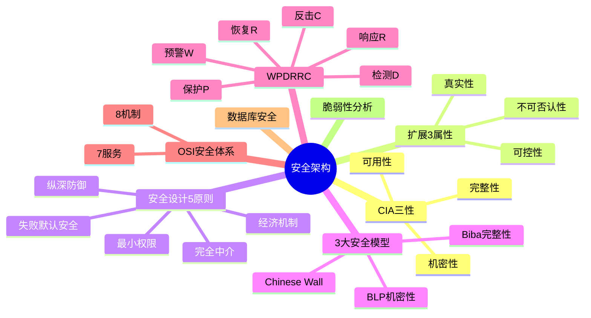

# 安全架构设计

> [!warning] 高频考点
> 核心考点：==安全模型 BLP / Biba / Chinese Wall==、==WPDRRC 6 环节==、==OSI 安全体系 7 服务 8 机制==、==数据库安全==、==脆弱性分析==。
>
> **状态**：✅ 已细化
>
> **速查跳转**：[[#8.2.1 3 大安全模型（必考核心）|3大模型]] · [[#8.2.2 WPDRRC 6 环节（案例特色）|WPDRRC]] · [[#8.2.3 OSI 安全体系|OSI 7+8]] · [[#8.4 真题与练习|真题]]

---

## 知识全景

---

## 8.1 核心概念

### 8.1.1 信息安全 CIA 三性

> [!important] 信息安全核心三要素

| 要素 | 英文 | 含义 | 典型威胁 |
| ---- | ---- | ---- | ---- |
| **机密性** | Confidentiality | 信息不被 ==非授权== 者获取 | 窃听、嗅探 |
| **完整性** | Integrity | 信息不被 ==非授权篡改== | 篡改、伪造 |
| **可用性** | Availability | 信息能被 ==授权== 用户使用 | DoS / DDoS |

^cia-triad-2

### 8.1.2 扩展 3 属性

- **真实性**（Authenticity）：身份的真实可靠
- **可控性**（Controllability）：信息流向和行为可控
- **不可否认性**（Non-repudiation）：发送/接收不能抵赖

### 8.1.3 安全设计 5 大原则

> [!important] 安全架构设计 5 大原则

| 原则 | 含义 |
| ---- | ---- |
| **最小权限** | 主体仅获得完成任务所需的最小权限 |
| **纵深防御** | 多层次、多维度的防御机制 |
| **失败默认安全** | 系统失败时默认拒绝（Deny by Default） |
| **经济机制** | 安全机制应尽可能简单 |
| **完全中介** | 每次访问都需经过安全检查 |

^security-principles-5

> [!tip] 5 原则速记：**小深默简介**

---

## 8.2 关键技术与架构

### 8.2.1 3 大安全模型（必考核心）

> [!important] 安全模型对比表

| 模型 | 关注属性 | 核心规则 | 答题关键字 |
| ---- | ---- | ---- | ---- |
| **BLP**（Bell-LaPadula） | **机密性** | ==不上读、不下写==（向下读、向上写） | 防泄密、机密文件 |
| **Biba** | **完整性** | ==不下读、不上写==（向上读、向下写） | 防污染、数据完整 |
| **Chinese Wall** | **利益冲突** | 同冲突类内已访问 A 不能再访问 B | 商业伦理、咨询 |

^security-models-3

### BLP 模型（机密性）

> [!important] BLP 两大核心规则
>
> | 规则 | 简称 | 含义 |
> | ---- | ---- | ---- |
> | 简单安全特性（ss） | ==不上读 / no read up== | 主体不能读取 ==高== 安全级别的客体 |
> | 星特性（*） | ==不下写 / no write down== | 主体不能写入 ==低== 安全级别的客体 |
>
> 整体效果：信息只能从 ==低密级 → 高密级==，防止机密信息泄露。

例：
- 普通员工（低）不能读机密文件（高）→ 不上读
- 高级别员工（高）不能向低密级写入 → 不下写

### Biba 模型（完整性）

> [!important] Biba 两大核心规则（与 BLP 镜像对称）
>
> | 规则 | 简称 | 含义 |
> | ---- | ---- | ---- |
> | 简单完整性 | ==不下读 / no read down== | 主体不能读取 ==低== 完整级别的客体 |
> | 完整性 * | ==不上写 / no write up== | 主体不能写入 ==高== 完整级别的客体 |
>
> 整体效果：防止 ==低完整性数据污染高完整性数据==。

^blp-biba-rules

> [!warning] BLP vs Biba 易混（必考）
> - BLP：==不上读、不下写==（机密性，防泄密）
> - Biba：==不下读、不上写==（完整性，防污染）
> - 两者方向 ==完全相反==

> [!tip] 形象记忆
> - **BLP 像保密文件**：高级别能往下俯瞰但不能告诉低级别（不下写）；低级别看不到高级别（不上读）
> - **Biba 像水源**：上游清水不能喝下游污水（不下读）；下游污水不能反流上游（不上写）

### Chinese Wall 模型（利益冲突）

应用于 ==商业咨询、金融顾问== 等存在利益冲突的场景。

核心规则：将客户分为若干 ==冲突类==（Conflict Class），同一冲突类内：
- 一旦顾问访问了客户 A 的数据
- 就 ==不能再访问== 该冲突类内其他客户（B / C / D）的数据

例：咨询师为某行业 X 公司服务后，不能再为同行业 Y 公司服务。

### 8.2.2 WPDRRC 6 环节（案例特色）

> [!important] WPDRRC 信息安全保障体系（6 大环节）

| # | 英文 | 中文 | 含义 |
| ---- | ---- | ---- | ---- |
| 1 | **W**arning | 预警 | 提前发现潜在威胁 |
| 2 | **P**rotection | 保护 | 加密、访问控制、防火墙 |
| 3 | **D**etection | 检测 | IDS / IPS、日志审计 |
| 4 | **R**esponse | 响应 | 应急处置、阻断攻击 |
| 5 | **R**ecovery | 恢复 | 数据恢复、业务连续性 |
| 6 | **C**ounterattack | 反击 | 反向追踪、取证 |

^wpdrrc-6

> [!tip] WPDRRC 速记：**预护检响恢反**（事前预警/保护 → 事中检测/响应 → 事后恢复/反击）

### 8.2.3 OSI 安全体系

#### 7 大安全服务

> [!important] OSI 7 大安全服务

| # | 服务 | 英文 | 含义 |
| ---- | ---- | ---- | ---- |
| 1 | **认证** | Authentication | 身份鉴别 |
| 2 | **访问控制** | Access Control | 授权管理 |
| 3 | **数据保密** | Data Confidentiality | 加密 |
| 4 | **数据完整** | Data Integrity | 完整性校验 |
| 5 | **不可否认** | Non-repudiation | 抗抵赖 |
| 6 | **可用性** | Availability | 服务可用 |
| 7 | **审计** | Audit | 日志记录 |

^osi-security-services

#### 8 大安全机制

> [!important] OSI 8 大安全机制

| # | 机制 | 英文 | 用途 |
| ---- | ---- | ---- | ---- |
| 1 | **加密** | Encryption | 保密性 |
| 2 | **数字签名** | Digital Signature | 不可否认 |
| 3 | **访问控制** | Access Control | 授权 |
| 4 | **数据完整性** | Data Integrity | 防篡改 |
| 5 | **认证交换** | Authentication Exchange | 身份验证 |
| 6 | **流量填充** | Traffic Padding | 防流量分析 |
| 7 | **路由控制** | Routing Control | 选择安全路由 |
| 8 | **公证** | Notarization | 第三方证明 |

^osi-security-mechanisms

> [!tip] 服务 vs 机制
> - **服务**：要达到的 ==安全目标==（认证、加密、完整性等）
> - **机制**：实现服务的 ==具体技术手段==（数字签名、流量填充等）

### 8.2.4 数据库安全

| 措施 | 说明 |
| ---- | ---- |
| **身份认证** | 用户名/密码、双因素认证、生物识别 |
| **访问控制** | 基于角色 RBAC、视图限制、行级安全 |
| **数据加密** | 透明加密 TDE、字段级加密、传输加密 |
| **审计** | 操作日志、敏感数据访问跟踪 |
| **备份恢复** | 完全 / 增量 / 差异备份（参见 [[../01-综合知识/11-系统运行与维护]]） |

### 8.2.5 脆弱性分析（风险评估）

> [!important] 风险评估公式
>
> **风险 = 资产价值 × 威胁可能性 × 脆弱性严重程度**

^vulnerability-formula

| 要素 | 含义 | 例子 |
| ---- | ---- | ---- |
| **资产**（Asset） | 信息系统、数据、人员 | 客户数据库、核心代码 |
| **威胁**（Threat） | 黑客攻击、内部泄密、自然灾害 | DDoS、内部员工泄密 |
| **脆弱性**（Vulnerability） | 漏洞、弱口令、配置错误 | 未修补 CVE、默认密码 |
| **风险**（Risk） | 三者综合评估结果 | 高 / 中 / 低 |

---

## 8.3 典型考点与解题套路

### 8.3.1 BLP / Biba 选择题模板

> **第一段（理论）**：信息安全模型核心 3 个：BLP（机密性）、Biba（完整性）、Chinese Wall（利益冲突）。
>
> **第二段（分点对比）**：
> - （1）BLP：==不上读、不下写==，防止机密信息泄露
> - （2）Biba：==不下读、不上写==，防止数据被污染
> - （3）Chinese Wall：商业利益冲突场景
>
> **第三段（结合场景）**：本场景的关注点是 <机密 / 完整 / 利益冲突>，故选用 <X 模型>。

### 8.3.2 关键字判定速查

> [!tip] 题目关键字 → 推荐模型 / 框架

| 题目关键字 | 推荐 |
| ---- | ---- |
| 机密信息防泄露 / 政府文件 / 军事 | **BLP** |
| 数据防篡改 / 防污染 / 完整性 | **Biba** |
| 商业咨询 / 利益冲突 / 同行业 | **Chinese Wall** |
| 全生命周期防护 / 主动防御 | **WPDRRC** |
| 通信网络分层安全 | **OSI 安全体系**（7 服务 + 8 机制） |

^security-keywords

### 8.3.3 WPDRRC 应用题套路

针对"为某系统设计安全保障方案"类题目，按 6 环节展开：

1. **预警 W**：威胁情报、漏洞监测、安全态势感知
2. **保护 P**：防火墙、加密、身份认证、访问控制
3. **检测 D**：IDS / IPS、日志审计、异常行为分析
4. **响应 R**：应急响应预案、攻击阻断、漏洞修补
5. **恢复 R**：数据备份、业务连续性 BCP / DR
6. **反击 C**：取证、溯源、法律追责

> [!tip] 答题套路
> 把"题目场景的关键字"映射到 6 环节，每个环节给 1-2 个具体技术 / 措施

---

## 8.4 真题与练习

### 8.4.1 真题示例 1：BLP / Biba 模型选择（高频）

**题目**：某公司有两个安全需求：
- **场景 A**：政府机密文件管理系统，需保证机密信息不外泄
- **场景 B**：核心交易数据库，需保证数据不被低权限用户篡改

请分别说明应选用何种安全模型，并简述其核心规则。

> [!example]+ 参考答题
>
> **理论**：信息安全模型核心 3 个：BLP（机密性）、Biba（完整性）、Chinese Wall（利益冲突）。本题涉及前两类。
>
> **分点分析**：
>
> **场景 A**（政府机密文件，防泄密）：
> - 关注点：==机密性==
> - 选用：**BLP（Bell-LaPadula）模型**
> - 核心规则：
>   - ==不上读==（no read up）：低密级用户不能读取高密级文件
>   - ==不下写==（no write down）：高密级用户不能向低密级写入
>   - 信息只能从 ==低 → 高== 流动，防止机密信息向下泄露
>
> **场景 B**（核心交易数据库，防篡改）：
> - 关注点：==完整性==
> - 选用：**Biba 模型**
> - 核心规则：
>   - ==不下读==（no read down）：高完整级别不读取低完整级别
>   - ==不上写==（no write up）：低完整级别不能向高完整级别写入
>   - 信息只能从 ==高 → 低== 流动，防止低质量数据污染
>
> **结论**：
> - 政府机密 → **BLP**（机密性、防泄密）
> - 核心交易 → **Biba**（完整性、防污染）
> - 两者方向 ==完全相反==，是经典易混考点

^realexam-blp-biba

### 8.4.2 真题示例 2：金融机构 WPDRRC 应用（中频）

**题目**：某金融机构构建网络安全保障体系，请基于 WPDRRC 模型说明各环节应部署的安全措施。

> [!example]+ 参考答题
>
> **理论**：WPDRRC 是信息安全保障体系的 ==6 环节闭环==：预警 → 保护 → 检测 → 响应 → 恢复 → 反击（口诀：预护检响恢反）。
>
> **分点设计**：
>
> （1）**预警**（Warning）：
>   - 接入威胁情报平台，订阅漏洞披露
>   - 部署 ==安全态势感知系统==（监控异常流量）
>
> （2）**保护**（Protection）：
>   - 网络层：==防火墙、WAF、DMZ==
>   - 主机层：杀毒软件、HIDS、漏洞修补
>   - 数据层：==传输加密 SSL/TLS、存储加密 TDE==
>   - 应用层：==身份认证、RBAC 访问控制==
>
> （3）**检测**（Detection）：
>   - 部署 ==IDS / IPS==（入侵检测/防御）
>   - SIEM 日志分析、UEBA 用户行为分析
>
> （4）**响应**（Response）：
>   - 制定 ==应急响应预案==
>   - 自动阻断（防火墙/IPS 联动）
>   - 漏洞紧急修补
>
> （5）**恢复**（Recovery）：
>   - ==异地备份== + 业务连续性 BCP
>   - 灾备演练 DR
>
> （6）**反击**（Counterattack）：
>   - ==取证溯源==（攻击日志、证据链）
>   - 法律追责（配合公安、监管）
>
> **结论**：通过 WPDRRC 6 环节构建 ==事前预防 + 事中检测响应 + 事后恢复反击== 的闭环安全体系，符合金融行业 ==等保 2.0 三级== 要求。

^realexam-wpdrrc

---

## 关联链接

- 返回案例分析索引：[[00-案例分析解题框架]]
- 返回主索引：[[../MOC]]
- 关联综合知识章节：
    - [[../01-综合知识/14-信息安全]]：CIA 三要素、加密、签名、安全模型详细
    - [[../01-综合知识/09-系统质量属性与架构评估]]：安全性是核心质量属性
    - [[../01-综合知识/15-法律法规]]：网络安全法、个人信息保护法
- 关联案例分析：[[07-通信系统架构设计]]（网络安全架构）
