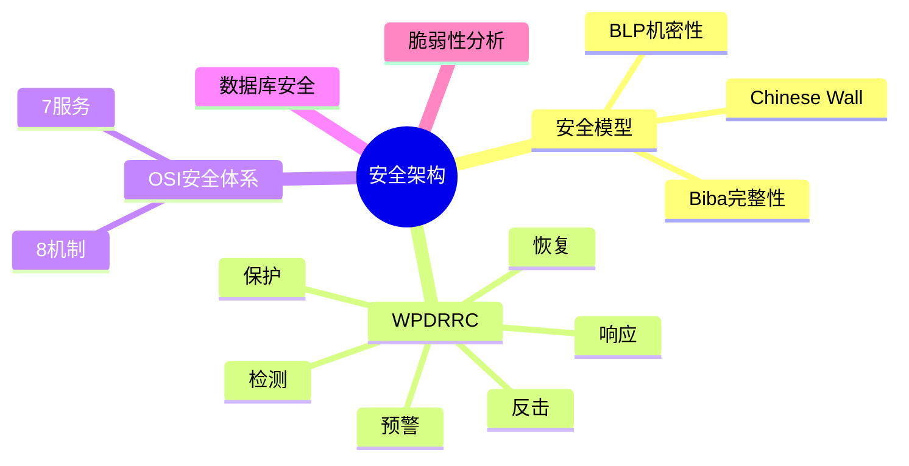

# 安全架构设计

> [!warning] 高频考点
> 核心考点：==安全模型 BLP / Biba / Chinese Wall==、==WPDRRC 6 环节==、==OSI 安全体系 7 服务 8 机制==、==数据库安全==、==脆弱性分析==。
>
> **状态**：⚠️ 骨架阶段，待细化

---

## 知识全景

---

## 8.1 核心概念（待细化）

> [!note]+ 待补充内容
> - 信息安全 CIA 三性 + 扩展 3 属性（参见 [[../01-综合知识/14-信息安全#13.1 信息安全基础]]）
> - 安全设计原则：最小权限 / 纵深防御 / 失败默认安全 / 经济机制 / 完全中介
> - 引用 [[../01-综合知识/14-信息安全]] 全章

---

## 8.2 关键技术与架构（待细化）

> [!note]+ 待补充内容
> - **3 大安全模型对比**：
>     - **BLP**：机密性，==不上读、不下写==（防泄密）
>     - **Biba**：完整性，==不下读、不上写==（防污染）
>     - **Chinese Wall**：利益冲突，冲突类约束
> - **WPDRRC 6 环节**：
>     1. **W**arning（预警）
>     2. **P**rotection（保护）
>     3. **D**etection（检测）
>     4. **R**esponse（响应）
>     5. **R**ecovery（恢复）
>     6. **C**ounterattack（反击）
> - **OSI 安全体系**：
>     - **7 大安全服务**：认证 / 访问控制 / 数据保密 / 数据完整 / 不可否认 / 可用性 / 审计
>     - **8 大安全机制**：加密 / 数字签名 / 访问控制 / 数据完整性 / 认证交换 / 流量填充 / 路由控制 / 公证
> - 数据库安全：访问控制 / 加密 / 审计 / 备份恢复

---

## 8.3 典型考点与解题套路（待细化）

> [!note]+ 待补充内容
> - 题型：安全模型选择题 / WPDRRC 应用题 / OSI 安全机制识别题
> - 答题套路：
>     - 看到「机密信息防泄露」→ BLP（不上读、不下写）
>     - 看到「数据防篡改、防污染」→ Biba（不下读、不上写）
>     - 看到「商业咨询利益冲突」→ Chinese Wall
>     - 看到「事前预警 + 事中检测 + 事后恢复」→ WPDRRC

---

## 8.4 真题与练习（待细化）

> [!note]+ 待补充内容
> - 历年真题列表
> - 完整答题示例 1-2 题

---

## 关联链接

- 返回案例分析索引：[[00-案例分析解题框架]]
- 返回主索引：[[../MOC]]
- 关联综合知识章节：
    - [[../01-综合知识/14-信息安全]]：CIA 三要素、加密、签名、安全模型详细
    - [[../01-综合知识/09-系统质量属性与架构评估]]：安全性是核心质量属性
    - [[../01-综合知识/15-法律法规]]：网络安全法、个人信息保护法
