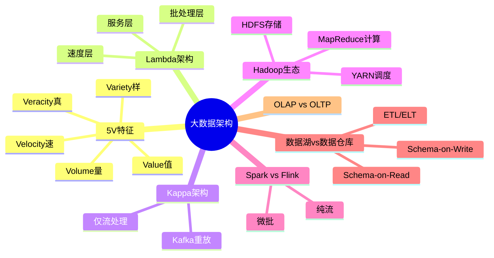

# 大数据架构设计

> [!warning] 高频考点
> 核心考点：==Lambda 架构==（批+流双层）、==Kappa 架构==（仅流）、==Hadoop 生态==（HDFS / MapReduce / YARN）、==Spark vs Flink==、==数据湖 vs 数据仓库==、==大数据 5V==。
>
> **状态**：✅ 已细化
>
> **速查跳转**：[[#9.2.1 Lambda 架构（必考核心）|Lambda]] · [[#9.2.2 Kappa 架构（必考核心）|Kappa]] · [[#9.2.6 数据湖 vs 数据仓库（必考）|数据湖vs仓库]] · [[#9.4 真题与练习|真题]]

---

## 知识全景



---

## 9.1 核心概念

### 9.1.1 大数据 5V 特征

> [!important] 5V 特征（必背）

| 特征 | 英文 | 含义 |
| ---- | ---- | ---- |
| **大量** | Volume | 数据规模 PB/EB 级 |
| **高速** | Velocity | 数据产生与处理速度 |
| **多样** | Variety | 结构化 / 半结构化 / 非结构化 |
| **真实性** | Veracity | 数据质量与可信度 |
| **价值** | Value | 蕴含的价值密度低 |

^bigdata-5v

> [!tip] 5V 速记：**量速样真值**

### 9.1.2 批处理 vs 流处理

> [!important] 批处理 vs 流处理对比

| 维度 | 批处理（Batch） | 流处理（Stream） |
| ---- | ---- | ---- |
| 数据范围 | 有界数据集 | 无界数据流 |
| 处理延迟 | 高（小时/天） | ==低（秒/毫秒）== |
| 吞吐量 | 高 | 中 |
| 典型框架 | Hadoop MapReduce / Spark | Flink / Storm / Spark Streaming |
| 典型场景 | 离线报表、ETL | 实时监控、风控、推荐 |

^batch-vs-stream

### 9.1.3 OLAP vs OLTP（参考 [[../01-综合知识/04-数据库系统]]）

| 维度 | OLAP（分析） | OLTP（事务） |
| ---- | ---- | ---- |
| 用途 | ==决策分析== | ==业务事务== |
| 数据量 | 大（历史） | 小（当前） |
| 操作 | 复杂查询、聚合 | 增删改查 |
| 响应时间 | 秒-分钟 | 毫秒 |
| 设计范式 | 反范式（星型/雪花） | 第三范式 |

---

## 9.2 关键技术与架构

### 9.2.1 Lambda 架构（必考核心）

> [!important] Lambda 架构 3 层结构
>
> ```
> 原始数据 → 同时进入两条路径
>   ├─→ 批处理层（Batch Layer）：处理全量历史数据，生成批视图
>   └─→ 速度层（Speed Layer）：处理实时增量数据，生成实时视图
>         ↓
>    服务层（Serving Layer）：合并批视图 + 实时视图，对外查询
> ```

| 层级 | 职责 | 典型技术 |
| ---- | ---- | ---- |
| **批处理层** | 处理 ==全量历史== 数据 | Hadoop MapReduce / Spark |
| **速度层** | 处理 ==实时增量== 数据 | Storm / Spark Streaming / Flink |
| **服务层** | 合并批+实时结果，对外查询 | HBase / Cassandra / Druid |

^lambda-architecture

**优点**：兼顾历史完整性 + 实时性
**缺点**：==双套代码维护成本高==、批/流可能不一致

### 9.2.2 Kappa 架构（必考核心）

> [!important] Kappa 架构（流处理一体化）
>
> ```
> 原始数据 → 流处理层（Stream Layer）→ 服务层
>               ↓
>         消息队列（如 Kafka）保存全部数据，可重放
> ```

核心思想：**移除批处理层，==仅用流处理==**（重放历史数据替代批处理）

| 层级 | 职责 | 典型技术 |
| ---- | ---- | ---- |
| **流处理层** | 处理实时 + 重放历史 | **Flink**（主流） |
| **消息队列** | 保存全量数据可重放 | Kafka |
| **服务层** | 提供查询 | HBase / Cassandra / Druid |

^kappa-architecture

**优点**：==单一引擎==、维护简单、批流一致
**缺点**：流处理引擎需支持 ==精确一次（exactly-once）==、Kafka 长期存储成本

### 9.2.3 Lambda vs Kappa 对比（必考）

> [!important] Lambda vs Kappa 6 维对比

| 维度 | Lambda | Kappa |
| ---- | ---- | ---- |
| 处理层数 | ==双层==（批 + 流） | ==单层==（仅流） |
| 代码维护 | ==双套==（批 / 流分别实现） | 单套 |
| 一致性 | 批+流可能不一致 | ==全流统一== |
| 重放 | 批层重新跑 | ==流层重放 Kafka== |
| 复杂度 | 高 | 低 |
| 适用场景 | 历史数据为主、实时辅助 | ==流处理为主、需重放== |

^lambda-vs-kappa

### 9.2.4 Hadoop 生态

> [!important] Hadoop 三大核心 + 主要扩展

| 组件 | 全称 | 职责 |
| ---- | ---- | ---- |
| **HDFS** | Hadoop Distributed File System | ==分布式文件存储== |
| **MapReduce** | — | ==批处理计算引擎== |
| **YARN** | Yet Another Resource Negotiator | ==资源调度== |
| Hive | — | SQL on Hadoop |
| HBase | — | NoSQL 列存储 |
| Pig | — | 数据流语言 |
| Sqoop | — | RDBMS ↔ HDFS 数据迁移 |

^hadoop-ecosystem

> [!tip] 三大核心：**存（HDFS） / 算（MapReduce） / 调（YARN）**

### 9.2.5 Spark vs Flink

> [!important] Spark vs Flink 对比

| 维度 | Spark | Flink |
| ---- | ---- | ---- |
| 处理模型 | ==微批==（Micro-Batch） | ==纯流式== |
| 时间语义 | 处理时间为主 | 支持 ==事件时间==、处理时间、注入时间 |
| 状态管理 | 一般 | 强（精确一次 exactly-once） |
| 窗口 | 简单 | ==丰富==（滚动、滑动、会话） |
| 延迟 | 秒级 | ==毫秒级== |
| 适用场景 | 批处理 + 准实时 | ==复杂实时流处理== |

^spark-vs-flink

### 9.2.6 数据湖 vs 数据仓库（必考）

> [!important] 数据湖 vs 数据仓库对比

| 维度 | 数据仓库（Data Warehouse） | 数据湖（Data Lake） |
| ---- | ---- | ---- |
| 数据类型 | ==结构化==（行 / 列） | ==所有类型==（结构化 / 半结构化 / 非结构化） |
| 模式 | ==Schema-on-Write==（写入前定义模式） | ==Schema-on-Read==（读取时定义模式） |
| 处理流程 | ETL（抽取 → 转换 → 装载） | ==ELT==（抽取 → 装载 → 转换） |
| 用户 | 业务分析师 | 数据科学家 / ML 工程师 |
| 用途 | 报表 / BI | 机器学习 / 探索性分析 |
| 典型技术 | Teradata / Snowflake / Redshift | S3 + Spark / Hadoop / Delta Lake |

^datalake-vs-warehouse

> [!tip] ETL vs ELT 区别
> - **ETL**（数据仓库）：先转换 → 后装载，==存储干净的结构化数据==
> - **ELT**（数据湖）：先装载 → 按需转换，==保留原始数据==

> [!note] 湖仓一体（Lakehouse）— 新趋势
> 结合两者优势：==数据湖底座 + 数据仓库的事务/索引能力==
> 典型：Delta Lake、Apache Iceberg、Apache Hudi

---

## 9.3 典型考点与解题套路

### 9.3.1 Lambda / Kappa 选择题模板

> **第一段（理论）**：大数据架构主流两种 — Lambda（批 + 流）和 Kappa（仅流）。
>
> **第二段（分点对比）**：
> - （1）Lambda：双层维护、批层处理历史、速度层处理实时
> - （2）Kappa：单层流处理、通过 Kafka 重放历史
> - （3）维护复杂度：Kappa < Lambda
>
> **第三段（结合场景）**：本系统的需求是 <场景>，故选用 <X 架构>。

### 9.3.2 关键字判定速查

> [!tip] 题目关键字 → 推荐架构

| 题目关键字 | 推荐架构 |
| ---- | ---- |
| 历史 + 实时 / 双套维护 / 全量数据重算 | **Lambda** |
| 流处理为主 / 单一引擎 / 简化维护 | **Kappa** |
| 离线分析 / 报表 / BI / 结构化 | **数据仓库（Hive/Snowflake）** |
| 机器学习 / 探索性 / 半/非结构化 | **数据湖（S3/HDFS + Delta）** |
| 复杂事件 / 事件时间 / 毫秒级 | **Flink** |
| 批处理 + 准实时 | **Spark** |

^bigdata-keywords

### 9.3.3 数据湖 / 仓库选型套路

**数据仓库适合**：
- 业务分析、固定报表、BI 看板
- 结构化数据为主（订单、用户、交易）
- 强一致性要求

**数据湖适合**：
- 机器学习、探索性分析
- 多源异构数据（日志、图像、视频）
- ==Schema 不固定==、灵活演化

**湖仓一体（Lakehouse）**：结合两者优势的新趋势（Delta Lake、Iceberg、Hudi）

---

## 9.4 真题与练习

### 9.4.1 真题示例 1：Lambda vs Kappa 架构选型（高频）

**题目**：某互联网公司构建大数据平台，需求：
- 用户行为日志全量历史分析（用于离线推荐）
- 实时用户行为统计（用于实时风控）
- 数据 ==Schema 演化== 频繁，希望简化架构维护

请说明应选择 Lambda 还是 Kappa 架构，并对比两者优缺点。

> [!example]+ 参考答题
>
> **理论**：大数据架构主流两种 — Lambda（批 + 流双层）和 Kappa（仅流单层）。
>
> **分点对比**：
> （1）**Lambda 架构**：
>   - **批处理层**：处理全量历史数据，使用 Spark / Hadoop MapReduce
>   - **速度层**：处理实时增量数据，使用 Flink / Spark Streaming
>   - **服务层**：合并批 + 实时视图（HBase / Druid）
>   - 优点：历史完整性 + 实时性兼顾
>   - 缺点：==双套代码维护、批/流可能不一致==
> （2）**Kappa 架构**：
>   - 移除批处理层，==仅用流处理引擎==（如 Flink）
>   - **重放历史数据**：通过 ==Kafka 长期保存全量数据==，需要时重新流式处理
>   - 优点：==单引擎、单套代码、简化维护==
>   - 缺点：流引擎需支持精确一次（exactly-once）和长期数据保留
>
> **选型建议**（结合场景）：
> - 题目中"Schema 演化频繁、希望简化维护" → ==Kappa 架构==
> - 用 ==Flink== 同时处理实时风控 + 重放历史日志做离线推荐
> - 配合 ==Kafka== 保存全量原始日志，支持任意时间点重算
>
> **结论**：选用 **Kappa 架构**，主要因为简化维护 + 单一引擎 + Schema 演化友好。但需注意 Kafka 存储成本（长期保留）和流处理引擎的精确一次能力。

^realexam-lambda-kappa

### 9.4.2 真题示例 2：数据湖 vs 数据仓库（中频）

**题目**：某零售企业有以下数据：
- 业务系统的订单、商品、客户数据（结构化）
- 用户行为日志（半结构化 JSON）
- 客服录音、商品图片（非结构化）

需求：① 业务报表 BI，② 用户画像与机器学习。请说明应建数据仓库还是数据湖，并描述 ETL/ELT 流程。

> [!example]+ 参考答题
>
> **理论**：数据存储有两种主流方案：==数据仓库==（结构化、Schema-on-Write、ETL）和 ==数据湖==（多类型、Schema-on-Read、ELT）。
>
> **分点对比**：
> （1）**数据仓库（Data Warehouse）**：
>   - 仅存储结构化数据（行/列）
>   - **ETL 流程**：抽取（Extract）→ 转换（Transform）→ 装载（Load）
>   - 适合：业务报表、BI、固定查询
>   - 典型：Snowflake、Redshift、Teradata
> （2）**数据湖（Data Lake）**：
>   - 存储 ==所有类型==（结构化 + 半结构化 + 非结构化）
>   - **ELT 流程**：抽取 → 装载 → 按需转换
>   - 适合：机器学习、探索分析、Schema 演化
>   - 典型：S3 + Spark / Delta Lake / Iceberg
>
> **选型建议**：
> - 同时需要 ==BI 报表== 和 ==机器学习==，且数据 ==类型多样==
> - → 推荐 **湖仓一体架构**（Lakehouse）：
>   - 数据湖：存储全部原始数据（订单、日志、图片、录音）
>   - 数据仓库：从数据湖中抽取结构化数据，建立维度模型供 BI 用
>   - 用 Delta Lake / Iceberg 提供 ACID 与统一元数据
>
> **结论**：建议 ==湖仓一体==（数据湖 + 数据仓库）：
> - 数据湖（S3 / HDFS）作为统一存储底座
> - 数据仓库（Hive / Snowflake）作为 BI 出口
> - 用户画像与 ML 直接基于数据湖 + Spark / Flink

^realexam-lake-vs-warehouse

---

## 关联链接

- 返回案例分析索引：[[00-案例分析解题框架]]
- 返回主索引：[[../MOC]]
- 关联综合知识章节：
    - [[../01-综合知识/04-数据库系统]]：分布式数据库、数据仓库 OLAP / OLTP
    - [[../01-综合知识/02-操作系统]]：分布式文件系统基础
    - [[../01-综合知识/16-其他知识]]：大数据 5V 特征、云计算
- 关联案例分析：[[04-云原生架构设计]]（容器化部署 Hadoop/Spark）
