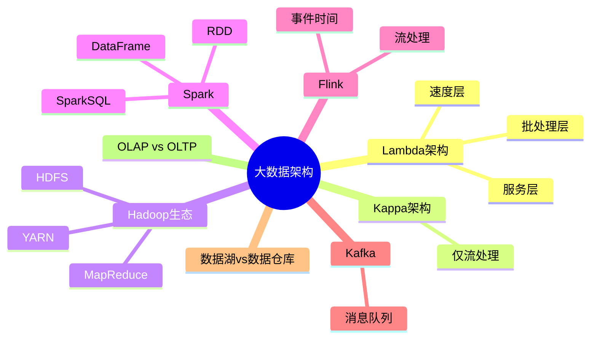

# 大数据架构设计

> [!warning] 高频考点
> 核心考点：==Lambda 架构==（批+流双层）、==Kappa 架构==（仅流）、==Hadoop 生态==（HDFS / MapReduce / YARN）、==Spark / Flink==、==数据湖 vs 数据仓库==、==大数据 5V==。
>
> **状态**：⚠️ 骨架阶段，待细化

---

## 知识全景

---

## 9.1 核心概念（待细化）

> [!note]+ 待补充内容
> - 大数据 5V 特征：Volume / Velocity / Variety / Veracity / Value（参见 [[../01-综合知识/16-其他知识#16.2.5 大数据]]）
> - 批处理 vs 流处理：处理模型、延迟、吞吐
> - OLAP vs OLTP（参见 [[../01-综合知识/04-数据库系统]]）
> - 引用 [[../01-综合知识/04-数据库系统]] 数据仓库与分布式

---

## 9.2 关键技术与架构（待细化）

> [!note]+ 待补充内容
> - **Lambda 架构 3 层**：
>     - **批处理层**（Batch Layer）：处理全量历史数据，低延迟难
>     - **速度层**（Speed Layer）：处理实时增量数据
>     - **服务层**（Serving Layer）：合并批处理 + 实时结果对外查询
> - **Kappa 架构**：移除批处理层，==仅用流处理==（Flink 主流），处理重放历史数据
> - Lambda vs Kappa 对比：复杂度 / 一致性 / 重放能力
> - **Hadoop 三大组件**：
>     - **HDFS**（Hadoop Distributed File System）— 分布式存储
>     - **MapReduce** — 批处理计算
>     - **YARN**（Yet Another Resource Negotiator）— 资源调度
> - **Spark vs Flink**：
>     - Spark：微批 + 内存计算，DAG 调度
>     - Flink：纯流式 + 事件时间窗口
> - **数据湖 vs 数据仓库**：
>     - **数据仓库**：结构化、Schema-on-Write、ETL 后存
>     - **数据湖**：原始数据、Schema-on-Read、ELT 模式

---

## 9.3 典型考点与解题套路（待细化）

> [!note]+ 待补充内容
> - 题型：大数据架构选型题 / Lambda vs Kappa 选择题 / 流批一体设计题
> - 答题套路：
>     - 看到「全量历史 + 实时增量、双层维护」→ Lambda
>     - 看到「流处理为主、可重放、单一引擎」→ Kappa
>     - 看到「结构化、报表、BI」→ 数据仓库
>     - 看到「半/非结构化、机器学习原料」→ 数据湖
>     - 看到「事件时间、复杂窗口」→ Flink

---

## 9.4 真题与练习（待细化）

> [!note]+ 待补充内容
> - 历年真题列表
> - 完整答题示例 1-2 题

---

## 关联链接

- 返回案例分析索引：[[00-案例分析解题框架]]
- 返回主索引：[[../MOC]]
- 关联综合知识章节：
    - [[../01-综合知识/04-数据库系统]]：分布式数据库、数据仓库 OLAP / OLTP
    - [[../01-综合知识/02-操作系统]]：分布式文件系统基础
    - [[../01-综合知识/16-其他知识]]：大数据 5V 特征、云计算
