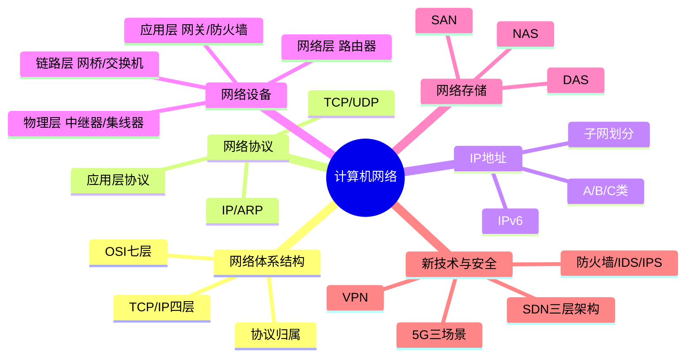

# D3 计算机网络 实施计划

> **For agentic workers:** REQUIRED SUB-SKILL: Use superpowers:subagent-driven-development (recommended) or superpowers:executing-plans to implement this plan task-by-task. Steps use checkbox (`- [ ]`) syntax for tracking.

**Goal:** 新建 `01-综合知识/03-计算机网络.md`，覆盖红宝书 ch10 全部考点（OSI/协议/IP子网/设备/存储/新技术与安全），与 D1/D2 风格一致。

**Architecture:** 单文件，6 个大节顺序撰写。每节独立可校验：是否覆盖 spec 列出的考点、对比表/公式/口诀是否到位。完成后整体校对 → 用户验证 → 更新 tracker → 双提交（docs + chore）。

**Tech Stack:** Markdown + Obsidian callout + Mermaid mindmap + Block ID 锚点。

**Spec:** [2026-04-29-d3-computer-network-design.md](../specs/2026-04-29-d3-computer-network-design.md)

---

## Task 1：创建文件 + 标题 + 知识全景

**Files:**
- Create: `01-综合知识/03-计算机网络.md`

- [ ] **Step 1: 创建文件并写入 Obsidian frontmatter + 标题**

frontmatter 字段沿用 D1/D2 模式（tags、aliases、cssclasses 等仅在 D1/D2 已使用的字段；若 D1/D2 无 frontmatter 则不写）。先 Read D2 文件前 30 行确认实际 frontmatter 格式后再写。

- [ ] **Step 2: 写入 `## 知识全景` 节，包含 Mermaid mindmap**

Mindmap 结构（单层缩进，避免 commit `76d5f0a` 错误）：



- [ ] **Step 3: 校对该节是否在 Obsidian 渲染正常**

校对点：标题层级唯一（仅一处 `# 计算机网络`）、mindmap 代码块标记 ` ```mermaid `、root 节点括号正确。

---

## Task 2：3.1 网络体系结构（重点★★★★）

**Files:**
- Modify: `01-综合知识/03-计算机网络.md`（追加章节）

- [ ] **Step 1: 写入大节标题与导语**

```markdown
## 3.1 网络体系结构（重点★★★★）

> [!tip] 记忆口诀：**物数网传会表应**（自下而上 OSI 七层）

```

- [ ] **Step 2: 写入 OSI/TCP-IP 对应表（核心对比）**

表头：层级 | OSI 七层 | TCP/IP 四层 | 数据单元 | 主要协议 | 典型设备

行（自下而上）：
- 1 物理层 | 网络接口层 | 比特(bit) | RJ45/双绞线 | 中继器/集线器
- 2 数据链路层 | 网络接口层 | 帧(Frame) | PPP/HDLC/Ethernet/ARP | 网桥/交换机
- 3 网络层 | 网际层 | 包(Packet) | IP/ICMP/IGMP | 路由器
- 4 传输层 | 传输层 | 段(Segment)/报文 | TCP/UDP | —
- 5 会话层 | 应用层 | — | RPC/SQL | —
- 6 表示层 | 应用层 | — | JPEG/ASCII/加解密 | —
- 7 应用层 | 应用层 | 报文 | HTTP/FTP/SMTP/DNS/DHCP | 网关

加 block ID `^osi-tcpip-mapping`。

- [ ] **Step 3: 写入 `> [!important]` callout：核心强化**

内容包含：OSI 七层是国际标准但理论模型；TCP/IP 是事实工业标准；ARP 协议位置易混（协议在网络层，但解析的是 MAC 地址）。

- [ ] **Step 4: 校对**

- 表格 7 行（OSI 完整七层）
- ARP 归属处用 ==高亮==
- block ID 已加

---

## Task 3：3.2 网络协议（重点★★★★）

**Files:**
- Modify: `01-综合知识/03-计算机网络.md`（追加章节）

- [ ] **Step 1: 写入大节标题**

```markdown
## 3.2 网络协议（重点★★★★）
```

- [ ] **Step 2: 写入应用层协议端口对照表**

表头：协议 | 端口 | 传输层 | 用途

必含行：
- HTTP | 80 | TCP | 超文本传输
- HTTPS | 443 | TCP | HTTP+SSL/TLS
- FTP | 20(数据)/21(控制) | TCP | 文件传输
- TFTP | 69 | UDP | 简单文件传输
- Telnet | 23 | TCP | 远程登录
- SSH | 22 | TCP | 安全远程登录
- SMTP | 25 | TCP | 邮件发送
- POP3 | 110 | TCP | 邮件接收
- IMAP | 143 | TCP | 邮件接收（保留服务器）
- DNS | 53 | UDP/TCP | 域名解析（区域传输用 TCP）
- DHCP | 67(server)/68(client) | UDP | 动态主机配置
- SNMP | 161/162 | UDP | 网络管理

加 block ID `^port-table`。

- [ ] **Step 3: 写入 TCP vs UDP 对比表 + TCP 三次握手/四次挥手**

TCP vs UDP 维度：是否连接 / 是否可靠 / 报文头开销（20B vs 8B）/ 流量控制 / 拥塞控制 / 适用场景。

三次握手：客户 SYN(seq=x) → 服务器 SYN+ACK(seq=y, ack=x+1) → 客户 ACK(ack=y+1)。

四次挥手：FIN → ACK → FIN → ACK，强调 TIME_WAIT 状态。

加 block ID `^tcp-udp-comparison`、`^tcp-handshake`。

- [ ] **Step 4: 写入网络层与数据链路层关键协议**

- IP（无连接、不可靠）/ ICMP（差错报告，ping 基于此）/ IGMP（多播）
- ARP（IP→MAC）/ RARP（MAC→IP）
- PPP / HDLC（数据链路层广域网协议）

`> [!warning]` callout：ARP 工作在网络层，但解析的是 MAC（链路层）地址，常考易混点。

- [ ] **Step 5: 校对**

- 端口表 ≥12 行
- TCP/UDP 对比 ≥6 维度
- 三次握手/四次挥手图示或文字说明完整
- block ID 已加

---

## Task 4：3.3 IP 地址与子网划分（重点★★★★）

**Files:**
- Modify: `01-综合知识/03-计算机网络.md`（追加章节）

- [ ] **Step 1: 写入大节标题与 IPv4 分类表**

```markdown
## 3.3 IP 地址与子网划分（重点★★★★）

### 3.3.1 IPv4 地址分类
```

表头：类别 | 首字节范围 | 默认掩码 | 网络数 | 每网络主机数 | 用途
- A | 1-126 | /8 | 126 | 2²⁴-2 | 大型网络
- B | 128-191 | /16 | 16384 | 2¹⁶-2 | 中型网络
- C | 192-223 | /24 | 2097152 | 254 | 小型网络
- D | 224-239 | — | — | — | 多播
- E | 240-255 | — | — | — | 保留实验

`> [!important]` 特殊地址：
- 127.0.0.1 环回测试
- 0.0.0.0 默认路由/未分配
- 255.255.255.255 受限广播
- 私有地址段：10.0.0.0/8、172.16.0.0/12、192.168.0.0/16

加 block ID `^ipv4-classes`。

- [ ] **Step 2: 写入子网划分公式与计算**

```markdown
### 3.3.2 子网划分（必考公式）
```

`> [!important]` 公式：
- 子网数 = 2ⁿ（n = 借位数）
- 可用主机数 = 2ʰ - 2（h = 主机位数；扣除全 0 网络号 + 全 1 广播）
- 每子网地址数 = 2ʰ

加 block ID `^subnet-formula`。

- [ ] **Step 3: 写入 2 个考试计算示例**

`> [!tip]` 示例 1：给定 192.168.1.0/24，借 3 位划分子网，求子网数与每子网可用主机数。
- 子网数 = 2³ = 8
- 主机位 = 8-3 = 5，可用主机 = 2⁵-2 = 30

`> [!tip]` 示例 2：要求每子网容纳 ≥ 50 主机，原 /24 网络至少保留几位主机位？
- 2ʰ-2 ≥ 50 → h ≥ 6 → 至少保留 6 位主机位 → 掩码 /26

- [ ] **Step 4: 写入 CIDR 与 IPv6 简介**

```markdown
### 3.3.3 CIDR 无类域间路由
```

CIDR 格式 `IP/前缀长度`，如 192.168.1.0/24。打破 A/B/C 类边界，提高地址利用率。

```markdown
### 3.3.4 IPv6 简介（了解）
```

- 长度：128 位（IPv4 是 32 位）
- 表示：8 组 4 位十六进制，冒号分隔，如 `2001:0db8::1`
- 过渡技术：双协议栈 / 隧道技术 / NAT-PT

- [ ] **Step 5: 校对**

- IPv4 分类表 5 行齐全
- 公式 block ID 加上
- 计算示例 ≥2 个
- IPv6 长度/表示/过渡 三要素齐全

---

## Task 5：3.4 网络设备（次重点★★★）

**Files:**
- Modify: `01-综合知识/03-计算机网络.md`（追加章节）

- [ ] **Step 1: 写入大节标题与设备层级对照表**

```markdown
## 3.4 网络设备（次重点★★★）
```

表头：层级 | 设备 | 工作原理 | 隔离冲突域 | 隔离广播域

行（自下而上）：
- 物理层 | 中继器(Repeater) | 信号放大整形 | 否 | 否
- 物理层 | 集线器(Hub) | 广播所有端口 | 否 | 否
- 数据链路层 | 网桥(Bridge) | MAC 地址转发 | 是 | 否
- 数据链路层 | 交换机(Switch) | MAC 地址表+全双工 | 是 | 否
- 网络层 | 路由器(Router) | IP 路由+ACL | 是 | 是
- 网络层 | 三层交换机 | 路由+二层转发 | 是 | 是（VLAN）
- 应用层 | 网关(Gateway) | 协议转换 | 是 | 是
- 多层 | 防火墙 | 包过滤/状态检测/应用代理 | — | —

加 block ID `^device-by-layer`。

- [ ] **Step 2: 写入交换机 vs 路由器对比表**

维度：工作层级 / 转发依据 / 隔离冲突域 / 隔离广播域 / 转发表 / 速度 / 适用场景

加 block ID `^switch-vs-router`。

- [ ] **Step 3: 写入 `> [!warning]` 易混点**

- 交换机隔离冲突域，但不隔离广播域（除非 VLAN）
- 路由器同时隔离冲突域与广播域
- 集线器：所有端口共享同一冲突域 + 广播域

- [ ] **Step 4: 校对**

- 设备层级表 ≥7 行
- 交换机/路由器对比表 ≥6 维度
- 冲突域/广播域 易混点 callout 已加

---

## Task 6：3.5 网络存储（次重点★★★）

**Files:**
- Modify: `01-综合知识/03-计算机网络.md`（追加章节）

- [ ] **Step 1: 写入大节标题与三者对比表**

```markdown
## 3.5 网络存储（次重点★★★）
```

表头：维度 | DAS | NAS | SAN

行（必含 ≥7 维度）：
- 全称 | Direct-Attached Storage | Network-Attached Storage | Storage Area Network
- 连接方式 | SCSI/SAS 直连 | 以太网（IP） | 光纤通道(FC)/iSCSI(IP)
- 访问层级 | 块级 | 文件级 | 块级
- 协议 | SCSI/SAS | NFS/CIFS/SMB | FC/FCoE/iSCSI
- 数据共享 | 不共享 | 文件共享 | 块共享（需文件系统协调）
- 性能 | 高（直连）| 中 | 极高（FC）/ 高（iSCSI）
- 成本 | 低 | 中 | 高
- 扩展性 | 差 | 好 | 极好
- 适用场景 | 单服务器 | 文件服务器/中小企业 | 大型企业/数据库/虚拟化

加 block ID `^das-nas-san-comparison`。

- [ ] **Step 2: 写入 `> [!important]` 速记口诀**

- DAS：**直**连存储（独占）
- NAS：**文**件级共享（IP 网络）
- SAN：**块**级共享（光纤为主）

- [ ] **Step 3: 校对**

- 对比表 ≥7 维度
- block ID 加上
- 三者特征关键字（块/文件/直连）清晰区分

---

## Task 7：3.6 新技术与网络安全（次重点★★★）

**Files:**
- Modify: `01-综合知识/03-计算机网络.md`（追加章节）

- [ ] **Step 1: 写入 5G 三大场景**

```markdown
## 3.6 新技术与网络安全（次重点★★★）

### 3.6.1 5G 三大场景
```

`> [!important]` 5G 三大应用场景（必考口诀）：
- **eMBB**（增强移动宽带 Enhanced Mobile Broadband）：高带宽，4K/8K 视频、AR/VR
- **uRLLC**（超高可靠低延迟通信 Ultra-Reliable Low Latency Communications）：自动驾驶、远程医疗、工业控制
- **mMTC**（海量机器类通信 Massive Machine Type Communications）：物联网、智慧城市

三大特征：高速率（峰值 10Gbps）、低时延（毫秒级）、广连接（百万设备/km²）

加 block ID `^5g-scenarios`。

- [ ] **Step 2: 写入 SDN 三层架构**

```markdown
### 3.6.2 SDN 软件定义网络
```

核心思想：**控制平面与数据平面分离**

三层架构（自上而下）：
- **应用层**：网络业务应用
- **控制层**：SDN 控制器，南向接口（OpenFlow）下发流表
- **数据层（基础设施层）**：转发设备（白盒交换机）

加 block ID `^sdn-architecture`。

- [ ] **Step 3: 写入 VPN 与网络安全设备**

```markdown
### 3.6.3 VPN 虚拟专用网

### 3.6.4 防火墙与入侵检测
```

VPN 实现方式：IPSec / SSL VPN / MPLS VPN / L2TP / PPTP

防火墙类型对比表：
- 包过滤防火墙：网络层，按 IP/端口过滤，速度快、安全弱
- 应用代理防火墙：应用层，深度检测，安全强、速度慢
- 状态检测防火墙：传输层，跟踪连接状态，平衡型（主流）

IDS（入侵检测系统）vs IPS（入侵防御系统）：
- IDS：旁路部署，被动检测+告警
- IPS：串联部署，主动阻断

DMZ（非军事区）：内网与外网之间的隔离区，部署对外服务（Web/邮件）。

加 block ID `^firewall-types`。

- [ ] **Step 4: 写入 WLAN 与无线安全（精简）**

```markdown
### 3.6.5 WLAN 与无线安全（了解）
```

- 802.11 系列：a/b/g/n/ac/ax(Wi-Fi 6)
- 加密演进：WEP（已破解）→ WPA → WPA2（AES-CCMP，主流）→ WPA3

- [ ] **Step 5: 校对**

- 5G 三场景 + 三特征齐全
- SDN 三层架构清晰
- 防火墙 3 类型对比
- IDS/IPS 部署方式区分

---

## Task 8：关联链接 + 整体校对

**Files:**
- Modify: `01-综合知识/03-计算机网络.md`（追加章节 + 全文核对）

- [ ] **Step 1: 写入文末关联链接**

```markdown
## 关联链接

- 返回主索引：[[../MOC]]
- 综合知识全景：[[00-综合知识全景图]]
- 关联章节：
    - [[14-信息安全]]：网络安全详细内容（加密算法/认证/等保）
    - [[12-系统可靠性]]：网络容错设计（双链路/HSRP）
    - [[01-计算机组成原理]]：硬件层网络接口（前置）
    - [[02-操作系统]]：网络 I/O 与 Socket（前置）
```

- [ ] **Step 2: 整体校对（覆盖度核对）**

逐项核对 spec [五、预期产出](../specs/2026-04-29-d3-computer-network-design.md) 的硬指标：
- [ ] 公式 ≥3 个：子网数、可用主机数、CIDR
- [ ] 对比表 ≥6 个：OSI/TCP-IP、TCP/UDP、设备层级、交换机/路由器、DAS/NAS/SAN、防火墙类型
- [ ] 口诀 ≥2 个：物数网传会表应、5G 三场景
- [ ] 计算示例 ≥2 个：子网数计算、借位计算
- [ ] block ID 锚点：osi-tcpip-mapping、port-table、tcp-udp-comparison、tcp-handshake、ipv4-classes、subnet-formula、device-by-layer、switch-vs-router、das-nas-san-comparison、5g-scenarios、sdn-architecture、firewall-types

- [ ] **Step 3: Obsidian 渲染检查**

让用户在 Obsidian 中打开文件，确认：
- mindmap 渲染正常
- 所有 callout 颜色正确（important/warning/tip）
- 表格列对齐正常
- 跨文件链接 `[[14-信息安全]]` 等可点击（虽然目标文件尚未创建会显示为虚链接）

- [ ] **Step 4: 暂停等用户验证**

向用户报告完成，等待用户确认无异常后再进入 Task 9。

---

## Task 9：用户验证后更新 tracker 并提交

**Files:**
- Modify: `docs/audit/revision-task-tracker.md`

- [ ] **Step 1: 用户确认验证通过后，更新 D3 行状态**

将 Phase D 表中 D3 行的状态从 `待执行` 改为 `✅已完成`，完成日期填 `2026-04-29`：

```markdown
| D3 | 新建 `03-计算机网络.md` | 新建 | ch10 次重点★★★☆ | ✅已完成 | 2026-04-29 |
```

- [ ] **Step 2: 在任务执行日志追加条目**

格式参照前序条目（D1/D2）：

```markdown
| 2026-04-29 | D3 | 新建计算机网络：覆盖网络体系结构(OSI七层vs TCP/IP四层+物数网传会表应口诀+协议归属表)/网络协议(端口表12项+TCP三次握手四次挥手+UDP对比+ARP/ICMP/IGMP)/IP地址与子网划分(A-E类+特殊地址+私有段+子网数2^n+主机数2^h-2公式+CIDR+IPv6过渡)/网络设备(中继器/集线器/网桥/交换机/路由器/网关/防火墙工作层级对比+冲突域广播域)/网络存储(DAS/NAS/SAN块vs文件级对比9维度)/新技术(5G三场景eMBB+uRLLC+mMTC+SDN三层架构+VPN+防火墙3类型+IDS/IPS+WLAN/WPA3)；对照红宝书ch10校准 | `<commit-hash>` | 通过 |
```

- [ ] **Step 3: 提交 docs commit（内容文件）**

```bash
git add 01-综合知识/03-计算机网络.md
git commit -m "docs(D3): 新建计算机网络，覆盖红宝书ch10全部内容

Co-Authored-By: Claude Opus 4.7 (1M context) <noreply@anthropic.com>"
```

获取 commit hash 后填回上一步的日志条目占位符 `<commit-hash>`。

- [ ] **Step 4: 提交 chore commit（任务日志）**

```bash
git add docs/audit/revision-task-tracker.md
git commit -m "chore(D3): 更新任务日志，计算机网络验证通过

Co-Authored-By: Claude Opus 4.7 (1M context) <noreply@anthropic.com>"
```

- [ ] **Step 5: 验证 git 状态**

```bash
git log --oneline -3
git status
```

预期：两条新提交在顶部，工作区 clean。

---

## 自检（Self-Review）已通过

- ✅ Spec 覆盖：6 大节、所有硬指标（公式/对比表/口诀/计算示例数量）均映射到 Task 2-8
- ✅ 无占位符：每 Task 内容具体可执行
- ✅ 类型一致：block ID 命名在 Task 与最终校对清单中保持一致
- ✅ 风格统一：与 D1/D2 完全对齐（commit `7832331`、`bda26cf` 模板）
