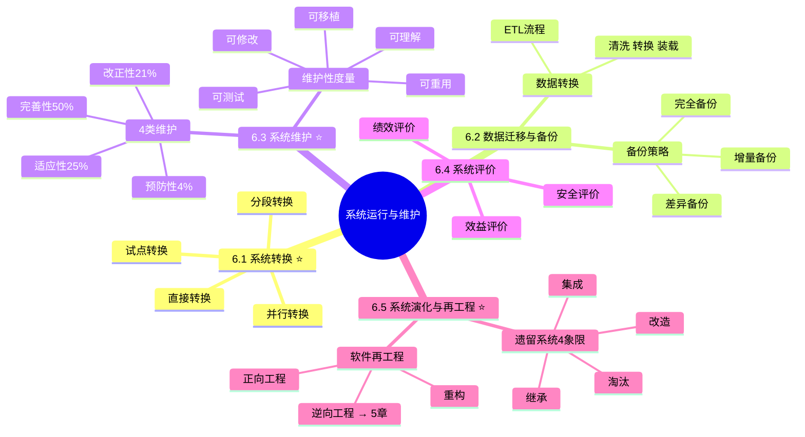

# D5 系统运行与维护 Implementation Plan

> **For agentic workers:** REQUIRED SUB-SKILL: Use superpowers:subagent-driven-development (recommended) or superpowers:executing-plans to implement this plan task-by-task. Steps use checkbox (`- [ ]`) syntax for tracking.

**Goal:** 新建 `01-综合知识/11-系统运行与维护.md`，覆盖红宝书 ch6 全部考点（系统转换/数据迁移备份/系统维护/系统评价/系统演化与再工程），与 D1-D4 风格一致。

**Architecture:** 单文件，5 个大节顺序撰写。每节独立可校验。完成后整体校对 → 用户验证 → 更新 tracker → 双提交（docs + chore）。

**Tech Stack:** Markdown + Obsidian callout + Mermaid mindmap + Block ID 锚点。

**Spec:** [2026-04-29-d5-system-operation-maintenance-design.md](../specs/2026-04-29-d5-system-operation-maintenance-design.md)

---

## Task 1：创建文件 + 标题 + 知识全景

**Files:**
- Create: `01-综合知识/11-系统运行与维护.md`

- [ ] **Step 1: 写入 frontmatter**

```yaml
---
title: 系统运行与维护
date: 2026-04-29
tags:
  - 综合知识
  - 频率/次重点
  - 红宝书/ch6
  - 知识点/系统转换
  - 知识点/数据迁移
  - 知识点/备份策略
  - 知识点/系统维护
  - 知识点/维护性
  - 知识点/遗留系统
  - 知识点/软件再工程
aliases:
  - 系统运行与维护
  - 系统转换
  - 直接转换
  - 并行转换
  - 分段转换
  - 试点转换
  - 完全备份
  - 增量备份
  - 差异备份
  - 改正性维护
  - 适应性维护
  - 完善性维护
  - 预防性维护
  - 维护性
  - 遗留系统
  - 软件再工程
  - 逆向工程
cssclasses:
  - exam-note
---
```

- [ ] **Step 2: 写入标题与 warning 顶部摘要**

```markdown
# 系统运行与维护

> [!warning] 次重点 ★★★☆（红宝书ch6）
> 选择题中常考 1-2 题，核心考点在 ==4 种系统转换方式==、==4 类维护类型与占比==、==遗留系统 4 象限演化策略==、==备份策略增量 vs 差异区分==。维护类型判定与遗留系统象限是历年高频考点。逆向工程 4 抽象层次详细推导参见 [[05-软件工程概述]]。
>
> **速查跳转**：[[#6.1 系统转换（重点★★★★）|系统转换]] · [[#6.2 数据迁移与备份恢复（次重点★★★）|备份策略]] · [[#6.3 系统维护（重点★★★★）|4类维护]] · [[#6.5 系统演化与再工程（重点★★★★）|遗留系统]]

---
```

- [ ] **Step 3: 写入 `## 知识全景` mindmap**



- [ ] **Step 4: 校对**

- 标题层级唯一（仅一处 `# 系统运行与维护`）
- mindmap 代码块 ` ```mermaid `
- frontmatter 含 `cssclasses: - exam-note`

---

## Task 2：6.1 系统转换（重点★★★★）

**Files:**
- Modify: `01-综合知识/11-系统运行与维护.md`（追加章节）

- [ ] **Step 1: 写入大节标题与导语**

```markdown
## 6.1 系统转换（重点★★★★）

新旧系统之间的过渡方式选择直接影响业务连续性和迁移风险。
```

- [ ] **Step 2: 写入 4 种转换方式对比表**

```markdown
### 6.1.1 4 种转换方式对比

> [!important] 必背对比表

| 转换方式 | 工作原理 | 风险 | 成本 | 适用场景 |
| ---- | ---- | ---- | ---- | ---- |
| **直接转换**（立即转换） | 旧系统停 → 新系统起，无过渡期 | **高** | **低** | 小型/非关键系统 |
| **并行转换** | 新旧系统 ==同时运行一段时间==，结果对比 | **低** | **高（双倍）** | 关键系统、大型业务、银行/证券 |
| **分段转换**（逐步转换） | 按 ==模块/功能== 逐步切换 | 中 | 中 | 复杂系统、可分模块 |
| **试点转换** | ==部分用户/部门== 先用，再全面推广 | 低-中 | 中 | 多分支机构、地理分散 |
```

加 block ID `^conversion-methods`。

- [ ] **Step 3: 写入题目区分技巧**

```markdown
> [!tip] 题目区分技巧（关键字捕捉）
> - 看到「核心业务、不能停」 → **并行转换**
> - 看到「按模块 / 分阶段」 → **分段转换**
> - 看到「先选试点 / 部分用户先用」 → **试点转换**
> - 看到「小系统 / 直接切换」 → **直接转换**

> [!warning] 4 种方式的核心差异
> - **风险**：并行 < 试点 ≤ 分段 < 直接
> - **成本**：直接 < 试点 ≈ 分段 < 并行
```

- [ ] **Step 4: 校对**

- 4 种方式对比表完整，5 维度（原理/风险/成本/场景）
- block ID `^conversion-methods` 加上
- 区分技巧 callout 完整

---

## Task 3：6.2 数据迁移与备份恢复（次重点★★★）

**Files:**
- Modify: `01-综合知识/11-系统运行与维护.md`（追加章节）

- [ ] **Step 1: 写入大节标题与数据迁移**

```markdown
## 6.2 数据迁移与备份恢复（次重点★★★）

### 6.2.1 数据转换与迁移（ETL 流程）

数据从旧系统到新系统的过程涉及 3 个阶段：

- **抽取（Extract）**：从源系统读取原始数据
- **转换（Transform）**：
    - **数据清洗**：去重、修正错误、补全缺失、标准化格式
    - **数据转换**：格式 / 编码 / 单位 / 业务规则映射
- **装载（Load）**：写入目标系统
    - 批量装载（一次性）
    - 增量装载（持续同步）
```

- [ ] **Step 2: 写入 3 种备份策略对比表**

```markdown
### 6.2.2 备份策略

> [!important] 3 种备份策略对比 — 必考

| 策略 | 备份范围 | 备份速度 | 占用空间 | 恢复速度 | 恢复操作 |
| ---- | ---- | ---- | ---- | ---- | ---- |
| **完全备份** | 全部数据 | 慢 | **大** | **快** | 单个完全备份即可 |
| **增量备份** | 自上次 ==任意备份== 以来变化 | **快** | **小** | **慢** | 完全 + 历次增量依次叠加 |
| **差异备份** | 自上次 ==完全备份== 以来变化 | 中 | 中 | 中 | 完全 + 最近一次差异 |

^backup-strategies
```

- [ ] **Step 3: 写入易混点与选择套路**

```markdown
> [!warning] 易混点：增量 vs 差异（关键字差一字）
> - **增量**：自上次「==任意==」备份以来变化（链式累加）
> - **差异**：自上次「==完全==」备份以来变化（独立累加）

> [!tip] 备份策略选择套路
> - 要 ==恢复快==、空间充裕 → **差异备份**（恢复只需 2 个文件）
> - 要 ==节省空间==、能接受恢复慢 → **增量备份**
> - 数据量小、要求最快恢复 → **完全备份**

典型组合策略：每周一次完全备份 + 每天一次增量/差异备份。
```

- [ ] **Step 4: 校对**

- ETL 三阶段清晰
- 3 种备份对比表 6 维度
- 增量 vs 差异 易混点 callout
- block ID `^backup-strategies` 加上

---

## Task 4：6.3 系统维护（重点★★★★）

**Files:**
- Modify: `01-综合知识/11-系统运行与维护.md`（追加章节）

- [ ] **Step 1: 写入大节标题与 4 类维护对比表**

```markdown
## 6.3 系统维护（重点★★★★）

### 6.3.1 4 类维护对比

> [!important] 必背对比表 — 历年最高频考点

| 类型 | 英文 | 触发原因 | 工作内容 | 占比 |
| ---- | ---- | ---- | ---- | ---- |
| **改正性维护**（纠错性） | Corrective | ==发现既有缺陷== / bug | 修复 bug | 约 **21%** |
| **适应性维护** | Adaptive | ==外部环境变化==（OS/硬件/数据库升级） | 适配新环境 | 约 **25%** |
| **完善性维护** | Perfective | ==用户提出新需求==、性能改进 | 增强功能、优化性能 | 约 **50%**（最高） |
| **预防性维护** | Preventive | 为提高 ==未来可维护性== | 重构、优化代码结构 | 约 **4%** |

^maintenance-types
```

- [ ] **Step 2: 写入占比口诀与判定关键字**

```markdown
> [!important] 占比口诀（必背）
> **改 21、适 25、完 50、预 4**（完善性占比最高，约一半）

^maintenance-ratio

> [!tip] 关键字判定（题目套路）
> - 看到「修复 bug / 修复缺陷」 → **改正性维护**
> - 看到「OS 升级 / 硬件更换 / 数据库迁移 / 适配新平台」 → **适应性维护**
> - 看到「新需求 / 性能优化 / 增加功能」 → **完善性维护**
> - 看到「重构 / 增强可维护性 / 提高代码质量」 → **预防性维护**

> [!warning] 易混点
> - **改正性维护** = 已发现的 bug 修复
> - **预防性维护** ≠ bug 修复，是 ==前置工作==（让代码更易维护）
> - **适应性 vs 完善性**：适应性是被动应对外部变化；完善性是主动满足用户需求
```

- [ ] **Step 3: 写入维护性 5 个子特性**

```markdown
### 6.3.2 维护性度量（5 个子特性）

| 子特性 | 英文 | 含义 |
| ---- | ---- | ---- |
| **可理解性** | Understandability | 理解软件的容易程度 |
| **可测试性** | Testability | 测试软件的容易程度 |
| **可修改性** | Modifiability | 修改软件的容易程度 |
| **可移植性** | Portability | 移到其他环境的容易程度 |
| **可重用性** | Reusability | 被复用的容易程度 |

^maintainability-attrs
```

- [ ] **Step 4: 写入维护成本影响因素**

```markdown
### 6.3.3 维护成本影响因素

- **模块独立性**：低耦合高内聚的模块容易维护
- **应用领域复杂度**：业务规则越复杂，维护越难
- **文档质量**：缺失或过期的文档显著抬高维护成本
- **人员稳定性**：人员流动导致知识丢失
- **编程语言与工具**：高级语言、强类型语言更易维护
```

- [ ] **Step 5: 校对**

- 4 类维护对比表完整 + 占比 21/25/50/4
- 占比口诀 callout 加 block ID `^maintenance-ratio`
- 关键字判定 callout 完整
- 维护性 5 子特性表
- block ID `^maintenance-types`、`^maintainability-attrs` 加上

---

## Task 5：6.4 系统评价（了解）

**Files:**
- Modify: `01-综合知识/11-系统运行与维护.md`（追加章节）

- [ ] **Step 1: 写入大节标题与三个评价维度**

```markdown
## 6.4 系统评价（了解）

> [!note]- 考点提示
> 选择题偶考。系统评价是对运行中的系统进行综合评价，决定是否保留 / 改进 / 替换，是系统全生命周期的"反馈环节"。

### 6.4.1 三个评价维度

| 维度 | 关注点 | 典型指标 |
| ---- | ---- | ---- |
| **绩效评价** | 系统运行性能 | 响应时间、吞吐量、可靠性、资源利用率 |
| **效益评价** | 经济效益 | 成本节约、效率提升、投资回报率 ROI |
| **安全评价** | 安全性、合规性 | 漏洞数、合规达标率、事故频率 |

### 6.4.2 评价时机

- **上线后 3-6 个月**：初次评价，验证投产效果
- **年度评价**：常规评价，纳入企业年度审计
- **重大变更前后**：变更评估、变更后回顾
```

- [ ] **Step 2: 校对**

- 3 个评价维度表
- 评价时机 3 个时间点

---

## Task 6：6.5 系统演化与再工程（重点★★★★）

**Files:**
- Modify: `01-综合知识/11-系统运行与维护.md`（追加章节）

- [ ] **Step 1: 写入大节标题与遗留系统 4 象限**

```markdown
## 6.5 系统演化与再工程（重点★★★★）

### 6.5.1 遗留系统 4 象限演化策略

按 ==业务价值== 与 ==技术水平== 两个维度划分 4 象限，对应不同演化策略：

> [!important] 4 象限演化策略表 — 必考

| 象限 | 业务价值 | 技术水平 | 策略 | 含义 |
| ---- | ---- | ---- | ---- | ---- |
| 业务高·技术低 | **高** | 低 | **淘汰**（弃旧建新） | 价值高但技术老旧，建议重新开发 |
| 业务高·技术高 | **高** | 高 | **集成** | 价值高技术也行，集成到企业总体架构 |
| 业务低·技术低 | 低 | 低 | **继承**（维持运行） | 价值低技术老，做最小维护 |
| 业务低·技术高 | 低 | **高** | **改造**（升级改造） | 价值低但技术新，改造提升业务价值 |

^legacy-quadrant
```

- [ ] **Step 2: 写入 4 象限易混点 callout**

```markdown
> [!warning] 4 象限易混点
> 不同教材对"业务价值"和"技术水平"的高低坐标标注可能不同，但 ==4 个策略名是固定的==：**淘汰 / 集成 / 继承 / 改造**。
>
> 答题时 ==看策略名匹配，别被坐标轴位置混淆==。

> [!tip] 策略关键字记忆
> - **业务高 + 技术低 = 淘汰**：可惜技术不行，干脆重写
> - **业务高 + 技术高 = 集成**：双高，融入总体架构
> - **业务低 + 技术低 = 继承**：双低，能跑就行
> - **业务低 + 技术高 = 改造**：技术好但价值低，改造提价值
```

- [ ] **Step 3: 写入软件再工程**

```markdown
### 6.5.2 软件再工程

> [!important] 核心公式
> **软件再工程 = 逆向工程 + 重构 + 正向工程**

^reengineering-formula

- **逆向工程**（Reverse Engineering）：从代码反推出更高抽象级别的描述
- **重构**（Restructuring）：在不改变功能的前提下，改善代码结构
- **正向工程**（Forward Engineering）：从高抽象描述重新生成新系统

> [!note]+ 逆向工程 4 抽象层次（详见 [[05-软件工程概述]]）
> 自低到高：**实现级 → 结构级 → 功能级 → 领域级**
>
> - 实现级：源代码 / 内部数据结构
> - 结构级：模块依赖关系 / 控制流
> - 功能级：模块职责 / 行为描述
> - 领域级（最高）：业务领域知识 / 概念模型
>
> 详细推导见 [[05-软件工程概述#逆向工程]]。
```

- [ ] **Step 4: 校对**

- 4 象限对比表完整（4 行 + 5 列）
- 4 象限易混点 callout
- 策略关键字记忆 callout
- 软件再工程公式 + block ID
- 逆向工程引用 [[05-软件工程概述]] 而不重复 4 抽象层次推导

---

## Task 7：关联链接 + 整体校对

**Files:**
- Modify: `01-综合知识/11-系统运行与维护.md`（追加章节 + 全文核对）

- [ ] **Step 1: 写入文末关联链接**

```markdown
---

## 关联链接

- 返回主索引：[[../MOC]]
- 综合知识全景：[[00-综合知识全景图]]
- 关联章节：
    - [[05-软件工程概述]]：逆向工程 4 抽象层次详细推导（实现/结构/功能/领域级）
    - [[09-系统质量属性与架构评估]]：可维护性是核心质量属性之一
    - [[10-软件测试]]：回归测试与维护活动配合
    - [[06-需求工程]]：变更管理 CCB 与维护需求关系
```

- [ ] **Step 2: 整体校对（spec 硬指标核对）**

逐项核对 spec 五.预期产出：
- [ ] 对比表 ≥4 个：4 种转换、3 种备份、4 类维护、4 象限演化
- [ ] 维护性 5 子特性表 + 系统评价 3 维度表（共 ≥6 个表）
- [ ] 口诀 ≥2 个：维护占比 21/25/50/4、4 象限策略关键字
- [ ] Block ID 锚点：conversion-methods、backup-strategies、maintenance-types、maintenance-ratio、maintainability-attrs、legacy-quadrant、reengineering-formula

- [ ] **Step 3: Obsidian 渲染检查**

让用户在 Obsidian 中打开文件，确认：
- mindmap 渲染正常（root → 5 大节 → 子项）
- 所有 callout 颜色正确
- 表格列对齐
- 跨文件链接 [[05-软件工程概述#逆向工程]] 可点击跳转
- 速查跳转锚点可达

- [ ] **Step 4: 暂停等用户验证**

向用户报告完成，等待用户确认无异常后再进入 Task 8。

---

## Task 8：用户验证后更新 tracker 并提交

**Files:**
- Modify: `docs/audit/revision-task-tracker.md`

- [ ] **Step 1: 提交 docs commit**

```bash
cd "/Users/wanlinruo/Library/Mobile Documents/iCloud~md~obsidian/Documents/project-003"
git add "01-综合知识/11-系统运行与维护.md"
git commit -m "docs(D5): 新建系统运行与维护，覆盖红宝书ch6全部内容

Co-Authored-By: Claude Opus 4.7 (1M context) <noreply@anthropic.com>"
```

获取 commit hash 备用。

- [ ] **Step 2: 更新 tracker D5 行**

```markdown
| D5 | 新建 `11-系统运行与维护.md` | 新建 | ch6 次重点★★★☆ | ✅已完成 | 2026-04-29 |
```

- [ ] **Step 3: 追加日志条目**

```markdown
| 2026-04-29 | D5 | 新建系统运行与维护：覆盖系统转换(直接/并行/分段/试点4方式对比+风险与成本排序+关键字区分技巧)/数据迁移与备份恢复(ETL流程抽取转换装载+清洗/3种备份策略对比6维度+增量vs差异易混"任意"vs"完全"+选择套路)/系统维护(4类维护改正性21%/适应性25%/完善性50%/预防性4%+口诀+关键字判定+预防性≠bug修复易混+维护性5子特性可理解/测试/修改/移植/重用+维护成本5因素)/系统评价(绩效/效益/安全3维度+评价时机)/系统演化与再工程(遗留系统4象限淘汰/集成/继承/改造+策略关键字+软件再工程=逆向+重构+正向+逆向工程4抽象层次引用05章)；对照红宝书ch6校准 | `<commit-hash>` | 通过 |
```

- [ ] **Step 4: 提交 chore commit**

```bash
git add docs/audit/revision-task-tracker.md
git commit -m "chore(D5): 更新任务日志，系统运行与维护验证通过

Co-Authored-By: Claude Opus 4.7 (1M context) <noreply@anthropic.com>"
```

- [ ] **Step 5: 验证 git 状态**

```bash
git log --oneline -5
git status
```

预期：两条新提交在顶部，工作区 clean。

---

## 自检（Self-Review）

- ✅ Spec 覆盖：5 大节 + 关联链接全部映射到 Task 1-7
- ✅ 无占位符：每 Task 内容具体可执行
- ✅ 类型一致：block ID 命名一致
- ✅ 风格统一：与 D1-D4 完全对齐
