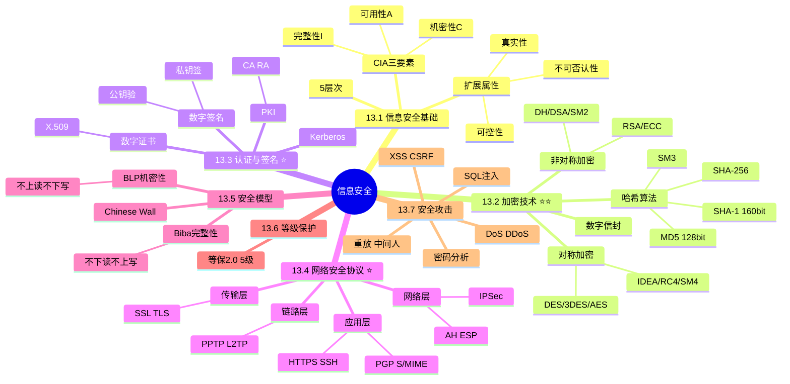

# D7 信息安全 Implementation Plan

> **For agentic workers:** REQUIRED SUB-SKILL: Use superpowers:subagent-driven-development (recommended) or superpowers:executing-plans to implement this plan task-by-task. Steps use checkbox (`- [ ]`) syntax for tracking.

**Goal:** 新建 `01-综合知识/14-信息安全.md`，覆盖红宝书 ch13 全部考点（CIA/加密/认证签名/网络安全协议/安全模型/等保/攻击类型），与 D1-D6 风格一致。

**Architecture:** 单文件，7 个大节顺序撰写。重点保障对称 vs 非对称加密对比、数字签名"私签公验"流程、各层安全协议归属、BLP/Biba 模型 4 大必考点。完成后整体校对 → 用户验证 → 更新 tracker → 双提交。

**Tech Stack:** Markdown + Obsidian callout + Mermaid mindmap + Block ID 锚点。

**Spec:** [2026-04-29-d7-information-security-design.md](../specs/2026-04-29-d7-information-security-design.md)

---

## Task 1：创建文件 + 标题 + 知识全景

**Files:**
- Create: `01-综合知识/14-信息安全.md`

- [ ] **Step 1: 写入 frontmatter**

```yaml
---
title: 信息安全
date: 2026-04-29
tags:
  - 综合知识
  - 频率/次重点
  - 红宝书/ch13
  - 知识点/CIA
  - 知识点/加密技术
  - 知识点/对称加密
  - 知识点/非对称加密
  - 知识点/哈希算法
  - 知识点/数字签名
  - 知识点/数字证书
  - 知识点/PKI
  - 知识点/网络安全协议
  - 知识点/SSL-TLS
  - 知识点/IPSec
  - 知识点/安全模型
  - 知识点/BLP
  - 知识点/Biba
  - 知识点/等级保护
  - 知识点/安全攻击
aliases:
  - 信息安全
  - CIA三要素
  - 机密性
  - 完整性
  - 可用性
  - 对称加密
  - 非对称加密
  - DES
  - AES
  - RSA
  - ECC
  - MD5
  - SHA
  - 数字签名
  - 数字证书
  - PKI
  - CA
  - X.509
  - Kerberos
  - SSL
  - TLS
  - IPSec
  - PGP
  - BLP
  - Biba
  - Chinese Wall
  - 等保2.0
  - DDoS
  - SQL注入
  - XSS
  - CSRF
  - 中间人攻击
cssclasses:
  - exam-note
---
```

- [ ] **Step 2: 写入标题与 warning 顶部摘要**

```markdown
# 信息安全

> [!warning] 次重点 ★★★☆（红宝书ch13）
> 选择题中常考 1-2 题，**核心高频考点**：==CIA 三要素==、==对称 vs 非对称加密对比==、==数字签名"私签公验"==、==各层网络安全协议归属==、==BLP（机密性）vs Biba（完整性）安全模型==、==常见攻击类型识别==。防火墙/IDS/IPS/DMZ 详见 [[03-计算机网络]]，本章不重复。
>
> **速查跳转**：[[#13.2 加密技术（重点★★★★★）|加密]] · [[#13.3 认证与数字签名（重点★★★★）|数字签名]] · [[#13.4 网络安全协议（重点★★★★）|安全协议]] · [[#13.5 安全模型（次重点★★★）|BLP/Biba]] · [[#13.7 安全攻击类型（次重点★★★）|攻击类型]]

---
```

- [ ] **Step 3: 写入 `## 知识全景` mindmap**



- [ ] **Step 4: 校对**

- 标题层级唯一
- mindmap 节点完整
- frontmatter 含 `cssclasses: - exam-note`

---

## Task 2：13.1 信息安全基础（了解）

**Files:**
- Modify: `01-综合知识/14-信息安全.md`（追加章节）

- [ ] **Step 1: 写入 CIA 三要素**

```markdown
## 13.1 信息安全基础（了解）

### 13.1.1 CIA 三要素（必考）

> [!important] 信息安全核心三要素

| 要素 | 英文 | 含义 | 典型威胁 |
| ---- | ---- | ---- | ---- |
| **机密性** | Confidentiality | 信息不被 ==非授权== 者获取 | 窃听、嗅探 |
| **完整性** | Integrity | 信息不被 ==非授权篡改== | 篡改、伪造 |
| **可用性** | Availability | 信息能被 ==授权== 用户使用 | DoS / DDoS |

^cia-triad

> [!tip] 口诀：**机完用**（机密性、完整性、可用性）
```

- [ ] **Step 2: 写入扩展属性与 5 层次**

```markdown
### 13.1.2 扩展三属性

- **真实性**（Authenticity）：身份的真实可靠
- **可控性**（Controllability）：对信息流向和行为的控制
- **不可否认性**（Non-repudiation）：发送者不能否认发送过、接收者不能否认接收过

### 13.1.3 信息安全 5 层次

由低到高：

1. **设备安全**：硬件、物理介质
2. **数据安全**：存储与传输的数据
3. **内容安全**：信息内容合法合规
4. **行为安全**：用户与系统行为可信
5. **关系安全**：系统间信任关系

### 13.1.4 安全管理范畴

除技术层面 CIA 外，还包括：
- **物理安全**：机房、设备物理保护
- **人员安全**：员工背景调查、安全培训
- **规章制度**：访问授权、应急响应、合规
```

- [ ] **Step 3: 校对**

- CIA 三要素表 + block ID
- 扩展三属性
- 5 层次列表
- 安全管理范畴

---

## Task 3：13.2 加密技术（重点★★★★★）

**Files:**
- Modify: `01-综合知识/14-信息安全.md`（追加章节）

- [ ] **Step 1: 写入对称 vs 非对称对比表**

```markdown
## 13.2 加密技术（重点★★★★★）

### 13.2.1 对称加密 vs 非对称加密（必考核心）

> [!important] 两种加密体系对比

| 维度 | 对称加密 | 非对称加密 |
| ---- | ---- | ---- |
| 别名 | 私钥加密 / 共享密钥 | 公钥加密 |
| 密钥数量 | 双方使用 ==同一把密钥== | 一对密钥（公钥 + 私钥） |
| 加密速度 | **快** | 慢（约 1000 倍差距） |
| 密钥管理 | 难（n 用户需 ==n(n-1)/2== 把密钥） | 易（n 用户共 2n 把密钥） |
| 密钥分发 | 难（共享密钥需安全通道） | 易（公钥可公开） |
| 适用场景 | 大数据量加密 | 密钥交换、数字签名 |
| 典型算法 | DES / 3DES / AES / IDEA / RC4 / SM4 | RSA / ECC / DSA / DH / ElGamal / SM2 |

^symmetric-vs-asymmetric
```

- [ ] **Step 2: 写入主流加密算法分类表**

```markdown
### 13.2.2 主流加密算法分类

> [!important] 算法归属必背表

| 类别 | 算法 | 密钥长度 | 备注 |
| ---- | ---- | ---- | ---- |
| **对称** | DES | ==56-bit== | 已不安全 |
| 对称 | 3DES | 等效 168-bit | 三次 DES |
| 对称 | **AES** | 128/192/256-bit | ==主流== |
| 对称 | IDEA | 128-bit | 强壮 |
| 对称 | RC4 | 可变 | 流密码 |
| 对称 | **SM4** | 128-bit | 国密对称 |
| **非对称** | **RSA** | 1024+ bit | 大整数因式分解 |
| 非对称 | **ECC** | 较短 | 椭圆曲线（同强度密钥更短） |
| 非对称 | DH | — | ==密钥交换==（不加密、不签名） |
| 非对称 | DSA | — | ==仅用于数字签名== |
| 非对称 | ElGamal | — | 加密 + 签名 |
| 非对称 | **SM2** | 256-bit | 国密非对称（基于 ECC） |

^crypto-algorithms

> [!warning] 易混点
> - **DH（Diffie-Hellman）**：只做 ==密钥交换==，不加密也不签名
> - **DSA**：只做 ==数字签名==，不加密
> - **AES** vs **DES**：AES 是 DES 的安全替代，密钥长度更长（128+）
```

- [ ] **Step 3: 写入哈希算法对比**

```markdown
### 13.2.3 哈希算法（消息摘要）

> [!important] 哈希算法对比

| 算法 | 摘要长度 | 安全状态 |
| ---- | ---- | ---- |
| **MD5** | ==128-bit== | ==已被破解==（仅用于校验） |
| **SHA-1** | ==160-bit== | 已被破解（不再推荐） |
| SHA-256 | 256-bit | 主流 |
| SHA-512 | 512-bit | 高安全 |
| **SM3** | 256-bit | 国密哈希 |

^hash-algorithms

哈希特性：**单向不可逆 + 任意长度输入 → 固定长度输出 + 雪崩效应**（输入微变、输出大变）。

> [!warning] 哈希位数易考点
> - MD5 = ==128 bit==
> - SHA-1 = ==160 bit==
> - 这两个数字常作为选择题选项
```

- [ ] **Step 4: 写入数字信封原理**

```markdown
### 13.2.4 数字信封（速度 + 安全兼顾）

> [!tip] 数字信封工作原理
>
> 结合对称（快）与非对称（安全）的优势：
> 1. 发送方用 ==随机生成的对称密钥 K== 加密 ==大数据==
> 2. 发送方用 ==接收方的公钥== 加密对称密钥 K
> 3. 把"加密后的数据 + 加密后的密钥 K"一起发送
> 4. 接收方用 ==自己的私钥== 解出对称密钥 K
> 5. 接收方用对称密钥 K 解出原始数据
>
> 核心思想：**非对称加密传"小"密钥，对称加密保"大"数据**。

数字信封是 SSL/TLS、PGP、S/MIME 等协议的底层思想。
```

- [ ] **Step 5: 校对**

- 对称 vs 非对称对比表 + block ID
- 加密算法分类表 + block ID
- DH 仅密钥交换、DSA 仅签名 易混点
- 哈希算法位数 MD5=128 / SHA-1=160
- 数字信封 5 步流程

---

## Task 4：13.3 认证与数字签名（重点★★★★）

**Files:**
- Modify: `01-综合知识/14-信息安全.md`（追加章节）

- [ ] **Step 1: 写入数字签名原理**

```markdown
## 13.3 认证与数字签名（重点★★★★）

### 13.3.1 数字签名原理（必考）

> [!important] 数字签名核心口诀
>
> ==**发送方用私钥签名、接收方用公钥验证**==

**完整流程**：

1. 发送方对原文做哈希得到 ==摘要 1==
2. 发送方用 ==自己的私钥== 加密摘要 1 → 数字签名
3. 发送方将 ==原文 + 数字签名== 一起发给接收方
4. 接收方用 ==发送方公钥== 解密签名得到 ==摘要 1==（验证身份）
5. 接收方对收到的原文做哈希得到 ==摘要 2==
6. 比对摘要 1 与摘要 2：
    - 一致：==原文未被篡改 + 确认是发送方所发==
    - 不一致：原文被篡改或非发送方所签

^digital-signature-flow
```

- [ ] **Step 2: 写入数字签名 4 个作用**

```markdown
### 13.3.2 数字签名作用（4 个）

> [!important] 必记 4 大作用
>
> | 作用 | 解读 |
> | ---- | ---- |
> | **认证** | 确认消息确实由签名者发出（身份认证） |
> | **完整性** | 消息未被篡改（哈希校验） |
> | **不可否认** | 发送方事后不能抵赖（==只有 TA 拥有私钥==） |
> | ==**不提供保密性**== | 数字签名 ==不加密==原文！如需保密，结合数字信封 |

> [!warning] 易混点：保密性 vs 签名
> - **保密性（加密原文）**：用 ==对方公钥== 加密 → 只有对方私钥能解
> - **签名（不可否认）**：用 ==自己私钥== 加密摘要 → 任何人公钥都能验
> - 两者使用 ==不同的密钥方向==
```

- [ ] **Step 3: 写入数字证书 / PKI / Kerberos**

```markdown
### 13.3.3 数字证书（X.509）

数字证书将 ==身份信息== 与 ==公钥== 绑定，由 ==CA（证书颁发机构）签名==。

X.509 标准证书内容：
- 版本号、序列号
- 签名算法
- 颁发者（CA）
- 有效期（NotBefore / NotAfter）
- 主体（Subject）名
- 主体公钥
- ==CA 签名==（防伪）

### 13.3.4 PKI 公钥基础设施

PKI（Public Key Infrastructure）四大组件：

| 组件 | 全称 | 职责 |
| ---- | ---- | ---- |
| **CA** | Certificate Authority | 证书颁发机构（签发、撤销） |
| **RA** | Registration Authority | 注册机构（受理申请、初审） |
| **证书库** | Repository | 公钥证书 + CRL 撤销列表存储 |
| **用户/订户** | Subscriber | 持有证书的实体 |

### 13.3.5 Kerberos 认证

基于 ==对称密钥== 的网络认证协议：

- **KDC（Key Distribution Center）**：密钥分发中心，含 ==AS（认证服务器）+ TGS（票据授予服务器）==
- 核心思想：使用票据（Ticket）实现可信认证、避免明文传输密码

> [!tip] 加密 vs 签名 选钥口诀
> - **加密**用 ==对方公钥==（保密性 → 只有对方能解）
> - **签名**用 ==自己私钥==（不可否认 → 谁都能验是你签的）
```

- [ ] **Step 4: 校对**

- 数字签名"私签公验"完整流程 + block ID
- 数字签名 4 作用
- 易混点：签名 ≠ 加密
- X.509 证书内容
- PKI 四大组件
- Kerberos KDC = AS + TGS

---

## Task 5：13.4 网络安全协议（重点★★★★）

**Files:**
- Modify: `01-综合知识/14-信息安全.md`（追加章节）

- [ ] **Step 1: 写入各层安全协议归属表**

```markdown
## 13.4 网络安全协议（重点★★★★）

### 13.4.1 各层安全协议归属（必考速记表）

> [!important] 各层安全协议对照

| OSI 层级 | TCP/IP 层级 | 安全协议 | 用途 |
| ---- | ---- | ---- | ---- |
| **应用层** | 应用层 | **PGP** | 电子邮件加密签名 |
| 应用层 | 应用层 | **S/MIME** | 安全邮件 |
| 应用层 | 应用层 | **HTTPS** = HTTP + SSL/TLS | Web 加密 |
| 应用层 | 应用层 | **SSH** | 安全远程登录（替代 Telnet） |
| **传输层** | 传输层 | **SSL / TLS** | 通用加密（HTTPS 底层） |
| **网络层** | 网际层 | **IPSec** | VPN / 站点对站点 |
| **数据链路层** | 网络接口层 | **PPTP / L2TP** | 拨号 / 隧道 VPN |

^security-protocols-by-layer

> [!tip] 速记口诀
> - 应用层：PGP / S-MIME / HTTPS / SSH
> - 传输层：SSL / TLS
> - 网络层：IPSec
> - 链路层：PPTP / L2TP
```

- [ ] **Step 2: 写入 SSL/TLS 详解**

```markdown
### 13.4.2 SSL / TLS（传输层安全）

工作位置：==TCP 之上、应用层之下==（独立的 SSL 子层）。

**三大功能**：
1. **身份认证**（基于数字证书）
2. **数据加密**（对称加密保密通信）
3. **完整性校验**（哈希 + MAC）

**握手过程简化版**：
1. 客户端发送支持的加密算法列表
2. 服务器返回选定算法 + 数字证书
3. 客户端验证证书、生成预主密钥并用 ==服务器公钥加密== 发送
4. 双方据此派生对称会话密钥
5. 后续用对称密钥加密通信

> [!note] TLS 是 SSL 的升级版
> - SSL 1.0/2.0/3.0 均已淘汰
> - TLS 1.0/1.1 也已淘汰
> - 当前主流：**TLS 1.2 / TLS 1.3**
```

- [ ] **Step 3: 写入 IPSec 详解**

```markdown
### 13.4.3 IPSec（网络层安全）

**两种工作模式**：

| 模式 | 加密对象 | 适用场景 |
| ---- | ---- | ---- |
| **传输模式** | 仅加密 IP 包的 ==Payload== | ==端到端==（主机到主机） |
| **隧道模式** | 加密 ==整个 IP 包==（含原始头） | ==网关到网关==（站点对站点 VPN） |

**两种协议**：

| 协议 | 全称 | 提供 |
| ---- | ---- | ---- |
| **AH** | Authentication Header（认证头） | ==完整性 + 认证==（不加密） |
| **ESP** | Encapsulating Security Payload | ==加密 + 完整性 + 认证== |

> [!warning] 易混点
> - AH ==不提供加密==，仅做认证与完整性
> - ESP 提供加密，是 IPSec VPN 的主流选择
> - 两者可结合使用
```

- [ ] **Step 4: 校对**

- 各层安全协议归属表 + block ID
- 速记口诀（应用 / 传输 / 网络 / 链路）
- SSL 三大功能 + 握手过程
- TLS 1.2 / 1.3 主流
- IPSec 两种模式 + 两种协议
- AH 不加密、ESP 加密 易混点

---

## Task 6：13.5 安全模型（次重点★★★）

**Files:**
- Modify: `01-综合知识/14-信息安全.md`（追加章节）

- [ ] **Step 1: 写入 3 大安全模型对比**

```markdown
## 13.5 安全模型（次重点★★★）

### 13.5.1 三大安全模型对比（必考）

> [!important] 安全模型核心对比

| 模型 | 关注属性 | 核心规则 | 关键字 |
| ---- | ---- | ---- | ---- |
| **BLP**（Bell-LaPadula） | **机密性** | 不上读、不下写 | 防泄密 |
| **Biba** | **完整性** | 不下读、不上写 | 防污染 |
| **Chinese Wall**（中国墙） | **利益冲突** | 同冲突类内已访问 A 不能再访问 B | 商业伦理 |

^security-models
```

- [ ] **Step 2: 写入 BLP 详解**

```markdown
### 13.5.2 BLP 模型（机密性）

> [!important] BLP 两大核心规则
>
> | 规则 | 简称 | 含义 |
> | ---- | ---- | ---- |
> | **简单安全特性**（ss） | ==不上读 / no read up== | 主体不能读取比自身安全级别 ==高== 的客体 |
> | **星特性**（*） | ==不下写 / no write down== | 主体不能写入比自身安全级别 ==低== 的客体 |
>
> **整体效果**：信息只能从 ==低密级流向高密级==，防止机密信息泄露。

例：
- 普通员工（低）不能读取机密文件（高）→ 不上读
- 高级别员工（高）不能向低密级文件写入 → 不下写（防止机密外泄）
```

- [ ] **Step 3: 写入 Biba 详解**

```markdown
### 13.5.3 Biba 模型（完整性）

> [!important] Biba 两大核心规则（与 BLP 镜像对称）
>
> | 规则 | 简称 | 含义 |
> | ---- | ---- | ---- |
> | **简单完整性** | ==不下读 / no read down== | 主体不能读取比自身完整级别 ==低== 的客体 |
> | **完整性 *** | ==不上写 / no write up== | 主体不能写入比自身完整级别 ==高== 的客体 |
>
> **整体效果**：防止 ==低完整性数据污染高完整性数据==。

例：
- 高完整级别系统不读取低完整级别数据（防被污染）→ 不下读
- 低完整级别用户不能向高完整级别文件写入 → 不上写

> [!warning] BLP vs Biba 易混（必考）
> - BLP：**不上读、不下写**（机密性）— 防泄密
> - Biba：**不下读、不上写**（完整性）— 防污染
> - 两者方向 ==完全相反==

> [!tip] 形象记忆
> - **BLP 像保密文件**：高级别能往下俯瞰但不能告诉低级别（不下写）；低级别看不到高级别（不上读）
> - **Biba 像水源**：上游清水不能喝下游污水（不下读）；下游污水不能反流上游（不上写）
```

- [ ] **Step 4: 写入 Chinese Wall**

```markdown
### 13.5.4 Chinese Wall 模型（利益冲突）

应用于 ==商业咨询、金融顾问== 等存在利益冲突的场景。

核心规则：将客户分为若干 ==冲突类==（Conflict Class），同一冲突类内：
- 一旦顾问访问了客户 A 的数据
- 就 ==不能再访问== 该冲突类内其他客户（B / C / D）的数据

例：咨询师为某行业 X 公司服务后，不能再为同行业 Y 公司服务。
```

- [ ] **Step 5: 校对**

- 3 大安全模型对比表 + block ID
- BLP 不上读不下写
- Biba 不下读不上写
- BLP vs Biba 易混 callout
- 形象记忆 callout
- Chinese Wall 冲突类

---

## Task 7：13.6 等级保护 + 13.7 安全攻击类型

**Files:**
- Modify: `01-综合知识/14-信息安全.md`（追加章节）

- [ ] **Step 1: 写入等保 2.0 五级**

```markdown
## 13.6 等级保护（了解）

### 13.6.1 等保 2.0 五级

| 级别 | 名称 | 受到破坏后影响 | 适用对象 |
| ---- | ---- | ---- | ---- |
| 第一级 | 用户自主保护级 | 损害公民、法人、其他组织合法权益 | 一般信息系统 |
| 第二级 | 系统审计保护级 | 严重损害公民、法人；轻微损害社会秩序、公共利益 | 一般行政事务 |
| 第三级 | 安全标记保护级 | 严重损害社会秩序公共利益、损害国家安全 | ==政府系统、银行核心、医疗等== |
| 第四级 | 结构化保护级 | 特别严重损害社会秩序公共利益、严重损害国家安全 | 重要金融、电信、能源 |
| 第五级 | 访问验证保护级 | 特别严重损害国家安全 | 极少数核心要害系统 |

> [!note] 等保 2.0 vs 等保 1.0
> 等保 2.0 = 等保 1.0 + 云计算 / 移动互联网 / 物联网 / 工业控制系统 扩展要求
```

- [ ] **Step 2: 写入安全攻击类型对比表**

```markdown
---

## 13.7 安全攻击类型（次重点★★★）

### 13.7.1 常见攻击对比

> [!important] 攻击类型必识别表

| 攻击类型 | 全称 | 工作原理 | 防御措施 |
| ---- | ---- | ---- | ---- |
| **DoS** | Denial of Service | ==大量请求耗尽资源== | 限流、防火墙规则 |
| **DDoS** | Distributed DoS | 多台肉鸡同时 DoS | CDN、流量清洗 |
| **SQL 注入** | SQL Injection | 输入 ==恶意 SQL 字符== 改变查询 | ==参数化查询==、ORM |
| **XSS** | Cross-Site Scripting | 注入恶意 JS 到 ==其他用户== 浏览器 | 输入过滤、CSP |
| **CSRF** | Cross-Site Request Forgery | 诱使用户在 ==已登录状态== 发出非预期请求 | ==Token 验证==、Referer 检查 |
| **重放攻击** | Replay Attack | 重发截获的合法请求 | Nonce、时间戳、序列号 |
| **中间人 MITM** | Man-In-The-Middle | 拦截并 ==篡改通信内容== | HTTPS、证书校验 |
| **密码分析** | Cryptanalysis | 暴力 / 字典 / 频率分析 | 高强度密钥、加盐哈希 |

^attack-types
```

- [ ] **Step 3: 写入易混点与防御口诀**

```markdown
> [!warning] XSS vs CSRF 易混（必考）
> - **XSS**：攻击 ==其他用户的浏览器==（注入恶意脚本）
> - **CSRF**：利用 ==用户当前的会话== 伪造请求
> - 共同点：都利用浏览器的"信任"

> [!tip] 防御口诀
> - **SQL 注入** → 参数化查询 / ORM
> - **XSS** → 输入过滤 + 输出转义 + CSP
> - **CSRF** → Token 验证 + Referer / Origin 检查
> - **MITM** → HTTPS + 证书校验
> - **重放** → Nonce + 时间戳 + 序列号

### 13.7.2 安全防护体系

==P²DR 模型==（Policy 策略 + Protection 保护 + Detection 检测 + Response 响应）：传统安全防护框架，强调动态主动防御。
```

- [ ] **Step 4: 校对**

- 等保 5 级对比表
- 攻击类型对比表 + block ID `^attack-types`
- XSS vs CSRF 易混
- 防御口诀
- P²DR 模型

---

## Task 8：关联链接 + 整体校对

**Files:**
- Modify: `01-综合知识/14-信息安全.md`（追加章节 + 全文核对）

- [ ] **Step 1: 写入文末关联链接**

```markdown
---

## 关联链接

- 返回主索引：[[../MOC]]
- 综合知识全景：[[00-综合知识全景图]]
- 关联章节：
    - [[03-计算机网络]]：防火墙类型 / IDS / IPS / DMZ / VPN 实现详细
    - [[15-法律法规]]：网络安全法、个人信息保护法
    - [[09-系统质量属性与架构评估]]：安全性是核心质量属性
    - [[12-系统可靠性]]：容错与安全的关系
```

- [ ] **Step 2: 整体校对（spec 硬指标核对）**

逐项核对 spec 五.预期产出：
- [ ] 对比表 ≥6 个：CIA、对称 vs 非对称、加密算法、哈希、安全协议、3 安全模型、等保、攻击类型
- [ ] 口诀 ≥3 个：CIA "机完用"、签名"私签公验"、安全协议各层 / BLP-Biba 形象记忆
- [ ] Block ID 锚点：cia-triad、symmetric-vs-asymmetric、crypto-algorithms、hash-algorithms、digital-signature-flow、security-protocols-by-layer、security-models、attack-types（共 8 个）

- [ ] **Step 3: Obsidian 渲染检查**

让用户在 Obsidian 中打开文件，确认：
- mindmap 渲染正常（root → 7 大节）
- 所有 callout 颜色正确
- 表格列对齐
- 跨文件链接 [[03-计算机网络]] 可点击
- 速查跳转锚点可达

- [ ] **Step 4: 暂停等用户验证**

向用户报告完成，等待用户确认后再进入 Task 9。

---

## Task 9：用户验证后更新 tracker 并提交

**Files:**
- Modify: `docs/audit/revision-task-tracker.md`

- [ ] **Step 1: 提交 docs commit**

```bash
cd "/Users/wanlinruo/Library/Mobile Documents/iCloud~md~obsidian/Documents/project-003"
git add "01-综合知识/14-信息安全.md"
git commit -m "docs(D7): 新建信息安全，覆盖红宝书ch13全部内容

Co-Authored-By: Claude Opus 4.7 (1M context) <noreply@anthropic.com>"
```

获取 commit hash 备用。

- [ ] **Step 2: 更新 tracker D7 行**

```markdown
| D7 | 新建 `14-信息安全.md` | 新建 | ch13 次重点★★★☆ | ✅已完成 | 2026-04-29 |
```

- [ ] **Step 3: 追加日志条目**

```markdown
| 2026-04-29 | D7 | 新建信息安全：覆盖信息安全基础(CIA三要素机完用+扩展3属性真实/可控/不可否认+5层次设备/数据/内容/行为/关系)/加密技术(对称vs非对称7维对比+主流算法分类DES/3DES/AES/IDEA/RC4/SM4-RSA/ECC/DH/DSA/SM2+DH仅密钥交换DSA仅签名易混+哈希MD5=128bit/SHA-1=160bit/SHA-256/SM3+数字信封5步=非对称传密钥+对称加数据)/认证与数字签名(数字签名"私钥签公钥验"6步流程+4作用认证/完整/不可否认/不保密+X.509证书+PKI四组件CA/RA/库/订户+Kerberos KDC=AS+TGS+加密用对方公钥签名用自己私钥)/网络安全协议(各层归属表应用层PGP/HTTPS/SSH+传输层SSL/TLS+网络层IPSec+链路层PPTP/L2TP+SSL三功能身份认证/加密/完整性+TLS1.2/1.3主流+IPSec传输vs隧道模式+AH不加密ESP加密)/安全模型(BLP机密性不上读不下写+Biba完整性不下读不上写+Chinese Wall利益冲突+BLP保密文件Biba水源记忆)/等级保护(等保2.0五级+1.0+云/移动/物联网/工控扩展)/安全攻击类型(DoS/DDoS/SQL注入/XSS/CSRF/重放/MITM/密码分析+XSS攻击其他用户CSRF利用当前会话+P²DR模型)；对照红宝书ch13校准 | `<commit-hash>` | 通过 |
```

- [ ] **Step 4: 提交 chore commit**

```bash
git add docs/audit/revision-task-tracker.md
git commit -m "chore(D7): 更新任务日志，信息安全验证通过

Co-Authored-By: Claude Opus 4.7 (1M context) <noreply@anthropic.com>"
```

- [ ] **Step 5: 验证 git 状态**

```bash
git log --oneline -5
git status
```

预期：两条新提交在顶部，工作区 clean。

---

## 自检（Self-Review）

- ✅ Spec 覆盖：7 大节 + 关联链接全部映射到 Task 1-8
- ✅ 无占位符：每 Task 内容具体可执行
- ✅ 类型一致：block ID 命名一致
- ✅ 风格统一：与 D1-D6 完全对齐
- ✅ 4 大必考点都有强化：对称 vs 非对称对比 / 数字签名"私签公验" / 安全协议层级 / BLP-Biba
