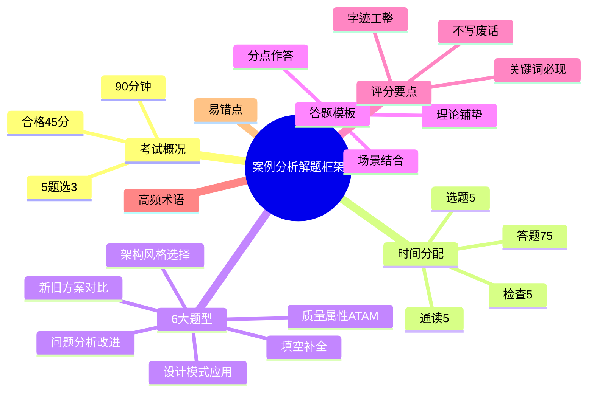

# E2 案例分析框架阶段 Implementation Plan

> **For agentic workers:** REQUIRED SUB-SKILL: Use superpowers:subagent-driven-development (recommended) or superpowers:executing-plans to implement this plan task-by-task. Steps use checkbox (`- [ ]`) syntax for tracking.

**Goal:** 建立 `02-案例分析/` 目录的整体框架：00-案例分析解题框架.md 完整版 + 9 个专题骨架文件，为后续逐个细化打底。

**Architecture:** 10 个新文件。Task 1 写完整 00 文件；Task 2 批量建立 9 个骨架文件（共享模板 + 各自特化）；Task 3 整体校对暂停验证；Task 4 更新 tracker + 双提交。

**Tech Stack:** Markdown + Obsidian callout + Mermaid mindmap + Block ID 锚点。

**Spec:** [2026-04-30-e2-case-analysis-framework-design.md](../specs/2026-04-30-e2-case-analysis-framework-design.md)

---

## Task 1：撰写 00-案例分析解题框架.md（完整内容）

**Files:**
- Create: `02-案例分析/00-案例分析解题框架.md`

- [ ] **Step 1: 写入 frontmatter**

```yaml
---
title: 案例分析解题框架
date: 2026-04-30
tags:
  - 案例分析
  - 频率/必备
  - 解题框架
  - 答题模板
aliases:
  - 案例分析
  - 解题框架
  - 答题模板
  - 时间分配
  - 评分要点
  - 题型分类
cssclasses:
  - exam-note
---
```

- [ ] **Step 2: 写入标题与 warning 顶部摘要**

```markdown
# 案例分析解题框架

> [!warning] 案例分析必读总纲
> 90 分钟、5 题选 3、合格线 45 分。==分点作答 + 专业术语 + 结合场景== 三大得分要素。所有专题文件答题前都应回查本文档。
>
> **速查跳转**：[[#0.2 时间分配策略|时间分配]] · [[#0.3 题型分类与答题套路|题型分类]] · [[#0.4 通用答题模板|答题模板]] · [[#0.5 评分要点与得分技巧|评分要点]] · [[#0.6 高频术语速查|术语速查]]

---
```

- [ ] **Step 3: 写入知识全景 mindmap**



- [ ] **Step 4: 写入 0.1 案例分析考试概况**

```markdown
## 0.1 案例分析考试概况

- **考试时长**：==90 分钟==
- **题型**：5 道大题，==每题 25 分==（总 75 分）
- **答题要求**：通常 ==5 选 3==（根据当年题型组合略有变化，可能含必答+选答）
- **合格线**：==45 分==（每题平均 ≥ 9 分即可过线）
- **题目范围**：覆盖 9 大架构专题（信息系统/层次式/云原生/SOA/嵌入式/通信/安全/大数据/系统计划）

> [!important] 三科同时合格规则
> 综合知识、案例分析、论文 ==三科必须同时达到 45 分==，任何一科不过都需要全部重考。
```

- [ ] **Step 5: 写入 0.2 时间分配策略**

```markdown
## 0.2 时间分配策略

> [!important] 90 分钟时间分配（必背）

| 阶段 | 用时 | 任务 |
| ---- | ---- | ---- |
| **通读** | 5 分钟 | 全部 5 道题快速浏览，标注熟悉 / 不熟悉 |
| **选题** | 5 分钟 | 选 3 道最有把握的，按难度从易到难排序 |
| **答题** | ==75 分钟== | 每题 ==25 分钟==（理论 5 分钟 + 答题 18 分钟 + 检查 2 分钟） |
| **检查** | 5 分钟 | 核对题号、补漏、调整字迹 |

^time-allocation

> [!warning] 时间陷阱
> - 不要在某一题上 ==超过 30 分钟==，及时止损切换
> - 必答题先答（如果有的话），不能漏
> - 留出 ==至少 5 分钟检查==，避免漏题号
```

- [ ] **Step 6: 写入 0.3 题型分类与答题套路**

```markdown
## 0.3 题型分类与答题套路

> [!important] 6 大常考题型

### 0.3.1 架构风格选择题

- **识别关键字**：「采用何种架构风格」「为什么选择 X 架构」「对比 X 与 Y」
- **答题套路**：
    1. 列出可选架构风格 3-4 个
    2. 对比优缺点（用表格 / 分点）
    3. 结合题目场景选定 + 说明理由
- **常见考点**：管道-过滤器、C/S vs B/S、分层、事件驱动、SOA、微服务

### 0.3.2 质量属性分析题（ATAM）

- **识别关键字**：「敏感点」「权衡点」「风险点」「ATAM」「质量属性场景」
- **答题套路**：
    1. **敏感点**：影响某个质量属性的设计决策
    2. **权衡点**：影响 ==多个质量属性== 的决策（往往是 trade-off，如性能 vs 安全）
    3. **风险点**：可能引发问题的决策
    4. 结合质量属性场景 6 要素：刺激源 / 刺激 / 制品 / 环境 / 响应 / 响应度量

### 0.3.3 设计模式应用题

- **识别关键字**：「该场景适合什么设计模式」「画 UML 类图」「列出参与者」
- **答题套路**：
    1. 识别场景中的 ==变化点 / 共性需求==
    2. 给出设计模式名 + 类型（创建型 / 结构型 / 行为型）
    3. 列出参与者（角色名 + 职责）
    4. 可加 UML 类图（手绘示意，标清类名与关系）

### 0.3.4 新旧方案对比题

- **识别关键字**：「比较 A 与 B 的优缺点」「将 A 改造为 B 的影响」
- **答题套路**：
    1. 用 ==对比表== 列出 A 与 B 的差异（5-6 个维度）
    2. 维度：架构层级、扩展性、可维护性、性能、成本、适用场景
    3. 总结改造的优势 + 风险

### 0.3.5 填空补全题

- **识别关键字**：架构图 / 表格 / 流程图中有 ==(1)(2)(3)== 空白
- **答题套路**：
    1. 通读全图 / 全表，理解整体逻辑
    2. 根据上下文推测空白位置的术语
    3. 用 ==专业名词== 填空（不要写大白话）

### 0.3.6 问题分析改进题

- **识别关键字**：「该方案存在哪些问题」「如何改进」「给出建议」
- **答题套路**：
    1. **问题识别**：分点列出 3-5 个问题（可结合质量属性维度）
    2. **改进措施**：每个问题对应给出 1-2 个具体改进
    3. 结合架构原则（高内聚低耦合 / 单一职责 / 开闭原则）说明
```

- [ ] **Step 7: 写入 0.4 通用答题模板**

```markdown
## 0.4 通用答题模板

> [!important] 答题三段论结构（万能模板）
>
> 1. **第一段：理论铺垫**（1-2 句）— 用专业术语定义概念
> 2. **第二段：分点作答**（核心）— 用 (1)(2)(3) 编号
> 3. **第三段：结合题目场景**（1-2 句）— 把理论落到题目里

^answer-template

### 0.4.1 架构风格选择 答题模板

> [!tip] 模板示例
>
> **理论**：架构风格反映了软件系统的组织结构与组件交互方式。常见的架构风格有 ==分层、管道-过滤器、C/S、B/S、事件驱动、SOA== 等。
>
> **分点对比**：
> - （1）X 风格：优点 / 缺点 / 适用场景
> - （2）Y 风格：优点 / 缺点 / 适用场景
> - （3）综合考虑题目中的 ==高并发 / 扩展性 / 实时性 / 安全性== 等需求
>
> **结论**：本系统应采用 ==<风格名>==。原因是 <结合题目关键词>。

### 0.4.2 质量属性 ATAM 答题模板

> [!tip] 模板示例
>
> **理论**：ATAM 通过分析架构对质量属性的影响，识别 ==敏感点 / 权衡点 / 风险点==。
>
> **分点分析**：
> - **敏感点**：<某设计决策> 显著影响 <某属性>，例如 <举例>
> - **权衡点**：<某决策> 同时影响 <属性 A> 和 <属性 B>，往往需要 trade-off
> - **风险点**：<某决策> 可能导致 <某问题>，需要补救方案

### 0.4.3 设计模式应用 答题模板

> [!tip] 模板示例
>
> **理论**：本场景的核心问题是 <识别变化点>，对应 ==<设计模式名>==（<创建型/结构型/行为型>）。
>
> **参与者**：
> - <角色 1>：<职责>
> - <角色 2>：<职责>
>
> **协作**：<两者如何协同工作>
>
> **应用到题目**：<把场景中的实体映射到模式角色>

### 0.4.4 新旧方案对比 答题模板

> [!tip] 模板示例
>
> | 维度 | 旧方案 (A) | 新方案 (B) |
> | ---- | ---- | ---- |
> | 架构层级 | … | … |
> | 扩展性 | … | … |
> | 可维护性 | … | … |
> | 性能 | … | … |
> | 成本 | … | … |
> | 适用场景 | … | … |
>
> **结论**：在 <场景关键字> 下，新方案的 <优势> 更突出，建议改造。
```

- [ ] **Step 8: 写入 0.5 评分要点与得分技巧**

```markdown
## 0.5 评分要点与得分技巧

> [!important] 5 大得分要素（按重要性排序）

| # | 要素 | 说明 | 失分点 |
| ---- | ---- | ---- | ---- |
| 1 | **分点作答** | 用 (1)(2)(3) 编号，阅卷按点给分 | 没编号或编号混乱 |
| 2 | **专业术语** | 用规范术语而非大白话 | "高并发"写成"很多人用" |
| 3 | **结合场景** | 理论 + 题目关键词 | 空谈理论、不落地 |
| 4 | **写满但不废话** | 每点 2-3 句说清楚 | 大段废话或过于简略 |
| 5 | **字迹工整** | 手写卷面整洁 | 字迹潦草直接扣印象分 |

> [!warning] 失分高发区
> - **题号错位**：5 选 3 不要做超过 3 道，多做不加分还浪费时间
> - **必答题漏做**：仔细看题目要求，"必答 1 + 选答 2" vs "5 选 3"
> - **ATAM 三点混淆**：敏感点、权衡点、风险点的区分必须清晰
> - **C/S vs B/S 答题**：用"客户端/服务器"、"浏览器/服务器"等专业表述

> [!tip] 答题节奏建议
> - 每题花 2 分钟在草稿纸上列要点
> - 直接用要点写答案，不要先写完整草稿
> - 答题时 ==字数控制== 在 200-300 字 / 题（每个分点 50-80 字）
```

- [ ] **Step 9: 写入 0.6 高频术语速查**

```markdown
## 0.6 高频术语速查（按主题分组）

> [!note]+ 答题用语规范
> 用专业术语而非大白话，是案例分析得分的核心。考前过一遍本表，确保答题时能"调用"。

### 0.6.1 架构风格

==分层架构 / 管道-过滤器 / 客户/服务器 C/S / 浏览器/服务器 B/S / 事件驱动 / 黑板模式 / 仓库模式 / SOA / 微服务 / 事件溯源==

### 0.6.2 质量属性（必背 6 个）

| 属性 | 关键场景 |
| ---- | ---- |
| **可用性** | MTBF、MTTR、故障检测、冗余 |
| **可修改性** | 模块化、低耦合、扩展点 |
| **性能** | 响应时间、吞吐量、负载、缓存 |
| **安全性** | 认证、授权、加密、审计 |
| **可测试性** | 测试桩、mock、覆盖率 |
| **易用性** | 用户体验、错误恢复、引导 |

### 0.6.3 设计模式（GoF 23 种 — 高频）

- **创建型**：单例、工厂方法、抽象工厂、建造者、原型
- **结构型**：适配器、装饰器、代理、外观、桥接、组合
- **行为型**：观察者、策略、责任链、命令、状态、模板方法、迭代器

### 0.6.4 SOA / 微服务

==WSDL / SOAP / UDDI / BPEL / ESB / REST / RPC / 服务注册发现 / 服务网格 Service Mesh / API Gateway==

### 0.6.5 云原生

==容器 / Docker / Kubernetes K8s / Serverless / FaaS / 服务网格 / Istio / 12-Factor / DevOps / CI/CD==

### 0.6.6 大数据

==Lambda 架构 / Kappa 架构 / Hadoop / HDFS / MapReduce / Spark / Flink / Kafka / 数据湖 / 数据仓库 / OLAP / OLTP==

### 0.6.7 安全

==认证 / 授权 / 加密 / 完整性 / 不可否认 / 防火墙 / IDS / IPS / WPDRRC / OSI 安全体系 / BLP / Biba==

### 0.6.8 嵌入式

==嵌入式 OS / RTOS / DARTS / ABSD / ADD / 中间件 / 实时性 / 资源受限==
```

- [ ] **Step 10: 写入 0.7 易错点与注意事项**

```markdown
## 0.7 易错点与注意事项

> [!warning] 必避免的 6 大错误

1. **题号错位**：5 选 3 题，超答的部分不会加分，反而浪费时间
2. **必答题漏做**：开考第一时间确认题目结构（必答 + 选答 / 全选答）
3. **大白话答题**：用"很多人用"代替"高并发"会被扣分
4. **不分点**：阅卷按点给分，不分点的答案被认为是"流水账"
5. **理论 ≠ 应用**：只写理论不结合场景，得不到结合分
6. **字迹潦草**：手写卷面是直接的视觉印象，会拉低整体分数

> [!tip] 心态建议
> - 案例分析 ==45 分及格==，不需要追求满分
> - 每题尽力答好 60% 即可（15/25）
> - 3 道题 × 15 分 = 45 分，刚好及格

> [!important] 考前最后 1 周准备清单
> - [ ] 重点背 ==9 大专题的标志性术语==
> - [ ] 通读 ==[[#0.4 通用答题模板]]==
> - [ ] 模拟做 1-2 套真题，控制时间
> - [ ] 高频专题：信息系统、层次式、云原生、SOA、安全、大数据
```

- [ ] **Step 11: 写入关联链接**

```markdown
---

## 关联链接

- 返回主索引：[[../MOC]]
- 综合知识全景：[[../01-综合知识/00-综合知识全景图]]
- **9 大专题文件**：
    - [[01-系统计划]] #中频
    - [[02-信息系统架构设计]] #高频
    - [[03-层次式架构设计]] #高频
    - [[04-云原生架构设计]] #高频
    - [[05-面向服务架构设计]] #高频
    - [[06-嵌入式系统架构设计]] #中频
    - [[07-通信系统架构设计]] #中频
    - [[08-安全架构设计]] #高频
    - [[09-大数据架构设计]] #高频
- 论文方向：[[../03-论文/00-论文写作框架]]（待建）
```

- [ ] **Step 12: 校对 00 文件**

- 标题层级唯一
- mindmap 渲染正常
- 7 大节齐全：考试概况 / 时间分配 / 题型分类 / 答题模板 / 评分要点 / 高频术语 / 易错点
- 时间分配 5/5/75/5 + 6 大题型 + 3 段论模板 + 5 大得分要素

---

## Task 2：批量建立 9 个专题骨架文件

**Files:**
- Create: `02-案例分析/01-系统计划.md` 至 `02-案例分析/09-大数据架构设计.md`（共 9 个文件）

每个骨架文件采用统一模板（frontmatter + 标题 + warning + mindmap + X.1-X.4 占位 + 关联链接）。

> [!important] 通用骨架模板（每个文件都用此结构）
>
> 1. frontmatter：title / date / tags（必含 `案例分析`、`频率/<高频|中频>`）/ aliases / cssclasses
> 2. 一级标题：`# <专题名>`
> 3. warning callout：标记骨架阶段、列出核心考点
> 4. mindmap：root + 4-5 个核心分支
> 5. X.1 核心概念（待细化）— note callout 占位
> 6. X.2 关键技术与架构（待细化）— note callout 占位
> 7. X.3 典型考点与解题套路（待细化）— note callout 占位
> 8. X.4 真题与练习（待细化）— note callout 占位
> 9. 关联链接：返回 [[00-案例分析解题框架]] + [[../MOC]] + 关联综合知识章节

下面 9 个 Step 分别写入 9 个文件。每个文件按"特化点"差异化。

- [ ] **Step 1: 写入 `02-案例分析/01-系统计划.md`**（中频，编号 1.x）

frontmatter 关键字段：
- title: 系统计划
- tags: `案例分析` / `频率/中频` / `题型/系统计划` / `知识点/可行性研究` / `知识点/成本效益分析`
- aliases: 系统计划 / 可行性研究 / 成本效益分析 / 新旧系统比较

warning 内容：
> 中频考点（约 1-2 年考一次）。核心考点：==可行性研究 4 类==（经济/技术/操作/法律）、==成本效益分析==、==新旧系统比较==。

mindmap：
```
root((系统计划))
  可行性研究
    经济
    技术
    操作
    法律
  成本效益分析
    NPV
    IRR
    投资回收期
  新旧系统比较
  系统规划方法
```

X.1-X.4 占位重点（在每个 callout 中提示）：
- X.1 核心概念：可行性 4 类、系统规划生命周期
- X.2 关键技术与架构：成本效益分析公式（NPV / IRR / 投资回收期）
- X.3 典型考点：新旧系统对比表答题套路
- X.4 真题与练习：列 1-2 道历年真题题目（不展开答案）

关联综合知识：[[../01-综合知识/06-需求工程]]、[[../01-综合知识/13-项目管理]]

- [ ] **Step 2: 写入 `02-案例分析/02-信息系统架构设计.md`**（高频，编号 2.x）

frontmatter：
- title: 信息系统架构设计
- tags: `案例分析` / `频率/高频` / `题型/信息系统架构` / `知识点/C-S` / `知识点/B-S` / `知识点/SOA` / `知识点/TOGAF`
- aliases: 信息系统架构 / C/S / B/S / 三层架构 / TOGAF / 信息化战略

warning：
> 高频考点（几乎每年必考）。核心考点：==C/S vs B/S 对比==、==三层架构 vs SOA==、==TOGAF-ADM 9 阶段==、==信息化战略规划==。

mindmap：
```
root((信息系统架构))
  架构模型
    C/S
    B/S
    三层架构
  SOA
  TOGAF-ADM
  信息化战略
    EA企业架构
    业务架构
    数据架构
    应用架构
    技术架构
```

X.1-X.4 占位重点：
- X.1 核心概念：信息系统层级、企业架构 EA
- X.2 关键技术与架构：C/S vs B/S vs 三层 对比表、TOGAF-ADM 9 阶段图
- X.3 典型考点：架构选型答题套路、信息化战略规划题
- X.4 真题与练习：1-2 道高频真题

关联综合知识：[[../01-综合知识/08-系统架构设计]]、[[../01-综合知识/06-需求工程]]

- [ ] **Step 3: 写入 `02-案例分析/03-层次式架构设计.md`**（高频，编号 3.x）

frontmatter：
- title: 层次式架构设计
- tags: `案例分析` / `频率/高频` / `题型/层次式` / `知识点/MVC` / `知识点/MVP` / `知识点/MVVM`
- aliases: 层次式架构 / 表现层 / 中间层 / 数据访问层 / MVC / MVP / MVVM / DAO

warning：
> 高频考点。核心考点：==4 层架构==（表现 / 业务 / 数据访问 / 数据）、==MVC / MVP / MVVM 对比==、==物联网 3 层==。

mindmap：
```
root((层次式架构))
  4层架构
    表现层
    业务层
    数据访问层DAO
    数据层
  MVC/MVP/MVVM
    MVC
    MVP
    MVVM
  物联网3层
    感知/网络/应用
```

X.1-X.4 占位重点：
- X.1 核心概念：分层职责、依赖方向（上层→下层）
- X.2 关键技术与架构：MVC / MVP / MVVM 对比表（数据流向、UI 测试性）
- X.3 典型考点：选择 MVx 模式答题套路
- X.4 真题与练习：1-2 道真题

关联综合知识：[[../01-综合知识/08-系统架构设计]]、[[../01-综合知识/07-系统设计]]

- [ ] **Step 4: 写入 `02-案例分析/04-云原生架构设计.md`**（高频，编号 4.x）

frontmatter：
- title: 云原生架构设计
- tags: `案例分析` / `频率/高频` / `题型/云原生` / `知识点/容器` / `知识点/微服务` / `知识点/Serverless` / `知识点/服务网格`
- aliases: 云原生 / 容器 / Docker / Kubernetes / K8s / 微服务 / Serverless / 服务网格 / Istio / 12-Factor

warning：
> 高频考点（近年新增热点）。核心考点：==容器化（Docker/K8s）==、==微服务设计原则==、==Serverless==、==服务网格 Istio==、==12-Factor 原则==。

mindmap：
```
root((云原生))
  容器
    Docker
    Kubernetes
  微服务
    设计原则
    服务拆分
  Serverless
    FaaS
  服务网格
    Istio
    Envoy
  12-Factor
  DevOps
```

X.1-X.4 占位重点：
- X.1 核心概念：CNCF 定义、4 大特征（容器化 / 微服务 / DevOps / CI-CD）
- X.2 关键技术与架构：K8s 核心组件、Istio 控制平面 vs 数据平面
- X.3 典型考点：单体 vs 微服务改造、Serverless 适用场景
- X.4 真题与练习：1-2 道真题

关联综合知识：[[../01-综合知识/08-系统架构设计]]、[[../01-综合知识/03-计算机网络]]

- [ ] **Step 5: 写入 `02-案例分析/05-面向服务架构设计.md`**（高频，编号 5.x）

frontmatter：
- title: 面向服务架构设计
- tags: `案例分析` / `频率/高频` / `题型/SOA` / `知识点/SOA` / `知识点/微服务` / `知识点/ESB` / `知识点/REST`
- aliases: SOA / 面向服务架构 / WSDL / SOAP / UDDI / BPEL / ESB / REST / 微服务

warning：
> 高频考点。核心考点：==SOA 5 原则==、==Web Service 三大标准==（WSDL/SOAP/UDDI）、==BPEL 流程编排==、==ESB 企业服务总线==、==REST vs SOAP==、==SOA vs 微服务==。

mindmap：
```
root((SOA))
  SOA原则
    松耦合
    可重用
    自治
    无状态
    可发现
  Web Service
    WSDL描述
    SOAP通信
    UDDI注册
  BPEL编排
  ESB
  REST
  微服务对比
```

X.1-X.4 占位重点：
- X.1 核心概念：SOA 定义、5 大原则
- X.2 关键技术与架构：WSDL/SOAP/UDDI 三角关系、ESB 角色、REST 6 约束
- X.3 典型考点：SOA vs 微服务对比题、ESB 选择题
- X.4 真题与练习：1-2 道真题

关联综合知识：[[../01-综合知识/08-系统架构设计]]

- [ ] **Step 6: 写入 `02-案例分析/06-嵌入式系统架构设计.md`**（中频，编号 6.x）

frontmatter：
- title: 嵌入式系统架构设计
- tags: `案例分析` / `频率/中频` / `题型/嵌入式` / `知识点/RTOS` / `知识点/DARTS` / `知识点/ABSD` / `知识点/ADD`
- aliases: 嵌入式系统 / RTOS / 实时系统 / DARTS / ABSD / ADD / 嵌入式中间件

warning：
> 中频考点。核心考点：==嵌入式硬件体系==、==RTOS 实时操作系统==、==嵌入式数据库==、==嵌入式中间件==、==DARTS / ABSD / ADD 设计方法==。

mindmap：
```
root((嵌入式系统))
  硬件体系
    处理器
    存储
    外设
  RTOS
    硬实时
    软实时
  嵌入式数据库
  嵌入式中间件
  设计方法
    ABSD
    ADD
    DARTS
```

X.1-X.4 占位重点：
- X.1 核心概念：嵌入式特征（资源受限 / 实时性 / 专用性）、硬实时 vs 软实时
- X.2 关键技术与架构：RTOS 调度算法、DARTS 流程
- X.3 典型考点：嵌入式系统选型、ABSD 应用题
- X.4 真题与练习：1-2 道真题

关联综合知识：[[../01-综合知识/01-计算机组成原理]]、[[../01-综合知识/02-操作系统]]、[[../01-综合知识/08-系统架构设计]]

- [ ] **Step 7: 写入 `02-案例分析/07-通信系统架构设计.md`**（中频，编号 7.x）

frontmatter：
- title: 通信系统架构设计
- tags: `案例分析` / `频率/中频` / `题型/通信系统` / `知识点/局域网` / `知识点/广域网` / `知识点/5G` / `知识点/SDN`
- aliases: 通信系统架构 / LAN / WAN / 5G / SDN / 存储网络 / SAN / NAS / 网络安全架构

warning：
> 中频考点。核心考点：==LAN / WAN / 5G 三大场景==、==存储网络 SAN/NAS/DAS==、==SDN 三层架构==、==网络安全架构==。

mindmap：
```
root((通信系统))
  局域网LAN
  广域网WAN
  5G
    eMBB
    uRLLC
    mMTC
  存储网络
    DAS
    NAS
    SAN
  SDN
  网络安全架构
```

X.1-X.4 占位重点：
- X.1 核心概念：通信架构层级、5G 三大特征
- X.2 关键技术与架构：SDN 三层、SAN/NAS/DAS 对比
- X.3 典型考点：网络规划题、5G 场景应用题
- X.4 真题与练习：1-2 道真题

关联综合知识：[[../01-综合知识/03-计算机网络]]、[[../01-综合知识/14-信息安全]]

- [ ] **Step 8: 写入 `02-案例分析/08-安全架构设计.md`**（高频，编号 8.x）

frontmatter：
- title: 安全架构设计
- tags: `案例分析` / `频率/高频` / `题型/安全架构` / `知识点/安全模型` / `知识点/WPDRRC` / `知识点/OSI安全体系`
- aliases: 安全架构 / BLP / Biba / WPDRRC / OSI 安全体系 / 数据库安全 / 脆弱性分析

warning：
> 高频考点。核心考点：==安全模型 BLP/Biba/Chinese Wall==、==WPDRRC 6 环节==、==OSI 安全体系 7 服务 8 机制==、==数据库安全==、==脆弱性分析==。

mindmap：
```
root((安全架构))
  安全模型
    BLP机密性
    Biba完整性
    Chinese Wall
  WPDRRC
    预警
    保护
    检测
    响应
    恢复
    反击
  OSI安全体系
    7服务
    8机制
  数据库安全
  脆弱性分析
```

X.1-X.4 占位重点：
- X.1 核心概念：信息安全三性（保密、完整、可用）+ 扩展属性
- X.2 关键技术与架构：BLP vs Biba 规则对比、WPDRRC 6 环节、OSI 7 服务 + 8 机制
- X.3 典型考点：安全场景应用题、安全模型选择题
- X.4 真题与练习：1-2 道真题

关联综合知识：[[../01-综合知识/14-信息安全]]、[[../01-综合知识/09-系统质量属性与架构评估]]

- [ ] **Step 9: 写入 `02-案例分析/09-大数据架构设计.md`**（高频，编号 9.x）

frontmatter：
- title: 大数据架构设计
- tags: `案例分析` / `频率/高频` / `题型/大数据` / `知识点/Lambda` / `知识点/Kappa` / `知识点/Hadoop` / `知识点/Spark`
- aliases: 大数据架构 / Lambda 架构 / Kappa 架构 / Hadoop / HDFS / MapReduce / Spark / Flink / Kafka / 数据湖 / 数据仓库

warning：
> 高频考点。核心考点：==Lambda 架构==（批+流双层）、==Kappa 架构==（仅流）、==Hadoop 生态==、==Spark / Flink==、==数据湖 vs 数据仓库==。

mindmap：
```
root((大数据架构))
  Lambda架构
    批处理层
    速度层
    服务层
  Kappa架构
    仅流处理
  Hadoop生态
    HDFS
    MapReduce
    YARN
  Spark
  Flink
  Kafka
  数据湖vs数据仓库
```

X.1-X.4 占位重点：
- X.1 核心概念：大数据 5V、批处理 vs 流处理
- X.2 关键技术与架构：Lambda vs Kappa 对比图、Hadoop 三大组件
- X.3 典型考点：大数据架构选型、Lambda/Kappa 选择题
- X.4 真题与练习：1-2 道真题

关联综合知识：[[../01-综合知识/04-数据库系统]]、[[../01-综合知识/16-其他知识]]

- [ ] **Step 10: 校对 9 个骨架文件**

- 每个文件 70-100 行（包含完整 frontmatter + warning + mindmap + 4 占位 callout + 关联链接）
- 9 个文件标题与 frontmatter title 一致
- 跨文件链接 [[00-案例分析解题框架]] 在 9 个文件中都存在
- 关联综合知识链接路径正确（`[[../01-综合知识/...]]`）
- mindmap 节点数 4-6 个核心分支，无层级错误

---

## Task 3：整体校对 + 用户验证暂停

**Files:**
- Modify: 无（仅校对）

- [ ] **Step 1: 文件清单核对**

```bash
ls -la "02-案例分析/"
```

预期输出：10 个 `.md` 文件（00 + 01-09）

- [ ] **Step 2: 行数核对**

```bash
wc -l "02-案例分析/"*.md
```

预期：
- 00 完整版 ~350-450 行
- 01-09 每个 ~70-100 行
- 总计 ~1100 行

- [ ] **Step 3: Obsidian 渲染检查**

让用户在 Obsidian 中打开每个文件，确认：
- 00 的 mindmap、callout、表格全部渲染正常
- 9 个骨架文件的 mindmap + 4 个占位 callout 正常显示
- 跨文件链接 [[00-案例分析解题框架]] 在每个骨架中都可点击跳转
- 关联综合知识链接 [[../01-综合知识/...]] 可跳转到对应章节

- [ ] **Step 4: 暂停等用户验证**

报告完成，等待用户确认无异常后再进入 Task 4。

---

## Task 4：用户验证后更新 tracker 并提交

**Files:**
- Modify: `docs/audit/revision-task-tracker.md`

- [ ] **Step 1: 提交 docs commit**

```bash
cd "/Users/wanlinruo/Library/Mobile Documents/iCloud~md~obsidian/Documents/project-003"
git add "02-案例分析/"
git commit -m "docs(E2): 建立案例分析框架，00完整+9专题骨架

Co-Authored-By: Claude Opus 4.7 (1M context) <noreply@anthropic.com>"
```

获取 commit hash 备用。

- [ ] **Step 2: 更新 tracker E2 行（标记为框架阶段已完成）**

由于 E2 是分阶段任务，将原 E2 行细化拆分为 E2 框架与后续 E2-X1...E2-X9 子任务，或直接备注：

```markdown
| E2 | 案例分析各专题 | 新建 | 沿用原计划，按红宝书优先级排列 | 🟡 框架阶段完成 / 9 专题待细化 | 2026-04-30（框架） |
```

- [ ] **Step 3: 追加日志条目**

```markdown
| 2026-04-30 | E2-框架 | 建立案例分析框架阶段：00-案例分析解题框架.md完整版(考试概况90分钟5选3+时间分配5/5/75/5+6大题型架构选择/质量ATAM/设计模式/方案对比/填空/问题分析+通用答题三段论模板理论铺垫+分点作答+场景结合+5大得分要素分点/术语/场景/写满/字迹+8大主题术语速查架构风格/质量属性/设计模式/SOA/云原生/大数据/安全/嵌入式+6大易错点+1周准备清单)/9个专题骨架文件统一模板frontmatter+warning+mindmap+X.1-X.4占位+关联链接(01系统计划中频/02信息系统架构高频/03层次式高频/04云原生高频/05SOA高频/06嵌入式中频/07通信中频/08安全高频/09大数据高频)；后续将逐个专题细化 | `<commit-hash>` | 通过（框架阶段） |
```

- [ ] **Step 4: 提交 chore commit**

```bash
git add docs/audit/revision-task-tracker.md
git commit -m "chore(E2): 更新任务日志，案例分析框架阶段完成

Co-Authored-By: Claude Opus 4.7 (1M context) <noreply@anthropic.com>"
```

- [ ] **Step 5: 验证 git 状态**

```bash
git log --oneline -5
git status
```

预期：两条新提交在顶部，工作区 clean。

---

## 自检（Self-Review）

- ✅ Spec 覆盖：00 完整内容 7 大节（考试概况/时间/题型/模板/评分/术语/易错）+ 9 骨架统一模板 + 各特化点全部映射到 Task 1-2
- ✅ 无占位符：00 的 7 大节完整内容已写入 Task 1 的 11 个 step；9 骨架的 frontmatter / warning / mindmap / X.1-X.4 占位提示在 Task 2 的 9 个 step 中明确
- ✅ 类型一致：所有 wiki link 使用 `[[文件名]]` 或 `[[../01-综合知识/文件名]]` 格式统一
- ✅ 风格统一：与综合知识 D1-D7 模板对齐
