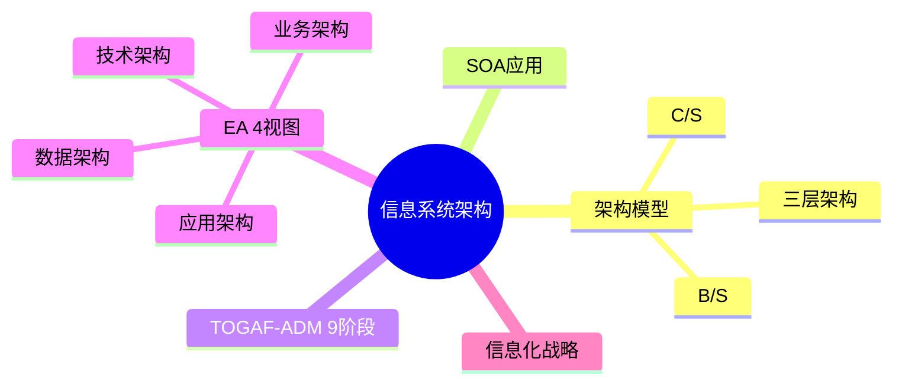

# E2-02 信息系统架构设计 细化 Implementation Plan

> **For agentic workers:** REQUIRED SUB-SKILL: Use superpowers:subagent-driven-development (recommended) or superpowers:executing-plans to implement this plan task-by-task. Steps use checkbox (`- [ ]`) syntax for tracking.

**Goal:** 将 `02-案例分析/02-信息系统架构设计.md` 从骨架（105 行）细化为完整版（250-350 行），覆盖 C/S vs B/S vs 三层、TOGAF-ADM、EA 4 视图、信息化战略 + 2 道真题示例。

**Architecture:** 单文件重写（保留原 frontmatter / 标题 / warning / mindmap，扩充 2.1-2.4 与关联链接）。完成后用户验证 → 更新 tracker → 双提交。

**Tech Stack:** Markdown + Obsidian callout + Mermaid mindmap + Block ID 锚点。

**Spec:** [2026-05-02-e2-02-information-system-architecture-design.md](../specs/2026-05-02-e2-02-information-system-architecture-design.md)

---

## Task 1：重写文件（单次 Write 完成所有 4 节内容）

**Files:**
- Modify: `02-案例分析/02-信息系统架构设计.md`（重写为细化版）

> 内容详尽参照 spec 三、各节内容设计。本 plan 只列写入步骤与校对项；具体内容（表格、callout、真题答案）按 spec 落地。

- [ ] **Step 1: 保留 frontmatter 头部**

frontmatter 沿用骨架已有版本，将 tags 中 `频率/高频` 和 aliases 等保留。

- [ ] **Step 2: 保留标题与 warning callout**

```markdown
# 信息系统架构设计

> [!warning] 高频考点（几乎每年必考）
> 核心考点：==C/S vs B/S 对比==、==三层架构 vs SOA==、==TOGAF-ADM 9 阶段==、==信息化战略规划==、==企业架构 EA 4 视图==（业务/数据/应用/技术）。
>
> **状态**：✅ 已细化
>
> **速查跳转**：[[#2.2.1 C/S vs B/S vs 三层架构（核心对比）|C/S/B/S/三层]] · [[#2.2.2 TOGAF-ADM 9 阶段（必背）|TOGAF-ADM]] · [[#2.4 真题与练习|真题]]
```

- [ ] **Step 3: 写入知识全景 mindmap**

沿用骨架的 mindmap，补充 EA 4 视图分支：



- [ ] **Step 4: 写入 2.1 核心概念**

3 个子节：
- 2.1.1 信息系统层级（战略/战术/操作 3 层级表）
- 2.1.2 EA 4 视图（业务/数据/应用/技术对比表 + block ID `^ea-4views`）
- 2.1.3 信息化战略与对齐

加 callout：`> [!important]` EA 4 视图、`> [!tip]` 信息系统三层级。

- [ ] **Step 5: 写入 2.2 关键技术与架构**

3 个子节：
- 2.2.1 C/S vs B/S vs 三层架构（9 维度对比表 + block ID `^csbs-3tier`）
- 2.2.2 TOGAF-ADM 9 阶段（预备 + A-H 表 + 口诀"预愿业信技/机迁实变" + block ID `^togaf-adm-9phases`）
- 2.2.3 SOA 应用（短链接 [[05-面向服务架构设计]]）

加 callout：`> [!important]` C/S/B/S/三层对比 + TOGAF-ADM、`> [!warning]` B/S 是三层的特例。

- [ ] **Step 6: 写入 2.3 典型考点与解题套路**

3 个子节：
- 2.3.1 架构选型答题模板（理论 + 分点 + 结合场景三段论）
- 2.3.2 关键字判定速查（5 行表 + block ID `^selection-keywords`）
- 2.3.3 信息化规划题套路（4 步法）

加 callout：`> [!tip]` 答题模板、关键字判定。

- [ ] **Step 7: 写入 2.4 真题与练习**

2 道真题（题目 + 完整答题）：
- 2.4.1 真题示例 1：C/S 改 B/S 选型（block ID `^realexam-csbs`）
- 2.4.2 真题示例 2：TOGAF-ADM 9 阶段（block ID `^realexam-togaf`）

每道真题答题按"理论 + 分点 + 结论"结构。

- [ ] **Step 8: 保留关联链接**

```markdown
## 关联链接

- 返回案例分析索引：[[00-案例分析解题框架]]
- 返回主索引：[[../MOC]]
- 关联综合知识章节：
    - [[../01-综合知识/08-系统架构设计]]：架构风格、ABSD、DSSA
    - [[../01-综合知识/06-需求工程]]：需求驱动的架构选型
    - [[../01-综合知识/09-系统质量属性与架构评估]]：架构选型的质量属性权衡
- 关联案例分析：[[05-面向服务架构设计]]（SOA 详细）
```

- [ ] **Step 9: 校对**

- 文件行数 250-350
- block ID 锚点 ≥6 个：`^csbs-3tier`、`^togaf-adm-9phases`、`^ea-4views`、`^selection-keywords`、`^realexam-csbs`、`^realexam-togaf`
- 对比表 ≥3：信息系统三层级 / EA 4 视图 / C/S vs B/S vs 三层 / 关键字判定
- 真题示例 2 道，含完整答题
- 与 spec 三、各节内容设计 一致

---

## Task 2：用户验证暂停

- [ ] **Step 1: 报告完成，请用户在 Obsidian 中检查**

校对项：
- mindmap 渲染（5 大分支）
- 所有 callout（important/warning/tip）颜色正确
- 跨文件链接 [[00-案例分析解题框架]]、[[05-面向服务架构设计]]、[[../01-综合知识/08-系统架构设计]] 可点击
- 真题示例 2 道完整呈现
- 表格列对齐

- [ ] **Step 2: 等用户确认无异常后再进入 Task 3**

---

## Task 3：用户验证后更新 tracker 并提交

**Files:**
- Modify: `docs/audit/revision-task-tracker.md`

- [ ] **Step 1: 提交 docs commit**

```bash
cd "/Users/wanlinruo/Library/Mobile Documents/iCloud~md~obsidian/Documents/project-003"
git add "02-案例分析/02-信息系统架构设计.md"
git commit -m "docs(E2-02): 细化信息系统架构设计专题，骨架→完整版

Co-Authored-By: Claude Opus 4.7 (1M context) <noreply@anthropic.com>"
```

- [ ] **Step 2: 追加 tracker 日志条目**

E2 行已在框架阶段标记为 🟡，本次只追加日志条目（不改 E2 行状态，等所有 9 专题细化完再标记 ✅）：

```markdown
| 2026-05-03 | E2-02 | 细化信息系统架构设计专题：2.1核心概念(信息系统3层级战略/战术/操作+EA4视图业务/数据/应用/技术+信息化战略对齐)/2.2关键技术(C/S vs B/S vs 三层架构9维对比+TOGAF-ADM 9阶段预愿业信技/机迁实变口诀+SOA应用引用05章)/2.3解题套路(架构选型三段论模板+5行关键字判定速查+信息化规划题4步法)/2.4真题(C/S改B/S改造完整答题+TOGAF-ADM 9阶段应用完整答题)；对照案例分析教材校准 | `<commit-hash>` | 通过 |
```

- [ ] **Step 3: 提交 chore commit**

```bash
git add docs/audit/revision-task-tracker.md
git commit -m "chore(E2-02): 更新任务日志，信息系统架构设计细化完成

Co-Authored-By: Claude Opus 4.7 (1M context) <noreply@anthropic.com>"
```

- [ ] **Step 4: 验证 git 状态**

```bash
git log --oneline -5
git status
```

预期：两条新提交在顶部，工作区 clean。

---

## 自检（Self-Review）

- ✅ Spec 覆盖：spec 三、各节内容设计 全部映射到 Task 1 的 Step 4-7
- ✅ 无占位符：内容详细参照 spec，每步指明 block ID / callout 类型
- ✅ 类型一致：block ID 命名与 spec 4.3 一致（`^csbs-3tier` 等）
- ✅ 风格统一：与综合知识 D 系列章节对齐（mindmap + callout + block ID + 关联链接）
- ✅ 真题示例完整：2 道真题选自高频考题模板（C/S→B/S 改造、TOGAF-ADM 9 阶段）
