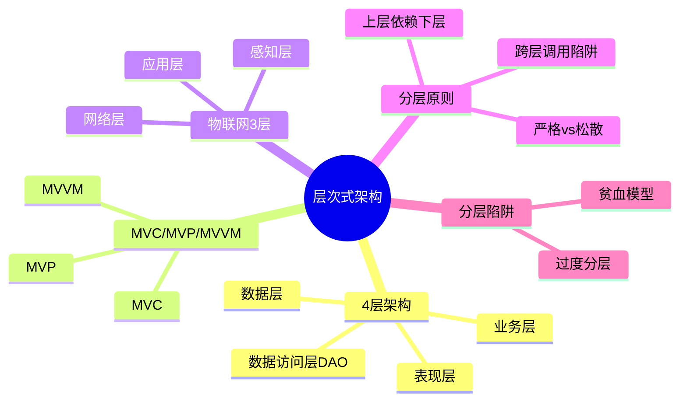

# E2-03 层次式架构设计 细化 Implementation Plan

> **For agentic workers:** REQUIRED SUB-SKILL: Use superpowers:subagent-driven-development (recommended) or superpowers:executing-plans to implement this plan task-by-task. Steps use checkbox (`- [ ]`) syntax for tracking.

**Goal:** 将 `02-案例分析/03-层次式架构设计.md` 从骨架（111 行）细化为完整版（280-350 行），覆盖 4 层架构、MVC/MVP/MVVM、物联网 3 层 + 2 道真题示例。

**Architecture:** 单文件重写（保留 frontmatter / 标题 / warning，扩充 mindmap 与 3.1-3.4）。完成后用户验证 → 更新 tracker → 双提交。

**Tech Stack:** Markdown + Obsidian callout + Mermaid mindmap + Block ID 锚点。

**Spec:** [2026-05-03-e2-03-layered-architecture-design.md](../specs/2026-05-03-e2-03-layered-architecture-design.md)

---

## Task 1：重写文件（单次 Write 完成所有 4 节内容）

**Files:**
- Modify: `02-案例分析/03-层次式架构设计.md`（重写为细化版）

> 内容详尽参照 spec 三、各节内容设计。本 plan 只列写入步骤与校对项；具体内容（表格、callout、真题答案）按 spec 落地。

- [ ] **Step 1: 写入 frontmatter**

沿用骨架已有 frontmatter，更新 date 为 2026-05-03，tags / aliases 保留。

- [ ] **Step 2: 写入标题与 warning callout**

```markdown
# 层次式架构设计

> [!warning] 高频考点
> 核心考点：==4 层架构==（表现 / 业务 / 数据访问 / 数据）、==MVC / MVP / MVVM 对比==、==物联网 3 层==（感知/网络/应用）、==分层原则与陷阱==。
>
> **状态**：✅ 已细化
>
> **速查跳转**：[[#3.2.1 MVC / MVP / MVVM 对比（必考核心）|MVx对比]] · [[#3.2.2 物联网 3 层架构（IoT 必备）|物联网3层]] · [[#3.4 真题与练习|真题]]
```

- [ ] **Step 3: 写入知识全景 mindmap**

精炼版含 5 大分支：



- [ ] **Step 4: 写入 3.1 核心概念**

3 个子节：
- 3.1.1 4 层架构职责（4 层职责对照表 + block ID `^4-layers`）
- 3.1.2 分层原则与依赖方向（依赖单向 + 跨层风险）
- 3.1.3 严格分层 vs 松散分层（对比表 + block ID `^strict-vs-loose`）

callout：`> [!important]` 4 层职责、`> [!warning]` 跨层调用陷阱

- [ ] **Step 5: 写入 3.2 关键技术与架构**

3 个子节：
- 3.2.1 MVC / MVP / MVVM 7 维度对比表（数据流 / View-Model 关系 / 测试性 / 框架 / 场景，加 block ID `^mvc-mvp-mvvm`）
- 3.2.2 物联网 3 层架构表（感知/网络/应用，加 block ID `^iot-3layers`）
- 3.2.3 分层陷阱（贫血模型 / 过度分层 / 跨层调用）

callout：`> [!important]` MVx 对比 + 物联网 3 层、`> [!warning]` 贫血模型

- [ ] **Step 6: 写入 3.3 典型考点与解题套路**

3 个子节：
- 3.3.1 MVx 选择题三段论模板
- 3.3.2 关键字判定速查（4 行表，加 block ID `^mvx-keywords`）
- 3.3.3 物联网架构填空套路（采集→传输→处理 自下而上）

callout：`> [!tip]` 答题模板、关键字判定

- [ ] **Step 7: 写入 3.4 真题与练习**

2 道真题（题目 + 完整答题）：
- 3.4.1 真题示例 1：MVVM 选型（Vue.js 电商场景，block ID `^realexam-mvvm`）
- 3.4.2 真题示例 2：物联网 3 层填空（智慧城市，block ID `^realexam-iot`）

每道真题答题按"理论 + 分点 + 结论"三段论。

- [ ] **Step 8: 保留关联链接**

```markdown
## 关联链接

- 返回案例分析索引：[[00-案例分析解题框架]]
- 返回主索引：[[../MOC]]
- 关联综合知识章节：
    - [[../01-综合知识/08-系统架构设计]]：分层架构风格
    - [[../01-综合知识/07-系统设计]]：设计原则、设计模式
    - [[../01-综合知识/03-计算机网络]]：物联网网络层、5G
- 关联案例分析：[[02-信息系统架构设计]]（C/S vs B/S vs 三层）/ [[07-通信系统架构设计]]（物联网网络）
```

- [ ] **Step 9: 校对**

- 文件行数 280-350
- block ID 锚点 ≥7 个：`^4-layers`、`^strict-vs-loose`、`^mvc-mvp-mvvm`、`^iot-3layers`、`^mvx-keywords`、`^realexam-mvvm`、`^realexam-iot`
- 对比表 ≥4 个：4 层职责 / 严格 vs 松散 / MVx / 物联网 3 层 / 关键字判定
- 真题示例 2 道，含完整答题
- 与 spec 三、各节内容设计 一致

---

## Task 2：用户验证暂停

- [ ] **Step 1: 报告完成，请用户在 Obsidian 中检查**

校对项：
- mindmap 渲染（5 大分支）
- 所有 callout（important/warning/tip/example）颜色正确
- 跨文件链接 [[00-案例分析解题框架]]、[[02-信息系统架构设计]]、[[07-通信系统架构设计]]、[[../01-综合知识/08-系统架构设计]] 可点击
- 真题示例 2 道完整呈现
- 表格列对齐

- [ ] **Step 2: 等用户确认无异常后再进入 Task 3**

---

## Task 3：用户验证后更新 tracker 并提交

**Files:**
- Modify: `docs/audit/revision-task-tracker.md`

- [ ] **Step 1: 提交 docs commit**

```bash
cd "/Users/wanlinruo/Library/Mobile Documents/iCloud~md~obsidian/Documents/project-003"
git add "02-案例分析/03-层次式架构设计.md"
git commit -m "docs(E2-03): 细化层次式架构设计专题，骨架→完整版

Co-Authored-By: Claude Opus 4.7 (1M context) <noreply@anthropic.com>"
```

- [ ] **Step 2: 追加 tracker 日志条目**

```markdown
| 2026-05-03 | E2-03 | 细化层次式架构设计专题骨架→完整版280+行：3.1核心概念(4层架构表现/业务/数据访问/数据职责对照+依赖单向上层依赖下层+严格vs松散分层对比)/3.2关键技术(MVC/MVP/MVVM 7维度对比View-Model关系/数据流/测试性/框架/场景+物联网3层感知/网络/应用+分层陷阱贫血模型/过度分层/跨层调用)/3.3解题套路(MVx三段论模板+4行关键字判定速查Spring→MVC/Android→MVP/Vue→MVVM/物联网3层+物联网填空套路采集→传输→处理)/3.4真题示例2道(题1:Vue.js电商MVVM选型完整答题/题2:智慧城市物联网3层填空)；7个block ID锚点 | `<commit-hash>` | 通过 |
```

- [ ] **Step 3: 提交 chore commit**

```bash
git add docs/audit/revision-task-tracker.md
git commit -m "chore(E2-03): 更新任务日志，层次式架构设计细化完成

Co-Authored-By: Claude Opus 4.7 (1M context) <noreply@anthropic.com>"
```

- [ ] **Step 4: 验证 git 状态**

```bash
git log --oneline -5
git status
```

预期：两条新提交在顶部，工作区 clean。

---

## 自检（Self-Review）

- ✅ Spec 覆盖：spec 三、各节内容设计 全部映射到 Task 1 的 Step 4-7
- ✅ 无占位符：内容详细参照 spec，每步指明 block ID / callout 类型
- ✅ 类型一致：block ID 命名与 spec 4.1 一致
- ✅ 风格统一：与 E2-02 完全对齐（mindmap + callout + block ID + 关联链接 + 真题三段论）
