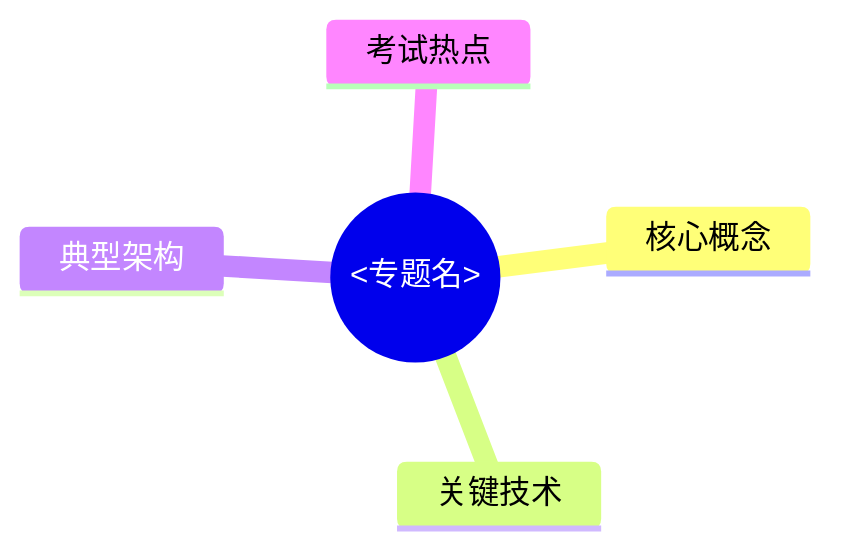

# E2 案例分析 框架阶段 设计文档

## 一、背景与目标

### 1.1 任务来源

依据 [修订任务追踪表](../../audit/revision-task-tracker.md) Phase E 第 E2 项，建立 `02-案例分析/` 目录的整体框架。E2 是大型任务（10 个文件），按用户指示采用 **"先建框架后逐个细化"** 的两阶段策略：

- **本次（框架阶段）**：00-案例分析解题框架.md 完整 + 9 个专题文件骨架
- **后续（细化阶段）**：每个专题文件单独 brainstorm + 细化（共 9 次）

### 1.2 范围决策

经与用户确认，采用 **方案 A**：解题框架完整 + 9 专题骨架。

### 1.3 成功标准

- 00-案例分析解题框架.md 包含完整可用的通用解题模板
- 9 个专题骨架文件结构统一、frontmatter 完整、章节占位清晰
- 跨文件 wiki link 现在就能跳转
- MOC.md / 综合知识全景图可索引到所有专题
- 文件在 Obsidian 中正常渲染

---

## 二、文件组织

### 2.1 完整目录

```
02-案例分析/
├── 00-案例分析解题框架.md     — 完整内容（约 350-450 行）
├── 01-系统计划.md             — 骨架 #中频
├── 02-信息系统架构设计.md      — 骨架 #高频
├── 03-层次式架构设计.md       — 骨架 #高频
├── 04-云原生架构设计.md       — 骨架 #高频
├── 05-面向服务架构设计.md      — 骨架 #高频
├── 06-嵌入式系统架构设计.md    — 骨架 #中频
├── 07-通信系统架构设计.md      — 骨架 #中频
├── 08-安全架构设计.md         — 骨架 #高频
└── 09-大数据架构设计.md       — 骨架 #高频
```

### 2.2 文件命名规范

- 文件名前缀按目录顺序：00-09
- 中文标题：与 frontmatter title 一致
- 频率标签：高频 / 中频 / 低频

---

## 三、00-案例分析解题框架.md 完整内容设计

### 3.1 章节结构

```
# 案例分析解题框架
├── (frontmatter)
├── ## 知识全景         — Mermaid mindmap
├── ## 0.1 案例分析考试概况
├── ## 0.2 时间分配策略
├── ## 0.3 题型分类与答题套路
├── ## 0.4 通用答题模板
├── ## 0.5 评分要点与得分技巧
├── ## 0.6 高频术语速查
├── ## 0.7 易错点与注意事项
└── ## 关联链接
```

### 3.2 各节内容要点

#### 0.1 案例分析考试概况
- 90 分钟，5 大题（每题 25 分制 → 总 75 分），通常 5 选 3
- 题型分布：必答题 + 选答题（每年题型组合略有变化）
- 合格线 45 分（每题平均 ≥9 分即可）

#### 0.2 时间分配策略
- 5 分钟通读全部题目
- 5 分钟选题（先做有把握的）
- 25 × 3 = 75 分钟答题（每题 25 分钟）
- 5 分钟检查（核对题号、补漏）

#### 0.3 题型分类与答题套路
6 大常考题型：
1. **架构风格选择题**：给场景，选合适的架构风格
2. **质量属性分析题**：分析 ATAM 敏感点 / 权衡点 / 风险点
3. **设计模式应用题**：识别场景 / 选模式 / 给类图
4. **新旧方案对比题**：对比 C/S vs B/S、SOA vs 微服务等
5. **填空补全题**：给架构图或表格，填空白
6. **问题分析改进题**：识别架构问题 + 提出改进方案

每种题型给出"识别关键字 + 答题模板 + 评分要点"。

#### 0.4 通用答题模板

**总览模板**：
- 第一段：理论铺垫（用专业术语定义概念）
- 第二段：分点作答（用 (1)(2)(3) 编号）
- 第三段：结合题目场景具体说明

**架构风格选择模板**：
> 第一步：识别场景关键词（如"高并发"、"扩展性"、"实时"）
> 第二步：列出可选架构风格 3-4 个
> 第三步：对比优缺点
> 第四步：选定风格 + 理由

**质量属性分析模板**：
> ATAM 三类点：
> - 敏感点：影响某质量属性的设计决策
> - 权衡点：影响多个属性的决策（往往是 trade-off）
> - 风险点：可能引发问题的决策

**设计模式应用模板**：
> 第一步：识别场景中的"变化点"
> 第二步：给出适用的设计模式
> 第三步：写出参与者类与协作关系
> 第四步：可加 UML 类图（手绘示意）

#### 0.5 评分要点与得分技巧
- **分点作答**：阅卷按点给分，未编号易丢分
- **关键词必现**：用专业术语而非大白话
- **场景结合**：理论 + 题目场景，避免空谈
- **写满但不废话**：每点 2-3 句说清楚
- **字迹工整**：手写卷面整洁直接影响印象分

#### 0.6 高频术语速查（按主题分组）
- 架构风格、质量属性、设计模式、SOA/微服务、云原生、大数据、安全、嵌入式

#### 0.7 易错点与注意事项
- 题号错位（5 选 3，不要做超过 3 道）
- 必答题不能漏（容易和选答题搞混）
- ATAM 三点常被混淆
- C/S vs B/S 经常考但答题术语易错

### 3.3 关键 callout

- `> [!important]` 时间分配 5/5/75/5
- `> [!important]` 通用答题模板（理论 + 分点 + 结合场景）
- `> [!warning]` 必答题与选答题区分
- `> [!tip]` 关键字识别套路

---

## 四、9 个专题骨架文件设计

### 4.1 统一骨架模板

每个专题文件采用同一模板（确保跨文件一致性）：

```markdown
---
title: <专题名>
date: 2026-04-30
tags:
  - 案例分析
  - 频率/<高频|中频>
  - 题型/<专题分类>
aliases:
  - <专题名>
  - <核心术语1>
  - <核心术语2>
cssclasses:
  - exam-note
---

# <专题名>

> [!warning] <频率级别>（<考点关键描述>）
> <考点重要性、考频、典型题型描述>
>
> **状态**：⚠️ 骨架阶段，待细化（计划日期：<日期>）

---

## 知识全景



---

## X.1 核心概念（待细化）

> [!note]+ 待补充内容
> - 列出该专题需要覆盖的核心知识点
> - 引用红宝书 / 教材的对应章节

---

## X.2 关键技术与架构（待细化）

> [!note]+ 待补充内容
> - 主要技术栈、典型架构图、对比表

---

## X.3 典型考点与解题套路（待细化）

> [!note]+ 待补充内容
> - 历年真题考点
> - 答题模板（结合 [[00-案例分析解题框架]]）

---

## X.4 真题与练习（待细化）

> [!note]+ 待补充内容
> - 历年真题列表
> - 完整答题示例 1-2 题

---

## 关联链接

- 返回案例分析索引：[[00-案例分析解题框架]]
- 返回主索引：[[../MOC]]
- 关联综合知识章节：
    - [[../01-综合知识/<相关章节>]]：<关联点>
```

### 4.2 9 个专题各自的特化点

每个文件除骨架外，需要根据专题特性预填以下内容：

| 文件 | 频率 | 关联综合知识章节 | 初步覆盖范围（骨架级提示） |
|------|------|----------------|------------------------|
| 01-系统计划 | 中频 | 06-需求工程 | 可行性研究（经济/技术/操作）/ 成本效益分析 / 新旧系统比较 |
| 02-信息系统架构设计 | 高频 | 08-系统架构设计 | C/S vs B/S vs 三层 / SOA / TOGAF-ADM / 信息化战略 |
| 03-层次式架构设计 | 高频 | 08-系统架构设计 | 表现层 / 中间层 / 数据访问层 / 数据层 / MVC / MVP / MVVM / 物联网 3 层 |
| 04-云原生架构设计 | 高频 | 08-系统架构设计 + 03-计算机网络 | 容器 / Docker / K8s / 微服务 / Serverless / 服务网格 Istio / 12-Factor |
| 05-面向服务架构设计 | 高频 | 08-系统架构设计 | SOA 5 原则 / WSDL / SOAP / UDDI / BPEL / REST / ESB / 微服务 vs SOA |
| 06-嵌入式系统架构设计 | 中频 | 01-计算机组成原理 + 02-操作系统 | 硬件体系 / 嵌入式 OS / 嵌入式数据库 / 嵌入式中间件 / ABSD / ADD / DARTS |
| 07-通信系统架构设计 | 中频 | 03-计算机网络 | LAN / WAN / 5G 三场景 / 存储网络 SAN/NAS / SDN / 网络安全架构 |
| 08-安全架构设计 | 高频 | 14-信息安全 + 09-系统质量属性 | 安全模型 BLP/Biba / WPDRRC / OSI 安全体系 7 服务 8 机制 / 数据库安全 / 脆弱性分析 |
| 09-大数据架构设计 | 高频 | 04-数据库系统 + 02-操作系统 | Lambda 架构 / Kappa 架构 / Hadoop / Spark / Flink / 数据湖 vs 数据仓库 |

### 4.3 骨架文件初始行数

每个骨架文件约 **70-100 行**：
- frontmatter（约 15 行）
- 标题 + warning + 知识全景 mindmap（约 20 行）
- X.1-X.4 占位章节（含初步要点 callout，约 30-40 行）
- 关联链接（约 10 行）

---

## 五、风格规范（与综合知识系列一致）

### 5.1 Markdown 元素

- 一级标题：`# <专题名>`（每文件唯一）
- 大节：`## X.x 节名`
- 重点级别：在标题或 callout 中标注

### 5.2 Callout 用途

| 类型 | 用途 |
|------|------|
| `> [!important]` | 必背考点 |
| `> [!warning]` | 易混点、骨架阶段标记 |
| `> [!tip]` | 答题套路 |
| `> [!note]` | 待细化内容、补充说明 |

### 5.3 关联链接

每个专题文件末尾必须含：
- 返回 `[[00-案例分析解题框架]]`
- 返回 `[[../MOC]]`
- 至少 1-2 个关联综合知识章节链接

---

## 六、预期产出

- **文件**：`02-案例分析/00-案例分析解题框架.md` 完整版（350-450 行）
- **文件**：`02-案例分析/01-系统计划.md` 至 `09-大数据架构设计.md` 共 9 个骨架（每个 70-100 行）
- **总行数**：约 350 + 9 × 80 ≈ 1100 行
- **预计文件数**：10 个新文件

---

## 七、实施流程

### 7.1 本次（框架阶段）

1. 撰写 `02-案例分析/00-案例分析解题框架.md`
2. 撰写 9 个专题骨架文件
3. 用户验证（Obsidian 渲染、骨架完整性）
4. 通过验证后，更新 [revision-task-tracker.md](../../audit/revision-task-tracker.md)：
   - E2 框架阶段标记进展（部分完成 — 框架已建，专题待细化）
   - 任务执行日志追加条目
5. 两次提交：
   - `docs(E2): 建立案例分析框架，00完整+9专题骨架`
   - `chore(E2): 更新任务日志，案例分析框架阶段完成`

### 7.2 后续（细化阶段）

后续每次会话单独细化一个专题文件：
- 每次：brainstorm → spec → plan → execute → 验证 → 双提交
- 优先级（推荐）：高频先行 — 02 → 03 → 04 → 05 → 08 → 09 → 01 → 06 → 07
- E2 任务在所有 9 个专题都完整后才标记为完成

---

## 八、风险与注意

- **骨架不能太空洞**：每个专题骨架要有具体的"待补充内容"提示，让后续细化有据可依
- **跨文件链接保持有效**：使用 `[[文件名#锚点]]` 时确认目标存在；初期可能有死链，是预期的
- **00 文件最重要**：是后续 9 个专题的"答题指南"，所有专题都引用它，必须完整
- **风格统一**：mindmap、callout、表格风格与综合知识系列一致
- **MOC.md 更新**：本次只新建文件，MOC.md 链接更新放到 E5 阶段统一处理（避免链接漂移）
